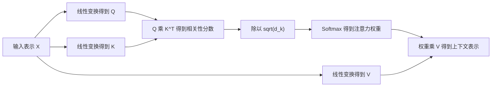
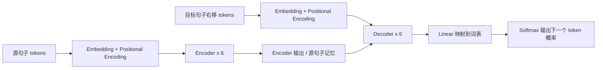
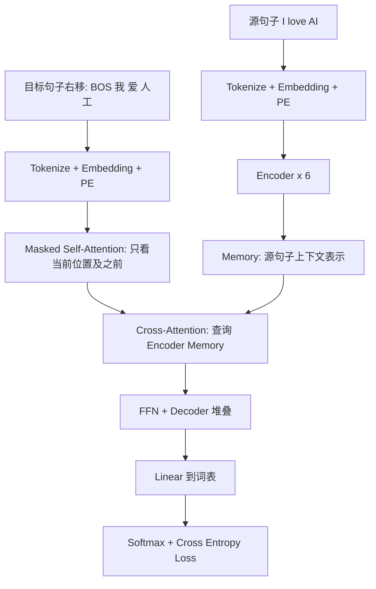
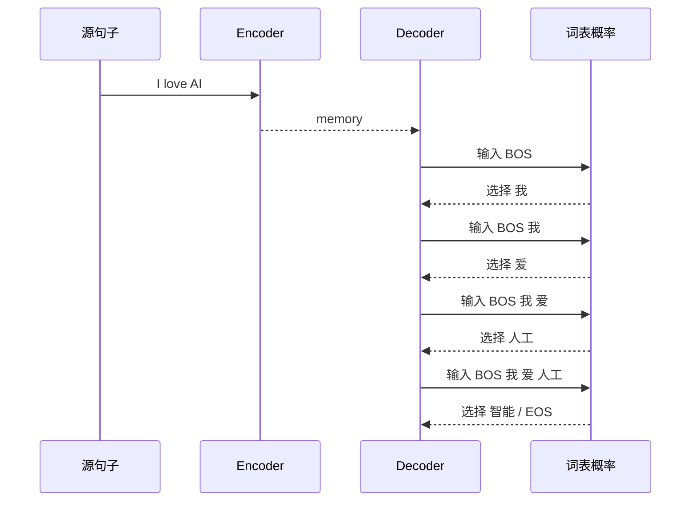

# 经典论文解读（一）：Attention Is All You Need

2017 年，Vaswani 等人在论文 **《Attention Is All You Need》** 中提出 Transformer。它后来成为 BERT、GPT、T5 等大模型的基础架构之一。

这篇论文最重要的地方，不只是提出了一个新的模块，而是做了一个很激进的判断：

> 序列建模不一定需要 RNN，也不一定需要 CNN。只靠注意力机制，也能完成机器翻译这类复杂序列到序列任务。

本文按三个问题展开：

1. Transformer 出现前，序列模型遇到了什么问题？
2. 注意力模块为什么能解决这些问题？
3. 从数据流动的角度，训练和推理时 Transformer 到底在做什么？

---

## 一、论文背景及动机：为什么要摆脱 RNN？

在 Transformer 之前，机器翻译、文本生成等任务通常使用 **Encoder-Decoder** 架构。Encoder 读入源语言句子，Decoder 逐步生成目标语言句子。

早期主流做法是用 RNN、LSTM 或 GRU 处理序列。

| 模型思路 | 优点 | 核心问题 |
| --- | --- | --- |
| RNN/LSTM/GRU | 天然按顺序建模文本 | 必须一步一步算，训练难以并行 |
| CNN 序列模型 | 可以并行，局部模式建模强 | 长距离依赖需要堆很多层 |
| RNN + Attention | Decoder 可关注源句子不同位置 | RNN 的顺序计算瓶颈仍然存在 |

### 1. RNN 的并行性问题

RNN 的隐藏状态是按时间步传递的：

```text
h1 -> h2 -> h3 -> h4 -> ...
```

第 4 个词的表示依赖第 3 个词，第 3 个词又依赖第 2 个词。这意味着即使 GPU 很强，也不能把所有时间步完全并行起来。

对短句子影响不大，但对大规模语料、大模型训练来说，这个串行依赖会成为明显瓶颈。

### 2. RNN 的长距离依赖问题

假设句子是：

```text
The animal that the kids saw in the park was tired.
```

`animal` 和 `was` 之间隔了很多词。RNN 要把前面的信息一步步传到后面，路径很长。路径越长，梯度和信息越容易衰减。

也就是说，RNN 不是不能学长距离依赖，而是学习成本高。

### 3. CNN 的路径问题

CNN 可以并行计算，但卷积核通常只看局部窗口。如果两个词距离很远，需要堆很多层卷积才能让它们互相影响。

Transformer 的问题意识很直接：

> 有没有一种结构，既能并行计算，又能让任意两个位置直接建立联系？

答案就是 **Self-Attention**。

---

## 二、注意力模块为什么能解决背景问题？

Self-Attention 的核心思想是：句子里的每个 token 都可以直接看见其他 token，并按相关性聚合信息。

比如输入：

```text
I love AI
```

当模型更新 `love` 的表示时，它不只看 `love` 自己，还可以同时关注 `I` 和 `AI`。如果模型认为 `AI` 对理解 `love` 更重要，就给 `AI` 更高权重。

### 1. Scaled Dot-Product Attention

论文中的注意力公式是：

```math
Attention(Q, K, V) = softmax(\frac{QK^T}{\sqrt{d_k}})V
```

可以把 Q、K、V 理解成三种视角：

| 符号 | 名称 | 直观理解 |
| --- | --- | --- |
| Q | Query | 我想找什么信息 |
| K | Key | 我有什么特征可以被别人匹配 |
| V | Value | 我真正提供的内容 |

注意力计算可以拆成四步：



其中 `QK^T` 用来计算 token 两两之间的匹配程度。除以 `sqrt(d_k)` 是为了避免点积值过大，让 softmax 梯度更稳定。

### 2. 为什么 Self-Attention 更适合长距离依赖？

RNN 里，两个远距离 token 的信息要经过很多步传递。Self-Attention 里，任意两个 token 可以在同一层中直接计算相关性。

| 层类型 | 每层复杂度 | 顺序操作数 | 最长路径长度 |
| --- | --- | --- | --- |
| Self-Attention | `O(n^2 * d)` | `O(1)` | `O(1)` |
| Recurrent | `O(n * d^2)` | `O(n)` | `O(n)` |
| Convolution | `O(k * n * d^2)` | `O(1)` | `O(log_k n)` |

这张表的关键不是说 Self-Attention 永远更便宜。它的 `O(n^2)` 在长序列上也会很重。

真正关键的是：

- **并行性好**：所有位置可以一起算。
- **路径短**：任意两个位置一层内直接连接。
- **表达灵活**：每个 token 可以动态选择关注哪些 token，而不是固定看前一个状态或固定卷积窗口。

### 3. Multi-Head Attention：多个视角同时看

论文 base 模型里，`d_model=512`，注意力头数 `h=8`。每个头的维度是：

```text
d_k = d_v = 512 / 8 = 64
```

多头注意力不是只算一次 512 维注意力，而是拆成 8 个子空间并行计算：

```text
输入 X: [batch, seq_len, 512]
        |
        |-- head 1: [batch, seq_len, 64]
        |-- head 2: [batch, seq_len, 64]
        |-- ...
        |-- head 8: [batch, seq_len, 64]
        |
      concat -> [batch, seq_len, 512]
      output projection -> [batch, seq_len, 512]
```

直观上，不同头可以关注不同关系：

- 有的头关注主谓宾。
- 有的头关注相邻词。
- 有的头关注指代关系。
- 有的头关注句法边界。

这比单个注意力头更有表达能力。

### 4. Positional Encoding：给无序注意力加入顺序

Self-Attention 本身不关心顺序。如果没有位置信息，`I love AI` 和 `AI love I` 对注意力来说很难区分。

因此 Transformer 在词向量上加了位置编码：

```math
PE(pos, 2i) = sin(pos / 10000^{2i / d_{model}})
```

```math
PE(pos, 2i+1) = cos(pos / 10000^{2i / d_{model}})
```

最终输入不是单纯的词向量，而是：

```text
输入表示 = token embedding * sqrt(d_model) + positional encoding
```

位置编码不会改变维度，仍然是 `[batch, seq_len, 512]`。

### 5. Add & Norm：让深层网络稳定训练

Transformer 的每个子层外面都有残差连接和 LayerNorm：

```text
Output = LayerNorm(x + Sublayer(x))
```

它做两件事：

- **Add**：保留原始输入，给信息和梯度一条直接通路。
- **Norm**：把每个 token 的 512 维特征做归一化，稳定训练。

所以 Add & Norm 不改变形状，只改变数值分布和信息组合：

```text
[batch, seq_len, 512] -> [batch, seq_len, 512]
```

---

## 三、Transformer 整体架构

Transformer 仍然是 Encoder-Decoder 架构，只是 Encoder 和 Decoder 内部不再使用 RNN。



论文 base 模型的主要配置：

| 配置 | 数值 |
| --- | --- |
| Encoder 层数 | 6 |
| Decoder 层数 | 6 |
| `d_model` | 512 |
| 注意力头数 | 8 |
| 每头维度 | 64 |
| FFN 隐藏层维度 | 2048 |
| Dropout | 0.1 |
| Label smoothing | 0.1 |

### 1. Encoder 单层做什么？

Encoder 每层包含两个子层：

```text
输入 X
  |
  |-- Multi-Head Self-Attention
  |-- Add & Norm
  |
  |-- Feed Forward Network
  |-- Add & Norm
  |
输出 X'
```

其中 FFN 是对每个位置独立执行的两层 MLP：

```text
512 -> 2048 -> 512
```

它不负责 token 之间交流，token 之间交流主要由 Self-Attention 完成。

### 2. Decoder 单层做什么？

Decoder 每层包含三个子层：

```text
Decoder 输入
  |
  |-- Masked Multi-Head Self-Attention
  |-- Add & Norm
  |
  |-- Cross-Attention
  |-- Add & Norm
  |
  |-- Feed Forward Network
  |-- Add & Norm
  |
Decoder 输出
```

它比 Encoder 多了两个关键点：

- **Masked Self-Attention**：生成目标句子时不能偷看未来 token。
- **Cross-Attention**：Decoder 用当前目标端表示去查询 Encoder 的源句子表示。

---

## 四、从数据流动理解 Transformer：训练阶段

我们用一个简化英译中例子：

```text
源句子: I love AI
目标句子: 我 爱 人工 智能
```

设定：

```text
batch = 1
源序列长度 S_src = 3
目标序列长度 S_tgt = 4
d_model = 512
h = 8
```

### 1. 源句子进入 Encoder

第一步是 tokenization。论文使用 BPE 子词切分。这里用简化 token ID 表示：

```text
"I love AI" -> [105, 2341, 8990]
```

然后查 embedding 表：

```text
[1, 3] -> [1, 3, 512]
```

再加位置编码：

```text
token embedding:      [1, 3, 512]
positional encoding:  [1, 3, 512]
相加后:               [1, 3, 512]
```

接着经过 6 层 Encoder，输出源句子的上下文表示：

```text
Encoder 输出 memory: [1, 3, 512]
```

这可以理解为源句子的“可查询记忆库”。

### 2. 目标句子右移进入 Decoder

训练时，模型不是一个字一个字慢慢生成，而是使用 **teacher forcing**：把正确答案右移一位后喂给 Decoder。

```text
目标答案:      我   爱   人工   智能   <eos>
Decoder 输入: <bos> 我   爱     人工   智能
预测目标:      我   爱   人工   智能   <eos>
```

右移的目的：第 `t` 个位置只能根据前面的真实 token 来预测当前 token。

目标端 embedding 后形状是：

```text
Decoder 输入: [1, 4, 512]
```

### 3. Masked Self-Attention 防止偷看未来

训练时虽然目标序列一次性输入，但每个位置不能看到未来位置。于是 Decoder self-attention 会加一个 causal mask。

假设目标长度为 4，mask 形状是 `[4, 4]`：

```text
          看:   1      2      3      4
位置 1        0    -inf   -inf   -inf
位置 2        0      0    -inf   -inf
位置 3        0      0      0    -inf
位置 4        0      0      0      0
```

它会加到 `QK^T / sqrt(d_k)` 的分数矩阵上。经过 softmax 后，`-inf` 对应的概率变成 0。

所以第 2 个位置只能看第 1、2 个位置，不能看第 3、4 个位置。

### 4. Cross-Attention：目标端查询源句子

Decoder 的第二个子层是 Cross-Attention。这里 Q、K、V 的来源不同：

| 张量 | 来源 | 形状 |
| --- | --- | --- |
| Q | Decoder 上一步输出 | `[1, 4, 512]` |
| K | Encoder 输出 | `[1, 3, 512]` |
| V | Encoder 输出 | `[1, 3, 512]` |

计算过程：

```text
Q: [1, 4, 512]
K^T: [1, 512, 3]
QK^T: [1, 4, 3]
softmax 后: [1, 4, 3]
乘 V: [1, 4, 512]
```

这个 `[1, 4, 3]` 的注意力矩阵很关键。它表示目标端每个位置对源句子 3 个 token 的关注分布。

比如生成中文 `爱` 时，模型应该更关注英文的 `love`。

### 5. 输出到词表并计算 loss

Decoder 最终输出：

```text
[1, 4, 512]
```

接一个线性层映射到词表大小。论文中英德任务使用约 37000 个 token 的词表：

```text
[1, 4, 512] -> [1, 4, 37000]
```

再做 softmax，得到每个位置对词表中所有 token 的概率分布。

训练目标是让正确 token 的概率更高：

```text
位置 1 预测 "我"
位置 2 预测 "爱"
位置 3 预测 "人工"
位置 4 预测 "智能"
```

训练阶段的数据流可以概括为：



### 6. 训练阶段维度总览

| 阶段 | 形状 | 说明 |
| --- | --- | --- |
| 源 token IDs | `[1, 3]` | `I love AI` |
| 源 embedding + PE | `[1, 3, 512]` | 词义 + 位置 |
| Encoder 输出 | `[1, 3, 512]` | 源句子记忆 |
| 目标右移 token IDs | `[1, 4]` | `<bos> 我 爱 人工` |
| 目标 embedding + PE | `[1, 4, 512]` | Decoder 输入 |
| Masked self-attention 权重 | `[1, 8, 4, 4]` | 目标端内部注意力 |
| Cross-attention 权重 | `[1, 8, 4, 3]` | 目标端看源端 |
| Decoder 输出 | `[1, 4, 512]` | 每个目标位置的上下文表示 |
| 词表 logits | `[1, 4, 37000]` | 每个位置预测下一个 token |

---

## 五、从数据流动理解 Transformer：推理阶段

训练时目标答案已知，可以一次性并行喂给 Decoder。推理时答案未知，必须从左到右生成。

仍然以翻译为例：

```text
输入: I love AI
输出: ?
```

### 1. Encoder 只需要计算一次

源句子先进入 Encoder：

```text
I love AI -> Encoder -> memory [1, 3, 512]
```

这个 memory 在整个生成过程中保持不变。

### 2. Decoder 自回归生成

Decoder 从 `<bos>` 开始：

```text
step 1 输入: <bos>
step 1 输出: 我

step 2 输入: <bos> 我
step 2 输出: 爱

step 3 输入: <bos> 我 爱
step 3 输出: 人工

step 4 输入: <bos> 我 爱 人工
step 4 输出: 智能
```

直到生成 `<eos>` 或达到最大长度。

推理阶段的数据流：



### 3. 训练和推理的核心区别

| 对比项 | 训练阶段 | 推理阶段 |
| --- | --- | --- |
| 目标端输入 | 正确答案右移 | 已生成 token |
| Decoder 计算 | 目标序列可并行计算 | 必须逐 token 自回归 |
| Mask | 必须使用 causal mask | 仍然使用 causal mask |
| Encoder 输出 | 每个 batch 算一次 | 每个输入句子算一次，可复用 |
| 输出选择 | 用真实标签算 loss | greedy search、beam search 或采样 |

这里容易误解的一点是：Transformer 解决的是训练阶段的大量并行问题，尤其是 Encoder 和训练时 Decoder 的并行性。推理阶段的自回归生成仍然是一步一步的，因为当前 token 依赖前面已经生成的 token。

---

## 六、论文实验结果和历史意义

论文主要在 WMT 2014 英德、英法机器翻译任务上验证 Transformer。

| 模型 | EN-DE BLEU | EN-FR BLEU | 训练成本 |
| --- | ---: | ---: | ---: |
| GNMT + RL | 24.6 | 39.92 | `2.3 * 10^19` FLOPs |
| ConvS2S | 25.16 | 40.46 | `9.6 * 10^18` FLOPs |
| Transformer base | 27.3 | 38.1 | `3.3 * 10^18` FLOPs |
| Transformer big | 28.4 | 41.8 | `2.3 * 10^19` FLOPs |

论文的关键结论是：

- Transformer 在翻译质量上达到或超过当时最强模型。
- base 模型训练成本显著更低。
- 完全基于注意力的架构可以替代循环和卷积，成为序列建模主干。

后来 BERT、GPT、T5 等模型并不是简单照搬原始 Encoder-Decoder Transformer，而是在它的基础上做了不同取舍：

- BERT 主要使用 Encoder，适合理解类任务。
- GPT 主要使用 Decoder，适合自回归生成。
- T5 保留 Encoder-Decoder 思路，把任务统一成 text-to-text。

---

## 七、用一句话总结 Transformer

Transformer 的核心不是“用了注意力”，而是：

> 用 Self-Attention 作为序列建模的主干，让每个 token 能并行地、直接地、动态地读取其他 token 的信息。

从数据流角度看，它做的事情很清楚：

```text
文本
 -> token ID
 -> embedding + position
 -> self-attention 建立上下文关系
 -> cross-attention 对齐源句子和目标句子
 -> FFN 提炼每个位置的表示
 -> 映射到词表概率
 -> 训练时算 loss，推理时逐步选 token
```

理解了这条链路，再看 BERT、GPT 或现代大模型，就不会只停留在“多头注意力很厉害”这句话上，而是能看清楚：模型内部的数据到底如何流动，信息又是怎样一步步被聚合和生成的。

---

## 参考资料

1. Ashish Vaswani et al. *Attention Is All You Need*. arXiv:1706.03762, 2017. https://arxiv.org/abs/1706.03762
2. NeurIPS Proceedings: *Attention Is All You Need*. https://papers.neurips.cc/paper/7181-attention-is-all-you-need.pdf
3. Harvard NLP. *The Annotated Transformer*. https://nlp.seas.harvard.edu/2018/04/03/attention.html
