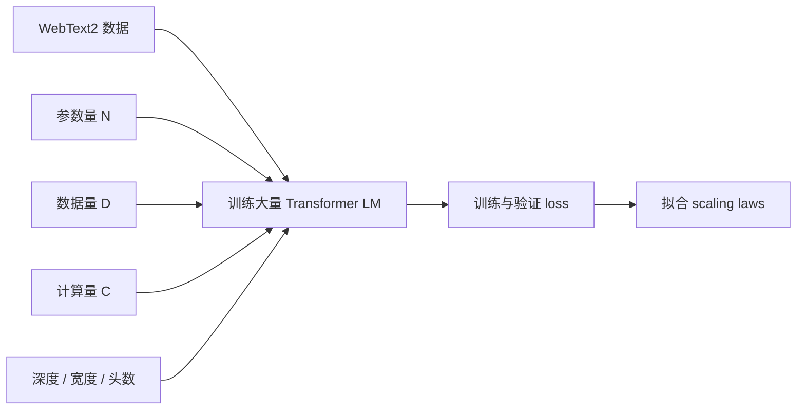

# 经典论文解读（三）：Scaling Laws for Neural Language Models

2020 年，Kaplan、McCandlish、Brown、Radford、Amodei 等人发表了 **《Scaling Laws for Neural Language Models》**。如果说 GPT-2 证明了“语言模型可以 zero-shot 做任务”，那么这篇论文回答的是下一个更工程化的问题：

> 当我们有更多算力时，应该把它用来扩大模型、增加数据，还是训练更久？

论文的核心贡献不是提出一个新架构，而是用大规模实验给出一组经验规律：语言模型的 loss 会随着参数量、数据量和训练计算量呈现平滑的幂律下降。这让大模型训练第一次显得像一门可以外推、可以规划预算的工程学。

本文按四个问题展开：

1. 为什么大模型时代需要 scaling law？
2. 论文如何设计实验来拆解 `N`、`D`、`C` 的影响？
3. 这些缩放定律到底说明了什么？
4. 它如何影响 GPT-3，以及后来为什么又被 Chinchilla 修正？

---

## 一、研究背景：大模型训练需要经验物理学

在 Transformer 和 GPT-2 之后，一个趋势已经很明显：语言模型越大，能力越强。但在 2020 年初，这个趋势还远没有变成确定的工程信念。

研究者面对的是一组非常现实的问题：

- 参数量加大，loss 会继续下降吗？
- 数据量和参数量应该按什么比例增长？
- 固定算力预算下，训练大模型早停更划算，还是训练小模型到收敛更划算？
- 架构细节，比如深度、宽度、注意力头数，会不会比总参数量更重要？

这些问题看起来像经验问题，但成本极高。训练一个千亿级模型之前，如果没有可外推的规律，几乎就是在用巨额算力做一次性赌博。

### 1. 语言建模适合做规模研究

论文选择语言建模作为研究对象，有一个重要原因：语言任务有很高的上限，也有很低的下限。

一个很差的语言模型可以接近随机猜词；一个很强的语言模型则能生成连贯段落、记住事实、做基本推理。中间有非常宽的性能空间，足够观察跨越多个数量级的变化趋势。

相比之下，很多图像分类任务会很快接近饱和。准确率到了 99% 附近，再增加模型和数据，很难看出清晰规律。语言建模用交叉熵 loss 评估，改善空间更连续，也更适合做“缩放实验”。

### 2. 资源分配成为核心痛点

训练语言模型主要受三类资源约束：

| 符号 | 含义 | 直观问题 |
| --- | --- | --- |
| `N` | 模型参数量 | 模型应该多大？ |
| `D` | 训练 token 数 | 应该看多少数据？ |
| `C` | 训练计算量 | 算力应该怎么花？ |

如果这三者没有明确关系，训练策略就只能靠经验试错。

Kaplan 论文真正想建立的是一套近似“经验物理学”：不解释神经网络为什么一定这样工作，但先用实验量化它在大范围内如何工作。

---

## 二、实验设计：大规模控制变量扫描

论文的实验思路很直接：训练大量不同规模的语言模型，分别控制参数量、数据量、计算量和模型形状，然后观察 loss 的变化。



### 1. 数据：WebText2

论文使用的是 WebText2，延续 GPT-2 的网页文本路线。相比手工标注任务，网页语言建模的优势是数据量大、分布多样，而且可以统一使用自回归目标训练：

```text
给定前面的 token，预测下一个 token
```

这也让实验可以专注于 `N/D/C` 的关系，而不被任务格式、监督标签或任务头设计干扰。

### 2. 模型：以 Transformer 为主，也比较 LSTM

主要实验使用 decoder-only Transformer。论文也比较了 LSTM，发现 Transformer 在相同计算下更有效，但 scaling law 的核心讨论集中在 Transformer 语言模型上。

为了避免“某个固定架构刚好有效”的偶然性，研究团队还故意改变模型形状：

- 更深或更浅。
- 更宽或更窄。
- 不同注意力头数。
- 不同前馈层维度。

这样可以观察：在总参数量相近时，架构形状到底会不会显著改变 loss。

### 3. 扫描范围：跨越多个数量级

论文最强的地方是实验覆盖范围很大。作者训练了大量模型，把关键变量扫过多个数量级：

| 变量 | 扫描方式 | 目的 |
| --- | --- | --- |
| 参数量 `N` | 从小模型到十亿级模型 | 看模型规模与 loss 的关系 |
| 数据量 `D` | 控制训练 token 数 | 看数据不足时的过拟合规律 |
| 计算量 `C` | 控制训练步数和 batch | 看固定算力下如何最优分配 |
| 模型形状 | 固定总参数量改变深宽 | 看架构细节是否主导性能 |
| 测试分布 | 评估多个文本分布 | 看训练 loss 与 OOD 泛化关系 |

这种实验方式更像测量自然规律，而不是单纯刷榜。论文关心的不是某个模型的最高分，而是趋势能不能被公式稳定预测。

---

## 三、核心结论：Loss 服从平滑幂律

论文最重要的结论可以浓缩成一句话：

> 语言模型的交叉熵 loss 与模型参数量、数据量、计算量之间呈现平滑、可预测的幂律关系。

幂律大致可以写成：

```text
L(x) = L_inf + (x0 / x)^alpha
```

这里 `x` 可以是 `N`、`D` 或 `C`，`L_inf` 表示不可约损失，`alpha` 是缩放指数。

### 1. 参数量越大，loss 稳定下降

当数据和训练计算足够时，模型越大，验证 loss 越低。这个趋势在实验范围内没有明显饱和。

这件事后来被总结成一句更粗糙的话：大力出奇迹。但论文真正严谨的地方在于，它不是说“更大一定更智能”，而是说在交叉熵 loss 这个指标上，规模提升带来的收益可以被幂律稳定拟合。

也就是说，扩大模型不是盲目堆参数，而是有可预测收益的工程投资。

### 2. 数据越多，loss 也按幂律下降

固定模型规模时，训练数据越多，过拟合越弱，验证 loss 越低。但数据的作用和参数量并不是简单线性关系。

论文发现，过拟合程度主要由类似 `N^0.74 / D` 的比例控制。直观理解是：

- 模型越大，越需要更多数据支撑。
- 但数据量不必和参数量完全等比例增长。
- 在 Kaplan 论文的估计下，参数量增长 8 倍，数据量增长约 5 倍就能保持类似过拟合水平。

这条结论在当时非常影响训练策略，因为它鼓励研究者在有限算力下更积极地扩大模型规模。

### 3. 架构形状没有总规模重要

论文发现，在一个相当宽的范围内，只要总参数量固定，模型更深一点、更宽一点、注意力头数多一点或少一点，对最终 loss 的影响通常不大。

这不是说架构完全不重要，而是说在这些实验范围内，**总规模比形状细节更主导性能**。

可以把它理解成：

| 问题 | 论文给出的经验判断 |
| --- | --- |
| 12 层还是 24 层？ | 重要，但不是第一阶因素 |
| 宽度怎么选？ | 重要，但可在合理范围内调整 |
| 参数总量是否够大？ | 第一阶因素 |
| 训练计算是否够多？ | 第一阶因素 |

这对工程团队很有价值。它减少了在架构细枝末节上的搜索成本，把注意力转向规模、数据和算力预算。

### 4. 固定算力下，大模型早停更优

这是论文最具冲击力的结论。

传统训练习惯是：选一个合适模型，把它训练到充分收敛。但 Kaplan 论文指出，在固定计算预算下，更优策略往往是：

> 训练一个更大的模型，并在它远未收敛时提前停止。

原因是大模型具有更高的样本效率。它可以用更少训练 step 达到小模型需要更长训练才能达到的 loss。

论文给出的最优分配关系中，模型参数量随计算预算增长得很快，近似 `N_opt ∝ C^0.73`；而数据量和训练步数增长得更慢。

这条规律直接影响了 GPT-3 的训练风格：使用非常大的模型，但每个 token 不重复训练很多轮。

### 5. OOD 泛化主要跟训练 loss 同步

论文还观察到，模型在其他文本分布上的 loss 与 WebText2 上的 loss 高度相关，通常只是存在一个近似固定偏移。

这说明，在这些语言建模分布上，泛化能力并不主要取决于某个特殊架构或训练阶段，而是强烈依赖于整体语言建模能力：

```text
训练分布 loss 降低 -> 其他分布 loss 通常也同步降低
```

这不是说所有下游任务都会自动解决，但它解释了为什么预训练 loss 后来成为大模型训练中极重要的过程指标。

### 6. 临界 batch size 与 loss 相关

论文还研究了 batch size。训练中存在一个临界 batch size：在这个范围内增大 batch 可以提升并行效率；超过它之后，继续增大 batch 会浪费计算。

作者发现，这个临界 batch size 主要随当前 loss 变化，而不是由模型大小本身决定。随着训练推进、loss 降低，模型可以有效利用更大的 batch。

这部分结论对大规模分布式训练很重要，因为它把“如何扩大 batch 以吃满硬件”也纳入了可预测框架。

---

## 四、这篇论文真正改变了什么？

Scaling law 论文的影响，不在于给了一个永远正确的公式，而在于它改变了大模型研发的思维方式。

### 1. 直接推动 GPT-3 路线

GPT-3 论文发表于同一年，模型达到 175B 参数。它的训练路线很明显继承了 Kaplan scaling law 的判断：

- 参数量大幅扩大。
- 不追求把每个 token 训练很多 epoch。
- 关注预训练 loss 对下游 few-shot 能力的预测作用。

GPT-3 的 few-shot 能力震动很大，但它背后的工程信念并不是凭空出现的。Scaling law 给了一个定量理由：如果 loss 能随规模稳定下降，那继续扩大模型就不是玄学，而是可预算、可外推的路线。

### 2. 把大模型研发从炼丹推向预测工程

训练大模型最大的风险是成本不可逆。一旦模型规模上到百亿、千亿参数，完整训练一次就非常昂贵。

Scaling law 提供了一个做法：

1. 先训练一批小模型和中等模型。
2. 拟合 loss 与 `N/D/C` 的关系。
3. 外推更大模型的预期 loss。
4. 再决定是否投入完整训练。

这很像在做工程标定。它不能保证所有能力都能预测，但至少让预训练损失变得可估算。

### 3. 强化了算力和数据基础设施的重要性

论文传递出的产业信号也很明确：如果性能随计算量平滑提升，那么算力、数据管线和训练系统就会成为核心竞争力。

这解释了后来大模型公司的投入方向：

- 更多 GPU/TPU。
- 更大的训练集。
- 更强的数据清洗和去重。
- 更稳定的分布式训练框架。
- 更系统的小规模预实验。

Scaling law 没有直接发明这些工程系统，但它让这些投入看起来更有确定性。

### 4. 也埋下了 Chinchilla 修正的伏笔

Kaplan scaling law 的一个重要结论是：固定算力下，应该更偏向训练大模型，数据增长可以相对慢一些。

但 2022 年 DeepMind 的 Chinchilla 论文提出修正：当代很多大语言模型其实是 **undertrained** 的。为了计算最优，模型参数量和训练 token 数应该更接近同步增长；模型翻倍，训练 token 也应该大致翻倍。

这不是推翻 scaling law 方法，而是修正了具体配比。

| 论文 | 核心倾向 | 后续理解 |
| --- | --- | --- |
| Kaplan et al. 2020 | 固定算力下更偏向扩大模型 | 解释了 GPT-3 式路线 |
| Hoffmann et al. 2022 | 参数和数据应更均衡增长 | 解释了 Chinchilla 式 compute-optimal 训练 |

因此，Kaplan 论文的真正遗产不是某个固定指数，而是方法论：用系统实验拟合缩放规律，再用规律指导大模型资源分配。

---

## 五、局限：Scaling law 不是万能预言机

这篇论文很重要，但也需要放在合适边界内理解。

### 1. 它主要预测预训练 loss

论文研究的核心对象是交叉熵 loss，而不是人类偏好、推理能力、工具使用能力或对齐安全性。

后来的经验表明，预训练 loss 很重要，但它不能完全预测所有下游能力。某些能力可能受数据组成、评测方式、提示格式、后训练和推理计算影响。

### 2. 指数不是永恒常数

Scaling law 是经验规律。它依赖数据分布、模型族、优化设置和训练范围。换数据、换架构、换训练目标，指数都可能变化。

这也是为什么 Chinchilla 能修正 Kaplan 的最优数据/参数配比。不是因为 Kaplan 论文错得离谱，而是因为更大范围和不同实验设计能得到更好的工程规律。

### 3. Loss 下降不等于智能问题解决

语言模型 loss 下降通常带来更强能力，但它不自动解决事实可靠性、长期规划、可解释性、价值对齐和真实世界交互。

Scaling law 告诉我们“扩大规模会带来可预测收益”，但没有告诉我们这些收益是否足以通向通用智能，也没有告诉我们如何安全地部署这些能力。

---

## 六、总结：大模型时代的资源分配指南

如果用一句话概括这篇论文：

> 它把“大模型会变强”从经验直觉，变成了可拟合、可外推、可用于预算决策的工程规律。

它的重要性体现在四点：

- **定量化**：把参数量、数据量、计算量和 loss 连接成幂律关系。
- **工程化**：让小规模实验可以外推大规模训练结果。
- **策略化**：提出固定算力下训练更大模型并提前停止的策略。
- **方法论化**：开启了后续 Chinchilla、多模态 scaling law、推理时计算 scaling 等一系列研究。

从论文史看，Transformer 解决了架构问题，GPT-2 展示了语言模型的 zero-shot 潜力，而 Scaling Laws 则回答了“大模型路线为什么值得继续砸资源”。这也是它为什么会成为大模型时代最有影响力的实证论文之一。

---

## 参考资料

- Kaplan, J., McCandlish, S., Henighan, T., Brown, T. B., Chess, B., Child, R., Gray, S., Radford, A., Wu, J., & Amodei, D. (2020). [Scaling Laws for Neural Language Models](https://arxiv.org/abs/2001.08361).
- Brown, T. B., et al. (2020). [Language Models are Few-Shot Learners](https://arxiv.org/abs/2005.14165).
- Hoffmann, J., et al. (2022). [Training Compute-Optimal Large Language Models](https://arxiv.org/abs/2203.15556).
