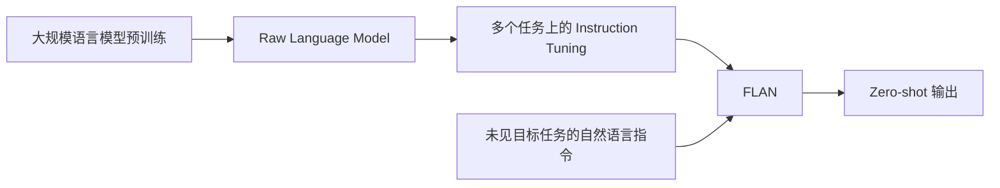
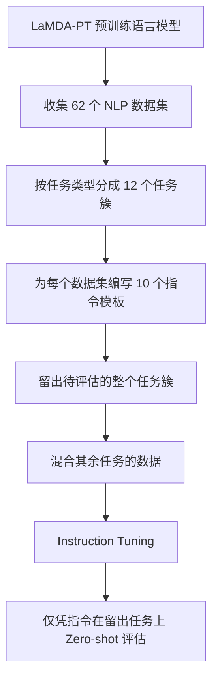

# 经典论文解读（七）｜对齐与微调：Finetuned Language Models Are Zero-Shot Learners

GPT-3 展示了一种令人兴奋的使用方式：不再为每个下游任务训练专用模型，而是把任务写进 prompt，让语言模型通过 zero-shot 或 few-shot 的方式直接回答。

但 GPT-3 的 zero-shot 表现并不稳定。在阅读理解、问答和自然语言推断等任务上，不提供示例时的表现往往明显弱于 few-shot。一个可能的原因是：预训练教会了模型续写自然文本，却没有专门教它如何理解人类写出的任务说明。

2021 年，Wei 等人在论文 **《Finetuned Language Models Are Zero-Shot Learners》** 中提出了一个直接的办法：既然希望模型按照自然语言指令完成任务，那就在许多不同任务上，用自然语言指令对它进行微调。

他们将这种方法称为 **instruction tuning**，并把得到的模型称为 **FLAN（Finetuned Language Net）**。

> FLAN 的实验表明，跨任务指令微调可以帮助大模型把自然语言任务描述映射到已有能力，并在未见过的目标任务上获得更好的 zero-shot 表现；它由此揭示了 raw language model 与可用指令模型之间的后训练鸿沟。

本文按五个问题展开：

1. GPT-3 已经能做 zero-shot，为什么还需要 instruction tuning？
2. FLAN 的指令微调流程具体是怎样的？
3. 论文如何证明模型能泛化到未见任务？
4. 为什么指令微调的收益只在大模型上明显出现？
5. FLAN 为后来的指令模型留下了什么？

---

## 一、从 Prompting 到 Instruction Tuning

GPT-3 的重要发现之一，是大规模语言模型可以仅凭 prompt 执行任务。

```text
Zero-shot：任务说明 + 测试输入 -> 答案

Few-shot：任务说明 + 少量输入输出示例 + 测试输入 -> 答案
```

Few-shot 示例不仅提供知识，也在告诉模型任务格式：输入是什么、输出应该长什么样、标签有哪些。到了 zero-shot 场景，这些示例消失了，模型只能从任务说明中推断用户意图和输出空间。

问题在于，大规模语言模型的预训练目标通常只是预测下一个 token。互联网文本当然包含说明、问答和示范，但模型并没有被显式训练成“看到指令就执行任务”。一段在人类看来很明确的任务描述，未必和预训练文本中常见的续写格式相似。

FLAN 的出发点因此非常简单：

> 用监督学习专门教模型，让它习惯“自然语言指令 → 相应任务输出”这种交互形式。

### 1. 三种范式的区别

可以把当时常见的方法放在一起比较：

| 范式 | 训练阶段 | 使用目标任务时 |
| --- | --- | --- |
| 预训练 + 任务微调 | 在无标注文本上预训练 | 用目标任务标注数据更新模型参数 |
| GPT-3 式 prompting | 只做大规模语言模型预训练 | 通过任务说明和少量示例提示模型，不更新参数 |
| FLAN instruction tuning | 预训练后，在许多其他任务的自然语言指令上微调 | 对未见目标任务只提供指令，不提供训练样本 |

FLAN 把前两条路线连接了起来：它使用微调阶段的监督信号，却不把模型微调成某个任务的专家；它的目标是让模型更擅长在推理时通过文本交互理解任务。



### 2. 这里的 Zero-shot 到底是什么意思？

FLAN 的 zero-shot 是**相对于目标任务**而言的。

模型已经经历过两类训练：

- 在海量无标注文本上进行语言模型预训练；
- 在许多其他 NLP 数据集上接受指令微调。

所谓 zero-shot，是指模型在指令微调中没有见过目标任务类型的监督数据，测试时也不会获得该任务的输入输出示例，只会看到任务说明和当前输入。

因此，FLAN 不是“没有监督数据的学习器”。它研究的是：**来自其他任务的监督，能否通过自然语言指令迁移到一个被留出的新任务？**

---

## 二、FLAN 的完整训练流程

这篇论文最值得理解的是它如何把预训练、任务数据、指令模板和 zero-shot 评估串成一条完整流程，单个 prompt 只是其中一环。



### 1. 从 137B 预训练语言模型开始

FLAN 的底座不是 T5，而是一个名为 **LaMDA-PT** 的 decoder-only 预训练语言模型。论文的主要实验使用 137B 参数版本，并另外使用 422M、2B、8B 和 68B 模型研究规模的影响。

这点很重要：instruction tuning 不是替代预训练，而是在大规模预训练之后增加一个相对短的监督训练阶段。模型的语言知识与许多潜在任务能力主要来自预训练，指令微调负责改变这些能力的使用方式。

### 2. 将 62 个数据集组织成 12 个任务簇

研究者从 TensorFlow Datasets 中收集了 62 个公开 NLP 数据集，涵盖语言理解和语言生成，并按任务类型划分为 12 个任务簇。

| 任务簇示例 | 任务目标 |
| --- | --- |
| Natural language inference | 判断前提和假设之间是蕴含、矛盾还是中立 |
| Reading comprehension | 根据给定上下文回答问题 |
| Closed-book QA | 不提供检索文档，直接回答事实问题 |
| Sentiment analysis | 判断文本表达的情感倾向 |
| Translation | 将文本从一种语言翻译成另一种语言 |
| Commonsense reasoning | 根据常识补全或选择合理答案 |
| Struct-to-text | 将结构化信息转换成自然语言 |

这里区分“数据集”和“任务簇”非常关键。RTE 和 ANLI 是不同数据集，但都属于自然语言推断；如果训练时见过 RTE、测试时只留出 ANLI，很难证明模型学会了跨任务泛化，它可能只是把同一种任务迁移到了另一个数据分布。

FLAN 因此不只留出某个数据集，而是尽量留出整个任务类型。

### 3. 为每个数据集人工编写 10 个模板

现有 NLP 数据集通常不是以自然语言指令存储的。研究者为每个数据集人工编写 10 个不同模板，将原始样本转换成模型可以直接阅读的任务描述。

以情感分类为例，原始数据可能只是：

```text
input: The movie was beautifully acted.
label: positive
```

转换后可以有多种表达：

```text
Determine whether the sentiment of this review is positive or negative:
The movie was beautifully acted.
```

```text
Is the following movie review positive or negative?
The movie was beautifully acted.
```

同一个任务使用不同措辞，是为了降低模型只记住固定前缀的可能性，让它接触“同一种意图可以有不同语言表达”这一事实。

此外，每个数据集最多还有 3 个模板会把任务反过来。例如，正常的情感分类是根据影评预测情感；反向模板则可能要求模型根据 `positive` 标签生成一段正面影评。这进一步增加了任务形式的多样性。

不过，模板数量的消融实验也给出了一个有意思的边界：增加每个任务簇内的数据集数量，对留出任务的平均表现帮助很大；单纯把每个数据集的模板从 1 个增加到 10 个，收益相对有限。**任务多样性比措辞数量更关键。**

### 4. 混合任务并进行指令微调

训练时，每条样本会随机选择该数据集的一个指令模板，然后与其他任务的样本混合，用标准语言模型目标继续微调底座模型。

模型看到的不是一个统一的任务前缀，而是大量不同的自然语言交互：

```text
指令 + 输入 -> 输出
```

训练更新的目标仍然是预测正确输出 token。新的地方不在损失函数，而在监督数据的组织方式：模型必须在许多任务之间根据指令判断当前应该做什么。

从这个角度看，instruction tuning 可以理解成一种跨任务元训练：每个样本不仅告诉模型答案，也在反复训练“从任务描述识别行为”的映射。

### 5. 留出任务簇后进行 Zero-shot 评估

评估自然语言推断时，FLAN 不会用任何自然语言推断数据进行指令微调，而是只在常识推理、翻译、情感分析等其他任务簇上训练。然后，模型直接根据自然语言指令完成 ANLI、RTE 等目标任务。

对其他任务簇评估时也采用同样方法。论文实际上需要为不同的留出任务簇分别训练 checkpoint，而不是训练一个模型后在所有 12 个簇上统一测试。

```text
评估 NLI：训练时排除 NLI 等相关任务簇
评估翻译：训练时排除翻译任务簇
评估情感分析：训练时排除情感分析任务簇
...
```

这种设计比“只留出单个数据集”更严格。它不能彻底证明模型理解了任意新指令，但至少排除了最直接的解释：模型并不是先在同类任务上学会解题，再换一个数据集名称进行测试。

---

## 三、实验结果：指令微调改善了什么？

论文首先将 FLAN 与未经指令微调的 LaMDA-PT 137B 比较。结果显示，FLAN 在多数留出任务上获得明显提升，说明收益来自 instruction tuning，而不只是底座模型本身。

随后，作者又将 FLAN 与公开的 GPT-3 结果比较：

- 在使用验证集选择最佳指令模板的设置下，FLAN 的 zero-shot 表现在 25 个数据集中的 20 个超过 zero-shot GPT-3 175B。
- 在其中 10 个数据集上，zero-shot FLAN 甚至超过 few-shot GPT-3。
- 优势较明显的任务包括自然语言推断、阅读理解、闭卷问答和部分翻译任务。

这些结果说明，扩大预训练规模并不是改善 zero-shot 的唯一途径。一个参数量略小的模型，在接受跨任务指令微调后，也可能比更大的 raw language model 更擅长按照任务说明作答。

### 1. 哪些任务受益更多？

论文发现，instruction tuning 对那些可以自然表达为指令的任务尤其有效，例如：

- 判断两个句子之间的逻辑关系；
- 阅读一段上下文后回答问题；
- 直接回答知识问题；
- 翻译文本；
- 根据结构化数据生成文本。

对于本来就接近语言模型续写形式的任务，收益则较小。例如一些常识推理和共指消解任务已经被表示成“补全句子或段落”，额外加入指令未必提供很多新信息。

这支持了论文的基本动机：instruction tuning 的价值在于弥合“自然续写”与“按任务要求行动”之间的格式差异。如果任务本来就是自然续写，这道鸿沟就没有那么大。

### 2. 不能把它写成 FLAN 击败 GPT-3

“20/25”是醒目的结果，但不能被简化为两个模型的公平比赛。

| FLAN | GPT-3 |
| --- | --- |
| 137B LaMDA-PT 底座 | 175B GPT-3 底座 |
| 接受了 62 个数据集的指令监督 | 没有接受对应的 instruction tuning |
| 使用多个人工指令模板 | 使用 GPT-3 论文中的提示设置 |
| 预训练数据和训练配置不同 | 预训练数据和训练配置不同 |

这不是只改变“是否指令微调”的严格控制变量实验。论文中更直接的因果证据，是 FLAN 与自己的未微调底座 LaMDA-PT 之间的比较；与 GPT-3 的结果则更适合用于说明不同训练路线在当时能够达到的效果。

---

## 四、为什么模型规模如此重要？

FLAN 论文最值得警惕的结果之一，是 instruction tuning 并不对所有模型规模都有效。

作者在 422M、2B、8B、68B 和 137B 五种规模上进行了消融实验。结果呈现出明显分界：

- 68B 和 137B 模型经过 instruction tuning 后，在留出任务上的平均表现显著改善。
- 8B 及以下模型经过相同处理后，留出任务表现反而下降。

这意味着不能从论文中得出“任何语言模型只要在许多指令上微调，就会成为优秀的 zero-shot learner”。在这套数据和训练设置下，instruction tuning 的收益只在足够大的模型上明显出现。

### 1. 一种解释：指令微调在学习如何调用能力

一种很有启发性的理解是，大模型已经在预训练中吸收了语言知识、常识和多种潜在任务能力，但 raw model 不一定知道如何根据用户指令稳定调用它们。

```text
预训练：形成知识与潜在能力
指令微调：学习“指令 -> 应调用的能力 -> 输出形式”
```

在这个视角下，instruction tuning 不主要是在几十个数据集上重新教会模型语言推断、翻译或问答，而是在训练一个任务路由接口：看到“判断是否蕴含”时调用推断能力，看到“翻译成法语”时调用翻译能力，并按照要求组织输出。

大模型拥有更丰富的预训练能力，因此更容易通过指令微调被“解锁”；小模型的底层能力不足，或者有限容量被多任务监督相互干扰，指令微调就可能适得其反。

### 2. 这是解释，不是论文已经证明的机制

规模实验直接证明的是相关性：模型越大，instruction tuning 对留出任务的收益越明显。

它没有完全区分以下可能原因：

- 大模型预训练后确实拥有更多可被调用的潜在能力；
- 小模型容量有限，多任务之间产生更严重的干扰；
- 相同的数据配比和优化设置并不适合所有规模；
- 小模型在监督微调中更容易遗忘预训练获得的能力。

因此，“能力解锁”适合作为理解 FLAN 的框架，但不应被写成这篇论文已经完成的因果证明。

### 3. 更多任务带来更好的迁移

论文还逐步增加 instruction tuning 使用的任务簇数量，并观察三个留出任务簇上的表现。除情感分析外，加入更多训练任务簇通常会改善 zero-shot 泛化。

这为“跨任务迁移”提供了另一项证据：模型见过的任务类型越丰富，就越可能学到跨数据集共享的模式，以及如何从任务说明判断目标行为。

不过，这也留下了一个自然问题：收益会随着任务数量持续增长，还是最终受到任务质量、冲突和分布覆盖的限制？后续更大规模的 FLAN、T0 和 instruction tuning 工作继续沿着这个问题展开。

---

## 五、从 T5 到 FLAN：指令成为迁移接口

T5 和 FLAN 都使用多任务监督，也都把输入输出表示成文本，但两篇论文解决的问题不同。

| T5 | FLAN |
| --- | --- |
| 统一不同 NLP 任务的 text-to-text 接口 | 用自然语言指令描述任务并训练模型遵循 |
| 重点研究预训练与下游迁移的最佳实践 | 重点研究未见任务上的 zero-shot 泛化 |
| 常用简短、固定的任务前缀 | 每个数据集使用多种自然语言模板 |
| 通常对目标任务继续微调 | 目标任务不参与微调，推理时只给指令 |

T5 说明，翻译、摘要、分类和问答可以共用同一种模型、损失和训练流程。FLAN 在此基础上推进了一步：统一格式还不够，模型还需要学会把**任务描述本身**当作决定行为的信号。

可以把两者的关系概括为：

```text
T5：所有任务都能表示成 text-to-text
  ↓
FLAN：自然语言任务描述可以成为跨任务迁移接口
  ↓
模型在未见任务上仅凭指令进行 zero-shot 推理
```

FLAN 的主要模型是 decoder-only，并不直接继承 T5 的 encoder-decoder 架构。因此，这里的“在此基础上”是研究范式的延续，而不是模型 checkpoint 或架构的直接继承。

---

## 六、从 GPT-3 到 FLAN：Raw Model 与指令模型之间的鸿沟

GPT-3 证明了扩大预训练规模可以显著改善 zero-shot 和 few-shot 能力。FLAN 并没有否定这条路线，它的规模消融反而说明 instruction tuning 也依赖一个足够强的底座。

两篇论文强调的是不同问题：

- **GPT-3**：大规模语言建模能否让模型通过上下文示例学习任务？
- **FLAN**：能否使用跨任务监督，让模型更善于理解自然语言任务描述？

因此，“FLAN 用微调战胜了 scaling”并不准确。二者的关系是：

```text
Scaling 提供更丰富的底层能力
          +
Instruction Tuning 提供调用这些能力的自然语言接口
          =
更可用的 Zero-shot 模型
```

这揭示了后来大模型训练中越来越重要的一道分界：**预训练得到的 raw model，不等于用户真正想要使用的模型。**

Raw model 的核心训练目标是预测文本；指令模型则进一步学习，面对用户要求时应该选择什么行为、采用什么输出格式。FLAN 尚未引入人类偏好反馈，也没有解决安全对齐，但它清楚展示了后训练可以显著改变大模型能力被调用的方式。

---

## 七、论文的边界

### 1. Zero-shot 不等于没有任务监督

FLAN 没有在目标任务簇上接受指令微调，但它已经见过大量其他任务。不同任务之间仍可能共享语言现象、标签含义和解题模式。

因此，实验能直接支持的是：模型可以把跨任务学习到的模式迁移到留出任务。至于它是否形成了普遍的“理解任意指令”能力，则是更强的解释。

### 2. 指令仍然经过人工设计

论文为每个数据集人工编写模板，并报告所有模板平均表现和验证集上最佳模板的表现。这说明模型对指令措辞仍然敏感，好的 zero-shot 表现并不代表 prompt engineering 已经消失。

而且这些指令主要围绕传统 NLP benchmark。它们与真实用户提出的开放式、多轮、含糊甚至互相冲突的要求仍有明显差距。

### 3. Benchmark 比较存在边界

FLAN 与 GPT-3 的模型、数据和提示设置不同；不同任务的指标也不能直接横向比较。论文证明了 instruction tuning 是一种有效方法，但不能仅凭“20/25”得出某种架构或模型全面占优。

论文还指出，网页预训练数据可能包含部分评测样本。作者的事后分析没有发现数据重叠显著影响结果，但大规模预训练下的数据污染问题仍难以完全排除。

### 4. 规模带来实际成本

主要结果依赖 137B 参数模型。论文自己也承认，这种规模的模型部署成本很高。小模型上的负迁移结果进一步说明，当时的 instruction tuning 还不是一种对所有模型都普遍有效的低成本配方。

---

## 八、总结：从拥有能力到听懂任务

如果用一句话概括 FLAN 论文，我会这样说：

> FLAN 的实验表明，跨任务指令微调可以帮助大模型把自然语言任务描述映射到已有能力，并在未见过的目标任务上获得更好的 zero-shot 表现；它由此揭示了 raw language model 与可用指令模型之间的后训练鸿沟。

这篇论文最重要的三点是：

- **指令成为迁移接口**：模型不只学习多个任务，还学习根据自然语言描述判断应该执行什么任务。
- **任务级 Zero-shot 泛化**：通过留出整个任务簇，论文展示了监督信号可以迁移到未见任务类型。
- **能力与调用方式相互依赖**：指令微调在大模型上收益更明显，说明强大的预训练底座和后训练缺一不可。

从 GPT-3 到 FLAN，研究重点发生了一次重要转变。问题不再只是“模型内部有没有某种能力”，也开始变成：

> 模型能否听懂人类如何描述任务，并在没有示例的情况下，把已有能力稳定地调用出来？

FLAN 没有完成今天意义上的完整对齐，也没有让模型理解任意指令。但它清楚地表明，语言模型的可用性并不只由预训练规模决定。如何组织监督数据、如何表达任务、如何训练模型响应自然语言要求，同样可以成为通用能力的重要来源。

这也让 instruction tuning 从一种多任务微调技巧，逐渐成为现代大模型后训练的基础环节。

---

## 参考资料

1. Jason Wei et al., **Finetuned Language Models Are Zero-Shot Learners**, ICLR 2022. https://arxiv.org/abs/2109.01652
2. Tom B. Brown et al., **Language Models are Few-Shot Learners**, NeurIPS 2020. https://arxiv.org/abs/2005.14165
3. Colin Raffel et al., **Exploring the Limits of Transfer Learning with a Unified Text-to-Text Transformer**, JMLR 2020. https://www.jmlr.org/papers/v21/20-074.html
4. Hyung Won Chung et al., **Scaling Instruction-Finetuned Language Models**, 2022. https://arxiv.org/abs/2210.11416
