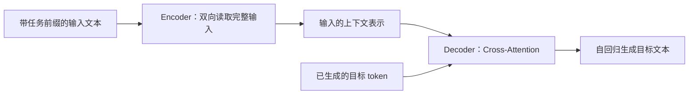
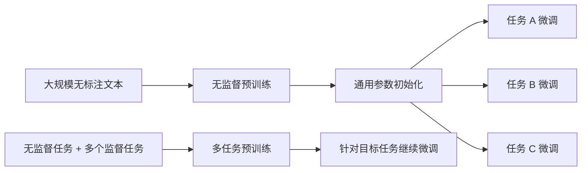

# 经典论文解读（六）｜对齐与微调：Exploring the Limits of Transfer Learning with a Unified Text-to-Text Transformer

2018 到 2019 年，基于大规模预训练 Transformer 的路线已经迅速成形。

BERT 证明了 **预训练 + 微调** 可以为多种语言理解任务提供强大的通用表示；GPT-2 则开始探索另一条路线：只通过大规模自回归语言建模，直接在下游任务上进行 zero-shot 迁移。它在语言建模以外的问答、翻译和摘要任务上只呈现出有限且不稳定的早期信号，真正让 zero-shot 与 few-shot 成为通用模型核心能力的，是随后规模更大的 GPT-3。

但当时还有一个问题没有解决：不同 NLP 任务依然像不同的工程项目。

- 情感分类需要分类头，输出类别概率。
- 阅读理解可能需要预测答案在原文中的起止位置。
- 翻译和摘要使用序列到序列模型，输出一段新文本。
- 不同任务往往还对应不同的损失函数、数据管线和训练方式。

2020 年，Raffel 等人在 **《Exploring the Limits of Transfer Learning with a Unified Text-to-Text Transformer》** 中提出 T5（Text-to-Text Transfer Transformer），试图把这些差异收进一个简单框架：

> 所有基于文本的语言任务，都可以表示成“输入文本，输出文本”。

T5 没有试图证明 encoder-decoder 比 GPT-2 更优。它的关键意义是通过 text-to-text 统一任务表示与训练目标，并以大规模系统实验表明：**统一的模型接口和针对任务的微调并不矛盾，二者共同构成了一条可扩展的迁移学习路线。**

本文按五个问题展开：

1. T5 所说的 text-to-text 到底统一了什么？
2. 为什么它采用 encoder-decoder 架构？
3. 这篇论文如何系统研究迁移学习？
4. 多任务训练能否取代预训练后的任务微调？
5. 今天回看，T5 为后来的通用模型留下了什么？

---

## 一、Text-to-Text：把不同任务改写成同一个问题

T5 的基本想法看起来很朴素：模型的输入是文本，输出也必须是文本。

对于本来就是生成问题的翻译和摘要，这种表示非常自然。真正值得注意的是，T5 也把分类、回归和抽取式问答改写成了文本生成。

| 任务 | 输入文本 | 目标文本 |
| --- | --- | --- |
| 英德翻译 | `translate English to German: That is good.` | `Das ist gut.` |
| 摘要 | `summarize: <文章正文>` | `<摘要>` |
| 语法可接受性判断 | `cola sentence: The course is jumping well.` | `not acceptable` |
| 文本相似度 | `stsb sentence1: ... sentence2: ...` | `3.8` |

任务名称或简短说明被写进输入，模型则自回归生成目标序列。这样一来，类别不再由额外的分类头表示，而是由 `positive`、`negative`、`entailment` 这样的文本 token 表示。


### 1. 统一的不是任务内容，而是任务接口

与 BERT 式做法相比，差别非常直观。

```text
BERT 情感分类：
文本 -> Encoder -> 任务专用分类头 -> 类别概率

T5 情感分类：
"sst2 sentence: <文本>" -> Encoder-Decoder -> "positive"
```

BERT 在不同任务上通常保留共享的预训练骨干，再增加相应的输出层。T5 则让所有任务都经过同一个词表上的生成过程，因此可以复用同一种模型、语言建模损失、训练流程和解码过程。

这首先是一种 **接口与方法论的统一**，不应被夸大成“生成标签词天然比分类头更强”。T5 论文没有通过消融实验证明，把分类改写成生成就一定能提高单项任务能力。它解决的主要问题是：如何让不同任务进入同一个可比较、可混合、可扩展的实验框架。

### 2. 统一框架也是论文的实验基础

如果一种预训练目标只能用于分类，另一种只能用于生成，那么跨任务比较很容易混入模型结构和损失函数的差异。

text-to-text 把任务放进同一套接口后，研究者可以相对公平地改变一个变量，再观察它对 GLUE、SuperGLUE、SQuAD、CNN/Daily Mail 和机器翻译等任务的影响。

因此，统一范式不只是 T5 最终产品的使用方式，也是这篇论文能够进行大规模系统实验的前提。

---

## 二、为什么是 Encoder-Decoder？

T5 采用的是原始 Transformer 的 encoder-decoder 结构，而不是 BERT 的 encoder-only 或 GPT-2 的 decoder-only 结构。

它和 text-to-text 的问题形式很匹配：**先完整读取输入，再根据输入生成目标文本。**



Encoder 中的每个位置都可以关注完整输入，因此适合建立输入内部的双向表示。Decoder 在生成第 `t` 个 token 时只能看到此前已经生成的目标 token，同时通过 cross-attention 读取 Encoder 的输出。

相比之下，三种常见架构的侧重点不同：

| 架构 | 典型模型 | 信息流 | 更自然的问题形式 |
| --- | --- | --- | --- |
| Encoder-only | BERT | 双向读取输入 | 分类、序列标注、表示学习 |
| Decoder-only | GPT-2 | 对整段序列做因果建模 | 文本续写、开放式生成 |
| Encoder-Decoder | T5 | 双向编码输入，条件生成输出 | 翻译、摘要、问答等输入到输出的映射 |

论文也在近似计算预算下比较了多种架构变体，发现原始 encoder-decoder 在它的 text-to-text 实验设置中表现最好。但这个结果有明确边界：它来自论文选取的数据、任务集合、参数配置与训练预算，不能被推广为“encoder-decoder 在任何场景都优于 decoder-only”。

更准确的理解是：对于 T5 要研究的“读取完整输入，再产生目标文本”范式，encoder-decoder 是一个自然且经过实验支持的选择。

---

## 三、T5 更像一份迁移学习实验报告

T5 当然是一组模型，但论文反复强调，它的主要目标不是提出一种全新的方法，而是对当时的迁移学习方法进行系统梳理和实证比较。

作者先建立一个统一基线，再依次改变关键变量：

| 研究维度 | 论文比较的问题 |
| --- | --- |
| 模型架构 | Encoder-decoder、语言模型式架构和前缀语言模型如何比较？ |
| 无监督目标 | 因果语言建模、去噪、连续 span corruption 等目标如何比较？ |
| 预训练数据 | 数据规模、数据质量和领域匹配分别有什么影响？ |
| 迁移方法 | 全参数微调、adapter、逐层解冻和多任务训练如何比较？ |
| Scaling | 增大模型、延长训练和模型集成如何利用额外计算？ |

这种设计使论文标题中的 **Exploring** 比某个单一模型结构更重要。T5 不是只展示最终 11B 模型的榜单成绩，而是在追问：当预训练 + 微调已经有效之后，究竟哪些选择真正影响迁移效果？

### 1. 一个固定基线，逐项改变变量

论文的基线是一个 encoder-decoder Transformer，先在 C4 上进行无监督去噪预训练，再分别对每个下游任务微调。多数对照实验使用相同的训练预算和评测任务，只替换正在研究的部分。

这比把不同论文中的最好分数直接排列在一起更有解释力。后者往往同时改变了数据、参数量、训练步数和实现细节，很难判断提升来自哪里；T5 则尽量在同一框架里拆开这些因素。

### 2. Span corruption 是重要选择，但不是唯一主角

T5 最终使用的预训练目标通常被称为 **span corruption**：随机选择若干连续文本片段，用不同的 sentinel token 替换，再让模型只生成被删除的片段。

```text
原文：Thank you for inviting me to your party last week.

输入：Thank you <X> me to your party <Y> week.
目标：<X> for inviting <Y> last <Z>
```

这种目标让 Encoder 学习损坏后的完整上下文，让 Decoder 重建缺失内容；目标序列又比重建整段原文更短，计算更高效。

不过论文发现，多种去噪目标的最终表现相近。它据此提出的更克制结论是：在 text-to-text 设置中，可以优先选择目标序列更短、计算效率更高的去噪目标，而不是把 span corruption 描述成唯一有效的秘密配方。

### 3. C4 提供大规模、相对干净的预训练文本

为了支持系统实验和大模型训练，论文从 2019 年 4 月的 Common Crawl 网页文本中构造了 **C4（Colossal Clean Crawled Corpus）**。处理包括语言识别、启发式质量过滤、去重以及对占位符、代码和不良词汇页面的过滤。

C4 的作用不只是“数据更多”。论文的对照结果显示，移除启发式清洗会一致地降低下游表现；过小的数据集如果在预训练中被反复遍历，也可能损害效果。对于通用迁移学习，大规模、多样且经过清洗的数据是重要组成部分。

---

## 四、多任务学习能取代微调吗？

text-to-text 最直接的好处之一，是让多任务训练变得非常简单。

过去的多任务系统可能为不同任务设置不同输出头和损失函数。在 T5 中，多任务学习在形式上只是把多个 text-to-text 数据集混合起来：

```text
一个 batch 可以来自：
  - C4 去噪预训练
  - GLUE 分类
  - SQuAD 问答
  - CNN/Daily Mail 摘要
  - WMT 翻译
```

模型始终接收 token，并预测目标 token。任务前缀告诉模型当前要执行什么任务。

但接口统一之后，一个更困难的问题立刻出现：**每个任务应该采样多少数据？**

### 1. 数据混合比例决定多任务训练的成败

不同数据集的规模差异巨大。如果对所有任务等概率采样，低资源任务会被反复看到，很快过拟合；高资源任务又可能训练不足。如果完全按样本数量采样，大数据集则会压倒小数据集。

T5 比较了多种混合策略：

- 等比例混合，每个任务获得相同采样概率。
- 按数据集样本数成比例混合。
- 为大数据集设置样本上限，避免它们完全支配训练。
- 使用温度缩放，在大小任务之间调节采样分布。

实验还暴露了 **task interference**：一个模型同时优化多个任务时，某些任务的提升可能妨碍另一些任务。统一损失函数没有消除任务间的资源竞争。

### 2. 纯多任务训练通常不如“预训练 + 微调”

论文最值得记住的结果之一是：在其比较的大多数任务上，直接进行多任务训练的表现弱于先做无监督预训练、再分别微调。

以论文表 12 的汇总结果为例：

| 训练策略 | GLUE | SQuAD | SuperGLUE | 英德翻译 |
| --- | ---: | ---: | ---: | ---: |
| 无监督预训练 + 微调 | 83.28 | 80.88 | 71.36 | 26.98 |
| 纯多任务训练 | 81.42 | 79.78 | 67.30 | 25.21 |
| 多任务预训练 + 微调 | 83.11 | 80.26 | 71.03 | 27.08 |

这些分数跨任务使用不同指标，不能横向比较数值大小；它们的用途是比较同一列中不同训练策略的相对表现。

结果传达了两个信息：

第一，简单地把所有任务混在一起，并不能自动得到一个在每个任务上都最强的统一模型。混合比例、过拟合和任务干扰仍然存在。

第二，多任务预训练后再对单项任务微调，可以达到与“无监督预训练 + 微调”相近的表现。也就是说，多任务学习可以让模型先吸收更丰富的监督信号，而最后的任务适配仍然有价值。



这正是 T5 中“统一”与“微调”的关系：**统一负责提供共同的表示、目标和训练基础，微调负责把共同能力适配到具体任务。** 两者不是互相替代的路线。

### 3. 统一接口没有消除任务边界

把分类标签写成文本后，表面上所有任务都变成了生成。但任务差异仍然存在：

- 需要为数据集设计输入格式和任务前缀。
- 不同任务的数据规模、难度和评价指标不同。
- 多任务训练需要决定采样比例。
- 分类输出可能生成不在合法标签集合中的文本。
- 为获得最好效果，仍可能需要分别选择 checkpoint 和进行任务微调。

因此，T5 的统一是一种有力的抽象，而不是对任务差异的消除。它让研究者可以用同一种语言讨论不同任务，也让跨任务训练更容易实现，但没有让任务建模从此变得免费。

---

## 五、从系统实验走向 Scaling

完成对架构、目标、数据和训练策略的比较后，论文把实验中较有效的选择组合起来，并继续扩大模型与训练规模。

最终的 T5 系列包含从 Small 到 11B 的多个模型。论文发现，增大模型、延长训练和使用模型集成都能显著提高性能；最大的 T5-11B 在 GLUE、SuperGLUE、SQuAD 和多个摘要任务上取得了当时的领先结果。

但 T5 关于 scaling 的意义，不只是“11B 比小模型分数高”。更重要的是，统一框架降低了扩大研究范围的结构成本：

```text
同一种任务表示
  + 同一种模型接口
  + 同一种训练目标
  + 多种数据与任务
  + 更大的模型和计算
  = 可系统扩展的迁移学习实验
```

这里仍需区分事实与后见之明。Scaling 并不依赖 text-to-text 才能发生，GPT 系列的 decoder-only 路线就是明显例子；T5 论文也没有研究后来语境中的“涌现”。更准确的说法是：text-to-text 降低了跨任务联合训练与评估的结构成本，使一个模型覆盖更多任务变得更直接。

---

## 六、今天回看：Instruction Tuning 的重要前奏

今天，我们已经习惯通过自然语言告诉模型要完成什么任务：总结一段文章、判断情感、翻译一句话，或者按照指定格式回答问题。

T5 还不是今天意义上的 instruction-tuned model。它使用的通常是简短、固定的任务前缀，例如 `summarize:` 或 `translate English to German:`，训练目标仍然依赖人工整理的监督数据集；它也没有研究 RLHF、偏好优化或现代意义上的对齐。

但从今天回看，T5 提供了一个重要前奏：**任务本身也可以被放进文本空间，并由同一个生成模型学习。**

后来的 instruction tuning 在这个方向上又向前走了一步：

- T5：把不同任务统一成带任务前缀的 text-to-text 数据。
- Instruction tuning：用更多样的自然语言指令和任务示例训练模型，让它泛化到新的指令表达和未见任务。

因此，不应该说 T5 已经证明了 instruction tuning 或能力涌现；更合适的历史定位是，它把自然语言任务接口、大规模预训练、多任务学习和任务微调放进了一套统一框架，为后续工作提供了清晰的形式基础。

---

## 七、局限：统一范式不等于最终答案

### 1. Text-to-Text 是接口统一，不是任务统一

同一个损失函数可以处理所有任务，并不意味着所有任务拥有相同的数据需求和优化过程。T5 的多任务实验恰好说明，采样策略和任务干扰会显著影响结果，分别微调仍然重要。

对于分类等输出空间封闭的任务，自回归生成也未必是计算效率最高的实现。统一接口带来的可组合性与工程简洁性，需要和具体任务的效率要求一起衡量。

### 2. 架构结论有明确的实验边界

T5 发现 encoder-decoder 在自己的 text-to-text 设置中表现最好，但这不是一个脱离条件的架构定律。

GPT-2 对这种可能性做了早期探索，后来的 GPT 系列才更充分地证明 decoder-only 架构同样可以通过自然语言接口执行广泛任务。架构表现还会受到训练数据、目标、参数量、计算预算、推理方式和任务类型影响。

所以 T5 与 GPT-2 更适合被理解为两种不同的问题设定：

- GPT-2 追问：无监督自回归语言建模能否自然产生跨任务的 zero-shot 能力？
- T5 追问：能否把异构任务统一表示，并系统研究预训练后迁移的最佳实践？

它们不是一道只需选出唯一胜者的架构选择题。

---

## 八、总结：统一与适配并不矛盾

如果用一句话概括 T5 论文，我会这样说：

> T5 没有试图证明 encoder-decoder 比 GPT-2 更优。它通过 text-to-text 统一任务表示与训练目标，并以大规模系统实验表明：统一的模型接口和针对任务的微调并不矛盾，二者共同构成了一条可扩展的迁移学习路线。

这篇论文留下了三点重要认识：

- **统一接口**：翻译、摘要、分类和问答都可以被表示成文本到文本的映射，复用同一模型、目标和训练流程。
- **系统实验**：架构、预训练目标、数据、迁移方法和规模需要在统一基线中控制变量比较，而不是只看最终榜单。
- **微调仍然重要**：多任务学习让知识共享更自然，但纯多任务训练并没有自动取代针对具体任务的适配。

从 Transformer、BERT、GPT-2 再到 T5，变化不只是模型越来越大。研究者也在不断减少任务专用结构，把更多问题收进同一个预训练模型和自然语言接口中。

T5 用统一接口表达问题，再通过微调解决具体任务，两者结合成了可复用的通用任务框架。

---

## 参考资料

1. Colin Raffel et al., **Exploring the Limits of Transfer Learning with a Unified Text-to-Text Transformer**, JMLR 2020. https://www.jmlr.org/papers/v21/20-074.html
2. Jacob Devlin et al., **BERT: Pre-training of Deep Bidirectional Transformers for Language Understanding**, NAACL 2019. https://aclanthology.org/N19-1423/
3. Alec Radford et al., **Language Models are Unsupervised Multitask Learners**, 2019. https://cdn.openai.com/better-language-models/language_models_are_unsupervised_multitask_learners.pdf
4. Jason Wei et al., **Finetuned Language Models Are Zero-Shot Learners**, ICLR 2022. https://arxiv.org/abs/2109.01652
