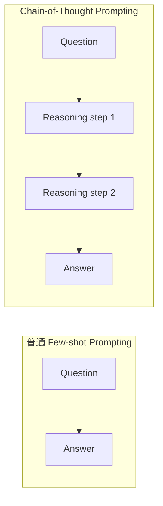
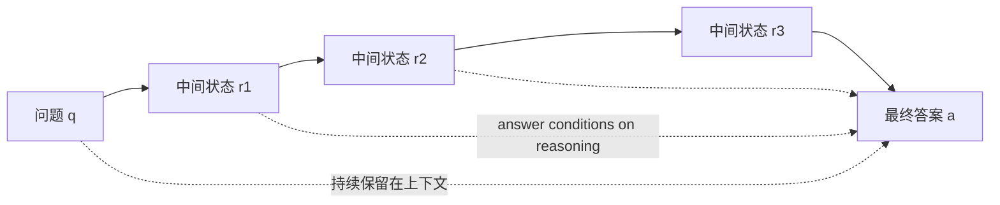

# 经典论文解读（十一）｜推理增强：Chain-of-Thought Prompting Elicits Reasoning in Large Language Models

同一道数学应用题，同一个语言模型，只改一下 few-shot 示例的答案格式，准确率会发生多大变化？

2022 年，Jason Wei 等人在 **《Chain-of-Thought Prompting Elicits Reasoning in Large Language Models》** 中给出了一个很夸张的结果：PaLM 540B 在 GSM8K 上使用普通 prompting 时，准确率只有 17.9%；示例中加入人工写出的中间推理步骤后，准确率提高到 56.9%，再配合外部计算器可达 58.6%。模型没有经过针对 GSM8K 的微调，参数也没有变化。

变化只发生在 prompt 里。

这篇论文最重要的发现，可以从标题里的 **elicits** 来理解。足够大的语言模型已经隐含了一定的多步推理能力，只是普通的“输入—答案”提示未必能让它表现出来。给模型示范如何生成中间步骤，不需要更新参数，就能把这部分能力引出来。随后生成的答案又可以依赖这些中间状态，推理能力因此转化成了可测量的正确率提升。

论文没有解释这种能力究竟以什么形式存在于参数中，也没有证明模型真的像人一样思考。它可靠地证明了一件更具体的事：普通 prompting 测到的只是大模型能力的下界，改变生成路径，可以让同一个模型表现出此前没有显现的推理能力。

---

## 一、研究背景：大模型会做任务，却仍然不会做多步题

GPT-3 之后，scaling 和 in-context learning 成为语言模型研究中的两条主线。

当模型扩大到足够规模，只要在上下文里放入几个输入—输出样例，它就能识别任务形式并完成新的样本，全程无须梯度更新。分类、翻译和简单问答都从这种方式中获得了明显收益。

```text
输入 1 -> 输出 1
输入 2 -> 输出 2
输入 3 -> 输出 3
新输入 -> ?
```

多步推理却没有沿着同一条曲线稳定改善。算术文字题、常识推理和符号操作仍然很难，普通 few-shot prompting 在这些任务上的收益有限。模型或许能理解题目里的每一句话，也能完成单独的加减乘除，却经常无法把多个步骤可靠地串起来。

当时已有研究让模型生成 rationale 或 scratchpad：把中间步骤也纳入训练目标，使模型先写推理过程，再给最终答案。这条路线有效，但需要为大量训练样本准备 reasoning rationale。标注一个答案可能只需写下数字，标注推理链还要保证语义、逻辑和计算过程都正确，成本完全不同。

CoT 论文把两个已有方向接到了一起：

```text
Few-shot in-context learning
            +
自然语言中间推理步骤
            |
            v
Chain-of-thought prompting
```

它保留了中间步骤带来的结构，又把大量 rationale 训练数据缩减成 prompt 里的少数示例。论文在数学实验中主要使用 8 个手写 CoT exemplar；除了选择题形式的 AQuA 使用另一组 4 个示例，同一组 8 个示例被直接用于多个数学 benchmark。

这里的“少量示例”很重要。论文研究的是 **few-shot CoT prompting**：示例本身完整演示了如何从问题走到答案。后来流行的“Let's think step by step”属于另一篇 zero-shot CoT 工作，不要把两者混为一谈。

---

## 二、CoT 做了什么：示范答案是怎样得到的

普通 few-shot prompting 只提供问题和最终答案。以论文 Figure 1 中的网球题为例，形式大致如下：

```text
Q: Roger 有 5 个网球，又买了两罐网球，每罐 3 个。他现在有多少个网球？
A: 11。

Q: 食堂原有 23 个苹果，用掉 20 个，又买了 6 个。现在有多少个苹果？
A:
```

CoT prompting 在示例的答案中加入中间过程：

```text
Q: Roger 有 5 个网球，又买了两罐网球，每罐 3 个。他现在有多少个网球？
A: 两罐网球共有 2 × 3 = 6 个。Roger 原来有 5 个，所以现在有 5 + 6 = 11 个。答案是 11。

Q: 食堂原有 23 个苹果，用掉 20 个，又买了 6 个。现在有多少个苹果？
A:
```

模型接着生成：

```text
用掉 20 个后还剩 23 - 20 = 3 个。又买了 6 个，所以现在有 3 + 6 = 9 个。答案是 9。
```

两种方法的差别可以压缩成下面这张图：



训练方法没有改变。模型权重没有改变。`<input, output>` 示例变成了 `<input, chain of thought, output>`，现成的大模型便开始在测试样本上生成新的推理链。

模型会从 few-shot 示例里读取答案格式，也会读取完成任务时应该生成怎样的中间结构。只有当底座模型已经具备足够的语义理解、符号映射和局部计算能力时，这种结构才能把各项能力组织起来；底座太弱，模型只会模仿推理文字的表面形式。

---

## 三、为什么生成中间步骤会有效？

论文给出的第一个直觉是问题分解。直接回答要求模型一次完成从题目到答案的复杂映射；CoT 把它拆成若干更短的局部映射，每一步只处理前一步留下的状态。

第二个直觉与计算长度有关。自回归语言模型每生成一个 token，都会再进行一次前向计算。直接输出一个数字，留给模型显式展开问题的长度很短；先生成一段推理链，模型在答案出现前便获得了更多顺序计算。

今天常用 inference-time compute 或 test-time compute 来描述类似思路，不过原论文的主张更克制：复杂问题可以通过中间步骤获得更多计算，所需步骤少的问题也不会被迫使用固定深度的计算图。它没有提出今天完整的推理时扩展范式。

### 1. 答案会真正依赖前面的 reasoning token

从自回归生成的角度看，普通 prompting 近似要求模型直接计算：

```text
P(answer | question)
```

CoT 则把生成过程展开：

```text
P(r1 | question)
P(r2 | question, r1)
P(r3 | question, r1, r2)
P(answer | question, r1, r2, r3)
```

已经生成的 `r1、r2、r3` 会留在上下文中，后面的答案 token 可以对这些中间状态进行条件化。



这也是为什么推理必须出现在答案之前。先输出答案，再补一段解释，答案已经无法依赖随后生成的 token。

不过，这个概率分解只描述了可观察的生成顺序。它能说明中间文本怎样影响后续答案，无法证明自然语言中的每一步就是神经网络内部实际采用的计算过程。外显推理链是一组参与后续预测的 token，也是一扇观察模型行为的窗口；窗口里的叙述是否忠实，还需要独立检验。

### 2. 多生成 token 还不够

如果 CoT 只是延长计算时间，那么在答案前填入同等长度的无意义 token 也应该有效。论文专门设计了这种对照：让模型先输出一串点号，再给答案。结果与普通 prompting 接近。

因此，收益不能仅由 token 数量解释。中间 token 还需要承载与问题相关的语义和结构，使后续生成能够利用它们。CoT 同时增加了生成计算，并把计算结果留成了可继续读取的中间表示。

---

## 四、最关键的实验：规模、难度与 GSM8K

论文测试了三类任务：算术推理、常识推理和符号推理。算术部分覆盖 GSM8K、SVAMP、ASDiv、AQuA 与 MAWPS，并在 GPT-3 API 系列、LaMDA、PaLM、UL2 和 Codex 上比较普通 prompting 与 CoT prompting。

模型名单很长，真正重要的是两条曲线。

### 1. CoT 的收益依赖模型规模

在小模型上，CoT 通常没有帮助，有时还会降低准确率。作者观察到，这些模型可以生成语言流畅的 reasoning chain，里面的逻辑却是错的。提示只教会了它“答案前应该写一段像推理的话”，没有补上完成推理所需的底层能力。

当模型达到更大规模后，CoT 与普通 prompting 的表现才明显拉开。论文把约 100B 参数附近出现的收益称为 chain-of-thought reasoning 的 emergent ability。参数规模只是当时实验里的观察轴，训练数据、训练计算量和模型架构也可能共同影响结果，不能把 100B 当成固定阈值。

| 模型状态 | 普通 prompting | CoT prompting |
| --- | --- | --- |
| 小模型 | 推理任务表现低 | 经常相近或更差，推理链流畅但不合逻辑 |
| 足够大的模型 | 部分任务的 scaling 曲线仍较平 | 多步任务准确率明显上升 |

这组结果直接支持了文章开头的判断：CoT 本身没有给模型补充一套新的推理参数。它更像一种 elicitation 方法，把足够大模型中已经形成、却没有在直接回答中稳定表现的能力组织并引出。

这里仍要区分观察和解释。论文观察到同一个模型在 CoT 下表现出更强的推理行为；“能力已经隐含在参数中”是对这个现象最自然的理解之一。实验并没有定位这些能力在网络内部如何表示，也没有证明预训练模型里存在一个等待 prompt 开启的独立“推理模块”。

### 2. 问题越复杂，CoT 越有价值

CoT 在 GSM8K 上的收益最大，而 GSM8K 恰好是普通 prompting 最难解决的数学数据集。PaLM 540B 的准确率从 17.9% 提高到 56.9%；配合外部计算器后达到 58.6%，超过了当时经过任务微调并配有 verifier 的 GPT-3 175B（55%）。这里必须保留计算器这个限定，论文用 58.6% 与此前基线作公平比较。

这组数字展示了 prompting 能走多远：PaLM 没有针对 GSM8K 更新参数，只看了 8 个 CoT 示例，便超过了使用大量训练样本和专门 verifier 的方案。

另一端是 MAWPS 中只需一步或两步的 SingleOp、SingleEq 和 AddSub。PaLM 540B 使用普通 prompting 已经达到 90% 以上，CoT 带来的收益很小，有时为负。中间步骤并非免费：它增加输出长度，也增加了引入错误的机会。

论文由此给出了很实用的适用范围：任务有一定难度、确实需要多步推理、底座模型足够强，而且普通 prompting 的 scaling 曲线相对平坦时，CoT 最可能带来明显收益。一步即可完成的问题通常没有必要强行展开。

---

## 五、三组消融：起作用的究竟是什么

这篇论文的说服力很大一部分来自消融实验。作者报告“CoT 有效”之后，又替几种容易想到的解释分别设计了对照。

| 实验变体 | 做法 | 结果与含义 |
| --- | --- | --- |
| Equation only | 只生成方程，再输出答案 | 对一两步题有帮助，在 GSM8K 上提升有限；复杂语义无法总是直接压成正确方程 |
| Variable compute only | 在答案前生成与所需方程字符数相当的点号 | 表现接近 baseline；单纯增加生成长度不足以产生 CoT 的收益 |
| Chain of thought after answer | 先给答案，再生成推理 | 表现接近 baseline；答案需要在自回归顺序上位于推理步骤之后 |

Equation only 的结果说明，自然语言步骤还要承担列式之前的语义分析。GSM8K 的困难往往正发生在这里：模型要理解人物、数量与事件之间的关系，判断一个百分比作用在哪个量上，再把语义关系逐步变成计算。

Variable compute only 排除了最粗糙的“多算几步就行”。点号确实让模型多生成了一些 token，却没有留下可供答案使用的中间信息。

把 CoT 放在答案之后则触及了自回归顺序。它或许能生成一段看起来合理的事后解释，却无法回头改变已经输出的答案。论文据此认为，CoT 的作用超出了简单激活预训练知识；按顺序生成中间状态本身有用。

### Prompt wording 是否碰巧调中了？

作者还更换了 reasoning 的撰写者、语言风格、简略程度与 exemplar，并测试不同排列顺序。绝对准确率会波动，但多组 CoT prompt 总体仍显著优于普通 prompting。这说明结果不依赖某一种神奇措辞。

鲁棒性也不是无限的。论文附录给出了一个很诚实的例子：在反转五个元素的列表任务上，两位作者没能写出有效的 CoT prompt，第三位作者写出的版本却可以完美解决任务；coin flip 任务在不同标注者下也从 71.4% 波动到 99.6%。CoT 降低了对特定训练数据的依赖，没有消除 prompt engineering。

---

## 六、从数学走向常识与符号任务

如果实验只覆盖数学文字题，还可以怀疑模型只是模仿示例里的列式格式。论文因此加入常识与符号任务，检验自然语言中间步骤能否迁移到不同类型的问题。

常识部分包括 CommonsenseQA、StrategyQA、日期理解、体育理解和机器人动作规划任务 SayCan。结果并不整齐划一：CoT 在 CommonsenseQA 上提升很小；在 StrategyQA 上，PaLM 540B 达到 75.6%，超过当时 69.4% 的单模型最佳结果；体育理解达到 95.4%，高于论文报告的无辅助体育爱好者水平 84%。

不整齐反而让边界更可信。CoT 不是所有任务都能套用的通用增益按钮。需要把多个事实连接起来、逐步排除或计算的任务更容易获益；主要依赖单次知识提取或本来就很简单的任务，收益有限。

符号推理部分使用两个合成任务：

- Last Letter Concatenation：取姓名中每个单词的末字母并拼接，例如 `Amy Brown -> yn`。
- Coin Flip：硬币从正面开始，根据一连串“翻转／不翻转”动作判断最后朝向。

作者还设计了一个 OOD 测试。few-shot exemplar 只包含两个单词或两步动作，测试样本则扩展到三步、四步。普通 prompting 在两个任务的 OOD 设置中都失败了；足够大的模型配合 CoT 后，性能随着模型规模上升，并表现出对更长序列的泛化。

这些毕竟是规则完全明确的 toy task，不能据此推断模型已经获得普遍的组合推理能力。它们证明的范围很清楚：当 prompt 已经给出解题结构时，大模型可以在推理时重复并延长这套结构，处理比示例更深的推理链。这个现象已经超出了死记最终答案或固定长度模板。

---

## 七、今天回看：效果、涌现与忠实性是三件事

CoT 后来的影响太大，很容易把 2022 年论文的结果和今天的理解混成一句“LLM 会思考”。至少要把三个问题分开。

### 1. CoT 是否提高了大模型的多步任务准确率？

这是论文直接展示的实验现象。在多种模型和算术、常识、符号任务上，足够大的模型通过 few-shot CoT 获得了明显收益。不同 prompt 会产生方差，任务之间的收益也不一致，但核心效果并非来自某一组措辞或单一 benchmark。

### 2. 这种能力是否在约 100B 参数处突然出现？

论文把 CoT 的规模效应描述为 emergent ability：小模型上没有正向趋势，到了大模型才出现显著收益。后来关于涌现的研究提醒我们，accuracy、exact match 这类离散指标可能把平滑的底层改进显示成突然跳变；模型规模又常常与训练 token、数据组成和训练算力纠缠在一起。

这场争论没有抹掉 CoT 对大型模型的实测收益。它质疑的是更强的解释：曲线在某处上跳，是否意味着模型内部发生了不可连续预测的能力相变。把“CoT 在大模型上有效”和“推理能力在 100B 附近真正突变”当成同一个结论，会越过实验能够支持的范围。

### 3. 输出的推理链是否忠实描述了模型内部计算？

原论文已经明确承认，生成类似人类思考过程的文字，并不能回答神经网络是否真的在 reasoning。模型可能写出错误步骤，也可能通过有问题的过程碰巧得到正确答案。

后续研究进一步发现，模型在不同任务上对自己生成的 CoT 依赖程度差异很大；推理示范里即使包含无效步骤，模型有时仍能生成连贯的新推理并保留大部分性能。这些结果让 CoT 的“解释窗口”需要谨慎使用。

```text
Displayed chain of thought
            !=
模型内部计算的完整、忠实转录
```

外显推理链依然有实际价值：它参与答案生成，可以暴露许多计算或语义错误，也方便人检查和调试。可读、有效和忠实是三个不同属性。看到一条顺畅的推理链，不能直接推断它完整记录了真正影响模型决策的因素。

---

## 八、CoT 打开的研究路线

在 CoT 之前，提升模型能力的讨论主要围绕预训练规模、数据和微调。CoT 展示了另一条轴：同一组参数在推理时怎样组织生成过程，也会显著改变最终表现。

中间步骤让大模型隐含的推理能力得以表现，同时带来新的问题：一条推理链走错了怎么办？复杂问题能否先拆成子问题？单一路径太脆弱时，能否探索多条路径再选择？后来的方法正沿着这些问题展开：

- Self-Consistency 对多条 CoT 采样并按最终答案投票。
- Least-to-Most 先分解问题，再依次解决子问题。
- Tree of Thoughts 让推理过程显式探索和评估多个分支。

再往后，推理模型与 inference-time scaling 把生成长度、搜索和验证进一步变成可调节的计算预算。这条路线远比原始 few-shot CoT 更复杂，不能倒过来算作 2022 年论文已经完成的工作。CoT 提供的起点是：输出过程可以承载计算，提示能够把大模型中尚未显现的能力引出来。

论文结尾有一句非常准确的话：standard prompting only provides a lower bound on the capabilities of large language models。

普通 prompting 得到的失败，未必意味着模型完全没有相关能力，也可能意味着我们尚未找到能让能力表现出来的生成方式。CoT 第一次用大规模实验把这件事摆到了台面上。它提高了多步推理的正确率，也改变了研究者衡量大模型能力的方式。

下一篇继续看 **Self-Consistency**：当一条 CoT 不可靠时，多采样几条推理路径再投票，为什么还能把 GSM8K 准确率继续推高？

---

## 参考资料

1. Jason Wei et al., **Chain-of-Thought Prompting Elicits Reasoning in Large Language Models**, NeurIPS 2022. https://arxiv.org/abs/2201.11903
2. Jason Wei, Denny Zhou, **Language Models Perform Reasoning via Chain of Thought**, Google Research, 2022. https://research.google/blog/language-models-perform-reasoning-via-chain-of-thought/
3. Rylan Schaeffer, Brando Miranda, Sanmi Koyejo, **Are Emergent Abilities of Large Language Models a Mirage?**, NeurIPS 2023. https://arxiv.org/abs/2304.15004
4. Boshi Wang et al., **Towards Understanding Chain-of-Thought Prompting: An Empirical Study of What Matters**, ACL 2023. https://aclanthology.org/2023.acl-long.153/
5. Tamera Lanham et al., **Measuring Faithfulness in Chain-of-Thought Reasoning**, 2023. https://arxiv.org/abs/2307.13702
6. Xuezhi Wang et al., **Self-Consistency Improves Chain of Thought Reasoning in Language Models**, ICLR 2023. https://arxiv.org/abs/2203.11171
