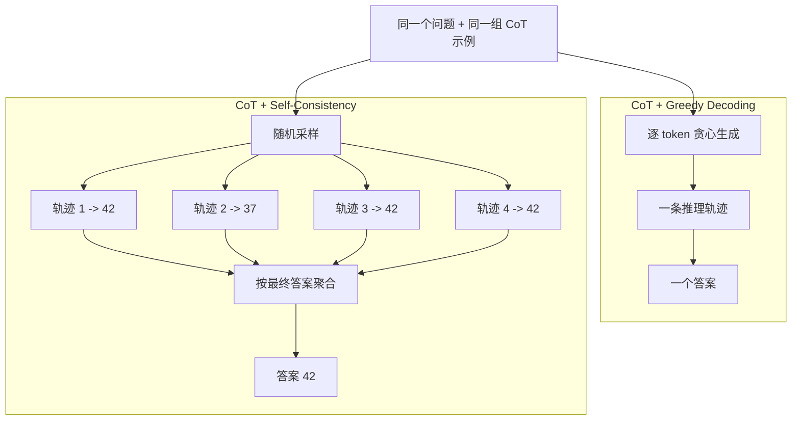
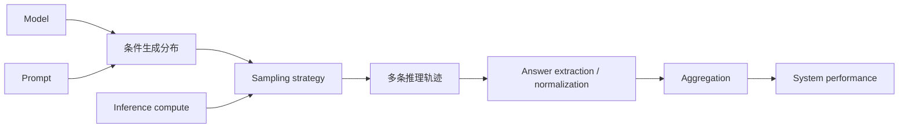

# 经典论文解读（十二）｜推理增强：Self-Consistency Improves Chain of Thought Reasoning in Language Models

同一个模型，同一组 Chain-of-Thought 示例，只改变生成答案的方式，GSM8K 准确率可以从 56.5% 提高到 74.4%。

模型参数没有更新，prompt 也没有加入新的解题知识。变化发生在推理时：原来的方法沿着 greedy decoding 生成一条 CoT；Self-Consistency 则采样 40 条不同的推理轨迹，抽取各自的最终答案，再选择出现次数最多的一个。

这篇由 Xuezhi Wang、Jason Wei、Denny Zhou 等人完成的论文于 2022 年 3 月提交，后来发表于 ICLR 2023。它的方法简单得几句话就能讲完，真正值得追问的是那个 17.9 个百分点的差距：如果模型没有变，为什么我们测到的“能力”变了？

我的理解是，Self-Consistency 把语言模型评测中一个容易被忽略的事实摆得很清楚：给定问题以后，模型对应的是一组可能输出的条件分布；一次生成只是从特定解码规则下得到的一次观测。模型参数给出生成的可能性，采样、计算预算和聚合方法则决定其中哪些可能性会成为系统的最终回答。

因此，benchmark 上的表现由模型参数和整套推理流程共同决定。更完整的表达应该是：

$$
\text{System Performance}
=f(\text{Model},\text{Prompt},\text{Sampling},\text{Compute},\text{Aggregation})
$$

Self-Consistency 的重要性，就藏在这个公式里。

---

## 一、CoT 留下的问题：为什么只看一条路径？

上一篇介绍的 CoT prompting，让模型先生成中间步骤，再给出最终答案。它把原本直接完成的映射：

```text
Question -> Answer
```

展开成：

```text
Question -> Reasoning steps -> Answer
```

这让复杂问题获得了更多生成长度，也让后续答案可以依赖前面写出的中间状态。但原始 CoT 在评测时通常仍采用 greedy decoding：每一步选择当前概率最高的下一个 token，沿着这条路径一直生成到底。

greedy decoding 并不等于找到了概率最高的完整推理序列。它只是把一个不断分叉的生成过程压成了一条确定轨迹。只要前面某一步选错，后面的生成就会在错误上下文上继续展开。

以一道简单的价格题为例：某商品原价 100 元，先打八折，再涨价 25%，最后多少钱？模型可能生成几种不同过程：

```text
路径 A：100 × 0.8 = 80，80 × 1.25 = 100，答案 100

路径 B：先降价 20 元，剩 80 元；再增加 80 × 25% = 20 元，答案 100

路径 C：打八折后是 80 元；再涨价 25 元，答案 105
```

三条文本都来自同一个模型。A 和 B 使用不同表述得到同一个答案，C 则在百分比的基数上犯了错。一次 greedy generation 若走到 C，评测只会记录一次错误；它不会告诉我们，同一套参数和 prompt 还能生成 A、B。

这正是 Self-Consistency 的出发点：既然复杂问题可能有多条推理轨迹，为什么要让一条逐 token 贪心得到的轨迹代表整个生成分布？

---

## 二、方法：采样多条轨迹，聚合最终答案

Self-Consistency 没有训练 verifier，也不需要微调模型。它保留原来的 CoT prompt，只替换 decoding strategy。



第一步是用 temperature sampling 生成多条推理轨迹。论文的主要实验对每道题独立采样 40 个输出；不同模型采用的具体温度和 top-k 配置有所不同。

第二步是从每条轨迹中抽取最终答案，然后统计答案频率：

```text
42 -> 3 次
37 -> 1 次
39 -> 1 次

最终输出：42
```

这里聚合的是 **answer consistency（答案一致性）**。方法不比较哪段推理写得更漂亮，也不检查不同 CoT 的中间步骤能否互相印证。两条推理过程可以完全不同，只要最终答案相同，就会被计入同一组。

中文里常说“多数投票”，严格来说，多答案任务取的是频数最高的答案，也就是经验众数；获胜答案未必拿到超过一半的票。

---

## 三、数学上在估计什么？

设问题为 $x$，一条完整推理轨迹为 $r$，从轨迹中抽取出的最终答案为 $a=f(r)$。

固定模型、prompt 和采样配置后，实际解码过程诱导出一个分布：

$$
r_i\sim q(r\mid x),\qquad i=1,2,\ldots,N
$$

Self-Consistency 从这个分布采样 $N$ 条轨迹，再选择出现次数最多的答案：

$$
\hat a
=\arg\max_a\sum_{i=1}^{N}\mathbf{1}[f(r_i)=a]
$$

如果只看答案，采样得到的其实是一组对答案分布的观测。例如：

$$
q(a=42\mid x)=0.40,\quad
q(a=37\mid x)=0.20,\quad
q(a=39\mid x)=0.15,\ldots
$$

只要正确答案是答案空间中最集中的那个峰，随着样本增加，经验众数就更有机会稳定落到它上面。

论文把这个过程描述为对采样到的 reasoning paths 做 marginalization。直觉上，一个答案可能由许多不同路径支持：

$$
P(a\mid x)=\sum_r P(a,r\mid x)
$$

所有路径无法枚举，于是通过 Monte Carlo sampling 观察哪些答案汇集了更多概率质量。

这里需要加一个限定：论文实际使用 temperature 和 top-k sampling，采样的是解码配置改变后的 $q(r\mid x)$，然后还要经过答案抽取函数 $f$。因此，这个投票可以理解为对路径边缘化的采样近似，却不是对模型原始 $P(a\mid x)$ 的精确求和。

从算法结构看，它可以概括成：

```text
Chain-of-Thought
        +
Monte Carlo sampling
        +
Answer aggregation
```

它使用单个模型自身的生成分布完成 self-ensemble，不需要另外训练多个模型。

---

## 四、为什么答案一致性可能有效？

论文依赖的核心直觉是：一道复杂推理题通常允许多种正确解法，这些解法的文字和中间步骤不同，最终会汇集到同一个答案；错误则可能来自不同环节，分散到多个答案上。

```text
正确轨迹 A -----\
正确轨迹 B ------> 42
正确轨迹 C -----/

错误轨迹 D ------> 37
错误轨迹 E ------> 39
错误轨迹 F ------> 46
```

如果模型对正确答案形成一个明显的概率峰，有限次采样就可能把它显露出来。论文用路径多样性去寻找这个峰，再用答案一致性完成选择。

不过，有效的并非多样性本身。把 temperature 调得很高当然可以得到差异更大的文本，也可能同时破坏解题质量。Self-Consistency 要得到收益，至少依赖两个条件：采样能够覆盖有用的解法；不同样本的错误不能总是高度相关。

“正确路径汇聚、错误路径分散”也是一种经验直觉，并非普遍定律。模型可能反复套用同一个错误公式，让错误答案比正确答案更加集中。此时答案一致性只会稳定地选中那个系统性错误。

所以，高一致性首先说明模型在当前 prompt 和采样配置下的答案分布很集中。它本身不能保证答案与外部事实一致。

---

## 五、实验：模型不变，GSM8K 提高 17.9 个百分点

论文在算术、常识和符号推理任务上测试了 UL2-20B、LaMDA-137B、PaLM-540B，以及 GPT-3、Codex 系列模型。主要对照很干净：模型与 CoT prompt 保持不变，只把 greedy decoding 换成 Self-Consistency。

PaLM-540B 在六个算术数据集上的结果如下：

| 数据集 | CoT | Self-Consistency | 提升 |
| --- | ---: | ---: | ---: |
| AddSub | 91.9 | 93.7 | +1.8 |
| MultiArith | 94.7 | 99.3 | +4.6 |
| ASDiv | 74.0 | 81.9 | +7.9 |
| AQuA | 35.8 | 48.3 | +12.5 |
| SVAMP | 79.0 | 86.6 | +7.6 |
| GSM8K | 56.5 | 74.4 | +17.9 |

GSM8K 的变化最醒目：

```text
PaLM-540B + CoT greedy decoding       56.5%
PaLM-540B + CoT Self-Consistency      74.4%
                                      +17.9
```

同样的方法也能跨模型、跨任务带来收益：

| 模型 | 任务 | CoT | Self-Consistency | 提升 |
| --- | --- | ---: | ---: | ---: |
| LaMDA-137B | MultiArith | 51.8 | 75.7 | +23.9 |
| LaMDA-137B | GSM8K | 17.1 | 27.7 | +10.6 |
| code-davinci-002 | StrategyQA | 73.4 | 79.8 | +6.4 |
| code-davinci-002 | ARC-Challenge | 83.6 | 87.5 | +3.9 |
| PaLM-540B | Last Letter | 65.8 | 70.8 | +5.0 |
| PaLM-540B | Coin Flip | 88.2 | 91.2 | +3.0 |

这些结果覆盖了算术、常识和符号任务，收益大小随模型和数据集变化。实验支持的结论很具体：对于多种已有一定 CoT 能力的模型，多路径采样与答案聚合比单条 greedy CoT 更准确。

它没有证明任意模型、任意任务都能靠增加样本持续获益。模型若很少生成有效解法，采样只会收集更多错误；任务若没有容易抽取和归一化的答案，投票本身也难以定义。

### 增加 sample 数量会怎样？

作者比较了 1、5、10、20、40 条推理轨迹。论文测试范围内的总体趋势很稳定：样本增加，准确率提高，随后逐渐趋于饱和。

```text
Accuracy
   ^
   |                 ______
   |             ___/
   |          __/
   |       __/
   |   ___/
   +------------------------> sampled reasoning paths
       1   5   10  20  40
```

这条曲线展示了固定模型下另一条性能轴：增加推理时计算量，可以换取更好的任务表现；边际收益则会下降。

### 会不会只是普通 ensemble 的作用？

作者还在 PaLM-540B 的 GSM8K 实验中比较了不同形式的 ensemble：

| 方法 | 准确率 |
| --- | ---: |
| 不同 prompt sets 产生 40 个输出 | 58.9 |
| 打乱 exemplar 顺序产生 40 个输出 | 59.6 |
| Self-Consistency，40 条推理轨迹 | 74.4 |
| Self-Consistency + 不同 prompt sets | 75.4 |

这里的第一行不是手写 40 套 prompt；论文使用三套 prompt，再产生共 40 个输出做集成。结果说明，简单改变 prompt 或示例顺序带来的收益远小于从同一 CoT 设置中采样不同推理轨迹。给 Self-Consistency 继续加入 prompt diversity，只多提高了 1 个百分点。

---

## 六、从模型能力到系统表现

Self-Consistency 最值得记住的地方，可以从生成分布重新理解。

给定模型、prompt 和解码配置后，同一道题对应一组可能的输出轨迹。模型参数决定哪些轨迹有可能出现以及各自的相对倾向；推理系统则决定采样多少次、怎样抽取答案、怎样利用这些样本。



这里可以区分两个概念。

**模型能力**指参数与条件生成分布提供的可能性：模型在什么输入条件下可能产生哪些解法。它无法脱离 prompt 和观测方式被直接读出来。

**系统表现**是整套推理流程在特定计算预算下得到的结果。相同参数接入不同 sampler、answer extractor 和 aggregator，最后可以测出显著不同的准确率。

Self-Consistency 没有向参数中写入新的知识，却把分布中原本不稳定出现的有效轨迹转化成了更稳定的答案。于是，单次 greedy accuracy 很难被视为一个脱离推断过程的“模型能力常数”。它只是特定推理系统、特定计算预算下的一个测量结果。

这也解释了为什么答案抽取并非无关紧要的工程细节。`42`、`42.0` 与 `The answer is 42` 若没有被归一化为同一个结果，本该一致的样本会被拆散；开放式文本没有固定答案集合时，还要先定义什么叫“相同答案”。系统边界比一条生成调用更宽。

---

## 七、边界：一致性会在哪里失效？

Self-Consistency 的代价和假设都很明显。

### 1. 系统性错误也会高度一致

如果十条轨迹中有六条重复同一个错误套路，另外四条得到正确答案，众数仍然会选错。频率只能反映生成分布中的概率质量，不能充当事实判定器。

### 2. 四十条轨迹不等于四十份独立证据

所有样本来自同一模型、同一 prompt，训练数据和生成偏好高度共享。表面措辞不同的 CoT，可能依赖相同的错误模式。路径数增加了，独立信息量未必按同样比例增加。

### 3. 成本会随采样数增长

原本每题只生成一条 CoT，现在要生成 40 条。token 消耗、延迟和计算量都会显著上升，而且曲线后段已经出现边际收益递减。实时应用很难不计成本地照搬论文配置。

2025 年的 **Confidence-Informed Self-Consistency（CISC）** 就在处理这个问题。它让模型为每条路径提供 confidence，再用置信度加权投票。论文在 9 个模型和 4 个数据集上报告：达到相同性能所需的推理路径平均减少超过 40%。这个结果也把新的问题带了进来——票数之外，系统还可以用什么信号衡量每条样本的价值？

---

## 八、从多路径聚合到测试时扩展

把 Self-Consistency 放回后来的研究进展中看，它提供了一个很简洁的 generate-and-aggregate 范式：

```text
Generate N reasoning trajectories
                |
                v
Extract and aggregate answers
                |
                v
Return one answer
```

后来很多推理系统也会生成多个候选，再用某种信号决定最终输出。选择器可以是答案频率，也可以是 outcome verifier、reward model 或 process reward model。进一步的方法不必等所有轨迹生成到底，还会在中间状态上评分、剪枝、扩展或回溯。

可以把几类方法放进同一条演进脉络观察：

```text
CoT
一条展开的推理轨迹
  |
  v
Self-Consistency
多条独立完整轨迹 + 最终答案聚合
  |
  v
Verifier / Best-of-N
多候选 + 显式质量评分
  |
  v
Tree Search / MCTS
生成过程中评估、剪枝与继续探索
```

这张图描述的是思想上的联系，不表示 Self-Consistency 直接催生了每一种后续方法。它和 Best-of-N 也有明确区别：Self-Consistency 聚合答案频率，并不挑选一条被判为“质量最高”的推理路径。

从 test-time scaling 的视角看，这篇论文给出了一次很有影响力的展示：模型参数固定以后，系统仍然可以用更多 inference compute 换取更高准确率。CoT 增加一条轨迹内部的推理 token；Self-Consistency 则把计算扩展到多条并行轨迹。

回到开头的 GSM8K 结果，56.5% 和 74.4% 来自同一个 PaLM-540B。两个数字都是真的，但它们描述的不是一套相同的推理系统。前者测量一条 greedy CoT，后者测量 40 条 sampled CoT 经过答案聚合后的输出。

因此，评价一个模型或搭建一个 Agent 时，只问“底座模型有多强”已经不够。还要继续问：系统怎样探索模型的输出分布？给了多少计算预算？怎样从候选中提取、验证和聚合答案？

模型给出可能性，推理系统决定怎样使用这些可能性。Self-Consistency 用最朴素的采样和计数，把这条边界展示得非常清楚。

---

## 参考资料

1. Xuezhi Wang et al., **Self-Consistency Improves Chain of Thought Reasoning in Language Models**, ICLR 2023. https://arxiv.org/abs/2203.11171
2. Xuezhi Wang et al., **Self-Consistency Improves Chain of Thought Reasoning in Language Models**, OpenReview. https://openreview.net/forum?id=1PL1NIMMrw
3. Jason Wei et al., **Chain-of-Thought Prompting Elicits Reasoning in Large Language Models**, NeurIPS 2022. https://arxiv.org/abs/2201.11903
4. Amir Taubenfeld et al., **Confidence Improves Self-Consistency in LLMs**, Findings of ACL 2025. https://aclanthology.org/2025.findings-acl.1030/
