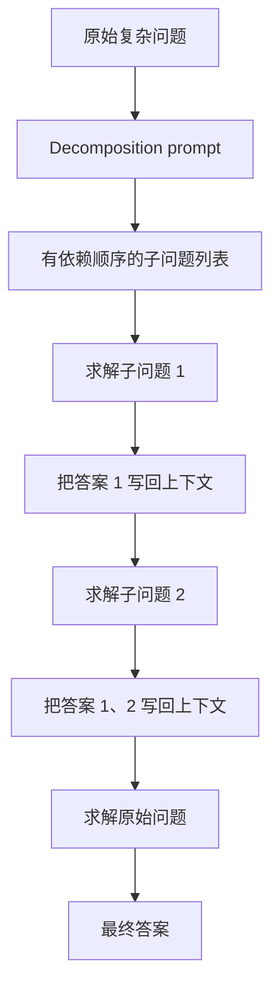
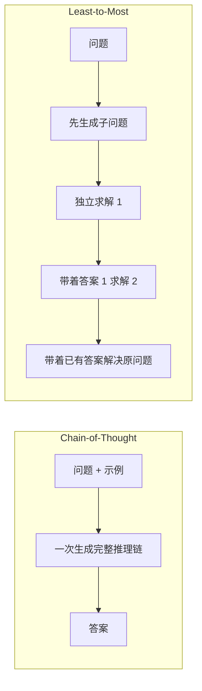
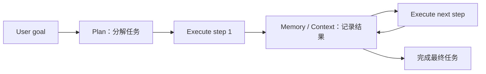

# 经典论文解读（十三）｜推理增强：Least-to-Most Prompting Enables Complex Reasoning in Large Language Models

如果 prompt 里的示例只演示了两三步推理，模型能不能据此解决一个需要十几步的问题？

Chain-of-Thought 已经让大模型学会把中间过程写出来，但写出一条更长的 CoT，不等于真正掌握了更深的组合结构。当测试问题明显比 few-shot exemplar 更复杂时，CoT 的准确率仍会快速下降。

2022 年，Denny Zhou 等人在 **《Least-to-Most Prompting Enables Complex Reasoning in Large Language Models》** 中专门研究了这个问题。他们提出 Least-to-Most Prompting：先让语言模型把复杂问题分解成一组相互依赖的子问题，再按照从简单到复杂的顺序逐个求解。已经得到的答案不会被丢掉，而是作为上下文放进下一轮 prompt，成为后续求解的已知条件。

这篇论文最重要的结果来自 SCAN 的 length split。使用 `code-davinci-002` 时，Chain-of-Thought 的准确率只有 16.2%，Least-to-Most 达到 99.7%。两种方法使用同一组 14 个 command-mapping exemplar，主要区别在于 Least-to-Most 额外做了问题分解，并把中间结果逐步复用。

我更愿意把它理解成早期 Agent 工作流的一个概念雏形：先 plan，再依次 execution，同时把每一步产生的状态写回 context。它还没有工具调用、环境反馈与动态重规划，却已经把“一次生成一个完整答案”改造成了一个有状态的求解过程。

---

## 一、CoT 留下的问题：会做短题，不等于会做长题

上一篇介绍 Self-Consistency 时，我们讨论的是一条推理路径不可靠怎么办。它的做法是多采样几条 CoT，再按照最终答案聚合。

Least-to-Most 处理的是另一个问题：如果测试题比 prompt 中的示例更难，仅仅重复采样同一种求解过程，未必能跨过难度差距。

这里的“更难”有一个很具体的含义。论文关注 **easy-to-hard generalization**：模型只从简单示例中学习任务，却要在测试时解决需要更多组合或更多步骤的问题。

以 last-letter concatenation 为例，任务规则很简单：取出列表中每个单词的最后一个字母，再按顺序拼接。

```text
think, machine -> ke
think, machine, learning -> keg
```

如果测试列表和 exemplar 一样短，CoT 可以逐个找出字母并拼接。但当列表从 4 个单词增长到 12 个时，模型必须维持更长的中间状态，漏掉、重复或拼错一个字母都会让整个答案失败。

论文中的 `code-davinci-002` 结果很直观：

| 测试列表长度 | 4 | 6 | 8 | 10 | 12 |
| --- | ---: | ---: | ---: | ---: | ---: |
| Standard prompting | 0.0 | 0.0 | 0.0 | 0.0 | 0.0 |
| Chain-of-Thought | 84.2 | 69.2 | 50.2 | 39.8 | 31.8 |
| Least-to-Most | 94.0 | 88.4 | 83.0 | 76.4 | 74.0 |

CoT 并非完全无效。长度为 4 时，它已经把 standard prompting 的 0% 提高到 84.2%。问题在于，随着测试输入越来越长，它的准确率下降得很快。CoT exemplar 示范了一条完整解法，却没有明确教模型怎样把同一个局部操作稳定地递归到任意长度。

这正是论文对“复杂”的限定。它没有证明 Least-to-Most 对所有困难任务都更好，也没有证明 CoT 遇到任何复杂问题都会失效。它展示的是：当难度体现为更长的组合结构或更多求解步骤时，显式分解比照着短示例一次写完更容易泛化。

---

## 二、方法：先自顶向下分解，再自底向上求解

Least-to-Most 包含两个阶段。

第一个阶段是 **problem decomposition**。Prompt 中放入少量“怎样拆题”的示例，然后要求模型把当前问题拆成一组更容易的子问题。

第二个阶段是 **subproblem solving**。模型从最简单的子问题开始求解。每得到一个答案，系统就把这组子问题与答案追加到下一轮 prompt 中，再要求模型解决下一个问题。原始问题也会被放进子问题序列，并在最后得到回答。



论文 Figure 1 使用了一道行程题。模型先产生一个中间问题：“每一趟需要多长时间？”得到每趟 5 分钟后，下一轮 prompt 会保留这个答案，再利用它解决原始问题。

这个过程与普通 CoT 看起来都在“分步骤”，但两者组织计算的方式不同。



CoT 通常让模型在一次生成中从头写到尾。Least-to-Most 则把中间结果提升成下一次调用可以直接读取的外部状态。后续步骤不必重新完成此前的全部推导，只需在已有结果上继续组合。

### 多次调用不是唯一形式

论文的标准描述是“两阶段、多轮求解”，last-letter concatenation 和 SCAN 也确实按这种方式实现。不过 Least-to-Most 并不要求每道题都必须发起多次模型调用。

在 GSM8K 实验中，作者把分解与求解合并进了一次生成：先输出子问题列表，再紧接着逐个回答。这是一个 single-pass 变体。论文还指出，Least-to-Most 可以与 CoT、Self-Consistency 组合使用。

所以，方法的核心不是 API 调用了几次，而是下面这两个约束：

- 先显式确定从简单到复杂的依赖结构；
- 求解后面的子问题时，可以直接使用前面已经得到的结果。

多轮调用只是让这种结构更加明确，也使系统更容易检查、替换或重试其中某一步。

---

## 三、关键差别：子问题不是彼此独立的

“把大问题拆成小问题”不是新想法。Least-to-Most 更值得注意的地方，是它拆出的子问题通常存在依赖关系，而且必须按顺序求解。

仍以 last-letter concatenation 为例。对三个单词 `think, machine, learning`，模型生成的不是三个互不相关的问题，而是一串逐渐扩大的前缀：

```text
think
think, machine
think, machine, learning
```

求解 prompt 随后示范一个 base case 和一个 recursive step：

```text
think, machine -> ke

think, machine 已经得到 ke
learning 的最后一个字母是 g
所以 think, machine, learning -> keg
```

第二步没有从零开始重新计算三个单词。它读取前一步的 `ke`，只处理新增加的 `learning`，再把 `g` 拼到已有结果上。

这相当于把一条长映射改写成可重复执行的局部更新：

```text
state_(t+1) = update(state_t, new_part)
```

只要模型学会 base case 和更新规则，测试输入变长时，系统就可以增加迭代次数，而不要求一次生成复刻一条远长于 exemplar 的推理链。

当然，“递归”在这里是对提示结构的描述，不代表模型内部真的执行了形式化递归程序。实验只能观察到：当 prompt 按 base case、recursive step 和状态复用来组织时，模型对更长输入的泛化明显更好。

---

## 四、最关键的实验：SCAN 从 16.2% 到 99.7%

SCAN 是一个研究 compositional generalization 的合成数据集。模型要把自然语言命令转换成动作序列，例如：

| 命令 | 动作序列 |
| --- | --- |
| `look thrice after jump` | `JUMP LOOK LOOK LOOK` |
| `run left and walk` | `TURN_LEFT RUN WALK` |
| `look opposite right` | `TURN_RIGHT TURN_RIGHT LOOK` |

它最困难的设置之一是 length split：训练集或示例中的动作序列较短，测试集中的序列更长。模型不能只记住见过的完整模式，必须把 `left`、`opposite`、`around`、`twice`、`thrice`、`and` 与 `after` 等局部规则重新组合。

Least-to-Most 为 SCAN 准备了两组 prompt：

- 8 个 decomposition exemplar，示范怎样把长命令拆成短命令；
- 14 个 command-mapping exemplar，覆盖 SCAN 中各类命令的语义与组合方式。

例如，`jump around left thrice` 会被逐级拆成：

```text
jump left
jump around left
jump around left thrice
```

模型先得到 `jump left` 的动作，再用它构造 `jump around left`，最后把该结果重复三次。对包含 `and` 或 `after` 的更长命令，系统会分别处理两侧的子表达式，再按正确顺序组合。

为了避免长动作序列超过当时模型的 2048 token 上下文限制，论文使用 Python 风格的表达式作为中间表示，例如用 `LOOK * 2` 代替 `LOOK LOOK`，最后通过后处理脚本将表达式展开。作者也在附录中测试了让模型自行展开这些表达式，报告的准确率同样为 99.7%。

length split 的结果如下：

| 模型 | Standard prompting | Chain-of-Thought | Least-to-Most |
| --- | ---: | ---: | ---: |
| code-davinci-002 | 16.7 | 16.2 | **99.7** |
| text-davinci-002 | 6.0 | 0.0 | **76.0** |
| code-davinci-001 | 0.4 | 0.0 | **60.7** |

对 `code-davinci-002`，CoT 与 Least-to-Most 使用相同的 14 个 command-mapping exemplar；CoT 缺少的是额外的 command decomposition。结果从 16.2% 变成 99.7%，很难再用“Least-to-Most 只是多放了几句解释”概括。

这里也有两个不能省略的限定。

第一，SCAN 是规则明确的合成任务。14 个 mapping exemplar 被有意设计为覆盖命令语义，不能把这个结果直接外推成“14 个样例足以解决任意自然语言任务”。

第二，99.7% 仍然不是零错误。论文在 length split 测试集中找到 13 个失败样本：6 个与 `around` 后的 `twice`、`thrice` 解释错误有关，其余主要把 `after` 错当成 `and`。分解可以缩短局部映射，却不会自动消除语义规则上的系统性错误。

---

## 五、数学任务：结论没有 SCAN 那么夸张

如果只看摘要中的 99.7%，很容易以为 Least-to-Most 在所有推理任务上都能碾压 CoT。GSM8K 的结果要克制得多。

论文用一道只需两步的苹果题作为 one-shot exemplar，让模型处理需要更多步骤的 GSM8K 问题。Least-to-Most prompt 比 CoT 多出一段明确的 decomposition：先列出“Anna 有多少个苹果”“两人一共有多少个苹果”，再依次计算。

总体结果是：

| 方法 | DROP 非足球题 | DROP 足球题 | GSM8K |
| --- | ---: | ---: | ---: |
| Zero-shot | 43.86 | 51.77 | 16.38 |
| Standard prompting | 58.78 | 62.73 | 17.06 |
| Chain-of-Thought | 74.77 | 59.56 | 60.87 |
| Least-to-Most | **82.45** | **73.42** | **62.39** |

GSM8K 总体只提高了 1.52 个百分点。按照标准答案所需步骤数拆开看，差别集中在更长的问题上：

| 方法 | 2 步 | 3 步 | 4 步 | 至少 5 步 |
| --- | ---: | ---: | ---: | ---: |
| Chain-of-Thought | **76.68** | 67.29 | 59.39 | 39.07 |
| Least-to-Most | 74.53 | **68.91** | **59.73** | **45.23** |

两步题上，Least-to-Most 反而略低于 CoT；至少五步时，优势才扩大到 6.16 个百分点。这与论文的核心问题一致：当测试题没有明显超出 exemplar 的复杂度时，额外分解未必有收益；当步骤继续增长，显式分解更可能发挥作用。

作者还发现，几乎所有 Least-to-Most 未能解决的 GSM8K 题，在换成人工设计的正确 decomposition 后最终都能得到答案。这句话揭示了方法的新瓶颈：求解器可能有能力解决每个局部问题，负责拆题的模型却未必能找出正确的依赖结构。

换句话说，Least-to-Most 没有让错误消失。它把一部分“整题太难”的失败，转化成了更容易定位的两类失败：

- 问题拆错了，后面会沿着错误计划继续执行；
- 问题拆对了，某个局部步骤仍可能计算或组合错误。

这对系统设计很有价值，因为两类错误可以分别检查。但论文中的基本方法本身还没有 verifier，也不会在发现计划不合理后自动重新分解。

---

## 六、怎样理解概率：这是直觉，不是论文定理

从自回归生成的角度，直接回答原问题可以写成：

$$
P(a\mid x)
$$

假设模型先产生分解 $Z$，依次得到子问题答案 $s_1,s_2,\ldots,s_k$，再输出最终答案 $a$。将每一次调用都视为条件生成，整个过程可以按链式法则写成：

$$
P(Z,s_1,\ldots,s_k,a\mid x)
=
P(Z\mid x)
\cdot
\prod_{i=1}^{k}P(s_i\mid x,Z,s_{<i})
\cdot
P(a\mid x,Z,s_{1:k})
$$

Least-to-Most 的工程直觉是：原本要求模型一次完成的复杂映射，被改写成多个更接近 exemplar 难度的局部映射。每一步生成的答案又会进入上下文，让下一步可以在已经算出的状态上继续，而不必重新恢复全部中间信息。

如果这些局部任务确实更容易，那么它们的条件正确率可能高于直接完成整题的正确率。即使最终成功仍要求一串步骤全部正确，较可靠的局部操作也可能带来更高的端到端准确率。

但链式法则本身只是一种概率分解，它不能证明条件概率一定提高。论文也没有逐步估计这些条件概率，更没有给出“拆成 $k$ 步后成功率必然上升”的理论保证。

事实上，假设每一步都必须正确，并粗略记第 $i$ 步的条件正确率为 $p_i$，端到端成功率近似为：

$$
P(\text{success})\approx\prod_{i=1}^{k}p_i
$$

增加步骤数量会增加出错机会。Least-to-Most 只有在“局部任务变简单带来的 $p_i$ 提升”足以抵消“步骤变多和错误传播的代价”时才会更好。GSM8K 两步题没有获益、长题获益更明显，正好符合这个直觉；它仍然只是对实验现象的解释，不是论文已经证明的数学原理。

已解决答案被写回 prompt 也有两面性。正确答案为后续步骤提供可靠状态，错误答案同样会被当成条件继续使用。上下文管理不会判断内容真假，它只负责让状态可见。

---

## 七、从 Least-to-Most 看 Agent：Plan、Execution 与 Context

今天再看 Least-to-Most，它的结构已经很像一个最小化的 Agent loop：



对应关系很清楚：

| Least-to-Most | Agent 工作流中的对应概念 |
| --- | --- |
| Decomposition prompt | Plan / task breakdown |
| 有依赖顺序的子问题 | 可执行步骤与依赖图 |
| Sequential solving | 按计划执行 |
| Previous Q&A pairs | Working memory / context state |
| 原问题作为最后一个子问题 | 根据中间状态完成最终目标 |

普通 CoT 把规划、执行和答案压在同一条生成轨迹里。Least-to-Most 第一次调用只负责拆题，后续调用消费计划与已有结果；于是不同阶段有了更明确的接口。哪一步失败、应该重试哪一步，也比一整段 CoT 更容易定位。

这也是为什么我愿意把它称为 Agent 的**概念前身**，而不是直接的历史祖先。论文自己在结尾说，传统 prompting 是一种单向沟通：人给模型指令，却不会根据模型反馈继续教学；更自然的方向是走向双向对话。作者把 Least-to-Most 看作朝这种交互迈出的一步。

现代 Agent 通常还多出几块关键能力：调用搜索、代码执行器或数据库等外部工具；从环境读取真实反馈；检查结果；在执行失败后修改计划。Least-to-Most 没有完成这些部分。它提供的是更基础的骨架：

```text
先决定做什么
        -> 做一步
        -> 保存这一步的结果
        -> 带着新状态继续做
```

一旦中间结果不再只存在于模型内部，而是成为系统可以保存、检查和重新注入的状态，prompting 就开始从一句精心措辞的文本，变成一段可以编排的程序。

---

## 八、适用边界：拆题本身就是难题

Least-to-Most 最容易被低估的成本，是 decomposition prompt 具有明显的领域依赖。

论文明确指出，数学应用题的分解示例不能直接教会模型分解常识推理题，例如“亚里士多德是否使用过笔记本电脑”。换一个领域，通常需要重新设计能够示范该领域结构的 decomposition prompt。

SCAN 的 99.7% 也建立在高质量任务设计上。14 个 command-mapping exemplar 被刻意挑选来覆盖 SCAN 语义；Python 表达式压缩了中间表示；外部脚本负责最终展开。这个系统并不是随便加一句“把问题拆开”就自然出现的。

在真实任务中，还会遇到论文基本方案没有处理的问题：

- 子问题之间未必能排成一条线，可能形成分支或循环依赖；
- 某一步需要的事实可能不在模型参数或当前上下文中；
- 早期结果出错后，后续步骤可能全部建立在错误状态上；
- 多轮调用增加 token、延迟与系统复杂度；
- 计划需要根据执行结果动态修改，而不是一次生成后固定不变。

因此，Least-to-Most 最适合的场景具有几个特征：复杂度来自可组合的局部结构；子问题能按依赖顺序排列；模型有能力解决局部问题；中间答案能成为后续步骤的有效输入。

如果任务主要缺少外部知识，拆成十个问题也不会凭空产生事实。如果分解质量低于直接求解，额外步骤反而会制造更多错误。方法的价值取决于分解是否真的把问题变得更容易。

---

## 九、从一条推理链到一个推理系统

CoT 的关键变化，是让最终答案依赖显式生成的中间 token。Self-Consistency 在此基础上采样多条路径，用更多推理时计算换取更可靠的答案。Least-to-Most 又向前走了一步：先把问题结构显式化，再让多个求解调用通过上下文共享状态。

它最有说服力的结果不是“模型会分步骤”——CoT 已经做到了这一点——而是模型可以借助递归式的分解与状态复用，从简单 exemplar 泛化到更长的组合问题。SCAN 的 16.2% 到 99.7% 把这种差别表现得非常极端；GSM8K 的小幅提升则提醒我们，它不是所有复杂推理题的通用开关。

回到最开始的概率直觉，Least-to-Most 确实在尝试提高每次求解的局部可控性，并让下一步显式条件化在已有答案上。论文真正证明的是这种组织方式在若干 easy-to-hard benchmark 上有效，而不是链式法则保证了它有效。

这篇论文留给后续系统的更实用问题是：既然复杂任务可以被拆开，为什么还要让一次模型调用承担规划、执行、记忆和纠错的全部责任？

把这些职责拆开以后，prompt 不再只是输入模型的一段话。它开始成为一套工作流。

---

## 参考资料

1. Denny Zhou et al., **Least-to-Most Prompting Enables Complex Reasoning in Large Language Models**, ICLR 2023. https://arxiv.org/abs/2205.10625
2. Brenden M. Lake, Marco Baroni, **Generalization without Systematicity: On the Compositional Skills of Sequence-to-Sequence Recurrent Networks**, ICML 2018. https://proceedings.mlr.press/v80/lake18a.html
3. Dheeru Dua et al., **DROP: A Reading Comprehension Benchmark Requiring Discrete Reasoning Over Paragraphs**, NAACL 2019. https://aclanthology.org/N19-1246/
4. Jason Wei et al., **Chain-of-Thought Prompting Elicits Reasoning in Large Language Models**, NeurIPS 2022. https://arxiv.org/abs/2201.11903
5. Xuezhi Wang et al., **Self-Consistency Improves Chain of Thought Reasoning in Language Models**, ICLR 2023. https://arxiv.org/abs/2203.11171
6. Tongshuang Wu, Michael Terry, Carrie Jun Cai, **AI Chains: Transparent and Controllable Human-AI Interaction by Chaining Large Language Model Prompts**, CHI 2022. https://doi.org/10.1145/3491102.3517582
