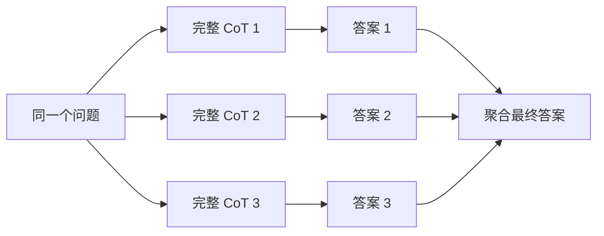
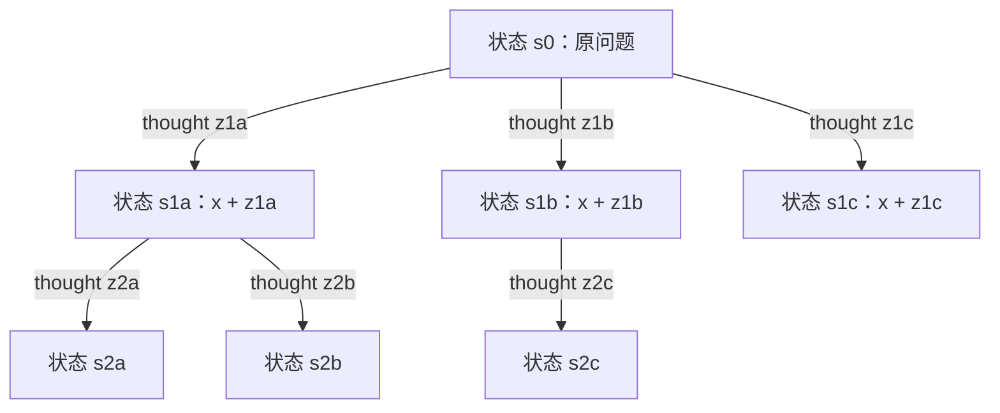
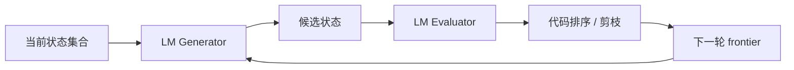

# 经典论文解读（十四）｜推理增强：Tree of Thoughts: Deliberate Problem Solving with Large Language Models

给定四个数字 `4、9、10、13`，每个数字只能用一次，怎样通过加减乘除得到 24？

GPT-4 使用 Chain-of-Thought 解这类题时，成功率只有 4%。即使独立生成 100 条 CoT，再对最终答案做 Self-Consistency，成功率也只有 9%。2023 年，Shunyu Yao 等人在 **《Tree of Thoughts: Deliberate Problem Solving with Large Language Models》** 中换了一种推理方式：不再选定一条路径后一路生成到底，而是在每一步提出多个候选，评估哪些中间状态仍有希望，再决定保留、剪枝或回退。

同一个 GPT-4，成功率提高到了 74%。

这个结果常被概括为“把 Chain of Thought 变成一棵树”，但真正重要的变化发生在模型外部。语言模型负责生成 thought，也负责给候选状态提供启发式评价；一段代码维护搜索树、控制宽度和深度、保存状态，并决定下一次把哪个状态放回 prompt。模型不再独自承担整条控制流，而是成为搜索算法中的生成器和估值器。

我更愿意把 Tree of Thoughts 看作早期 LLM harness 的一个概念雏形。它把过去藏在一次生成里的探索过程拆开，变成了一组可编排、可观察、可替换的模块。代价也很直接：只要分支数和深度增长，搜索空间就会迅速膨胀；剪枝可以减少无效探索，错误的剪枝也可能把正确答案一起删掉。

---

## 一、CoT 的限制：第一步走错，后面只能继续走错

自回归语言模型按 token 从左到右生成。一旦前面的 token 已经输出，后面的生成只能条件化在这段历史上，无法回到过去替换一个早期选择。

CoT 把中间推理写进上下文，已经比直接输出答案强很多。它的问题是，实际推理通常仍被采样成一段连续文本：

```text
问题 -> thought 1 -> thought 2 -> thought 3 -> 答案
```

假设解 24 点时，第一步选择了 `4 + 9 = 13`。模型接下来可以写出很长的计算，但如果剩下的数字已经不可能得到 24，再流畅的后续步骤也救不回最初的选择。

论文在 Game of 24 上分析了 CoT 的失败位置，发现大约 60% 的 CoT 样本在第一步后就已经失败。此时模型只生成了最开始的三个词，例如 `4 + 9`，整条路径却已经不可能到达答案。直接从左向右生成，会把大量计算花在这些早已失去希望的路径上。

Self-Consistency 扩大了探索范围，但每一条路径内部仍然是单向的：



它只在路径走到底之后比较答案，不会在第一步发现 `4 + 9` 没有前途时，立即停止这条轨迹并把预算转给另一个选择。多数投票还要求输出空间比较有限，或者至少能把不同文本归一化成同一个答案。24 点可能存在大量不同的正确等式，正确路径不一定汇集到一个相同字符串上。

Tree of Thoughts 的问题由此变得很具体：能否把“生成完整轨迹后再比较”，改成“每走一步就比较当前状态”？

---

## 二、什么是 thought，什么才是树节点？

论文把 **thought** 定义为一段连贯的语言序列，它在解决问题的过程中充当一个有意义的中间步骤。这个单位比 token 大，却不必是一整条推理链。

thought 的粒度由任务决定：

| 任务 | 一个 thought 的形式 |
| --- | --- |
| Game of 24 | 一行中间方程，例如 `13 - 9 = 4` |
| Creative Writing | 一段完整的写作计划 |
| Mini Crosswords | 为某条横向或纵向线索填写一个单词 |

粒度需要落在两个极端之间。一个 token 太小，很难判断它对完成任务有没有帮助；一整本书又太大，模型难以一次产生多个连贯候选，也来不及在错误扩大前进行评估。

严格来说，单个 thought 不是树节点。给定输入问题 $x$ 和已经生成的 thoughts $z_1,\ldots,z_i$，论文把节点定义为一个部分解状态：

$$
s_i=[x,z_1,\ldots,z_i]
$$

从当前状态生成一个新 thought $z_{i+1}$，才得到一个新的状态：

$$
s_{i+1}=[x,z_1,\ldots,z_i,z_{i+1}]
$$

如果 generator 对同一个 $s_i$ 提出 $k$ 个候选 thought，就会产生 $k$ 个子状态。节点保存从原问题到当前位置的完整语义前缀，thought 是扩展节点的候选步骤，分支表示一次不同的扩展选择。



这棵树不是模型参数里预先存在的结构，也不是一次 prompt 自动吐出的完整对象。外部程序反复选择状态、构造 prompt、调用模型并保存结果，树才在多次交互中逐步展开。

---

## 三、ToT 的四个组件

论文没有给出一个适用于所有任务的固定 prompt，而是提出四个需要针对任务回答的问题：thought 怎样划分、候选怎样生成、状态怎样评估、搜索算法怎样选择。

### 1. Thought decomposition：选定可搜索的语义单位

划分 thought 是把自然语言推理转成搜索问题的第一步。24 点天然可以按每次合并两个数字划分；填字游戏可以按每次填写一个词划分；创意写作则把整份写作计划当成一个 thought。

这一步包含人工设计。ToT 可以不训练模型，却不意味着完全不需要任务知识。开发者必须找到一种中间表示，使模型既能产生足够多样的候选，也能评价候选距离目标还有多远。

### 2. Thought generator：从一个状态提出多个下一步

论文记 generator 为：

$$
G(p_\theta,s,k)
$$

输入是模型 $p_\theta$、当前状态 $s$ 和候选数 $k$，输出是下一步可能采用的 thoughts。

候选空间很丰富时，可以从同一个 CoT prompt 独立采样 $k$ 次。创意写作采用这种方式生成不同计划。候选空间较窄时，分别采样容易产生重复，论文便用一个 `propose prompt` 让模型一次列出若干不同选择。Game of 24 和 Mini Crosswords 使用了这种策略。

### 3. State evaluator：把语言模型变成启发式函数

生成候选以后，还需要判断哪些状态值得继续探索。ToT 没有为每个任务训练独立的 value model，而是再次调用语言模型进行评价。

论文采用两种方式：

- **Value**：独立评价一个状态，输出数值或 `sure / maybe / impossible` 等分类；
- **Vote**：把多个候选放在一起比较，让模型投票选出更有希望的状态。

24 点使用 value prompt。模型可以通过少量 lookahead 检查 `5、5、14` 能否组成 24，也可以根据数值常识判断某些剩余数字已经太大或太小。创意写作很难为一个计划定义绝对分数，所以把五个计划放在一起投票。

评价不需要完美，只要与随机选择相比更有帮助，就可能引导搜索。但这也是整个框架最脆弱的地方：generator 和 evaluator 可能由同一个模型承担。会提出错误方案的模型，也可能对错误方案很有信心。

### 4. Search algorithm：由代码决定展开顺序

最后，外部程序把 generator 和 evaluator 接入搜索算法。论文实验了 BFS 与 DFS，并把 A*、MCTS 等更复杂算法留给后续工作。



模型决定“有哪些可能的下一步”和“看起来哪一步更有希望”。代码决定保留多少状态、先访问哪个状态、何时停止、是否回退，以及总共允许消耗多少次调用。

---

## 四、BFS 与 DFS：同一框架，不同控制策略

### BFS：每层保留最有希望的几个状态

ToT-BFS 在第 $t$ 层维护一个状态集合 $S_{t-1}$。对其中每个状态生成 $k$ 个候选，得到新的候选集合：

$$
S'_t=\{[s,z]\mid s\in S_{t-1},\ z\in G(p_\theta,s,k)\}
$$

evaluator 为候选打分后，只保留最好的 $b$ 个状态进入下一层。这里的 $b$ 是 breadth limit，也可以理解为 beam width。

Game of 24 和 Creative Writing 使用 BFS，因为它们的树很浅，最多只需要三步。24 点在每一步保留最好的 5 个候选；创意写作只保留一个胜出的计划，再基于它生成五篇文章并选出一篇。

BFS 并不自动减少推理。它要先扩展候选、调用模型评价，再丢弃低分状态。真正节省的是这些状态被淘汰后，其整棵子树不再继续展开。

### DFS：沿最有希望的路径深入，失败后回溯

Mini Crosswords 使用 DFS。系统优先尝试评价最高的填词候选，继续填写下一条线索。如果 evaluator 判断某个剩余线索已经不可能填出单词，这个状态的子树便被剪掉，搜索退回父节点，改试另一个候选。

```text
选择候选词
    -> 更新盘面约束
    -> 检查剩余线索是否仍可满足
        -> 可行：继续深入
        -> 不可行：剪枝并回到父状态
```

回溯使模型能够撤销早期选择。这里的“撤销”并不是修改已经生成的 token，而是外部程序重新取出父状态，用另一条 thought 构造新的 prompt。

---

## 五、Game of 24：为什么局部搜索比完整采样有效？

论文从 4nums.com 抽取了按人类求解时间排序的题目，并选取编号 901–1000 的 100 道较难题作为测试集。每道题给出四个数字，答案必须恰好使用每个数字一次，并通过基本算术运算得到 24。

ToT 把求解分成三个 thought step。每一步选择两个剩余数字进行运算，再把结果放回剩余数字集合。例如：

```text
4 9 10 13
-> 13 - 9 = 4    (剩余 4 4 10)
-> 10 - 4 = 6    (剩余 4 6)
-> 4 * 6 = 24
```

对每个候选状态，GPT-4 用 `sure / maybe / impossible` 评价是否仍有机会得到 24。论文对每个 thought 的 value 独立采样三次，再聚合评价。BFS 每层最多保留 5 个状态。

结果如下：

| 方法 | 成功率 |
| --- | ---: |
| IO prompt | 7.3% |
| CoT prompt | 4.0% |
| CoT-SC，100 条路径 | 9.0% |
| ToT，$b=1$ | 45% |
| ToT，$b=5$ | **74%** |
| IO + Refine，最多 10 轮 | 27% |
| IO best of 100 | 33% |
| CoT best of 100 | 49% |

`best of 100` 是借助标准答案判断 100 次采样中是否至少有一条正确的 oracle 指标，不是实际可用的选择算法。即便允许这个事后 oracle，100 条 CoT 也只覆盖了 49% 的题目，仍低于 ToT 的 74%。

ToT 的优势来自搜索预算的重新分配。完整 CoT 把一次采样的预算全部压在一条路径上；ToT 在局部选择处分叉，用 evaluator 阻止明显不可能的状态继续消耗后续步骤。它还允许不同路径共享相同深度的比较标准，而不必等每条路径都生成最终等式。

`b=1` 已经达到 45% 也值得注意。此时每一层最终只保留一个状态，并没有同时维护五条完整路径；收益主要来自“先提出多个下一步，再评价后选择”的局部 lookahead。把宽度扩到 5，系统才进一步保留多个有希望的部分解。

---

## 六、Self-Consistency 与 ToT：都增加计算，花法不同

Self-Consistency 和 ToT 都承认第一次生成不一定可靠，也都愿意用更多推理时计算换取结果。区别发生在比较候选的时机。

| 方法 | 探索单位 | 何时比较 | 能否回溯 |
| --- | --- | --- | --- |
| CoT | 一条连续路径 | 不比较 | 否 |
| Self-Consistency | 多条完整路径 | 全部结束后聚合答案 | 否 |
| Tree of Thoughts | 多个部分解状态 | 每个 thought step 后评价 | 可以 |

不能据此推出 ToT 比 Self-Consistency 更便宜。论文在 Game of 24 上给出了实际 API 成本：

| 方法 | Generated / Prompt tokens | 每题成本 | 成功率 |
| --- | --- | ---: | ---: |
| IO best of 100 | 1.8k / 1.0k | USD 0.13 | 33% |
| CoT best of 100 | 6.7k / 2.2k | USD 0.47 | 49% |
| ToT | 5.5k / 1.4k | **USD 0.74** | **74%** |

ToT 的 generated tokens 略少于 100 条 CoT，论文报告的美元成本却更高。这组数字来自 2023 年的 GPT-4 API 配置，具体单价早已不具备今天的参考意义，但相对关系仍能说明：不能只凭剪枝就推断整套搜索更便宜。

论文估计，不同任务配置下，ToT 可能需要 CoT 的 5–100 倍生成 token。Creative Writing 中，ToT 的生成 token 和成本大约是 IO、CoT 的五倍。

因此，更准确的结论是：ToT 改变了计算预算的分配方式。它愿意在局部候选和评价上多花计算，以减少在坏路径深处继续生成的浪费。是否更划算，取决于 evaluator 的质量、问题的分支结构，以及提前淘汰错误状态究竟能省下多少后续搜索。

---

## 七、搜索空间为什么仍然会爆炸？

假设每个状态产生 $k$ 个候选，搜索深度为 $T$。如果完整展开整棵树，节点数量为：

$$
1+k+k^2+\cdots+k^T=O(k^T)
$$

thought 的粒度越小，树通常越深；每一步候选越多，分支因子越大。即使单个 thought 只是一行文字，组合起来仍然是指数级搜索空间。

ToT-BFS 用 breadth limit $b$ 避免保存整棵树。每一层开始时最多有 $b$ 个状态，每个状态生成 $k$ 个候选，因此一层最多评价约 $bk$ 个新状态，$T$ 层的候选规模约为：

$$
O(Tbk)
$$

这个表达只计算受 beam 限制后的候选数量，不等于完整 API 成本。每个候选可能需要多次 value sampling；vote prompt 会同时携带多个状态；越深的节点包含越长的 thought 历史，prompt token 也会增加。

DFS 不需要同时保存整层状态，却可能在错误分支上反复深入和回溯。论文直接为 Mini Crosswords 设置了最多 100 个搜索步骤。搜索之所以能够运行，不是因为解空间不再爆炸，而是 harness 明确设定了宽度、深度、阈值和访问节点数等预算。

这些预算也意味着搜索不完备。beam 太窄，正确路径可能因为一次低分评价被丢掉；DFS 步数耗尽时，尚未访问的分支不会得到机会。ToT 在性能与成本之间提供了控制旋钮，没有消除两者之间的取舍。

---

## 八、错误的 evaluator 会怎样？

Mini Crosswords 最清楚地展示了 ToT 的能力与风险。

任务给出 5 条横向和 5 条纵向线索，要求填满一个 $5\times5$ 的字母盘面。每填入一个候选词，横纵交叉位置就会对其他线索产生新的字母约束。系统使用 DFS 优先尝试最有信心的词；如果 GPT-4 判断任何剩余线索已经不可能满足，便剪掉当前子树并回溯。

结果如下：

| 方法 | 字母正确率 | 单词正确率 | 完整游戏成功率 |
| --- | ---: | ---: | ---: |
| IO | 38.7 | 14.0 | 0% |
| CoT | 40.6 | 15.6 | 5% |
| ToT | **78.0** | **60.0** | **20%** |
| ToT + oracle best state | 82.4 | 67.5 | 35% |
| ToT - pruning | 65.4 | 41.5 | 5% |
| ToT - backtracking | 54.6 | 20.0 | 5% |

去掉剪枝或回溯都会明显降低最终输出质量，说明两者确实帮助搜索聚焦。但 evaluator 并不总是正确。论文记录了已经填对的盘面仍被判定含有 `impossible` 单词的情况，因为一些填字答案是 GPT-4 不认识的罕见词或旧词。

去掉 pruning 后，系统在 100 步限制内找到过 4 个完整正确盘面，其中 3 个是带剪枝的 ToT 没能找到的。只是最终输出 heuristic 没有选中其中大部分状态，所以表格中的完整成功率仍然只有 5%。

这组消融给“尽早排除不合理路径”加上了必要条件：只有 evaluator 足够可靠时，提前剪枝才会降低无效搜索。错误的启发式函数会非常高效地删掉正确答案。

---

## 九、开放式任务也能形成树吗？

ToT 不只用于答案可以程序验证的数学题。Creative Writing 实验要求模型根据四个随机句子写四段连贯文章，并让每一段分别以给定句子结尾。

这个任务没有唯一正确答案，也很难给一个写作计划打出客观 value。论文把树设计得很浅：

1. 独立生成 5 份写作计划，采样 5 次 vote，保留多数选择的计划；
2. 基于胜出的计划生成 5 篇文章，再采样 5 次 vote 选出最终文章。

这里的 BFS 宽度实际上是 $b=1$，每一步比较多个候选后只保留一个。ToT 的 GPT-4 连贯性评分为 7.56，高于 IO 的 6.19 和 CoT 的 6.93。作者盲评 100 对 CoT 与 ToT 文章时，41 对更偏好 ToT，21 对更偏好 CoT，另有 38 对认为相近。

这说明“状态可评价”不要求任务拥有精确的数值目标。模型可以比较多个语义方案的相对前景，外部程序再把投票结果变成搜索决策。

同时，这个实验规模不大，自动指标仍由 GPT-4 给分，人类评审也是部分论文作者。Iterative Refine 最终取得了 7.67，略高于基础 ToT 的 7.56；在 ToT 结果上继续 refinement 才达到 7.91。论文并没有证明树搜索在所有开放式生成任务中都优于更简单的迭代修改。

---

## 十、从经典问题空间到 LLM Harness

ToT 的“树”并不是从语言模型领域凭空出现的。论文回到 Newell、Shaw 与 Simon 在 1950 年代提出的通用问题求解视角：问题求解可以看作在组合空间中搜索，节点代表部分解，分支是修改部分解的操作，heuristic 负责引导搜索走向目标。

论文又借用了双过程理论的类比。逐 token 的快速关联式生成近似 System 1；维护多个备选方案、进行 lookahead 和 backtracking 的慢速搜索近似 System 2。这里是启发性类比，不代表论文证明了语言模型或 ToT 拥有人类认知系统。

ToT 做的事情，是让语言模型填补经典搜索最难工程化的两个接口：

- 给定一个难以形式化的自然语言状态，提出合理的后继状态；
- 给定一个部分解，用自然语言知识估计它是否值得继续探索。

传统搜索可以在规则完全明确时手写 successor function 和 heuristic function。创意写作、开放式规划等问题很难做到这一点。ToT 用 prompt 调用通用语言模型，让这些函数不必被完整写成规则。

反过来，经典搜索也补上了单次语言模型调用缺少的控制能力：

| ToT 组件 | Harness 中的工程职责 |
| --- | --- |
| State $s$ | 持久化的任务状态与工作上下文 |
| Thought generator | 候选动作或中间方案生成器 |
| State evaluator | Critic、reward 或启发式评分接口 |
| BFS / DFS | 调度和控制策略 |
| $k,b,T$、阈值 | 推理预算与停止条件 |
| Backtracking | 状态恢复与替代路径重试 |

这就是它与早期 harness 工程思想的连接。Prompt 负责描述某一次模型调用要完成的局部职责，代码则控制调用之间的数据流和控制流。修改 beam width、替换 evaluator、换用更便宜的模型、增加外部验证器，都不要求把整个系统重新塞回一个巨型 prompt。

这种联系是结构上的，不是历史谱系上的断言。论文自己把 ToT 称为模块化框架，也明确讨论了 planning、self-reflection、program-guided generation 与 ReAct 等同期工作。现代 harness 还需要工具权限、环境反馈、错误恢复、上下文压缩和长期记忆；ToT 只覆盖了其中“候选生成—评价—搜索”的一段控制循环。

---

## 十一、ToT 的适用边界

论文主动选择了三个连 GPT-4 配合普通 prompt 也难以解决、并且确实需要规划或搜索的新任务。这个选择展示了 ToT 的上限，也限制了结论范围。

在附录的传统任务上，GPT-4 + CoT 已经能解决 86% 的 GSM8K 子集，ToT 只提高到 90%；StrategyQA 从 82% 提高到 83%。如果瓶颈是外部知识而非搜索，把同一个模型的 thoughts 展开成树也不会产生缺失的事实。

ToT 更适合以下问题：早期选择会显著影响结果；存在多个值得探索的候选；部分解能够被大致评价；失败路径允许回退；任务价值足以覆盖额外推理成本。

它不适合被当成默认解码策略。简单问题用一次 CoT 已经足够时，构建搜索树只会增加延迟。evaluator 无法识别好坏时，搜索会被错误信号引导。分支空间巨大又缺少可靠剪枝时，有限预算只能看到解空间的一小部分。

模型能力仍然决定框架上限。论文把 GPT-4 换成 GPT-3.5 后，Game of 24 的 ToT 成功率从 74% 降到 19%。混合实验中，GPT-4 generation + GPT-3.5 evaluation 达到 64%，GPT-3.5 generation + GPT-4 evaluation 只有 31%，说明这项任务的主要瓶颈是能否提出有用的 thought，而不只是能否评价候选。

搜索算法不会凭空创造模型从未生成过的正确步骤。它能做的是更好地利用模型分布中已经存在、却不会在一次贪心生成中稳定出现的路径。

---

## 十二、从生成答案到搜索解空间

CoT 把推理过程写在答案之前；Self-Consistency 并行采样多条完整推理链；Least-to-Most 先确定子问题顺序，再把前一步答案写回下一步上下文。Tree of Thoughts 又增加了一个维度：中间状态不必只有一个，系统可以在多个候选之间搜索。

它最重要的贡献不是把文字画成一棵树，而是定义了语言模型与搜索程序之间的接口。thought 必须足够完整，才能作为可评价的语义单位；state 必须被外部保存，才能重新放回 prompt；generator 和 evaluator 必须能够独立调用，搜索算法才能剪枝、保留分支或回溯。

这种设计把推理从一段不可撤销的文本，变成了一套显式控制的计算过程。代价也随之从一次模型调用，扩大成整套搜索的生成、评估和上下文成本。

所以，ToT 相比 Self-Consistency 的优势不是“少走几条完整路径，因此一定更便宜”。它真正改变的是算力花在哪里：少把预算浪费在已知无望的路径深处，多在关键的局部选择上生成备选、估计前景，并在需要时回到过去。

从这个角度看，ToT 已经很接近后来 LLM 系统的一条基本工程原则：模型提供不确定的认知能力，harness 负责把这种能力组织成有状态、有预算、可以检查和恢复的过程。

---

## 参考资料

1. Shunyu Yao et al., **Tree of Thoughts: Deliberate Problem Solving with Large Language Models**, NeurIPS 2023. https://arxiv.org/abs/2305.10601
2. Princeton NLP, **Tree of Thoughts Official Code, Prompts, and Trajectories**. https://github.com/princeton-nlp/tree-of-thought-llm
3. Jason Wei et al., **Chain-of-Thought Prompting Elicits Reasoning in Large Language Models**, NeurIPS 2022. https://arxiv.org/abs/2201.11903
4. Xuezhi Wang et al., **Self-Consistency Improves Chain of Thought Reasoning in Language Models**, ICLR 2023. https://arxiv.org/abs/2203.11171
5. Denny Zhou et al., **Least-to-Most Prompting Enables Complex Reasoning in Large Language Models**, ICLR 2023. https://arxiv.org/abs/2205.10625
6. Allen Newell, J. C. Shaw, Herbert A. Simon, **Report on a General Problem-Solving Program**, 1959.
7. Shunyu Yao et al., **ReAct: Synergizing Reasoning and Acting in Language Models**, ICLR 2023. https://arxiv.org/abs/2210.03629
