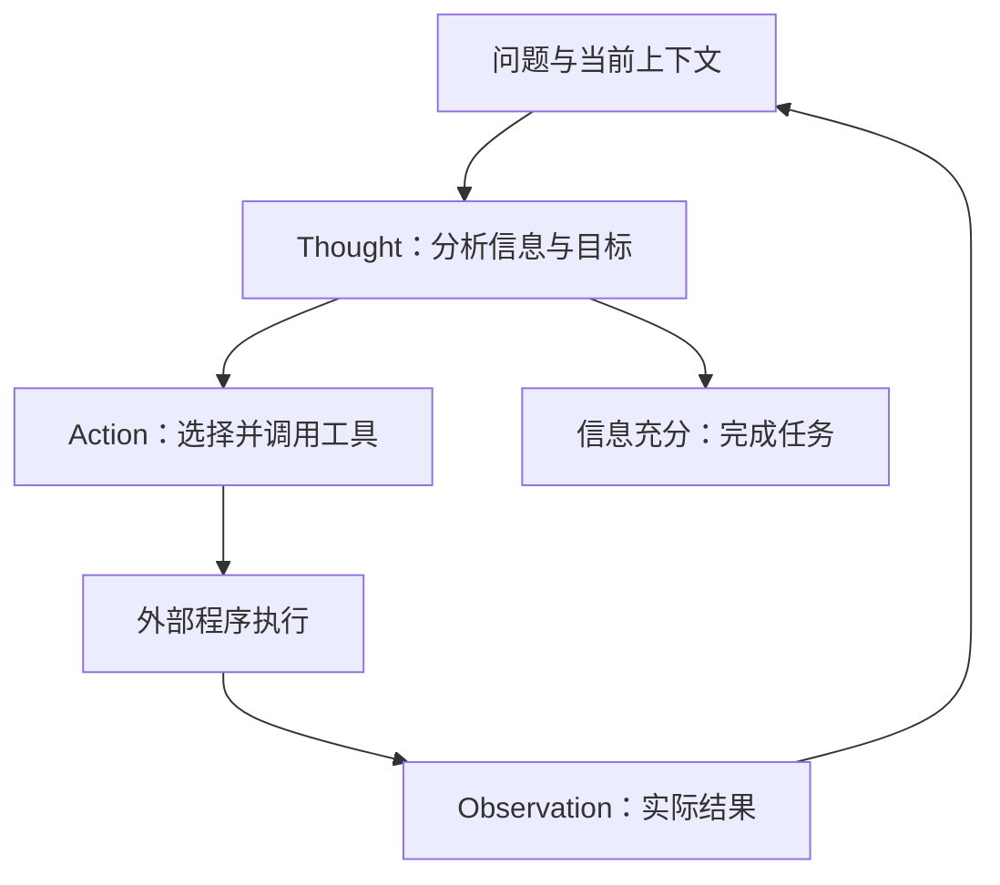

# 经典论文解读（十五）｜Agent 与工具调用：ReAct: Synergizing Reasoning and Acting in Language Models

今天的 agent 项目通常有一个核心部件：agent loop。模型读取当前上下文，决定下一步调用什么工具；程序执行工具，把结果写回上下文；模型根据结果继续推理、继续行动，直到完成任务。

这个循环的基本思想，在 2022 年的 **《ReAct: Synergizing Reasoning and Acting in Language Models》** 中就已经被清楚地表达出来：把 reasoning 和 acting 放进同一条交错的任务轨迹，让思维链决定执行什么工具，让工具结果反过来指导思维链。

在我看来，ReAct 是对后来 LLM agent 发展影响最大的一篇论文。当前绝大多数 agent 项目的 agent loop，本质上就是 ReAct 的工程实现。它已经成为这类系统的事实标准范式。这个判断的依据，是今天系统的运行结构：无论外围增加了多少规划、记忆和调度部件，模型与环境之间的交互，仍然经常通过这一循环完成。

要理解它为什么影响这么大，可以先回到 thought 和 action 还主要沿两条路线发展的阶段。

---

## 一、会想与会做，原本是两条研究路线

Chain-of-Thought 让模型把中间推理写进上下文，再根据这些步骤得到答案。对于算术、常识和符号推理，这种方式已经展示了很强的效果。但原始的 reason-only 流程主要依赖模型内部知识：模型可以把推导写得很完整，却无法在推导过程中查证缺失的事实。

例如，回答一个需要跨两篇资料的问题，模型可能正确识别出“先确定地点，再查询海拔”的推理结构，却记错第一步的地点。后续计算即使全部正确，答案也会建立在错误前提上。更多推理文本，还可能把这个错误包装得更有说服力。

另一条路线研究的是让语言模型行动。WebGPT、SayCan 等工作已经尝试让模型浏览信息、产生动作或参与规划。模型可以根据环境中的文字决定下一步操作，外部程序再负责执行。

这条路线接触到了外部世界，但行动之间需要处理的问题依然存在：刚才得到了什么信息？哪个子目标已经完成？这次失败说明了什么？下一步应该改变什么？如果缺少显式的推理和状态整理，系统就容易重复无效动作，或者虽然检索到了资料，却无法把资料综合成答案。

ReAct 把两种能力接到一起。模型在行动之间进行推理，在推理需要信息时采取行动。计划可以随着任务进行而更新，外部观察也可以进入后续判断。

---

## 二、Thought、Action、Observation 怎样互相促进？

ReAct 的名字来自 **Reasoning + Acting**。一条典型轨迹可以写成：

```text
Question
  -> Thought：我需要知道什么，下一步应该做什么？
  -> Action：查询资料或操作环境
  -> Observation：工具或环境返回结果
  -> Thought：这次结果说明了什么，还缺什么？
  -> Action：执行下一步
  -> ...
  -> Final answer
```

其中，thought 和 action 由模型产生，observation 来自外部工具或环境。程序执行模型提出的动作，然后把实际结果放回上下文，模型才能基于新的信息继续生成。

两种促进关系分别是：

- **Reason to act**：推理拆解目标、选择工具、确定参数，并根据进展调整行动计划。
- **Act to reason**：行动获取模型原本缺少的信息，确认或推翻已有假设，为下一步推理提供依据。



thought 在这里有具体的工作内容。它可以指出一段搜索结果没有回答问题，也可以提取关键事实、判断子目标已经完成，或者解释为什么需要换一种查询。写下这些中间状态以后，后续行动便可以依赖它们。

论文的形式化定义也很直接：在原本的环境动作空间之外，加入一个语言空间。语言中的 thought 更新上下文，环境中的 action 则通过交互获得反馈。这样，整理信息和操作环境就进入了同一个决策过程。

---

## 三、一个例子：下一次查询由上一次结果决定

官方提示示例中有一道多跳问答题：**Colorado orogeny 的东部区域延伸到哪个地区，那个地区的海拔范围是多少？** 下面是该轨迹的中文概述，保留原来的行动顺序，压缩返回文本。

| 步骤 | Thought 的作用 | Action | Observation 的关键信息 |
| --- | --- | --- | --- |
| 1 | 先确定东部区域延伸到哪里，再查海拔 | `Search[Colorado orogeny]` | 返回造山活动简介，没有目标地区 |
| 2 | 现有结果缺少东部区域的信息，需要查找关键词 | `Lookup[eastern sector]` | 东部区域延伸到 High Plains |
| 3 | 地区已经确定，接下来查它的海拔 | `Search[High Plains]` | 返回同名地区的歧义提示 |
| 4 | 当前语境指向美国，需要明确实体 | `Search[High Plains (United States)]` | 海拔约为 1,800–7,000 英尺 |
| 5 | 所需事实已经齐全，可以回答 | `Finish[1,800 to 7,000 ft]` | 任务结束 |

这里最有价值的是第二步和第四步。

第一次搜索没有直接给出答案。模型根据返回内容发现信息缺口，把“搜索整个条目”改成“查找条目里的关键词”。第三次搜索又遇到了实体歧义，模型根据问题背景把查询对象限定为美国的 High Plains。

这两个动作都来自对 observation 的分析。思路没有在第一步被全部固定下来，而是随着外部反馈继续展开。

同时，工具也没有自行决定下一步。工具只返回信息，模型负责判断这些信息与目标的关系，再选择继续查找、消除歧义还是停止。推理为行动提供方向，行动为推理提供材料，论文标题中的 synergy 就发生在这里。

---

## 四、同一种循环，可以查资料，也可以完成操作

在 HotpotQA 和 FEVER 中，论文提供了一个简单的 Wikipedia 接口：

| 动作 | 功能 |
| --- | --- |
| `search[entity]` | 查找实体页面，返回开头内容或相近实体提示 |
| `lookup[string]` | 在当前页面查找包含关键词的后续句子 |
| `finish[answer]` | 输出答案并结束任务 |

这些接口让模型能够边查边想。HotpotQA 需要跨资料进行多跳推理，FEVER 需要判断一条陈述是否有证据支持；两者都需要把检索结果转化为判断。

ALFWorld 则把环境换成了文字描述的家庭场景。任务可能要求找到某件物品，完成清洗、加热或移动。模型发出前往某处、拿取物品等动作，环境返回执行结果。推理负责分解任务、记录已经完成的子目标，并根据常识判断下一处应该去哪里寻找。

在 WebShop 中，模型根据用户要求搜索商品、浏览详情、选择规格并完成购买。工具返回的商品描述可能包含大量无关信息，thought 需要把这些信息与用户的约束对应起来，再决定继续浏览还是购买。

任务和动作集合都变了，循环结构仍然成立：读取当前状态，判断下一步，执行动作，再根据结果更新判断。ReAct 因此能够跨越“生成答案”和“完成任务”之间的边界。

论文主要通过 few-shot prompting 实现这一行为：在 prompt 中给出人工编写的完整任务轨迹，让冻结的模型学习如何把推理、动作和观察组织起来。知识问答主要使用 PaLM-540B；交互任务使用的示例数很少，ALFWorld 为 two-shot，WebShop 为 one-shot。

---

## 五、实验：交互任务中的收益最直观

论文表 1 使用 PaLM-540B 比较不同提示方式。HotpotQA 使用 exact match，FEVER 使用分类准确率，下表单位均为百分比。

| 方法 | HotpotQA EM | FEVER 准确率 |
| --- | ---: | ---: |
| CoT | 29.4 | 56.3 |
| CoT-SC | 33.4 | 60.4 |
| Act-only | 25.7 | 58.9 |
| ReAct | 27.4 | 60.9 |
| CoT-SC → ReAct | 34.2 | **64.6** |
| ReAct → CoT-SC | **35.1** | 62.0 |

ReAct 在两个任务上都优于 Act-only，说明即使拥有相同工具，推理仍然能帮助模型检索和综合信息。它在 FEVER 上优于 CoT，在 HotpotQA 上则略低于 CoT。

论文进一步尝试结合两者：ReAct 在规定步骤内没有返回答案时，切换到 CoT-SC；CoT-SC 的多数答案不够集中时，切换到 ReAct 查询外部信息。结合后的结果更好，体现了内部知识与外部证据之间的互补。

交互决策任务中的差距更明显：

| 任务 | 比较方式 | 成功率 |
| --- | --- | ---: |
| ALFWorld | Act-only，六组提示中的最佳结果 | 45% |
| ALFWorld | ReAct，六组提示的平均结果 | 57% |
| ALFWorld | ReAct，六组提示中的最佳结果 | **71%** |
| ALFWorld | BUTLER，八组配置中的最佳结果 | 37% |
| WebShop | Act-only | 30.1% |
| WebShop | ReAct | **40.0%** |
| WebShop | Imitation Learning | 29.1% |
| WebShop | Imitation Learning + RL | 28.7% |

以上分别来自论文表 3 和表 4。ALFWorld 的“最佳”与“平均”使用了不同的提示聚合方式，需要连同比较条件一起读；71% 与 BUTLER 的 37% 相差 34 个百分点。WebShop 中，ReAct 比 Act-only 高 9.9 个百分点。

这些结果把“会想有助于会做”落实到了任务成功率上。对于连续交互，模型需要记住进度、识别失败、切换子目标，仅仅根据上一条观察生成动作往往不够。

---

## 六、Agent loop：ReAct 的工程实现

今天实现一个工具型 agent，通常会先实现 agent loop。它负责把一次次模型调用和工具执行连接起来。下面是说明控制流的伪代码，具体消息格式由模型接口决定：

```python
context = [user_task]

for step in range(max_steps):
  response = model.generate(context, tools=tools)
  context.append(response)

  if not response.tool_calls:
    return response.final_answer

  for call in response.tool_calls:
    result = execute_tool(call)
    context.append(tool_result(call.id, result))

return stopped_with_current_progress(context)
```

模型根据上下文决定要做什么，程序执行工具，并将结果关联到对应的调用。下一轮模型读取更新后的上下文，判断还需要什么信息、是否应该调整计划，以及任务是否已经完成。

把它与 ReAct 放在一起，关系非常清楚：

| ReAct 中的环节 | Agent loop 中的对应职责 |
| --- | --- |
| 推理当前问题与任务状态 | 模型读取上下文并决定下一步 |
| Action | 模型产生工具调用及参数 |
| 执行环境动作 | 程序分发并执行工具 |
| Observation | 工具结果回写上下文 |
| 基于反馈继续推理与行动 | 进入下一轮模型调用 |
| Finish | 返回最终结果并结束循环 |

这个对应关系解释了我为什么把 ReAct 看作当前 agent 系统的事实标准范式。**当前绝大多数 agent 项目的 agent loop，本质上就是 ReAct 的实现：推理指导工具调用，工具反馈进入下一轮推理。**

LangChain 的官方文档把 agent 定义为“模型循环调用工具，直到任务完成”，并将 prompt、工具和 middleware 等外围组件归入 harness。这种划分把循环本身与围绕循环组织起来的工程能力区分得很清楚。

Anthropic 的工程文章也把 agent 描述为根据环境反馈循环使用工具的 LLM，并强调在每一步读取工具结果或代码执行结果，以判断任务进展。

原论文通过文本中的 Thought、Action、Observation 展示这一过程；现代系统可以把 action 编码成结构化工具调用，把 observation 保存为工具消息，推理也可能发生在模型内部。循环中的因果关系仍然相同：新结果改变上下文，新的上下文改变下一步决策。

因此，ReAct 的影响可以在代码结构中找到。agent 不再只是一段要求模型“自主完成任务”的 prompt，它有了一个可以反复运行的执行过程。开发者能够在循环的各个位置增加日志、检查结果、保存状态，并控制何时结束。

这里有一个很实际的分工：模型提出工具调用，agent loop 负责让调用真正发生。模型生成了“搜索某个关键词”，还只是产生了一个待执行的动作；执行搜索、等待结果、保存结果，再把控制权交回模型，这些步骤需要外部程序连接起来。官方 ReAct 实现中的问答 notebook，也将模型生成与环境的 `step` 调用交替运行。

这个分工让开发者可以分别改进决策与执行。模型判断要查哪份资料，可以通过提示和模型能力改善；工具超时、消息遗漏、调用结果没有进入下一轮上下文，则需要在循环的执行逻辑里解决。两边任何一边出问题，都会切断推理与行动之间的反馈。

---

## 七、更多工程能力，围绕这个循环展开

以一个编码 agent 为例：它先读文件，判断修改位置；修改后运行测试，再根据报错继续定位和修复。这里测试结果既是一次行动的返回值，也是下一轮推理的输入。

如果测试失败，模型需要判断原因是实现错误、环境配置问题，还是对需求理解有偏差。这个判断再决定下一次调用读取文件、修改代码或执行命令的工具。把这一过程持续运行起来，便是 agent loop 的工作。

在这个基础上，工程系统还需要回答更多问题：

- 历史越来越长时，哪些观察必须保留，哪些可以压缩？
- 工具失败时，应该重试、换参数还是改变方案？
- 多久没有取得进展，应该停止循环？
- 当前任务可以消耗多少调用、时间和 token？

这些问题分别落在上下文管理、错误恢复、进度判断和预算控制上。它们都直接影响循环的可靠性。Anthropic 也强调，环境反馈与明确的停止条件是 agent 执行过程中的重要组成部分。

ReAct 自身的实验已经暴露出一些问题：搜索结果可能没有有效信息，模型可能重复此前的 thought 和 action，也可能无法从无效查询中恢复。工具提供了外部依据，但模型仍然需要正确理解依据并选择下一步。

现代 agent 的工程工作，很大一部分就在于让这个循环更可靠。工具接口决定模型能做什么，上下文决定模型能看到什么，停止条件决定系统什么时候不再继续尝试。围绕这些位置增加控制能力，才能把一个可以演示的循环变成可以持续使用的系统。

循环次数也有直接的成本。每一轮都需要再次调用模型，并携带此前保留的任务状态和工具结果；调用越多、历史越长，总延迟和上下文成本就越需要控制。上面的伪代码因此保留了 `max_steps`，达到上限时返回当前进展。实际系统还需要区分“任务已完成”和“预算耗尽后停止”，否则一个停止运行的循环很容易被误记为一次成功执行。

---

## 八、为什么我把它放在 agent 论文的首位

CoT 让模型把推理过程展开；ReAct 又让这个过程能够接收外部反馈，并反过来控制接下来如何接触外部世界。

它提供的组织方式非常简单：想清楚下一步，执行，观察结果，再继续想。这个结构足够通用，可以容纳资料检索、网页操作、环境交互和代码执行，也足够具体，可以直接写成 agent loop。

这就是我认为 ReAct 对后来 agent 发展影响最大的原因。今天的系统可以使用不同模型、不同工具、不同记忆方案，外围也可以接上复杂的规划和调度。只要核心执行过程仍然是模型根据反馈继续决定行动，就仍然能在其中辨认出 ReAct。

thought 与 action 通过循环互相促进，最终成为 agent 系统最常见的运行方式。

---

## 参考资料

1. Shunyu Yao et al., [ReAct: Synergizing Reasoning and Acting in Language Models](https://arxiv.org/abs/2210.03629), ICLR 2023；预印本首次提交于 2022 年 10 月。
2. 作者项目页：[ReAct](https://react-lm.github.io/)。
3. 官方实现：[ysymyth/ReAct](https://github.com/ysymyth/ReAct)，以及 [问答提示与轨迹](https://github.com/ysymyth/ReAct/blob/master/prompts/prompts_naive.json)。
4. LangChain：[Agents](https://docs.langchain.com/oss/python/langchain/agents)。
5. Anthropic：[Building Effective Agents](https://www.anthropic.com/engineering/building-effective-agents)。
