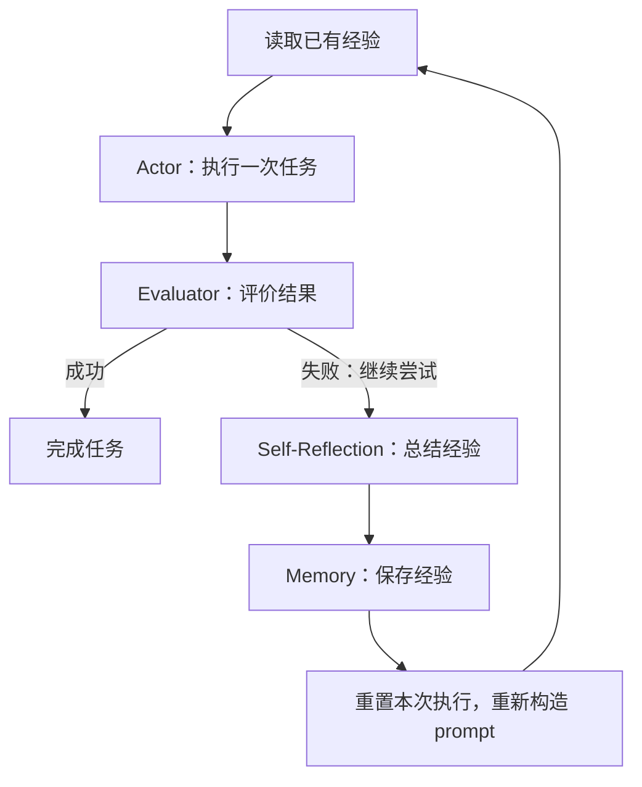

# 经典论文解读（十六）｜Agent 与工具调用：Reflexion: Language Agents with Verbal Reinforcement Learning

一个 ReAct agent 可以边想边做，根据工具结果调整下一步。但它仍然可能走上一条不太好的 trace：选错搜索对象，误解任务要求，或者在早期做出错误判断，随后沿着这个判断继续行动，最终失败。

失败以后，如果让它从同一个 prompt 重新开始，它可能再次走进相似的路径。那么，能不能让模型先总结这次失败的经验，把经验重新注入 prompt，让下一次推理与行动有机会改变？

2023 年，Noah Shinn 等人在 **《Reflexion: Language Agents with Verbal Reinforcement Learning》** 中提出了这样的做法。模型执行任务，评价结果，再把失败轨迹提炼成语言形式的经验，保存下来并用于下一次尝试。

我认为，这篇论文对后续 agent 发展的重要影响，是催生了 agent 的记忆模块：执行过程可以结束，失败经验却能够留下来，继续影响后来的决策。ReAct 给出了任务内的推理与行动循环，Reflexion 又把经验连接到了下一次循环的起点。

---

## 一、一条失败的 trace，怎样影响下一次尝试？

ReAct 的循环让工具结果进入思维链，思维链再决定下一次工具调用。这个结构已经允许模型在任务进行中调整思路，但调整能否成功，仍然取决于模型如何理解当前上下文。

例如，在一个找物品的任务中，模型可能误以为自己已经拿到了目标物品。接下来它按照“物品已经在手里”的状态制定计划，执行移动、清洗或摆放动作。环境不断返回失败，它却没有回头检查最初的假设，甚至反复执行同一个动作。

Reflexion 论文在 ALFWorld 的分析中记录了这类错误。任务轨迹越长，早期判断与后续失败之间的联系就越容易被淹没。工具反馈确实存在，agent 却未必能够在当前轨迹里找到问题所在。

重新尝试提供了另一个机会：让模型回看整条轨迹，指出哪里出了问题，给出下一次应该采取的策略。下一次运行便可以从不同的提示条件出发。

```text
第一次尝试：任务 -> 推理与行动 -> 失败
                         |
                         v
                  分析失败，提炼经验
                         |
                         v
第二次尝试：任务 + 经验 -> 新的推理与行动 -> 再评价
```

经验可以非常具体，例如“此前没有确认拿取成功，就开始执行后续步骤；下一次先核对拿取结果”。它把一条较长轨迹中的关键错误压缩成下一次可以直接使用的提示。

当然，重新注入经验只是给模型提供了改变路径的条件。经验是否准确，模型是否采用，以及新策略是否有效，仍然需要通过下一次执行检验。

---

## 二、Reflexion 的几个部件

论文把系统拆成 Actor、Evaluator、Self-Reflection，并用 Memory 在不同尝试之间传递经验。这些名称描述的是职责，工程实现中可以由模型调用、程序逻辑或环境反馈承担。

| 部件 | 输入 | 主要职责 |
| --- | --- | --- |
| Actor | 任务、当前观察、已有经验 | 生成推理和行动，完成一次尝试 |
| Evaluator | 执行轨迹或最终结果 | 判断这次尝试的表现 |
| Self-Reflection | 轨迹、评价反馈、已有经验 | 分析失败并提出改进方向 |
| Memory | 反思得到的经验文本 | 保存经验，供后续尝试读取 |

Actor 可以采用 ReAct，也可以采用 CoT。交互任务需要它持续生成动作；推理题和代码题则可以把一次回答或一次实现作为待评价的输出。

Evaluator 提供的是判断依据。游戏环境可以报告任务成功，问答实验可以通过 exact match 判断答案，编程任务可以通过运行测试获得反馈。评价结果可以是一个成功或失败信号，也可以带有更详细的错误信息。

Self-Reflection 把这些反馈转化成模型能够使用的语言。例如，“失败”只告诉系统结果不对；反思进一步尝试解释失败发生在哪里、下一次可以改变什么。论文将这一过程看作把稀疏反馈转化为更具体的改进信号。

Memory 保存反思文本，使它在当前轨迹结束后仍然能够进入下一次 prompt。论文在实践中限制经验数量，通常保留 1–3 条，以适应上下文窗口。



模型权重在这一过程中保持固定，变化发生在经验和上下文中。标题中的 verbal reinforcement learning 描述的就是这种通过语言反馈改善后续行为的方式。论文把它比作提供改进方向的“语义梯度”：模型下一次看到更有针对性的经验，因而可能生成不同的推理与行动。

---

## 三、一个实例：把错误的判断带回 prompt

论文附录 D.2 给出了一个 CoT + Reflexion 的例子。问题是：**John Lanchester 和 Alan Dean Foster 有什么共同职业？** 下面用中文概述两次尝试和反思，保留原例中的关键变化。

第一次，模型分别列出了两人的职业：

```text
John Lanchester：小说家、记者、评论家
Alan Dean Foster：小说家、编剧
```

它却把共同职业回答为“小说家和编剧”。这个结果与它自己列出的事实不一致：编剧只出现在第二个人的职业列表中。环境返回了答案错误的反馈。

反思文本要求下一次更仔细地核对两人的背景，准确识别共同职业。带着这段经验重新尝试后，模型再次列出职业，并把共同职业回答为“小说家”，得到正确反馈。

| 环节 | 发生的变化 |
| --- | --- |
| 第一次 trace | 有了分别列举的事实，却错误地合并共同职业 |
| 评价反馈 | 告知答案错误 |
| 反思经验 | 提醒重新核对个人背景与共同职业 |
| 第二次 trace | 重新比较职业，只输出共同的“小说家” |

这个例子中，失败的总结给下一次推理增加了检查方向。模型原本就有足够的信息，第一次没有正确使用；经验注入以后，它得到了一次更有针对性的重新组织机会。

在 ReAct 任务中，同样的机制还可以影响行动选择。官方 ALFWorld 反思示例里，agent 拿到杯子后反复检查炉灶，迟迟没有推进加热任务。对应的经验指出了重复检查的循环，并提醒下次卡住时改变动作。这个示例展示的是失败轨迹与改进计划，后续计划仍要接受环境验证。

因此，反思需要给出可执行的方向。只有“我应该更仔细”很难改变下一条 trace；指出哪个假设没有确认、哪个操作没有推进目标，才更容易落实到下一步推理和工具选择中。

---

## 四、记忆连接了两次独立的执行

Reflexion 论文区分了两种记忆：当前轨迹作为短期记忆，反思文本作为跨尝试保留的长期记忆。两者都参与 Actor 的决策，但保存的信息不同。

| 记忆 | 保存的内容 | 对下一步的作用 |
| --- | --- | --- |
| 当前轨迹 | 本次产生的推理、动作和观察 | 帮助模型理解当前执行状态 |
| 经验记忆 | 此前尝试总结的失败原因和改进计划 | 帮助模型避开旧路径，采用新策略 |

一次失败结束后，环境可以重置，当前执行历史也可以重新开始。经验记忆则继续留在系统中，随新的任务提示一起进入模型上下文。

官方 ALFWorld 实现把这一流程写得很直接：生成反思时，输入失败日志和此前的计划；生成下一次执行的 prompt 时，先放入已有经验，再放入任务。经验文本可以提醒模型此前哪里找过、哪些动作无效，以及下一次应该优先检查什么。

下面是说明这种分工的伪代码：

```python
memory = []

for trial in range(max_trials):
  prompt = build_prompt(task, experiences=memory)
  trajectory = actor.run(prompt, environment.reset())
  feedback = evaluator.evaluate(trajectory)

  if feedback.success:
    return trajectory.result

  if trial + 1 < max_trials:
    lesson = reflect(task, trajectory, feedback, memory)
    memory.append(lesson)
    memory = memory[-memory_limit:]

return stopped_with_progress(trajectory, memory)
```

`actor.run` 内部可以继续运行上一篇介绍的 ReAct agent loop。Reflexion 在它外面组织重试、评价和经验更新。内层循环解决本次任务如何推进，外层循环解决下一次如何利用此前失败。

这种结构也让经验成为可以独立管理的对象。系统可以检查反思内容，决定保留多少条，或者替换经验生成的提示。模型调用、执行轨迹和经验存储各自有明确的位置。

---

## 五、实验：有经验的重试能走得更远吗？

### ALFWorld：改善长轨迹中的行动选择

论文在 134 个 ALFWorld 任务上，以 ReAct 作为 Actor，测试多次尝试能否提高累计完成任务的比例。实验使用 GPT-3 和 two-shot 任务轨迹，每次最多保留最近三条反思。

启发式评价会检测重复循环和低效规划：同一动作与同一反馈重复超过三轮，或行动数超过 30 时，触发失败处理。ReAct 基线重置环境后直接重试；Reflexion 则先生成经验，再重置环境。

经过最多 12 次尝试，使用启发式评价的 ReAct + Reflexion 完成了 **130/134 个任务，约 97%**。论文报告它相对强基线有约 22 个百分点的累计成功率提升。

这里衡量的是多次尝试后的累计完成情况。经验能够跨尝试保留，模型便有机会定位早期错误，或者利用此前的探索信息扩大搜索范围。单纯重试的基线在后期停止改善，而带反思的系统继续解决了更多任务。

### HotpotQA：保留轨迹与提炼经验的差别

HotpotQA 实验在 100 道题上比较 CoT、带正确支持资料的 CoT，以及使用 Wikipedia 工具的 ReAct。失败后返回 exact match 的评价信号，再进行反思和重试；经验窗口为三条，连续三次失败后停止当前题目的尝试。

其中一个消融特别贴近记忆模块的问题：给模型保留最近一次轨迹，能否获得同样的收益？论文在提供正确支持资料的 CoT 设置下比较了这种 episodic memory 基线与完整 Reflexion，后者高出约 **8 个百分点**。

这表明，在该设置里，经验的加工方式也影响效果。完整轨迹包含许多动作和判断，模型需要重新寻找关键错误；反思则已经尝试将改进方向提取出来。存储提供了可回看的材料，反思让材料更容易被下一次使用。

### HumanEval：利用自生成测试改进代码

编程任务把评价落到了实际执行上。模型生成代码，也生成用于内部检查的测试；代码未通过时，系统根据反馈反思，再修改实现。论文最多采用六个内部测试，编程记忆窗口为一条经验。

论文表 1 的部分结果如下，使用 GPT-4 作为基础模型，单位为百分比：

| 任务 | GPT-4 基线 | Reflexion |
| --- | ---: | ---: |
| HumanEval Python | 80.1 | **91.0** |
| HumanEval Rust | 60.0 | **68.0** |
| MBPP Python | **80.1** | 77.1 |
| MBPP Rust | 70.9 | **75.4** |

这里的 pass@1 对应系统最终提交的一份代码，内部可以经过多轮测试与修改。内部评价使用自生成测试，最终正确性由基准测试判定；比较时需要同时考虑这一执行流程和额外推理预算。

在 HumanEval Rust 的 50 道较难题上，论文还拆开了测试与反思的贡献：

| 方法 | 准确率 |
| --- | ---: |
| 基础模型 | 60% |
| 有反思，省略内部测试生成 | 52% |
| 有内部测试，省略反思 | 60% |
| 测试与反思同时使用 | **68%** |

这一组结果说明，可靠反馈与经验总结需要配合。缺少有效评价时，反思可能引导模型做出有害修改；有错误日志却没有有效的分析，也未必能把错误修好。

---

## 六、从 Reflexion 到 agent 的记忆模块

我认为 Reflexion 催生 agent 记忆模块的关键，就在于它明确了一个需要独立完成的工作：**把执行经验保存下来，再让后续决策能够读取和使用。**

这件事沿着执行过程可以拆成几个工程职责：

| 环节 | 记忆模块需要处理的问题 |
| --- | --- |
| 形成经验 | 从轨迹和反馈中提炼有用的教训 |
| 写入 | 将经验与对应的任务或情境一起保存 |
| 保留 | 在容量限制下决定留下哪些经验 |
| 读取 | 为当前任务选出需要参考的经验 |
| 注入 | 把选出的经验放入模型实际读取的上下文 |

Reflexion 采用了很简单的实现：在同一个任务的多次尝试间保存少量反思，再加入下一次 prompt。这个实现已经把“执行”和“经验积累”连接起来，后续系统可以围绕相同职责扩展存储与读取方式。

例如，一个编码 agent 失败后总结出：“当前项目的测试需要先生成某项依赖；此前直接运行测试，误把缺失依赖当成实现问题。”系统保存这条经验，以后遇到相关任务时再将它读入上下文，就可以改变检查顺序。这里的例子说明工程用途，具体经验必须从真实执行结果中产生。

现代框架也把记忆作为独立能力提供。LangGraph 官方文档将当前交互状态与跨会话保存的信息分开，并讨论保存经验的 episodic memory，以及通过反思更新指令的方式。数据可以存入 store，再由读取逻辑提供给模型。

保存范围、存储形式和读取策略可以继续发展：从最近几次反思，扩展到按任务类型组织的经验集合；从每次全部注入，扩展到为当前问题选择相关经验。这些是围绕记忆职责的工程延伸，Reflexion 本身最直接展示的是同一任务跨尝试的经验复用。

记忆只有进入下一次决策上下文，才会影响行为。文件里有一条教训，模型却没有读取，它就无法改变下一条 trace。因而，记忆模块需要同时处理保存与使用，最终效果要看经验是否改变了执行结果。

---

## 七、经验也需要被检验

反思由模型生成，它可能找错原因。任务失败只给出一个整体信号，究竟是哪一个动作导致后续错误，需要根据轨迹分析。把猜测写进记忆后，下一次还可能受到这个猜测的误导。

编程实验中的 MBPP Python 就展示了评价环节的影响：Reflexion 的表现低于基础模型。论文分析了自生成测试的问题。错误测试可能把正确实现判为失败，覆盖不足的测试也可能让错误实现通过，导致系统提前提交。

有效的经验因此需要尽量依赖可检查的观察：哪个操作被环境确认成功，哪项测试实际失败，下一步建议与这些结果是什么关系。笼统地宣称“已经找到根因”，却没有对应证据，很容易把一次错误扩大成多次错误。

经验数量也受上下文和成本约束。论文保留最近少量反思，避免轨迹与记忆不断膨胀。更多尝试意味着更多执行、评价和模型调用，收益需要连同预算一起衡量。

在更大的记忆系统里，还需要考虑过时经验、重复经验和适用条件。同一种错误在不同环境下可能需要不同处理方式；读取时保留情境，能够帮助模型判断一条教训是否适用于当前任务。

这些问题不妨碍记忆的价值，但它们决定经验能否持续发挥作用。一次反思是否有用，最终要由下一次执行来回答。

---

## 八、让失败成为下一次尝试的条件

ReAct 将推理与行动接在一起，让模型根据外部结果继续推进任务。Reflexion 将失败经验接到下一次尝试中，让 agent 在重新开始时拥有新的判断依据。

模型仍然可能失败，但失败轨迹不必随着本次运行结束而消失。它可以被提炼成经验，保存在系统里，再通过 prompt 影响下一次思维链和工具选择。

这就是我看重这篇论文的原因。它把“从失败中学习”落实成了一个可以实现的流程，也让记忆模块有了具体职责：记录经验，并让经验参与未来决策。

---

## 参考资料

1. Noah Shinn et al., [Reflexion: Language Agents with Verbal Reinforcement Learning](https://arxiv.org/abs/2303.11366), NeurIPS 2023；预印本首次提交于 2023 年 3 月。
2. 官方实现：[noahshinn/reflexion](https://github.com/noahshinn/reflexion)。
3. ALFWorld 的 [反思生成](https://github.com/noahshinn/reflexion/blob/main/alfworld_runs/generate_reflections.py)、[经验注入](https://github.com/noahshinn/reflexion/blob/main/alfworld_runs/env_history.py)与[反思示例](https://github.com/noahshinn/reflexion/blob/main/alfworld_runs/reflexion_few_shot_examples.txt)。
4. Shunyu Yao et al., [ReAct: Synergizing Reasoning and Acting in Language Models](https://arxiv.org/abs/2210.03629), ICLR 2023。
5. LangGraph：[Memory overview](https://docs.langchain.com/oss/python/concepts/memory)。
