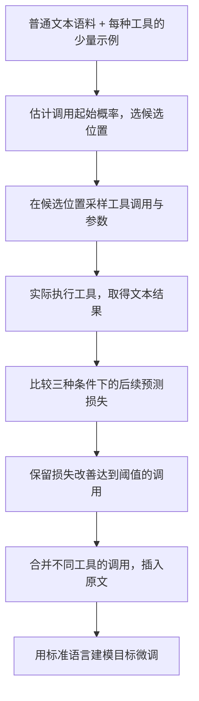

# 经典论文解读（十七）｜Agent 与工具调用：Toolformer: Language Models Can Teach Themselves to Use Tools

工具调用需要训练数据。Toolformer 用少量示例合成调用，以后续文本预测损失筛选有效样例，再把工具调用与结果统一写入文本序列，通过 next-token prediction 学习工具使用。

2023 年，Timo Schick 等人在 **《Toolformer: Language Models Can Teach Themselves to Use Tools》** 中给出了一套具体做法。它从普通文本出发，让语言模型提出候选调用，实际执行工具，再用模型自己的预测损失判断调用是否值得保留。

我认为，这篇论文最值得关注的是两个相互连接的设计：**用后续文本预测的改善筛选有价值的合成 tool call，缓解工具调用训练数据短缺；把不同工具的调用和结果统一为文本序列，继续用标准语言建模目标学习工具使用。** 前者决定训练数据从哪里来，后者决定这些数据怎样进入模型。

---

## 一、工具调用训练数据从哪里来？

给模型接上计算器，接口层面并不复杂。但在一句“共有 17 盒，每盒 23 件，所以总共是……”之后，模型还需要知道应该暂停写答案，生成一个乘法表达式，交给计算器，再把返回值用在后续句子里。

这里有几种需要学习的决策。调用位置决定工具介入的时机；工具名称决定请求送到哪里；参数决定工具实际处理什么；返回值的使用决定外部信息能否变成正确回答。只提供一份 API 文档，仍然缺少大量展示这些决策如何配合的训练实例。

人工可以给文本标注调用位置和参数，也可以写出完整的工具使用轨迹。工具越多、文本越杂，标注成本就越高。还有一个问题：人觉得值得查的内容，未必恰好是模型最需要外部帮助的内容。模型可能已经记住某个事实，却仍然算不好一个很简单的乘法。

Toolformer 利用预训练模型已有的 in-context learning 能力，为每种工具写少量人工示例，让模型照着示例给普通语料添加候选调用。这样得到的调用只是提案：参数可能有误，调用可能多余，返回结果也可能与后文无关。论文把质量控制留给后续筛选步骤。

普通文本在这里承担了监督作用。原文已经给出后续内容，系统可以检查：拿到工具结果后，模型是否更容易预测这些内容？于是，一篇没有人工工具标注的文章，也可以成为判断调用是否有用的材料。

## 二、什么是“有价值的 Tool Call”？

先看一个自行构造的示意例子，调用名称与序列格式用于说明方法：

```text
原文：There are 17 boxes with 23 items each, for a total of 391 items.

增强后的文本：
There are 17 boxes with 23 items each, for a total of
[Calculator(17 * 23) -> 391] 391 items.
```

对于一个不擅长计算的模型，看到前半句以后，“391”可能是低概率答案。若上下文中已经出现计算器返回的 `391`，后续这个数字就更容易预测。Toolformer 将这种变化作为保留调用的依据。

这个判断与工具能否成功执行是两件事。计算器正确返回 `391`，但如果调用插在一段与数量无关的描述之前，对接下来要预测的词没有帮助，它仍然可能被筛掉。反过来，一个事实查询如果准确提供了后文需要的人名或地点，就可能降低后续文本的损失。

筛选因此同时约束了位置、参数和结果：调用发生在需要信息的附近，参数能取回相关内容，结果确实帮助模型完成原文。论文没有为这几个决策分别设计人工标签，而是把它们交给同一个预测改善信号判断。

这一信号也有明确范围。它评价的是外部信息对既有文本续写的帮助。若某次调用很适合用户任务，却无法改善这段语料的预测，它就不容易被这个流程选中。理解这一点，才能看清方法在哪些地方能够节省标注，又在哪些地方需要其他反馈。

## 三、筛选标准：结果到底带来了多少信息？

设原文为 $\mathbf{x}=x_1,\ldots,x_n$，候选调用位于第 $i$ 个 token 之前，调用为 $c_i$，工具返回结果为 $r_i$。论文把调用及结果编码成文本，分别记为 $e(c_i)$ 和 $e(c_i,r_i)$。

为了评价调用，论文定义了后续原文 token 的加权负对数似然：

```math
L_i(\mathbf{z})=-\sum_{j=i}^{n}w_{j-i}\log p_M(x_j\mid\mathbf{z},x_{1:j-1})
```

这里 $M$ 是用于评分的语言模型，$\mathbf{z}$ 是附加前缀。损失越低，说明模型越容易预测原文后续内容。评分对象是原文 token，不是生成的调用字符串或返回结果。

一个容易影响复现的细节是：**筛选时，调用与结果作为前缀放在原文前面；最终微调时，才把它们插到选定的调用位置。** 论文这样处理，是因为尚未微调的模型没有适应正文中突然出现 API 调用的形式，直接插入会打断原有文本模式，干扰损失比较。

论文比较三种条件：

| 条件 | 模型额外看到什么 | 要检验的问题 |
| --- | --- | --- |
| 不调用 | 空前缀 | 原模型直接预测有多困难？ |
| 调用但不给结果 | 工具名、参数、空返回值的调用形式 | 仅仅写出请求是否已经有帮助？ |
| 调用且给出结果 | 工具名、参数、真实返回值 | 工具结果能否进一步改善预测？ |

公式中的空返回条件写作 $e(c_i,\varepsilon)$，其中 $\varepsilon$ 表示空序列。论文取两个无结果条件中损失较小的一个作为基线：

```math
L_i^+=L_i(e(c_i,r_i))
```

```math
L_i^-=\min\bigl(L_i(\varepsilon),L_i(e(c_i,\varepsilon))\bigr)
```

只有改善达到阈值，才保留该调用：

```math
L_i^- - L_i^+\geq\tau_f
```

取最小值意味着带结果的条件要优于两个基线，并且至少改善 $\tau_f$。比较“只有调用”的条件很有用：参数本身可能已经包含提示，甚至包含后文答案。如果请求文本就能降低损失，系统还需要确认工具返回值带来了额外的信息。

例如，以下数字均为自行构造的示意，不是论文实验结果。假设不调用的损失为 3.0，只有调用为 2.6，带结果为 1.8，则改善为 $2.6-1.8=0.8$。当阈值为 0.5 时，调用通过筛选。若带结果的损失为 2.3，改善只有 0.3，即使相对“不调用”下降了 0.7，也不会通过这个阈值。

论文还让距离调用位置更近的 token 权重更高。具体权重为：

```math
\widetilde w_t=\max(0,1-0.2t),\qquad
w_t=\frac{\widetilde w_t}{\sum_{s\geq0}\widetilde w_s}
```

按偏移 $t=0,1,\ldots$ 计算，只有接下来的五个 token 获得非零权重。这样，工具信息需要在调用位置附近就能派上用场。一个结果若只对很远处的文字有帮助，就不会得到同样的筛选优势。

## 四、从少量示例到增强训练语料

完整流程可以画成下面这条流水线：



对每一种 API，论文构造带有示例的提示 $P(\mathbf{x})$。模型先计算各位置开始调用的概率：

```math
p_i=p_M(\texttt{<API>}\mid P(\mathbf{x}),x_{1:i-1})
```

概率超过采样阈值 $\tau_s$ 的位置进入候选集合；若数量过多，只保留概率最高的 $k$ 个位置。之后在每个位置采样至多 $m$ 个调用。这里的 $k$ 是候选位置上限，与后文推理解码中的 top-k 设置含义不同。

少量示例负责告诉模型调用应该长什么样，概率筛选负责缩小搜索范围，实际执行负责提供结果。模型没有生成结束标记的样本会被丢弃。完成评分后，不同工具通过筛选的调用被合并到相应文本里。

下面是方法层面的简短伪代码，省略了解析、工具异常处理及候选合并细节：

```python
augmented = []
for text in corpus:
    kept = []
    for tool in tools:
        prompt = few_shot_prompt(tool, text)
        positions = select_positions(model, prompt, text)
        for pos in positions:
            for call in sample_calls(model, prompt, text, pos):
                result = execute(tool, call)
                base = min(loss(text, pos, prefix=""),
                           loss(text, pos, prefix=encode(call, "")))
                aided = loss(text, pos, prefix=encode(call, result))
                if base - aided >= tool.filter_threshold:
                    kept.append((pos, call, result))
    if kept:
        augmented.append(insert_calls(text, kept))
finetune_language_model(model, augmented)
```

这段流程中的评分使用同一个基础模型，不会在每保留一条调用后立刻更新模型。筛选与微调是分开的阶段。论文实验还去掉了没有任何调用通过筛选的文本，所以最终训练集的文档分布会发生变化。

原文内容仍然保留，新增部分是调用与结果。这个设计让工具使用样例附着在一般文本上，能够覆盖不同语境；与此同时，数据量仍取决于普通语料中有多少内容适合这些工具，以及候选生成能否找到正确参数。

## 五、不同工具，统一的学习方式

论文接入五种工具，它们提供的能力不同，但接口都要求输入、输出能够表示为文本。

| 工具 | 论文实际采用的实现 | 返回内容 |
| --- | --- | --- |
| 问答 | 在 Natural Questions 上微调的检索增强模型 Atlas | 简短事实答案 |
| 计算器 | 支持加、减、乘、除 | 数值结果，舍入到两位小数 |
| Wikipedia 搜索 | 对 KILT 的 Wikipedia 数据使用 BM25 检索 | 相关文本片段 |
| 翻译 | 600M 参数的 NLLB，结合 fastText 检测源语言 | 英文译文 |
| 日历 | 不需要输入参数的日期接口 | 当前日期的文本描述 |

问答工具可以直接回答一个事实问题，搜索工具则返回材料，让模型自己提取有用部分。翻译工具的目标语言固定为英语；日历工具提供日期上下文，后续日期推算仍由模型完成。

论文在方法描述中使用抽象标记：

```text
<API>工具名(输入)</API>
<API>工具名(输入) -> 返回结果</API>
```

实际实现使用现有词表中的 ` [`、`]` 和 `->` 等 token 序列，不需要扩充模型词表。工具名、参数和返回值都进入同一条序列。计算器返回一个数字，搜索返回一段文字，对语言模型而言都成为可读取的上下文。

微调仍然采用标准 next-token prediction。模型预测调用起始标记时，学习何时使用工具；预测工具名与参数时，学习选择和请求方式；在结果之后预测原文时，学习如何根据返回值继续写作。这些决策在序列中拥有不同位置，却可以共同进入语言建模目标。

我觉得这个设计很有价值：增加工具可以继续沿用文本接口和训练方式，工具内部可以是检索系统、另一个神经网络或普通程序。模型通过序列表示接触这些能力，外部执行器负责把调用转成真实操作。

当然，统一格式并不意味着不同工具同样容易学。短数字与长检索结果的信息密度不同，翻译调用和计算器调用在语料中的出现频率也不同。它们可以共享目标函数，仍然需要各自的示例、采样阈值和筛选设置。

## 六、推理时，谁生成调用，谁执行工具？

微调后，模型从输入开始自回归生成文本。当它生成调用名称和参数，随后输出 `->` 时，系统暂停解码，执行对应 API，将返回结果及结束标记回填，再让模型继续预测。

```text
模型生成：... [Calculator(17 * 23) ->
外部执行：计算表达式，返回 391
结果回填：... [Calculator(17 * 23) -> 391]
模型继续：391 items.
```

模型架构仍然是语言模型，训练目标仍然是语言建模。运行时额外需要一个能解析调用、路由请求并回填结果的执行器。上述例子中，`391` 这一返回值来自计算器；模型随后可以依据它生成正文答案。

论文的下游实验使用带自然语言任务提示的 zero-shot 设置，不提供任务专属的工具使用示例。解码大体采用 greedy decoding，但 Toolformer 有一项调整：只要调用起始标记进入最可能的前 10 个 token，就允许它开始调用。普通贪心解码则要等该标记成为概率最高的 token。

这一设置提高了工具触发倾向。因此，实验里的调用频率同时受到模型学习结果与解码策略影响，不能单独归因于微调。论文另外限制每个输入最多调用一次工具，避免不断调用却不输出答案的循环。

这些条件也说明了实验验证的范围：Toolformer 展示了根据输入生成调用、读取外部结果再续写的能力。要完成“先查日期，再带着日期搜索，结果不够好就重新检索”的过程，还需要能够支持这种轨迹的数据与执行策略。

## 七、实验：合成数据和真实工具各贡献了什么？

论文使用 GPT-J 作为基础模型，用 CCNet 的一个子集合成工具调用。为了减少处理成本，部分工具先用启发式条件筛选文档，例如计算器候选文本至少包含三个数字。

### 筛选规模与阈值

下表摘自论文表 2，统计的是不同阈值下包含工具调用的样例数，不能直接相加理解为去重后的文档总数。

| 工具 | 阈值 0.5 | 阈值 1.0 | 阈值 2.0 |
| --- | ---: | ---: | ---: |
| 问答 | 51,987 | 18,526 | 5,135 |
| Wikipedia 搜索 | 207,241 | 60,974 | 13,944 |
| 计算器 | 3,680 | 994 | 138 |
| 日历 | 61,811 | 20,587 | 3,007 |
| 翻译 | 3,156 | 1,034 | 229 |

阈值越高，保留样例越少；工具之间的数量差异也很大。这个流程能够从普通文本找出监督样例，但不会自动产生均衡的数据分布。论文附录 B 进一步说明，实际训练每种 API 最多使用 25,000 个样例，所以表里的筛选数量也不等于最终投入微调的数量。

### 算术任务中的工具收益

论文表 4 的结果如下，数值为百分比：

| 模型 | ASDiv | SVAMP | MAWPS |
| --- | ---: | ---: | ---: |
| GPT-J | 7.5 | 5.2 | 9.9 |
| GPT-J + CC | 9.6 | 5.0 | 9.3 |
| Toolformer，关闭工具 | 14.8 | 6.3 | 15.0 |
| Toolformer，启用工具 | 40.4 | 29.4 | 44.0 |
| GPT-3（175B） | 14.0 | 10.0 | 19.8 |

GPT-J + CC 在同一 CCNet 子集的原文上微调，帮助控制继续训练带来的收益。关闭工具的 Toolformer 使用相同的微调模型，只是在解码时把调用起始标记的概率设为零。

关闭工具后，部分算术表现已有改善；作者推测，调用及结果构成的训练样例也帮助模型学习了计算。启用工具后则有更大的提升，说明测试时真实计算器的返回结果仍然起到关键作用。论文报告，在这些算术基准中，97.9% 的样例触发了计算器。

这里的评分检查模型生成的第一个数字；若生成了等式，则取等号后的第一个数字。它衡量数值答案，不直接评价完整推理过程。表中与大模型的比较也受这些任务、提示和解码条件约束。

### 事实问答中的检索收益

论文表 5 给出了以下结果，同样以百分比表示：

| 模型 | WebQS | Natural Questions | TriviaQA |
| --- | ---: | ---: | ---: |
| GPT-J | 18.5 | 12.8 | 43.9 |
| GPT-J + CC | 18.4 | 12.2 | 45.6 |
| Toolformer，关闭工具 | 18.9 | 12.6 | 46.7 |
| Toolformer，启用工具 | 26.3 | 17.7 | 48.8 |
| GPT-3（175B） | 29.0 | 22.6 | 65.9 |

这组实验关闭了问答 API，因为它本身就在 Natural Questions 上微调，直接使用会让比较失去意义。Toolformer 主要依靠 Wikipedia 搜索，99.3% 的样例使用了这一工具。评价标准是前 20 个生成词中是否包含正确答案，并非严格的 exact match。

启用工具的模型超过同规模基线，但仍落后于 GPT-3。作者把差距与简单检索器的质量，以及模型无法重新组织查询、浏览多个结果等限制联系起来。工具接口提供了外部信息，信息质量和后续交互能力仍然影响最终效果。

这些对照支持了本文关注的两点：筛选得到的序列可以用于学习工具使用，模型也能在测试时通过统一的调用形式获取有用结果。论文验证的是这套方法的可行性，并没有单独比较各种合成数据方案，从而证明损失筛选优于所有替代方法。

## 八、适用边界：预测改善能覆盖多远？

首先是筛选与执行成本。每条候选都需要生成、运行工具并计算多种条件下的损失。论文指出，处理超过一百万篇文档，也只能得到几千个有用的计算器调用。少量人工示例节省了标注，数据生产仍然消耗算力和工具资源。

部署时同样存在成本，但原方法判断是否调用时没有纳入工具各自的计算开销。一次远程查询若只提供很小的信息增益，可能仍然触发调用。延迟、费用等因素需要额外进入实际系统的决策。

其次是评价信号的覆盖范围。后续文本损失提供了一个容易计算的标准，适合查事实、做计算和翻译等能够帮助续写的工具。对于完成操作、改变外部状态、经过多步才体现收益的任务，近期几个 token 的预测改善未必能表达真实价值。这是由方法的评分方式推导出的适用边界。

链式工具使用则有论文明确指出的数据限制：不同工具的调用独立生成，训练集没有展示把一个工具的输出作为另一个工具输入的链式过程。即使一段增强文本包含多个调用，也不能据此认为模型学会了它们之间的依赖。实验中每个输入最多调用一次，又进一步限制了交互式搜索与多步组合。

我理解 Toolformer 的核心贡献，是把工具使用中的一部分人工监督转化为可计算的模型反馈：先提出调用，再用真实结果能否帮助预测原文来筛选。筛选之后，各种工具又都能回到同一条文本序列里，沿用 next-token prediction 学习。

这两个设计连接起来，才形成完整的方法。损失改善提供了训练样例的选择标准，统一文本表示提供了学习和执行的共同接口。沿着这条思路继续做 agent，后续需要补上的，是能够评价更长任务过程的反馈，以及包含工具之间依赖关系的训练轨迹。

## 参考资料

1. Schick, T. 等，**Toolformer: Language Models Can Teach Themselves to Use Tools**，2023。[原论文 HTML（v1）](https://arxiv.org/html/2302.04761v1)。本文的方法公式、工具实现、实验数据及条件依据论文第 2–5、7 节和附录 A、B；数据表分别摘自原文表 2、4、5。
