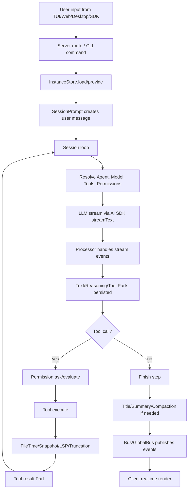

# opencode 项目解读

OpenCode 是一个开源 AI 编程助手。它表面上是一个终端里的 coding agent，但从源码结构看，它更像一个围绕“项目上下文 + 会话状态 + 工具执行 + 权限控制”构建的智能编码平台。

这篇文章按当前源码口径梳理 OpenCode 的核心架构。重点不是罗列每个文件做什么，而是回答几个更关键的问题：

1. 为什么它不是一个简单的 CLI？
2. 它如何让 TUI、Web、Desktop、SDK 复用同一个后端？
3. Agent、Tool、Permission、Session 这些模块如何串成一次完整的 AI 编码流程？
4. 它为了安全性、可恢复性和长上下文做了哪些工程设计？

先给结论：OpenCode 的核心设计是 **C/S 分离 + Instance 隔离 + 事件驱动 + 工具权限化**。CLI/TUI 只是客户端形态之一，真正的能力集中在后端服务和项目实例运行时里。

---

## 一、整体定位：它不是“一个命令”，而是多端复用的 coding agent

OpenCode 官方文档把它定义为开源 AI coding agent，可用于终端界面、桌面应用和 IDE 扩展。这个定位很重要，因为它直接决定了源码架构不会围绕“单次命令执行”展开，而是围绕“可复用服务”展开。

从使用方式看，OpenCode 至少有几类入口：

| 入口 | 使用场景 | 架构含义 |
| --- | --- | --- |
| TUI | 用户在终端中交互式编码 | TUI 是客户端，需要和后端通信 |
| CLI run | 一次性执行 prompt | 命令入口复用 Session/Agent/Tool 流水线 |
| `opencode serve` | 启动无头 HTTP 服务 | 外部客户端可通过 API 调用 |
| Web/Desktop | 图形界面 | 复用同一套后端 API 和事件流 |
| SDK | 程序化集成 | OpenAPI/HTTP 接口成为稳定边界 |

这就是 OpenCode 和“纯 CLI 脚本”的分界线。纯 CLI 通常是：

```text
parse args -> call model -> print result -> exit
```

而 OpenCode 更接近：

```text
client input
  -> server route
  -> instance context
  -> session loop
  -> model stream
  -> tool execution
  -> event bus
  -> client realtime update
```

这种设计的收益是复用性。只要后端把项目上下文、会话、工具、权限、事件都抽象成服务，TUI、Web、Desktop 和 SDK 就可以共享同一套能力。

---

## 二、Monorepo：把核心能力、UI、桌面端和 SDK 拆开

OpenCode 当前仓库使用 Bun workspace 和 Turborepo 组织。Bun workspace 负责把多个 package 放在同一个仓库中开发，Turborepo 负责 monorepo 下的任务调度、缓存和增量构建。

当前仓库中的关键包大致可以分为几类：

| 包 | 角色 |
| --- | --- |
| `packages/opencode` | 主程序，包含 CLI、Server、Session、Tool、Agent、Permission、Provider 等 |
| `packages/core` | 核心通用能力，例如全局路径、日志、错误、安装版本、文件系统抽象等 |
| `packages/app` | 共享应用层 UI |
| `packages/ui` | 更底层的 UI 组件 |
| `packages/web` | Web 前端 |
| `packages/desktop` | Tauri 桌面端封装 |
| `packages/sdk/js` | JavaScript SDK |
| `packages/plugin` | 插件接口 |
| `packages/llm` | 和模型/LLM 相关的辅助包 |

这种拆法体现了一个边界：`packages/opencode` 是 agent 运行时，UI 和集成入口围绕它展开。

入口文件 `packages/opencode/src/index.ts` 仍然是典型 CLI 结构：用 `yargs` 注册子命令，例如 `run`、`serve`、`web`、`mcp`、`agent`、`session` 等。它在 middleware 里做几件全局初始化：

- 初始化日志系统。
- 设置 `AGENT=1`、`OPENCODE=1`、`OPENCODE_PID` 等进程环境。
- 启动 heap 相关采集。
- 做一次性数据库迁移。

最后的 `finally { process.exit() }` 也很值得注意。代码注释明确提到，一些子进程，特别是 Docker 容器形式的 MCP server，可能不能正确响应 `SIGTERM`。显式退出是为了避免主命令结束后进程仍被子进程挂住。

这类细节说明 OpenCode 的 CLI 并不只是“调 model 的薄壳”，它还要管理插件、MCP、数据库迁移、日志、进程生命周期等一整套运行时问题。

---

## 三、C/S 架构：TUI 也是客户端

OpenCode 官方 Server 文档写得很直接：`opencode serve` 会运行一个 headless HTTP server，暴露 OpenAPI endpoint，客户端可以通过它和 OpenCode 交互。文档还说明，当运行 `opencode` 时，它会同时启动 TUI 和 server，TUI 是和 server 通信的客户端。

这就是整个项目最重要的架构判断：

```text
TUI / Web / Desktop / SDK
          |
          v
HTTP API / streaming events
          |
          v
OpenCode server runtime
          |
          v
Session / Agent / Tool / Provider / Storage
```

早期或旧材料里常见的描述是“Server 使用 Hono 框架组织路由”。但按当前源码，Server 主线已经明显转向 Effect HTTP API 和 Effect runtime。`server.ts` 中通过 `HttpApiApp.createRoutes()` 创建路由，用 Node HTTP server 监听端口，并提供 OpenAPI spec。

这不是单纯换框架，而是运行时风格的变化：

- Hono 风格更像直接声明 middleware 和 route。
- 当前 Effect 风格更强调 service、layer、scope、resource lifecycle。

例如 Server listen 流程里会创建 listener scope，并把 WebSocket tracker、HTTP server、config provider 等服务组合起来。停止服务时，也不是简单 `server.close()`，而是会处理 mDNS 取消发布、WebSocket/HTTP 连接关闭和 Scope finalizer。

Server 还支持几个关键能力：

| 能力 | 作用 |
| --- | --- |
| OpenAPI endpoint | 用于生成 SDK，也让外部客户端可程序化调用 |
| Basic Auth | 通过 `OPENCODE_SERVER_PASSWORD` 保护服务 |
| CORS 配置 | 允许 Web 客户端从指定 origin 访问 |
| mDNS | 让局域网内的桌面端发现本地服务 |
| WebSocket / event stream | 把消息、工具状态、权限请求实时推给客户端 |

这里的核心不是“用了哪个 HTTP 框架”，而是后端已经成为稳定平台。客户端只是不同显示和交互层。

---

## 四、Instance：同一进程中隔离多个项目

一个 coding agent 最大的问题之一是“当前上下文到底属于哪个项目”。如果用户打开多个目录，或者 Web/Desktop 同时连接不同项目，所有状态都必须隔离。

OpenCode 用 Instance 解决这个问题。每个 Instance 至少包含：

```text
directory: 当前工作目录
worktree:  项目 Git worktree 或沙箱根
project:   项目元信息
```

底层上下文传递使用 `AsyncLocalStorage`。它的作用类似 Java 里的 `ThreadLocal`，但绑定的是 Node.js 异步调用链，而不是线程。

简化后的模型是：

```ts
const storage = new AsyncLocalStorage<T>()

function provide(value, fn) {
  return storage.run(value, fn)
}

function use() {
  const value = storage.getStore()
  if (!value) throw new Error("No context")
  return value
}
```

这样外层 route 或 command 只需要做一次：

```text
Instance.provide(directory, effect)
```

后续深层模块就可以直接读取当前项目上下文，而不用把 `directory`、`projectID`、`worktree` 层层传参。

当前源码里 Instance 的实现不再只是“Map 缓存 Promise”这么简单，而是由 `InstanceStore` 服务管理。它用 `Deferred` 表达正在加载的实例，达到同样目的：同一个目录并发初始化时，后来的请求等待已有初始化完成，而不是重复创建。

关键流程可以概括为：

```text
request directory
  -> resolve absolute directory
  -> cache hit: await existing Deferred
  -> cache miss: create Deferred and boot instance
  -> Project.fromDirectory()
  -> run bootstrap
  -> provide InstanceRef to downstream Effect
```

这里有两个设计点很重要。

第一，缓存的是“正在完成的加载过程”，而不只是加载完成后的值。这可以避免并发竞态。

第二，dispose 是显式生命周期。Instance 被销毁时，会运行 per-instance disposer，并向全局事件总线发出 `server.instance.disposed`。这对 WebSocket、事件流、文件监听、LSP 进程等资源释放都很关键。

项目边界判断也有一个容易忽略的细节：非 Git 项目的 worktree 可能是 `/`。如果直接判断“某路径是否在 `/` 下”，所有绝对路径都会被认为在项目内，`external_directory` 权限就失效了。所以当前实现会在 worktree 为 `/` 时跳过 worktree 包含判断。

---

## 五、Project 与 Storage：从文件 JSON 走向数据库主线

旧版材料常把 Storage 描述为“key 数组映射到 JSON 文件路径”。这个描述仍能解释一部分兼容层和迁移代码，但已经不能代表当前主线。

当前源码中，项目、会话、权限等核心数据明显大量进入 SQLite/Drizzle 表：

- `project.sql.ts`
- `session.sql.ts`
- `workspace.sql.ts`
- `account.sql.ts`
- `share.sql.ts`
- `sync/event.sql.ts`

CLI 启动时也会检查 `opencode.db`，并运行一次性 JSON 到 SQLite 的迁移。

这说明 OpenCode 的持久化已经从早期“文件系统 JSON 简单存储”演进为：

```text
旧 JSON storage
  -> JsonMigration
  -> SQLite database
  -> Effect/Drizzle service layer
```

不过 JSON Storage 并没有完全消失。`storage/storage.ts` 仍提供 `read`、`write`、`update`、`list` 等接口，并带有 migration 逻辑。它现在更像兼容层、辅助存储和迁移入口，而不是唯一数据底座。

为什么这种演进合理？

文件 JSON 的优点是简单、可读、无需 schema 管理；缺点是当 Session、Part、Permission、Project、Workspace、Sync 等对象越来越多时，索引、迁移、并发和查询都会变重。SQLite 则更适合：

- 按 project/session 查询。
- 做权限和会话状态更新。
- 处理同步和共享记录。
- 支持更清晰的数据迁移。

Storage service 中仍能看到 OpenCode 对并发安全的重视：它使用 `TxReentrantLock` 为目标文件做读写锁。也就是说，即便是兼容层，也没有放弃并发控制。

---

## 六、Agent：把“角色”变成可配置运行策略

OpenCode 的 Agent 不只是一个 system prompt 名字。Agent 定义的是一组运行策略：

- mode：是主 agent 还是 subagent。
- prompt：系统提示词。
- model：是否指定特定模型。
- temperature / top_p：模型参数。
- steps：最大推理步数。
- permission：工具权限规则。
- hidden / disabled / color 等 UI 和控制属性。

官方文档把 Agent 分成两类：

| 类型 | 含义 |
| --- | --- |
| primary agent | 用户直接交互的主助手，可在会话中切换 |
| subagent | 被主助手调用的专用助手，也可以通过 `@` mention 调用 |

内置 Agent 的职责大致如下：

| Agent | 类型 | 作用 |
| --- | --- | --- |
| build | primary | 默认开发 agent，工具权限更完整 |
| plan | primary | 规划和分析，默认限制编辑和 bash |
| general | subagent | 通用复杂搜索和多步骤任务 |
| explore | subagent | 只读探索代码库 |
| scout | subagent | 外部文档和依赖源码研究 |
| compaction | hidden primary | 自动压缩长上下文 |
| title | hidden primary | 自动生成会话标题 |
| summary | hidden primary | 自动生成会话摘要 |

这里的设计很有意思。很多工具把“计划模式”当作 UI 状态，而 OpenCode 把它抽象成 Agent。Plan 模式本质上就是权限受限、prompt 不同、行为目标不同的 primary agent。

这带来一个统一模型：

```text
不同工作方式 = 不同 Agent 配置
不同安全边界 = 不同 Permission Ruleset
不同能力范围 = 不同 Tool 可见性
```

比如 `explore` agent 只需要搜索、读取和理解代码，就不应该拥有写文件权限。`compaction` 和 `title` 这种系统 agent 更应该禁止工具调用，避免内部自动任务产生副作用。

Agent 配置可以来自 JSON，也可以来自 Markdown 文件。官方文档支持在全局目录或项目 `.opencode/agents/` 下定义 agent。这让团队可以把特定工作流固化进仓库，例如“安全审计 agent”“文档 agent”“迁移评审 agent”。

---

## 七、Permission：安全边界不是“开关”，而是可匹配规则

AI 编程助手最危险的地方不是它会写错代码，而是它可以调用工具。只要它能执行 bash、改文件、访问外部目录，安全边界就必须清晰。

OpenCode 的 Permission 系统把每类行为映射成三种动作：

| 动作 | 含义 |
| --- | --- |
| `allow` | 直接允许 |
| `ask` | 需要用户确认 |
| `deny` | 阻止执行 |

官方文档说明，权限规则支持 pattern match，并且“最后匹配的规则获胜”。这和源码里的 `findLast` 思路一致。

可以把规则理解成：

```text
evaluate(permission, pattern, rules)
  -> 从后往前找最后一个匹配项
  -> 找到则返回 allow/ask/deny
  -> 找不到则默认 ask
```

为什么是“最后匹配获胜”？因为配置通常是分层合并的：

```text
默认规则
  -> 远程/组织配置
  -> 全局用户配置
  -> 项目配置
  -> Agent 配置
  -> Session 临时规则
```

后面的配置应该能覆盖前面的配置。用数组拼接 + `findLast` 比复杂 deep merge 更直观，也更符合权限优先级。

Permission 不只控制工具是否可用，还控制工具输入。例如 bash 可以按命令模式配置：

```json
{
  "permission": {
    "bash": {
      "*": "ask",
      "git *": "allow",
      "rm *": "deny"
    }
  }
}
```

这比“bash true/false”细得多。AI 可以自动运行常见安全命令，但涉及删除、外部目录、未知命令时仍要询问。

此外，Permission 还承担交互协议。当工具执行调用 `ctx.ask()` 时，如果规则是 `ask`，系统会发出权限请求事件，TUI/Web 展示确认 UI。用户可以选择本次允许、总是允许或拒绝。总是允许通常会在当前会话中传播到匹配的 pending 请求，减少重复弹窗。

这里的核心取舍是：默认 `ask` 而不是默认 `deny`。默认 `deny` 更安全，但会让 agent 变成“什么都做不了”；默认 `ask` 则把最终控制权留给用户。

---

## 八、Tool：统一工具接口，把副作用包进上下文

OpenCode 的工具系统要同时支持三类工具：

1. 内置工具，例如 read、grep、edit、bash、lsp。
2. 插件提供的自定义工具。
3. MCP server 暴露的外部工具。

这要求工具接口必须统一。一个工具通常需要定义：

- id
- description
- parameters schema
- execute 函数
- metadata 更新能力
- permission ask 能力
- abort signal
- 当前 session/message/agent 上下文

工具执行上下文非常关键。它让工具不只是“一个函数”，而是运行在一次会话步骤中的可观测副作用：

```text
Tool.execute(args, ctx)
  -> validate parameters
  -> ask permission if needed
  -> run side effect
  -> update metadata while running
  -> return output
  -> truncate oversized output
```

输出截断是 coding agent 里非常实际的问题。`cat` 一个大文件、跑一次超长测试、打印大量日志，都可能把模型上下文和前端渲染拖垮。OpenCode 会限制工具输出的行数和字节数；超出限制后，把完整内容写到临时文件，再在输出里提示如何继续按需读取。

这背后的思路是：**上下文窗口里只放当前决策需要的信息，完整数据放到可追溯位置。**

Bash 工具尤其复杂。它不是简单 `spawn(command)`：

- 要选择兼容 shell，排除 fish、nu 等非 POSIX 风格 shell。
- 要解析命令结构，用于权限粒度判断。
- 要处理超时和用户 abort。
- 要清理整个进程树，而不是只杀直接子进程。
- 要截断实时输出和最终输出。

命令权限粒度也很有工程味。比如批准 `npm run dev` 不应该自动批准 `npm run build`，但批准 `git checkout main` 后，可能可以记住 `git checkout *`。这类规则通过 Bash arity 表达，目标是在安全性和体验之间找平衡。

---

## 九、Session：一次对话是可恢复的状态机

OpenCode 的 Session 不只是聊天记录。它是一次 agent 工作流的持久化状态机。

一次用户输入进入系统后，大致会发生：

```text
create user message
  -> enter session loop
  -> build system prompt
  -> resolve model and tools
  -> stream LLM response
  -> create/update parts
  -> execute tools if tool calls appear
  -> append tool results
  -> continue loop
  -> finish response
  -> update title/summary
```

消息被拆成多种 Part，常见包括：

| Part | 作用 |
| --- | --- |
| text | 普通模型输出 |
| reasoning | 模型推理内容 |
| tool | 工具调用及结果 |
| patch | 文件变更摘要 |
| step-start / step-finish | 一次推理步骤边界、token/cost 等 |
| compaction | 上下文压缩标记 |
| subtask | 子任务关系 |
| file | 用户附件或文件引用 |

这种拆分比“把 assistant 回复存成一个字符串”复杂很多，但收益也明显：

- 前端可以实时展示工具运行状态。
- 工具 pending/running/completed/error 可以精确恢复。
- token、cost、snapshot、patch 可以按 step 记录。
- 子任务和父任务可以建立层级关系。
- compaction 可以在消息流中留下明确边界。

LLM 流式响应由 Vercel AI SDK 的 `streamText` 驱动。AI SDK 本身支持 streaming、tool calling、middleware 等能力；OpenCode 在外层把流事件转成自己的 Message Part。

简化后可以理解为：

```text
AI SDK stream event
  -> processor switch event type
  -> update Message Part
  -> persist state
  -> Bus publish event
  -> client realtime render
```

为什么要边流式处理边持久化？因为 agent 工作可能很长，中途可能出现工具错误、网络中断、用户取消、进程退出。如果所有状态都只在内存里，恢复能力会很差。OpenCode 把中间状态显式落地，前端看到的每一次变化也都可以由事件驱动。

Session loop 还要避免并发写同一个 session。通常同一 session 只允许一个 loop 运行，后来的请求排队等待。这是为了防止两个 LLM 流同时写同一组 message/part，造成顺序错乱。

---

## 十、LLM Provider：模型只是后端之一

OpenCode 支持多个 LLM provider。上层 Session/Agent 不应该关心底层是 Anthropic、OpenAI、Google、Bedrock、xAI，还是 OpenCode 自己的 Zen provider。它只需要拿到一个统一的语言模型接口。

Provider 层主要负责：

- 读取 provider 配置。
- 处理认证信息。
- 发现或合并模型元数据。
- 判断模型能力，例如是否支持温度、工具调用、上下文窗口等。
- 构造 AI SDK language model。
- 对不同 provider 做消息格式转换。

这层抽象的意义在于：Agent 工作流是 provider-agnostic 的。

```text
SessionPrompt
  -> Provider.getLanguage(model)
  -> LLM.stream()
  -> AI SDK streamText()
```

模型元数据也不只是名字。OpenCode 需要知道：

- context limit
- input/output token limit
- pricing
- cache read/write cost
- 是否支持某些能力

这些信息会影响几个关键决策：

- 什么时候触发 compaction。
- 生成标题时是否使用 small model。
- 如何计算 cost。
- 是否启用某些工具或消息转换策略。

System prompt 也不是固定字符串。它通常由几部分组成：

```text
agent prompt
  + provider/model specific prompt
  + environment information
  + project instructions
  + plugin transformed content
```

这解释了为什么 OpenCode 需要 Plugin hook 介入 `experimental.chat.system.transform`、`chat.params`、`chat.headers` 等位置。企业或团队可能需要在系统提示词、请求头、审计信息、模型参数上做统一注入。

---

## 十一、Event Bus：后端状态变化如何实时到前端

OpenCode 是强实时应用。用户不是等 agent 全部做完才看结果，而是要看到：

- assistant 正在输出文本。
- 工具参数正在生成。
- bash 命令正在运行。
- 权限请求正在等待确认。
- 文件变更已经产生。
- 子任务正在执行。

这就需要事件系统。

OpenCode 的事件模型可以概括为两层：

```text
Instance-scoped Bus
  -> 当前项目内的模块订阅和发布

GlobalBus
  -> 跨 Instance 广播，供 server event stream / websocket 等消费
```

为什么要两层？因为大部分事件属于某个项目实例，不能串到另一个项目。但 HTTP/WebSocket/SSE 连接有时站在 Instance 外部，需要能收到带 directory/project 信息的全局事件。

事件定义通常会带 schema，保证 payload 结构明确。发布流程大致是：

```text
module changes state
  -> Bus.publish(event)
  -> local subscribers run
  -> GlobalBus emit
  -> server pushes to client
```

这样前端不需要轮询 session 状态，而是订阅事件流后增量更新 UI。

这也是 C/S 架构成立的基础。如果没有事件流，TUI/Web/Desktop 只能不断拉取状态，工具运行和权限确认的体验会非常差。

---

## 十二、Snapshot 与 Undo：用 Git 对象做轻量快照

AI agent 会改文件，就必须能撤销。OpenCode 的 undo 不是简单保存一份完整目录副本，而是利用 Git 的对象存储做轻量快照。

核心思路是：

```text
独立 git dir
  + 项目 worktree
  + git add .
  + git write-tree
  -> 得到 tree hash
```

为什么是 `write-tree`，不是 commit？

commit 会记录 parent、author、message、HEAD 引用等信息，还可能触发签名和 hook。OpenCode 只需要“某个时刻的文件树状态”，不需要完整提交历史。Git tree 对象正好是内容寻址的文件树快照：

- 相同内容得到相同 hash。
- Git 对象天然去重。
- 不污染用户项目自己的 Git 历史。
- diff 和 checkout 能复用 Git 底层能力。

一次 step 开始前记录 snapshot，step 结束后计算 patch：

```text
step-start: track() -> tree hash
tool edits files
step-finish: diff tree hash with current worktree
```

撤销时，根据 patch 里的文件列表把文件恢复到对应 tree。如果文件是这一步新增的，快照中不存在，就删除它。

这个设计很适合 coding agent：它不试图理解每个工具到底做了什么，而是在步骤边界观察文件系统结果。

---

## 十三、FileTime、Watcher 与 LSP：让修改更安全、更可验证

文件编辑工具的难点不只是“替换字符串”。真正的问题是：

1. AI 是否读过这个文件？
2. 用户是否在 AI 读取后手动改过文件？
3. 多个工具是否同时写同一个文件？
4. 编辑后是否引入类型错误或语法错误？

OpenCode 用 FileTime 处理编辑冲突。基本规则是：

```text
read(file) -> 记录 session 对该文件的读取时间
edit(file) -> 检查文件 mtime 是否晚于读取时间
```

如果文件在读取后被外部修改，edit 会失败，避免 AI 覆盖用户刚改的内容。这是一个非常实用的保护，因为真实使用中用户和 agent 经常会同时操作同一个仓库。

文件级写锁则解决并发写问题。它不是操作系统级 mutex，而是 JavaScript 里基于 Promise 链的串行化：

```text
write A starts
write B waits A
write A releases
write B runs
```

这种锁不能跨进程，但对同一 OpenCode 进程内的工具并发已经足够。

Edit 工具还做了多层模糊匹配。因为 LLM 给出的 `oldString` 经常有轻微差异，例如空格、缩进、转义字符、首尾上下文不完整。OpenCode 会从严格到宽松逐层尝试：

- 精确匹配。
- 行级 trim。
- 首尾行锚定。
- 空白归一化。
- 缩进容错。
- 上下文感知匹配。
- 多处匹配检测。

宽松匹配的前提是仍要避免误改。非 `replaceAll` 时，如果候选不唯一，就要求提供更多上下文。

LSP 则提供修改后的诊断反馈。官方文档也说明，OpenCode 能集成 Language Server Protocol servers，并用 diagnostics 作为 agent 的反馈。也就是说，AI 编辑后不只是“看起来写完了”，还能立刻知道是否引入类型错误。

文件监听由 watcher 把变更广播出去，LSP 和前端都可以感知。这几块组合起来，形成一个闭环：

```text
Read Tool -> FileTime records read
Edit Tool -> assert not externally modified
Edit Tool -> write with file lock
Watcher -> publish file event
LSP -> diagnostics feedback
Session -> model can continue fixing
```

---

## 十四、Compaction：长会话不能只靠模型上下文硬撑

Coding agent 的上下文很容易爆炸。一次任务可能包括：

- 用户多轮需求。
- 模型长回复。
- 多次 grep/read/bash 输出。
- patch 和 diagnostics。
- 子任务结果。
- 项目 instructions。

如果全部塞回模型，成本和延迟都会失控，甚至超过上下文窗口。

OpenCode 采用两类策略：

| 策略 | 含义 | 代价 |
| --- | --- | --- |
| prune | 清理旧工具输出，只保留结构和占位 | 快，但信息损失粗糙 |
| compaction | 用模型生成摘要，替代早期上下文 | 慢，但质量更高 |

Prune 适合处理大段工具输出。旧工具结果对当前任务可能不再重要，但工具调用结构仍然有价值。清掉具体输出文本后，模型仍知道“这里曾经运行过某工具”，只是不能再直接看到完整内容。

Compaction 则是长会话的关键。当 token 接近模型可用上下文上限时，系统 agent 会把历史总结成新的 assistant summary。后续构建模型消息时，早于 summary 的消息就可以被压缩掉。

这类设计的本质是上下文工程：

```text
完整历史不等于有效上下文
有效上下文 = 当前决策仍需要的信息
```

OpenCode 还通过 Plugin hook 允许扩展 compaction 上下文。企业环境里，这可以用来加入组织规则、审计要求或额外知识。

---

## 十五、MCP 与 Plugin：扩展边界在哪里

OpenCode 的扩展主要有两条线：MCP 和 Plugin。

MCP 面向外部工具协议。官方文档说明，OpenCode 支持本地和远程 MCP server，添加后 MCP 工具会和内置工具一起提供给 LLM。它适合把 GitHub、Sentry、Context7、数据库、内部系统等工具接入 agent。

但 MCP 也有成本：每个 server 暴露的工具说明都会占用上下文。官方文档也提醒，MCP server 会增加 context，工具太多可能很快顶到上下文限制。

MCP 的核心价值是标准化外部工具接入：

```text
MCP server
  -> list tools
  -> tool schema
  -> call tool
  -> return result
```

OpenCode 把 MCP 工具转换成自己的 Tool 接口，再统一走权限、执行、结果处理。

Plugin 则更像内部扩展机制。官方文档说明，插件可以通过事件和 hook 自定义行为，例如通知、保护 `.env`、注入环境变量、自定义工具、日志和 compaction hook。

典型 hook 包括：

- 监听事件。
- 注册工具。
- 修改 system prompt。
- 修改 chat params。
- 添加请求 headers。
- 工具执行前后处理。
- compaction 时注入上下文。

插件加载顺序也有优先级：全局配置、项目配置、全局插件目录、项目插件目录。多个 hook 顺序执行，形成管道式修改：

```text
output0
  -> plugin A modifies
  -> plugin B modifies
  -> plugin C modifies
  -> final output
```

这让 OpenCode 可以在不改核心代码的情况下扩展到团队工作流。

---

## 十六、Configuration：配置是分层合并，不是简单覆盖

OpenCode 支持 JSON 和 JSONC 配置。JSONC 很适合这类工具，因为配置经常需要注释说明。

官方文档给出的配置来源优先级很清晰，后面的配置覆盖前面的冲突项，但整体是 merge，而不是整份替换：

```text
Remote config
  -> Global config
  -> OPENCODE_CONFIG
  -> Project config
  -> .opencode directories
  -> OPENCODE_CONFIG_CONTENT
  -> Managed config files
  -> macOS managed preferences
```

这里有两个值得注意的设计。

第一，项目配置优先于用户全局配置。这很合理，因为团队项目通常需要约束模型、权限、MCP、格式化、LSP 等项目级规则。

第二，Managed config 优先级最高，且用户不可覆盖。这是企业部署需要的能力，比如强制关闭分享、限制 server hostname、禁止危险 bash 命令。

配置系统和 Agent/Permission/Plugin 是连在一起的。OpenCode 不是只有一个“设置页”，而是用配置驱动整个运行时：

- agent 行为。
- provider 和 model。
- permission 安全策略。
- server 监听和 CORS。
- MCP server。
- plugin。
- LSP。
- formatter。
- watcher。
- compaction。

这也是为什么配置合并策略很重要。错误的 merge 可能导致权限被误覆盖，或者项目插件丢失。

---

## 十七、一次完整请求的数据流

把前面的模块串起来，一次用户请求大致是这样：



这张图里最关键的是 loop。LLM 输出工具调用后，系统不是结束，而是执行工具、把结果写回消息，再让模型继续推理。直到模型不再请求工具，或者用户中断，或者达到步骤限制。

因此 OpenCode 的本质是一个 agentic loop：

```text
think -> act -> observe -> think -> act -> observe -> final
```

工程难点就在于每个环节都要可控：

- think：模型、prompt、上下文、compaction。
- act：工具、权限、abort、超时。
- observe：工具输出、LSP diagnostics、snapshot patch。
- persist：message/part/session。
- notify：event bus。
- recover：session 状态和 undo。

---

## 十八、我认为最值得学习的设计点

### 1. C/S 分离让产品形态变得开放

TUI、Web、Desktop、SDK 都复用同一个后端，这让 OpenCode 不被终端形态锁死。后续接 IDE、团队服务、自动化脚本，都有自然入口。

### 2. Instance 是多项目隔离的基础

没有 Instance，上下文只能靠显式参数到处传，很容易漏。用异步上下文和服务注入管理项目状态，能让深层模块自然拿到当前项目，同时保持多项目隔离。

### 3. Permission 是工具系统的安全阀

工具越强，权限系统越重要。OpenCode 没有把权限做成简单开关，而是支持 pattern、ask、allow、deny 和 agent 级差异，这更接近真实使用场景。

### 4. Snapshot/Undo 是 coding agent 的底线能力

AI 会改错。一个严肃的 coding agent 必须能回答：“我能不能回到上一步？”OpenCode 用 Git tree 做快照，设计轻巧且复用成熟工具。

### 5. Compaction 体现了上下文工程思维

长上下文不是无限塞历史。OpenCode 同时做 prune 和 summary compaction，说明它把 token 当成需要管理的资源，而不是等模型报错才处理。

### 6. 当前架构正在明显服务化

从当前源码看，Effect、Layer、Service、SQLite、OpenAPI 这些元素越来越多。这说明 OpenCode 已经不是早期脚本式工具，而是在往更长生命周期、更强扩展性、更复杂客户端场景演进。

---

## 十九、容易误解的点

### 误解一：OpenCode 只是 Claude Code 的开源替代

这说法太粗。OpenCode 的重点不只是“能让模型改代码”，而是围绕多 provider、多客户端、插件、MCP、权限、Session、事件流做平台化。

### 误解二：Plan 模式只是禁止编辑

Plan 更准确地说是一个受限 primary agent。它通过 prompt、permission、工具可见性共同塑造行为，而不是 UI 上把按钮禁掉。

### 误解三：工具调用只要 schema 校验就安全

Schema 只能保证参数形状正确，不能保证行为安全。真正的安全边界来自 permission、external_directory、FileTime、abort、timeout、进程树清理等组合。

### 误解四：Storage 还是纯 JSON 文件

当前源码已经有明显 SQLite/Drizzle 主线。JSON Storage 仍存在，但更像迁移与兼容层的一部分。写架构解读时应按当前数据库主线描述。

### 误解五：上下文压缩只是省 token

省 token 只是结果。更重要的是保持 agent 的工作记忆质量。糟糕的压缩会丢失约束、目标和已完成工作，导致后续推理偏航。

---

## 二十、总结

OpenCode 的架构可以用一句话概括：

> 它把 AI 编码过程拆成可复用的后端服务：项目实例负责隔离，Session 负责状态机，Agent 负责行为策略，Tool 负责行动能力，Permission 负责安全边界，Event Bus 负责实时同步。

从工程角度看，它最有价值的地方不是某个 prompt 或某个工具，而是这些模块之间的边界：

```text
Client UI
  -> Server API
  -> Instance context
  -> Session state machine
  -> Agent policy
  -> Provider abstraction
  -> Tool execution
  -> Permission control
  -> Snapshot/File/LSP feedback
  -> Event stream
```

这也是现代 coding agent 和普通聊天机器人的区别。普通聊天机器人主要处理文本；coding agent 必须管理项目状态、文件系统副作用、工具权限、长上下文、实时 UI 和可恢复性。

如果只看 OpenCode 的界面，它像一个终端助手；如果看源码，它更像一个面向多端的 agent runtime。

---

## 参考资料

1. OpenCode 官方文档：Intro. https://opencode.ai/docs
2. OpenCode GitHub README. https://github.com/anomalyco/opencode
3. OpenCode 官方文档：Server. https://opencode.ai/docs/server/
4. OpenCode 官方文档：Agents. https://opencode.ai/docs/agents/
5. OpenCode 官方文档：Permissions. https://opencode.ai/docs/permissions/
6. OpenCode 官方文档：LSP Servers. https://opencode.ai/docs/lsp/
7. OpenCode 官方文档：MCP servers. https://opencode.ai/docs/mcp-servers/
8. OpenCode 官方文档：Plugins. https://opencode.ai/docs/plugins/
9. OpenCode 官方文档：Config. https://opencode.ai/docs/config/
10. Bun 官方文档：Workspaces. https://bun.sh/docs/pm/workspaces
11. Turborepo 官方文档：Introduction. https://turborepo.dev/docs
12. Vercel AI SDK 文档：streamText. https://ai-sdk.dev/docs/reference/ai-sdk-core/stream-text
13. Effect 官方文档：Introduction. https://effect.website/docs/getting-started/introduction/
