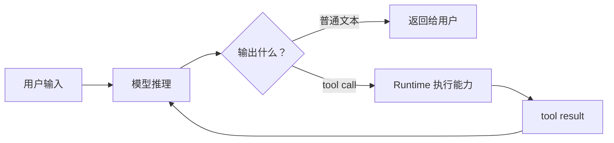
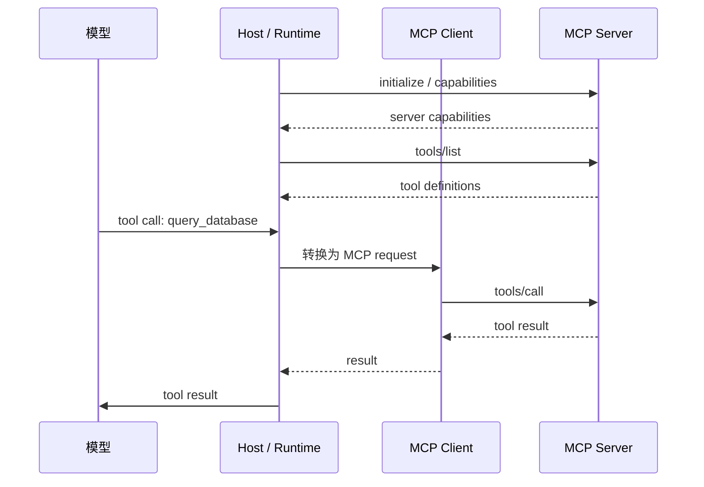
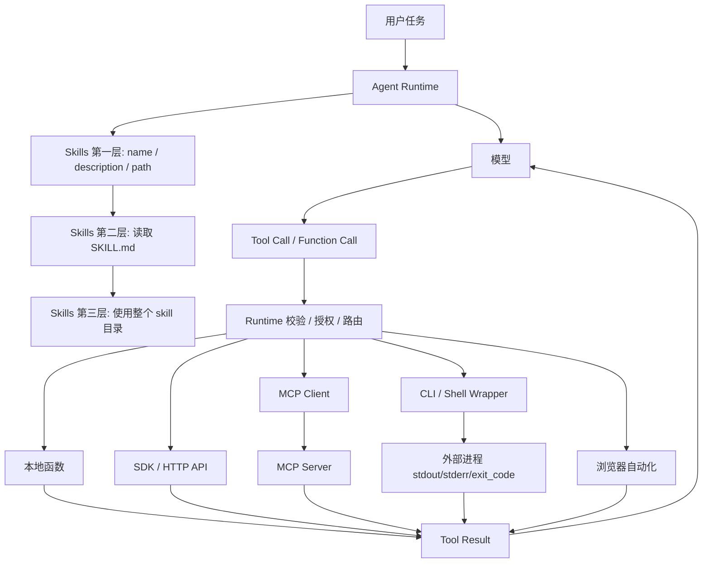

# 从 Function Call 到 Skills：Agent 运行能力的历史发展

讨论 agent 工程时，经常会把 **Function Call**、**Tool Call**、**MCP**、**CLI** 和 **Skills** 混在一起说。它们确实都和“让模型使用外部能力”有关，但不是同一种东西，也不是简单的替代关系。

如果只说“模型调用工具”这件事，会漏掉最关键的工程边界：

- 早期 Function Call 解决的是：模型如何输出一个函数名和结构化参数。
- 后来 agent 应用把这种能力内置化、产品化，形成更通用的 Tool Call。
- 各家 Tool Call 的消息格式、流式事件、工具定义和结果回填并不统一，于是 MCP 试图标准化外部工具的连接和通信。
- MCP 标准化了连接，但工具描述、资源说明和 server instructions 仍然会占用上下文。
- CLI 这类古老接口重新变重要，因为命令行本身就是外部能力接口，`--help`、`--list`、`--json` 这类交互模式也在模型训练数据里大量出现。
- Skills 则是另一条路线：不把所有工具说明一次性塞进上下文，而是用分层披露治理复杂能力。

---

## 一、最小 Agent Loop：模型只发起调用，Runtime 才执行

一个最小 agent loop 可以写成这样：



这里最重要的事实是：**tool call 是模型发给 runtime 的结构化请求，并不等于工具已经执行**。

比如用户问：

```text
帮我查一下杭州今天是否适合骑车。
```

模型可能输出：

```json
{
  "type": "tool_call",
  "name": "get_weather",
  "arguments": {
    "city": "Hangzhou"
  }
}
```

这段 JSON 不会自动访问天气 API。它只是一个请求。真正的数据流是：

```text
assistant -> tool_call -> runtime -> external capability -> tool_result -> model
```

runtime 做的事情包括：

1. 校验工具名和参数。
2. 判断是否需要用户确认。
3. 选择具体执行路径：函数、API、MCP、CLI、浏览器、数据库或 subagent。
4. 执行外部动作，处理超时、错误、权限和日志。
5. 把结果包装成 tool result，必要时压缩后再回填给模型。

这就是后面所有机制的底座。Function Call、Tool Call、MCP、CLI、Skills 都没有改变“模型提出意图、runtime 执行动作”这个基本事实，只是在不同层面让这条链路更稳定、更可扩展或更省上下文。

---

## 二、Function Call：把“可调用函数”描述给模型

早期 Function Call 的核心设计很直接：应用把一组函数 schema 发给模型，模型在需要时选择函数名并生成 JSON 参数，应用执行函数并回填结果。

一个典型函数定义大概是：

```json
{
  "name": "get_order_status",
  "description": "查询订单状态",
  "parameters": {
    "type": "object",
    "properties": {
      "order_id": {
        "type": "string",
        "description": "订单号"
      }
    },
    "required": ["order_id"]
  }
}
```

调用过程是：

```text
应用请求模型：
  messages + get_order_status schema

模型返回：
  function_call(name="get_order_status", arguments="{\"order_id\":\"A123\"}")

应用执行：
  get_order_status("A123")

应用回填：
  function result = {"status":"shipped"}

模型继续：
  “订单 A123 已发货。”
```

这一步的价值很大。它把以前靠 prompt 约束出来的“请输出某种 JSON”变成了模型接口的一部分，显著减少了随意文本、格式漂移和参数解析失败。

但 Function Call 的边界也很清楚。

第一，函数 schema 通常由单个应用传入。换一个应用、换一个模型供应商、换一个消息协议，都可能要重新适配。

第二，它描述的是“模型可以请求应用执行哪些函数”，但不规定外部能力本身如何被安装、发现、授权、初始化、分页列出或复用。

第三，当函数数量变多时，所有 schema 一次性进入上下文会很贵。几十个函数还好，几百个工具、长描述、复杂 JSON Schema 和示例全部塞进去，模型不仅成本上升，还更容易选错工具。

所以 Function Call 更像是第一层突破：

> 让模型可以稳定地产生“调用某个函数及其参数”的结构化意图。

---

## 三、Tool Call：从函数扩展到运行时动作

现代 API 里经常不再只说 Function Call，而是说 Tool Call。OpenAI 文档里也把 function calling 视为 tool calling 的一种形式：function 是由 JSON Schema 定义的特定工具，除此之外还可以有 built-in tools、custom tools、remote MCP servers、tool search 等更大的工具集合。

这意味着“工具”不再只是应用里的一段函数。它更像 runtime 暴露给模型的一组动作入口：

| Tool 类型 | 例子 | 谁执行 |
| --- | --- | --- |
| Function tool | `get_order_status(order_id)` | 应用 runtime |
| Built-in tool | web search、file search、code interpreter | 平台或托管 runtime |
| Custom tool | 自由文本输入输出的自定义能力 | 应用或平台 |
| Remote MCP tool | 远程 MCP server 暴露的工具 | MCP client/server 链路 |
| CLI wrapper tool | `gh pr view`、`kubectl get pods`、`figma-export` | runtime 启动命令 |
| Subagent tool | `start_subagent(task)` | runtime 启动另一个 agent loop |

从数据流看，现代 Tool Call 仍然是同一个循环：

```text
model
  -> tool_call(name, arguments, call_id)
runtime
  -> execute capability
runtime
  -> tool_result(call_id, output)
model
  -> final answer or more tool calls
```

相比早期 Function Call，现代 Tool Call 主要增强了几件事：

- 工具类型更多，不限于 JSON 参数函数。
- 调用结果可以包含结构化 JSON、文本、文件、图片或其他内容块。
- 一轮里可能出现多个 tool call，runtime 可以并行执行其中没有依赖关系的调用。
- structured outputs、严格 schema、调用 ID 等机制让多轮工具链更容易被校验和追踪。
- 部分平台支持 deferred tools 或 tool search，减少一次性注入全部工具定义的压力。

但 Tool Call 仍然是“模型到应用 runtime”的接口。它回答的是：

```text
模型如何表达：我要调用哪个能力，参数是什么？
```

它没有回答：

```text
这个能力到底来自 MCP、CLI、SDK、HTTP API，还是本地函数？
能力如何安装？
认证放在哪里？
错误如何恢复？
大量能力如何不挤爆上下文？
```

这些问题发生在 runtime 和外部能力之间。

---

## 四、为什么会有 MCP：Tool Call 内置化之后的协议碎片

Function Call 解决了“模型怎么输出函数名和参数”。Tool Call 进一步把这件事做成 agent runtime 的内置能力：工具不再只是应用临时传给模型的一组函数，而是平台、IDE、桌面 agent、云端 agent 都会长期维护的一组能力入口。

这一步很自然。一个 agent 如果要真正做事，不能每次都靠 prompt 让模型猜 JSON。它需要稳定的工具定义、调用 ID、结果回填、多轮调用、并行工具调用、内置搜索、文件访问、代码执行和远程工具。

问题也随之出现：**各家 Tool Call 的形态并不统一**。

同样是“让模型调用工具”，不同系统可能有不同差异：

- 工具 schema 放在请求的哪个字段。
- 模型返回的是 `function_call`、`tool_call`、`tool_use`，还是流式 event。
- 参数是严格 JSON，还是自由文本。
- 工具结果如何绑定到原来的 call id。
- 一轮多个工具调用能否并行。
- 工具列表是每轮完整传入，还是可以动态发现。
- 工具来自本地函数、内置平台能力，还是远程服务。

如果每个 agent host 都为 GitHub、Figma、浏览器、数据库、内部文档、监控平台重新做一套工具适配，外部能力生态会非常碎。工具开发者也很难复用自己的集成：给一个 IDE agent 写一套，给一个桌面 agent 又写一套，给一个云端 agent 还要再写一套。

MCP 出现的位置就在这里。它试图把“agent host 连接外部能力服务器”这件事标准化：

```text
Host / Runtime
  -> MCP Client
  -> JSON-RPC 2.0
  -> MCP Server
  -> tools / resources / prompts
```

也就是说，MCP 不是替代 Tool Call。Tool Call 仍然是模型对 runtime 表达“我要调用某个能力”的方式；MCP 是 runtime 继续向外连接工具服务器、资源服务器和 prompt 模板服务器的协议。

这条链路可以拆成两段：

```text
模型 -> runtime:
  tool_call(name, arguments)

runtime -> 外部系统:
  MCP tools/call
  或 CLI command
  或 SDK/API
  或本地函数
```

MCP 主要解决第二段里的标准化和通信问题。它让外部能力可以被统一发现、统一描述、统一调用，而不是每个 host 各写一套私有协议。

---

## 五、MCP：解决通信标准化，但不消灭上下文成本

MCP（Model Context Protocol）解决的问题不是“模型如何在 API 响应里表达 tool call”，而是：

> agent 应用如何用统一方式连接外部工具、资源和 prompt 模板。

它的基本角色是：

| 角色 | 职责 |
| --- | --- |
| Host | LLM 应用本体，比如 IDE agent、桌面 agent、聊天应用 |
| Client | Host 内部的连接器，负责和某个 MCP server 通信 |
| Server | 暴露工具、资源、prompt 模板等能力的外部服务 |

数据流可以这样理解：



MCP 使用 JSON-RPC 2.0 消息。连接开始时，client 和 server 先通过 `initialize` 做协议版本、能力和实现信息协商。server 会声明自己是否支持 `tools`、`resources`、`prompts` 等能力。初始化完成后，client 才进入正常操作阶段。

一个简化的 `tools/list` 请求长这样：

```json
{
  "jsonrpc": "2.0",
  "id": 1,
  "method": "tools/list",
  "params": {
    "cursor": "optional-cursor-value"
  }
}
```

真正调用工具时，是 `tools/call`：

```json
{
  "jsonrpc": "2.0",
  "id": 2,
  "method": "tools/call",
  "params": {
    "name": "get_weather",
    "arguments": {
      "location": "Hangzhou"
    }
  }
}
```

MCP 还把三类 server 能力分得很清楚：

| MCP 能力 | 控制面 | 典型用途 |
| --- | --- | --- |
| Tools | model-controlled | 模型根据任务决定调用，如查数据库、调用 API、执行计算 |
| Resources | application-driven | host 把文件、数据库 schema、上下文资料纳入模型上下文 |
| Prompts | user-controlled | 用户显式选择的模板化工作流，如 slash command |

这个区分很关键。不是 MCP server 暴露的一切都应该变成“模型自动调用的工具”。有些内容适合 host 作为上下文资源管理，有些适合用户明确触发，有些才适合模型自动选择。

因此，MCP 的工程价值主要在连接层：

- 工具服务器可以复用，不必为每个 agent 产品重新写一套协议。
- host 可以用统一 lifecycle、能力协商、分页、通知、错误处理来管理外部能力。
- 工具、资源、prompt 模板有相对清晰的职责边界。
- 安全控制可以放在 host 侧，包括暴露哪些工具、哪些调用需要确认、哪些资源可以共享。

但 MCP 也不是所有问题的终点。它解决了“如何连接外部能力”，没有自动解决“当能力很多时，模型如何低成本地理解和使用它们”。

因为模型要正确调用工具，通常还是得看到一些说明：

- 这个 server 有哪些 tools。
- 每个 tool 的 `name`、`description` 和 `inputSchema` 是什么。
- 哪些 resources 可以读。
- prompt 模板什么时候适合用。
- server instructions 里有哪些跨工具约束、速率限制和安全边界。

这些信息即使用 MCP 标准化了，仍然要以某种形式进入模型上下文或工具选择机制。工具少的时候问题不大；工具一多，就会出现新的成本：

```text
MCP 标准化了工具连接
  -> 但工具描述仍要被模型理解
  -> 工具越多，上下文越拥挤
  -> 模型选择工具的负担越重
```

所以 MCP 解决的是“外部能力怎么接进来”，不是“所有外部能力怎么低成本地常驻上下文”。这也是为什么后面会出现两条很有意思的路线。

第一条路线，是重新重视 CLI。CLI 不追求把每个能力都展开成一堆工具 schema，而是利用模型已经熟悉的命令行交互模式：`--help`、`--list`、`--json`、子命令、man page、错误输出。它把一部分“工具发现”和“使用说明”转移到命令行生态本身。

第二条路线，是 Skills。Skills 不试图让所有工具说明一开始都出现在上下文里，而是先暴露短描述，命中任务后再读取 `SKILL.md`，最后按需进入整个 skill 目录。它解决的是复杂能力的上下文治理问题。

MCP、CLI 和 Skills 因此不是同一层的竞争关系。MCP 管连接协议，CLI 提供命令行能力面，Skills 管能力如何被模型按需发现和使用。

---

## 六、CLI：古老接口为什么重新变重要

CLI 之所以值得单独讨论，是因为它不是 agent 时代才出现的新东西。恰恰相反，它是软件工程里最古老、最稳定的一类外部能力接口。

一个成熟 CLI 往往已经包含了这些东西：

- 子命令体系，比如 `git branch`、`git commit`、`git diff`。
- 自发现入口，比如 `--help`、`help`、`list`、`version`。
- 机器可读输出，比如 `--json`、`-o json`、`--format`。
- 环境上下文，比如 cwd、配置文件、认证状态、当前 repo、当前 kube context。
- 错误语义，比如 exit code、stderr、usage message。

更重要的是，模型训练数据里有大量命令行材料：README、man page、StackOverflow、CI 配置、Dockerfile、shell 脚本、GitHub Actions、终端日志。模型通常已经知道很多常见 CLI 怎么用，也知道遇到错误时应该看 `--help`、改参数、加 `--json`、检查 exit code。

所以 CLI 的价值和它是否“比 MCP 更新”无关，关键是它把外部能力暴露成了一种模型已经很熟的交互语言。

比如同样是访问 GitHub：

```text
MCP 路径：
  tool_call -> GitHub MCP server -> GitHub API -> result

CLI 路径：
  tool_call -> runtime shell tool -> gh pr view --json ... -> result
```

同样是访问 Kubernetes：

```text
MCP 路径：
  tool_call -> Kubernetes MCP server -> Kubernetes API -> result

CLI 路径：
  tool_call -> runtime shell tool -> kubectl get pods -o json -> result
```

这就是为什么一些能力会从 MCP 回到 CLI，或者 MCP server 内部最终还是调用 CLI。因为很多领域已经有成熟命令行操作面：

```text
gh pr view 123 --json title,body,author,files
kubectl get pods -n prod -o json
docker ps --format json
npm test -- --reporter=json
```

这些命令不需要 agent host 重新发明一套工具定义。模型可以根据已有知识使用它们；runtime 只需要控制权限、环境、输出和危险操作。

当然，真正的 agent runtime 不应该让模型随便拼接 shell 字符串。更稳的做法是把 CLI 包成受控 tool：

```json
{
  "name": "kubernetes_list_pods",
  "description": "列出指定 namespace 下的 pods",
  "parameters": {
    "type": "object",
    "properties": {
      "namespace": { "type": "string" }
    },
    "required": ["namespace"]
  }
}
```

runtime 再负责把参数变成安全命令：

```text
argv = ["kubectl", "get", "pods", "-n", namespace, "-o", "json"]
```

这和把 CLI 原样暴露给模型不同。合理的 CLI tool wrapper 应该处理：

- 参数白名单和类型校验。
- `argv` 数组构造，而不是字符串拼接。
- cwd、env、超时和输出大小限制。
- exit code、stdout、stderr 的结构化回填。
- 对写操作、删除操作、生产环境操作加用户确认。
- 对长输出保存文件，只把摘要和路径回填给模型。

所以 CLI 不是“让模型随便执行 shell”。CLI 作为外部能力时，runtime 仍然要把它工具化、结构化和权限化。

这也解释了 MCP 和 CLI 的真实关系：如果需要跨 host 复用、动态发现工具、暴露 resources 和 prompts，MCP 很合适；如果已有成熟 CLI，且 agent 运行环境本来就是开发者工作区，CLI 往往更直接。

实际系统里，两者经常组合：

```text
模型看到：
  tool: deploy_service(service, env)

runtime 内部可以选择：
  1. 调用部署平台 API
  2. 调用 MCP server
  3. 调用内部 deploy CLI
  4. 启动 subagent 做预检查后再执行
```

模型不需要知道所有细节。它需要的是稳定的能力入口；runtime 需要的是可控的执行实现。

---

## 七、Skills：把复杂能力做成按需加载的任务包

CLI 是一条路线：复用已有命令行生态，让模型借助训练数据里已经熟悉的命令行模式使用外部能力。

Skills 是另一条路线：不讨论某个能力底层到底用 MCP、CLI、API 还是脚本，而是治理“复杂能力如何进入上下文”。

它解决的核心问题是：

> 一个 agent 面对复杂任务时，如何按需发现、加载和执行一套可复用工作流。

一个 skill 通常是一个目录，核心文件是 `SKILL.md`，还可以包含 `references/`、`examples/`、`scripts/`、`assets/` 等资源。`SKILL.md` 用 front matter 声明 `name` 和 `description`，正文写明流程、边界、约束和可用资源。

它的关键设计是 **progressive disclosure**，也就是渐进式披露。这里的三层是：

| 层级 | 这一层暴露什么 | 作用 |
| --- | --- | --- |
| 第一层 | skill `name`、`description`、`path` | 触发和选择 skill |
| 第二层 | 完整 `SKILL.md` | 获得任务流程、边界、约束和资源入口 |
| 第三层 | 整个 skill 目录 | 按需使用目录内的 references、examples、scripts、assets 等资源 |

第一层，初始上下文只放很短的 discovery list，也就是每个 skill 的 `name`、`description` 和 `path`：

```text
- blog-draft: 根据想法、资料或现有草稿撰写中文博客文章。
  path: /path/to/blog-draft/SKILL.md
- openai-docs: 使用官方 OpenAI 文档回答 API、Codex、模型相关问题。
  path: /path/to/openai-docs/SKILL.md
```

这一层只用于触发和选择。模型不需要一开始读完每个 skill 的完整说明，更不需要看到整个 skill 目录。当某个 skill 被选中时，再进入第二层，读取完整 `SKILL.md`。

第二层，选中 skill 后读取完整说明：

```text
user: 写一篇中文技术博客，主题是 Tool Call、MCP、CLI 和 Skills

model:
  任务匹配 blog-draft

runtime:
  read /path/to/blog-draft/SKILL.md

model:
  根据 SKILL.md 中的写作流程、质量标准和项目约定执行
```

第三层，是整个 skill 目录。`SKILL.md` 不是第三层资源本身，而是进入整个 skill 目录的说明书和路由入口：

```text
blog-draft/
  SKILL.md
  references/function-calling.md
  examples/long-tech-post.md
  scripts/collect-sources.mjs
  assets/outline-template.md
```

agent 不会因为选中了 skill 就把整个目录一次性塞进上下文，而是根据 `SKILL.md` 的指引和当前任务需要，从这个目录里继续按需读取或执行。

更关键的是，skill 可以把 MCP、CLI、API、脚本组织成一个任务工作流。例如一个“发布服务”的 skill 可以写：

```text
1. 先读取 repo 部署说明。
2. 用 kubectl CLI 检查当前 namespace 状态。
3. 用 GitHub MCP 或 gh CLI 读取最近 PR。
4. 运行 scripts/preflight.sh。
5. 只有用户确认后才执行部署命令。
6. 输出部署结果、日志路径和回滚建议。
```

这里 Skills 的价值不是提供一个新的底层协议，而是告诉 agent：

- 什么时候应该使用这个能力。
- 先读哪些说明。
- 哪些 MCP 或 CLI 能用。
- 哪些命令需要确认。
- 长输出应该如何保存和摘要。
- 最终交付物应该是什么格式。

所以 Skills 更像是“agent 能力的包管理和上下文管理机制”。它可以调用普通文件、脚本、MCP 工具、CLI 命令，也可以只是纯说明文档。它的核心是任务能力组织，不是一套新的底层协议。

---

## 八、放在同一张图里

把 Function Call、Tool Call、MCP、CLI 和 Skills 放到同一条链路里，会更清楚：



它们的分层关系可以总结成：

| 层级 | 机制 | 解决的问题 |
| --- | --- | --- |
| 模型输出层 | Function Call / Tool Call | 模型如何表达“我要调用哪个能力、参数是什么” |
| 应用执行层 | Agent Runtime | 谁校验、授权、路由、执行，并把结果回填 |
| 外部能力层 | 函数、SDK/API、MCP、CLI、浏览器、subagent | runtime 如何把动作落到真实系统 |
| 能力组织层 | Skills | agent 如何按需发现、加载和组合复杂任务流程 |

这也解释了为什么 MCP、CLI 和 Skills 不是替代关系。

一个 skill 可以指导 agent 优先使用 MCP：

```text
当任务涉及官方文档：
1. 先使用 Docs MCP 搜索。
2. 获取最相关页面。
3. MCP 不可用时退回官方站点搜索。
4. 回答时引用来源。
```

也可以指导 agent 优先使用 CLI：

```text
当任务涉及当前 repo 的 GitHub PR：
1. 优先用 gh CLI，因为它继承用户本机认证和 repo 上下文。
2. 输出使用 --json，避免解析自然语言。
3. 如果 gh 不可用，再退回 GitHub MCP 或 API。
```

MCP 提供标准连接，CLI 提供成熟操作面，Skills 提供任务级编排。真正的 agent runtime 会把它们组合起来，而不是强行选一个。

---

## 九、工程上应该怎么选？

如果只是给模型一个很小的应用函数，例如查询订单、创建工单、计算价格，Function Call 或普通 Tool Call 就够了。重点是 schema 清楚、参数严格、runtime 校验到位。

如果你要把 agent 接到外部系统，例如 GitHub、浏览器、Figma、数据库、内部文档、监控平台，不应该默认只有 MCP 一条路。可以按下面的标准判断：

| 场景 | 更适合的接入方式 |
| --- | --- |
| 多个 agent host 都要复用同一套能力 | MCP |
| 需要暴露 tools、resources、prompts 三类能力 | MCP |
| 本机已有成熟 CLI，且用户已经登录配置好 | CLI wrapper |
| 命令本身就是开发工作流的一部分 | CLI wrapper |
| 只服务当前应用，逻辑很小 | 本地函数 |
| 外部服务有稳定 SDK/API，权限模型清楚 | SDK/API |
| 必须操作真实网页 UI | 浏览器自动化 |
| 需要隔离探索、并行调研或独立验证 | Subagent |

如果你要沉淀一个复杂任务能力，例如“写一篇带官方引用的技术博客”“做一次安全审查”“迁移一套前端组件”“部署一个服务并做回滚预案”，Skills 更合适。它让 agent 先看到短描述，再按需加载完整 `SKILL.md` 和整个 skill 目录，避免上下文被工具说明、命令手册、示例和参考资料挤满。

更现实的系统通常会组合这些层：

```text
Skill:
  定义任务流程、边界、工具优先级和质量标准

Tool Call:
  让模型在流程中表达具体动作

Runtime:
  校验、授权、路由、执行、压缩结果

External Capabilities:
  MCP / CLI / API / 本地函数 / 浏览器 / subagent
```

所以不要把这些概念排成简单的单线替代关系：

```text
Function Call -> Tool Call -> MCP -> CLI -> Skills
```

更准确的理解是：

```text
Function/Tool Call: 模型到 runtime 的调用接口
MCP: runtime 到外部能力服务器的标准连接协议
CLI: runtime 调用外部系统的成熟操作面
Skills: agent 选择和组合复杂任务能力时的上下文组织方式
```

Function Call 让模型能够稳定地产生结构化调用意图；Tool Call 把这种能力扩展到更丰富的工具类型；MCP 让外部工具和上下文服务可以被标准化接入；CLI 让 agent 复用已有命令生态和开发者工作流；Skills 则让复杂能力不必一次性挤进上下文，而是按任务需要逐层展开。

真正的 agent 工程，不只是“给模型更多工具”。更难的是让模型在合适的上下文里看到合适的能力，让 runtime 选择合适的执行形态，并以可控、可审计、可恢复的方式把外部世界接进来。

---

## 参考资料

- OpenAI, [Function calling](https://developers.openai.com/api/docs/guides/function-calling)
- OpenAI, [Using tools](https://developers.openai.com/api/docs/guides/tools)
- OpenAI, [Function calling and other API updates](https://openai.com/index/function-calling-and-other-api-updates/)
- Model Context Protocol, [Specification 2025-11-25](https://modelcontextprotocol.io/specification/2025-11-25)
- Model Context Protocol, [Lifecycle](https://modelcontextprotocol.io/specification/2025-11-25/basic/lifecycle)
- Model Context Protocol, [Tools](https://modelcontextprotocol.io/specification/2025-11-25/server/tools)
- Model Context Protocol, [Resources](https://modelcontextprotocol.io/specification/2025-11-25/server/resources)
- Model Context Protocol, [Prompts](https://modelcontextprotocol.io/specification/2025-11-25/server/prompts)
- OpenAI Codex Manual, Agent Skills and Model Context Protocol sections
