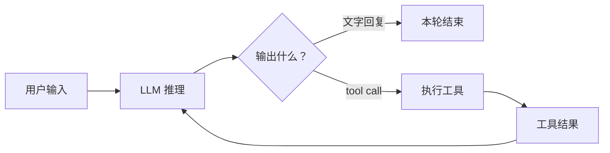
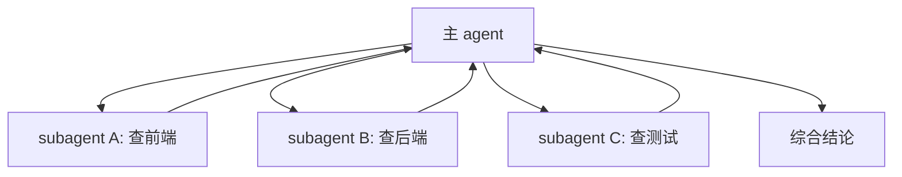
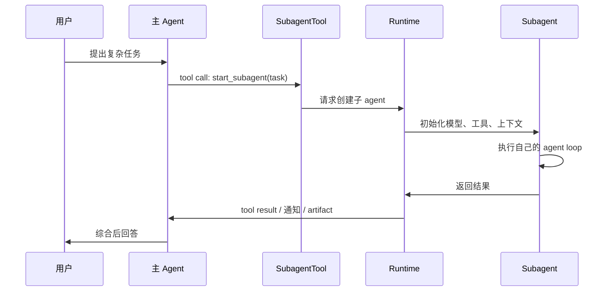
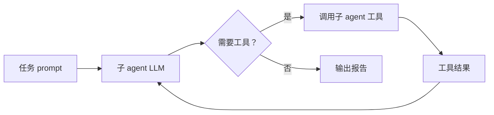

# Agent Subagent 机制设计：它到底是什么，为什么有用？

现在很多 Agent 产品都会提到 **subagent**、**worker agent**、**team**、**swarm**。这些词听起来很复杂，好像背后有一套很神秘的多智能体架构。

但如果把 agent loop 拆开看，主 agent 自主委派出来的 subagent，本质其实很直接：

> **在由主 agent 自主委派任务的系统里，subagent 通常是通过一次工具调用启动的另一个 agent loop。**

它不是魔法，也不是模型突然学会了“分身”。主 agent 在一次推理中只有两类动作：

1. 回复文字，然后这一轮结束。
2. 发起工具调用，让运行时执行某个外部动作。

所以主 agent 想在自己的推理过程中启动一个 subagent，机制上通常要把“启动子 agent”包装成一个工具。模型选择调用这个工具，运行时接到 tool call 后创建一个新的 agent loop，把任务交给它执行，再把结果返回给主 agent。

这里需要先划清边界：如果 subagent 是由固定 workflow、外部调度器、产品 UI 或人工操作启动的，它不一定表现为主 agent 发起的 tool call。但只要“是否启动 subagent”这个决策发生在主 agent 的 agent loop 里，它就必须通过 tool call、action call 或类似机制把意图交给运行时执行。

这篇文章就围绕三个问题讲清楚：

1. subagent 的本质到底是什么？
2. 它解决了主 agent 的什么问题？
3. 一个 subagent 系统在工程上怎么实现？

---

## 一、先把 Agent Loop 说清楚

要理解 subagent，先要理解普通 agent loop。

一个最小的 agent loop 大概是这样：



模型每轮读取上下文，然后决定：

- 如果它已经能回答，就输出文字。
- 如果它需要外部信息或动作，就调用工具。
- 工具执行结果再追加回上下文，模型继续推理。

这就是 ReAct、tool use、function calling 等机制背后的基本循环。

关键点在于：**模型自己不能真的启动进程、读文件、查网页、创建新 agent。它只能输出结构化的 tool call。真正执行的是运行时。**

所以主 agent 自主委派式的 subagent，通常会落到这个框架里：

```text
主 agent 输出 tool call:
start_subagent({
  type: "researcher",
  task: "调研 subagent 的实现方式，给出要点",
  context_policy: "fresh"
})

运行时执行这个工具：
创建 researcher agent -> 跑它自己的 agent loop -> 返回结果
```

从主 agent 视角看，subagent 表现为一个工具。从系统视角看，这个工具内部启动了另一个完整 agent。

---

## 二、Subagent 和普通工具有什么区别？

普通工具通常是一个确定性函数。比如：

```text
read_file(path) -> content
search_web(query) -> results
run_tests(command) -> logs
```

工具的特点是：输入明确，执行逻辑由代码写死，输出相对直接。

subagent 工具不一样。它不是完成一个固定动作，而是启动一个新的 agent loop：

```text
start_subagent(task) -> subagent 自己推理、调用工具、整理结果 -> report
```

区别可以这样看：

| 维度 | 普通工具 | Subagent |
| --- | --- | --- |
| 执行主体 | 程序函数 | 另一个 agent loop |
| 是否会继续推理 | 不会 | 会 |
| 是否能调用工具 | 通常只执行自己 | 可以有自己的工具集 |
| 是否有上下文 | 只有输入参数 | 有独立消息历史 |
| 输出 | 函数结果 | 子任务报告、文件、状态或通知 |

所以在这篇文章里，我们讨论的 subagent 可以这样定义：

> **subagent 是被主 agent 委派出来、在独立上下文里完成一个子任务的 agent loop。**

它的“子”不是能力弱，而是控制关系上的子：主 agent 负责决定是否委派、给什么任务、如何使用结果；subagent 负责在自己的边界内完成任务。

---

## 三、为什么需要 Subagent？

如果主 agent 本来就能推理和调用工具，为什么还要 subagent？

核心原因是：**复杂任务里，主 agent 的上下文、注意力、时间和权限都很宝贵。**

### 1. 隔离上下文污染

主 agent 做复杂任务时，经常需要大量探索：

- 搜索很多文件。
- 读一堆日志。
- 尝试多个假设。
- 跑一些失败命令。
- 收集很多候选方案。

这些过程对最终决策有帮助，但全部塞进主上下文会带来两个问题：

- 上下文变长，成本变高。
- 噪声变多，模型更容易被无关细节干扰。

subagent 可以把探索过程隔离出去。主 agent 只需要接收一个压缩后的结果：

```text
我查了 A/B/C 三条路径。结论是：
1. 真正相关的是 src/auth/session.ts。
2. 失败原因是 token 过期后 user 为空。
3. 建议在 validateSession 里补空值处理。
```

这比把几十个文件片段和命令输出都塞进主线程干净得多。

### 2. 并行探索

很多任务天然可以拆成多个方向：

- 一个 agent 查前端。
- 一个 agent 查后端。
- 一个 agent 查测试。
- 一个 agent 查历史提交。

如果主 agent 串行做，时间会很长。subagent 允许 fan-out：



并行不是为了显得复杂，而是为了减少等待时间，并让每个子任务有更专注的上下文。

### 3. 专业化工具和权限

不同子任务需要的工具不一样。

一个研究型 subagent 可能只需要搜索和读取文件；一个实现型 subagent 需要编辑文件和运行测试；一个验证型 subagent 最好只能读和运行检查，不应该修改代码。

这就形成了工具和权限隔离：

| Agent 类型 | 适合工具 | 适合任务 |
| --- | --- | --- |
| researcher | search/read | 调研、定位、收集证据 |
| coder | read/write/bash | 实现、修复、重构 |
| verifier | read/bash | 审查、验证、找遗漏 |
| summarizer | read | 压缩上下文、整理报告 |

主 agent 自己可以拥有全量能力，但 subagent 不必都有全量能力。权限越小，越容易控制风险。

### 4. 独立验证

实现者容易带着自己的假设看问题。让同一个上下文里的模型自查，常常会漏掉它自己刚刚引入的错误。

subagent 可以作为独立验证者：

```text
主 agent / coder: 完成实现
verifier subagent: 用新上下文检查 diff、测试和边界
主 agent: 根据验证报告决定是否继续修改
```

这里 subagent 的价值不是“更聪明”，而是**上下文独立**。它没有背负实现过程中的错误假设，因此更容易发现问题。

### 5. 后台长任务

有些任务会跑很久：

- 深度调研。
- 大范围代码扫描。
- 多组测试。
- 多方案比较。

如果全部阻塞主 agent，用户只能等。异步 subagent 可以先返回一个 task id，让主 agent继续处理对话，之后再检查状态或接收完成通知。

---

## 四、主 Agent 如何启动 Subagent？

机制上可以拆成六步。



### 1. 主 agent 生成 tool call

主 agent 不会直接“创建对象”。它只是输出类似这样的工具调用：

```json
{
  "tool": "start_subagent",
  "arguments": {
    "subagent_type": "researcher",
    "task": "调查当前代码库里用户鉴权失败的可能原因。只读，不要修改文件。输出最多 5 条结论，每条带文件路径。",
    "mode": "sync"
  }
}
```

这个工具 schema 是系统提前提供给主 agent 的。模型看到工具说明后，知道自己可以通过它委派任务。

### 2. 运行时创建子 agent

运行时收到工具调用后，做真正的创建工作：

```text
start_subagent(args):
  1. 根据 subagent_type 找到 agent 定义
  2. 选择模型、system prompt、工具集合和权限
  3. 构造子 agent 的初始消息历史
  4. 启动子 agent loop
  5. 收集结果并返回
```

这里的关键不是模型，而是运行时。没有运行时支持，主 agent 输出再漂亮的“我启动一个子 agent”也只是文本。

### 3. 子 agent 跑自己的 loop

子 agent 被启动后，和主 agent 一样工作：



它可以读文件、搜索、运行命令、写报告，具体取决于它被授予哪些工具。

### 4. 主 agent 综合结果

subagent 返回结果后，主 agent 不应该机械转发。主 agent 的职责是综合：

- 判断结果是否可信。
- 合并多个 subagent 的发现。
- 决定是否继续委派。
- 把结论转成用户真正需要的答案或执行计划。

这点很重要：**subagent 可以委派执行，但主 agent 不能委派理解。**

如果主 agent 只是说“根据子 agent 的发现继续修”，它其实把最关键的判断丢给了别人。更好的方式是：主 agent 读懂结果，然后写出明确的下一步指令。

---

## 五、Subagent 能看到主 Agent 的上下文吗？

答案是：**取决于系统设计，但主 agent 不应该默认它能看到。**

常见有三种上下文策略。

### 1. Fresh：完全新上下文

fresh subagent 只看到主 agent 给它的任务描述，看不到主对话历史。

```text
主上下文：用户需求、已有讨论、工具结果、计划

fresh subagent 上下文：
system prompt
task prompt
```

这是最常见、最干净的模式。优点是：

- 成本低，不复制大上下文。
- 噪声少，任务更聚焦。
- 不容易泄露无关信息。
- 失败后容易丢弃。

缺点也很明显：主 agent 必须把任务讲清楚。不能写：

```text
帮我看看刚才那个问题。
```

因为 subagent 根本不知道“刚才”是什么。

更好的任务描述是：

```text
只读调查登录失败问题。重点看 auth/session.ts 和 api/login.ts。
用户现象：token 过期后刷新页面返回 500。
请找出最可能的异常路径，输出文件路径、函数名和原因，不要修改代码。
```

### 2. Fork：继承上下文快照

fork subagent 会继承主 agent 当前上下文的一份快照，然后独立运行。

```text
主 agent 上下文 at T0
        |
        | fork
        v
子 agent 上下文副本
```

优点是子 agent 不需要重新解释背景，适合复杂任务中的分支探索。

缺点是成本更高，而且会把主上下文里的噪声也带过去。如果主上下文已经很乱，fork 出去的 subagent 也会被污染。

### 3. Continue：继续已有子 agent

有些系统允许主 agent 给已经启动过的 subagent 继续发消息。

这时子 agent 保留自己的历史上下文：

```text
第一次：研究 auth 模块
第二次：继续同一个 subagent，让它根据刚才读过的文件补查测试
```

continue 适合上下文高度重叠的后续任务。如果后续任务已经换方向，继续旧 subagent 反而会带来历史噪声，不如 fresh 一个新的。

### 4. 一个实用判断

可以用这张表决定上下文策略：

| 场景 | 更适合 |
| --- | --- |
| 独立研究一个方向 | fresh |
| 主上下文很关键，复制过去能省大量解释 | fork |
| 子 agent 刚做完相关探索，需要沿着结果继续 | continue |
| 验证别人刚写的代码 | fresh |
| 纠正同一个子 agent 的失败尝试 | continue |

对主 agent 来说，最稳妥的原则是：**无论系统是否支持继承上下文，给 subagent 的任务都尽量自包含。**

---

## 六、主 Agent 和 Subagent 怎么通信？

subagent 启动后，通信方式通常有四类。

### 1. 同步返回：像普通工具一样

最简单的方式是同步 tool result。

```text
主 agent 调用 start_subagent
        |
等待子 agent 完成
        |
工具结果返回：子 agent 的报告
```

这种模式容易实现，也容易被主 agent 理解。缺点是主 agent 会被阻塞，不适合长任务。

### 2. 异步任务：先返回 task id

长任务更适合异步。

```text
start_subagent(...) -> task_id
check_status(task_id) -> running / done / failed
cancel_task(task_id) -> cancelled
update_task(task_id, instruction) -> updated
```

这里 subagent 不再是一个短工具调用，而是一个后台任务。主 agent 可以告诉用户“任务已经启动”，之后根据用户请求检查进度。

这类机制的关键是生命周期管理，而不是 prompt。

### 3. 文件或 Artifact：把结果落到共享位置

有些任务结果太长，不适合直接塞回上下文。比如：

- 调研资料。
- 大规模扫描结果。
- 测试日志。
- 生成的代码或文档。

这时 subagent 可以把结果写到文件或 artifact：

```text
subagent -> reports/auth-investigation.md
主 agent -> 读取摘要或引用路径
```

好处是主上下文只需要保留“结果在哪里”和关键摘要，不必吞下全部过程。

### 4. 多轮消息：主 agent 继续指挥

如果 subagent 是长期存在的，会话之间可以通过消息继续通信：

```text
send_message(to="researcher-1", message="继续查测试覆盖，只看 auth 相关")
```

这和普通聊天类似，但要注意：主 agent 仍然要写明确指令。不要说“按你刚才的发现继续”，而要说明具体继续什么、输出什么、不要做什么。

---

## 七、Subagent 适合解决什么问题？

subagent 不是越多越好。它适合的是边界清楚、可以独立推进的子任务。

### 适合的任务

| 任务类型 | 为什么适合 |
| --- | --- |
| 代码库探索 | 可以大量读文件，把噪声隔离出去 |
| 资料研究 | 搜索和整理过程长，适合压缩成报告 |
| 多方案比较 | 不同 subagent 可以独立探索不同路线 |
| 独立验证 | 新上下文能减少实现者偏见 |
| 批量检查 | 多个模块可以并行扫描 |
| 后台长任务 | 可以异步运行，主 agent 不必阻塞 |

比如用户问：

```text
这个项目的权限系统有没有安全问题？
```

主 agent 可以拆成：

- subagent A：查 API 鉴权入口。
- subagent B：查前端权限控制。
- subagent C：查数据库访问层。
- subagent D：独立审查测试和边界。

最后由主 agent 合并为一份安全审查报告。

### 不适合的任务

| 任务类型 | 为什么不适合 |
| --- | --- |
| 一步能完成的小任务 | 启动成本比收益高 |
| 强共享状态的细粒度协作 | 多个上下文之间同步复杂 |
| 需要实时逐步控制的流程 | 主 agent 直接执行更可控 |
| 任务描述不清的问题 | 委派会放大歧义 |
| 高风险写操作 | 权限和审计要求更高 |

一个简单经验是：

> 如果你无法用几句话定义一个清晰的子任务，就不要急着启动 subagent。

subagent 不是用来替代规划的。恰恰相反，只有主 agent 先把任务边界想清楚，subagent 才有价值。

---

## 八、实现一个 Subagent 系统需要什么？

最小可用的 subagent 系统，需要七个组件。

### 1. Agent Registry：有哪些子 agent

系统需要注册可用的 subagent 类型：

```json
{
  "researcher": {
    "description": "只读调查问题，输出证据和结论",
    "model": "fast-model",
    "tools": ["read_file", "search"],
    "permission": "read-only"
  },
  "coder": {
    "description": "实现明确的代码修改并运行验证",
    "model": "strong-model",
    "tools": ["read_file", "write_file", "bash"],
    "permission": "write"
  },
  "verifier": {
    "description": "独立检查代码和测试，不修改文件",
    "model": "fast-model",
    "tools": ["read_file", "bash"],
    "permission": "read-only"
  }
}
```

主 agent 不是随便创造任何子 agent，而是在 registry 允许的类型里选择。

### 2. Subagent Tool：暴露给主 agent 的启动工具

在主 agent 自主委派的实现里，主 agent 能看到的通常是一个工具：

```json
{
  "name": "start_subagent",
  "description": "Start a subagent to work on a bounded task.",
  "parameters": {
    "subagent_type": "researcher | coder | verifier",
    "task": "string",
    "mode": "sync | async",
    "context_policy": "fresh | fork | continue"
  }
}
```

这个工具是主 agent 和运行时之间的协议。没有这个协议，主 agent 在自己的 loop 里就只能“说要启动子 agent”，却不能真的让运行时创建子 agent。

### 3. Context Builder：如何构造子上下文

运行时要根据策略构造子 agent 初始上下文：

```text
fresh:
  system prompt + task

fork:
  system prompt + 主上下文快照 + task

continue:
  找到已有 subagent 会话 + 新 message
```

这里有一个常见坑：直接把主上下文完整复制给所有 subagent，成本高，也容易泄露无关信息。更好的做法是默认 fresh，必要时 fork。

### 4. Agent Runner：跑子 agent loop

runner 负责真正执行：

```text
while not done:
  调用模型
  if model 输出 tool call:
    校验权限
    执行工具
    写回观察结果
  else:
    返回报告
```

从这里看，subagent 和主 agent 没有本质区别。它只是另一个被 runner 管理的 loop。

### 5. Result Channel：结果怎么回来

同步模式：

```text
start_subagent -> report
```

异步模式：

```text
start_subagent -> task_id
later: task_completed(task_id, report)
```

artifact 模式：

```text
start_subagent -> { summary, output_file }
```

结果通道设计不好，subagent 就会变成黑盒。主 agent 不知道它在跑什么、是否失败、产物在哪里。

### 6. Lifecycle Manager：生命周期和并发控制

subagent 不是一次函数调用那么简单。系统要管理：

- pending
- running
- completed
- failed
- cancelled
- timed out

还要管理并发上限。尤其是本地模型或资源受限环境，如果允许无限 spawn，多个 subagent 会同时占用 KV cache、CPU、内存和文件句柄。

所以实际系统通常需要：

```text
max_concurrent_subagents = 1 / 2 / N
```

超过上限时，启动工具应该返回错误或排队，而不是无节制创建。

### 7. Interrupt Policy：打断语义

这是很多人容易忽略的地方。

如果用户在主 agent 忙的时候又发了一句：

```text
等等，顺便看一下测试
```

系统应该怎么处理？

如果直接 interrupt 主 agent，而主 agent 正在等待 subagent，可能会把正在运行的子任务也杀掉。对于几分钟的研究任务来说，这很浪费。

更稳妥的策略是：

- 普通追问：排队，等当前子任务完成后处理。
- 明确停止：取消主 agent 和相关 subagent。
- 修改任务：通过 update/cancel 协议通知后台 subagent。

也就是说，subagent 系统必须区分：

```text
用户补充信息
用户要求停止
用户要求修改后台任务
```

这已经是运行时工程问题，不是 prompt 能单独解决的。

---

## 九、一个最小实现长什么样？

用伪代码表示，subagent 工具大概是这样：

```python
class SubagentTool:
    def __init__(self, registry, runner, lifecycle):
        self.registry = registry
        self.runner = runner
        self.lifecycle = lifecycle

    async def start_subagent(self, subagent_type, task, mode="sync", context_policy="fresh"):
        spec = self.registry.get(subagent_type)
        if not spec:
            return {"error": f"Unknown subagent type: {subagent_type}"}

        if not self.lifecycle.can_start():
            return {"error": "Too many subagents running"}

        context = build_context(
            policy=context_policy,
            system_prompt=spec.system_prompt,
            task=task,
        )

        handle = self.lifecycle.create(spec=spec, context=context)

        if mode == "async":
            self.lifecycle.run_in_background(handle, self.runner)
            return {"task_id": handle.id, "status": "running"}

        result = await self.runner.run(handle)
        return {"status": "completed", "result": result}
```

这里没有神秘部分。核心就是：

1. 查 registry。
2. 构造上下文。
3. 创建一个 agent loop。
4. 同步或异步运行。
5. 返回结果或 task id。

主流项目名字不同，抽象也不同。有的叫 AgentTool，有的叫 Task API，有的叫 async subagent，有的叫 team。只要是由主 agent 在推理中自主委派，基本都绕不开这几个环节；如果是 workflow 图或外部调度器启动，则会把“是否启动”的决策从主 agent 挪到调度层。

---

## 十、怎么判断一个 Subagent 设计好不好？

可以用下面几个问题检查：

1. **任务边界是否清楚？**  
   subagent 是否知道目标、范围、禁止事项和输出格式？

2. **上下文策略是否明确？**  
   它是 fresh、fork，还是 continue？主 agent 是否假设了不存在的上下文？

3. **工具权限是否最小化？**  
   研究 agent 是否真的需要写权限？验证 agent 是否应该能改代码？

4. **结果是否可综合？**  
   返回的是可执行结论，还是一堆过程噪声？

5. **生命周期是否可控？**  
   能否查看状态、取消、超时、限制并发？

6. **失败是否可恢复？**  
   subagent 报错后，主 agent 能否判断是重试、换 agent，还是自己接管？

如果这些问题没有答案，subagent 很容易变成“多开几个聊天窗口”，不仅不提升质量，还会增加混乱。

---

## 总结

subagent 的本质很简单：

> **在主 agent 自主委派场景下，它通过工具调用把一个边界清楚的子任务交给另一个独立 agent loop。**

它解决的问题也很明确：

- 隔离探索噪声。
- 并行处理多个方向。
- 给不同任务分配不同工具和权限。
- 用独立上下文做验证。
- 把长任务后台化。

真正难的不是“启动一个子 agent”，而是围绕它建立完整工程约束：

- 任务怎么描述。
- 上下文怎么传。
- 权限怎么隔离。
- 结果怎么回来。
- 并发怎么限制。
- 打断和取消怎么处理。
- 主 agent 如何综合而不是偷懒转发。

所以不要把 subagent 理解成多个 AI 开会。更准确的理解是：**它是一种把复杂工作拆成独立、可控、可并行执行单元的运行时机制。**

当任务足够复杂时，这个机制能让主 agent 保持清醒，让子任务各自深入，最后再由主 agent 做真正的判断和整合。
