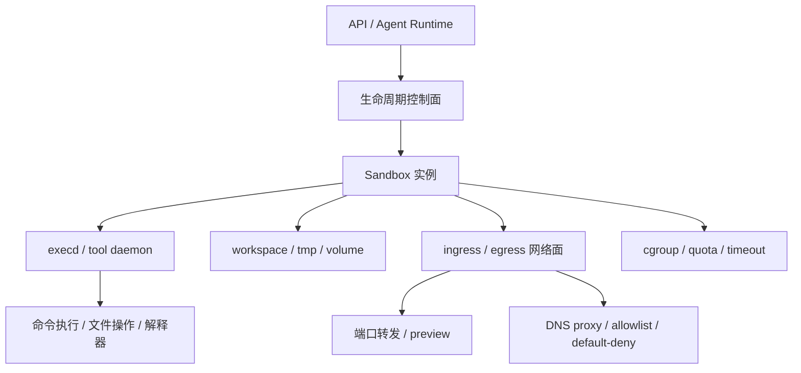
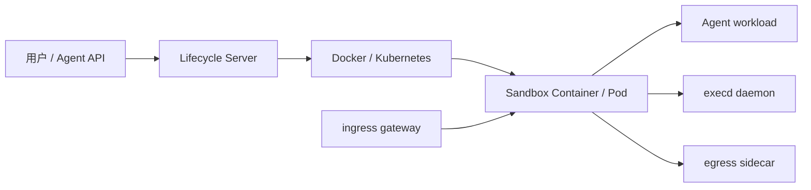

# Agent 沙箱运行时隔离：容器、受限进程、MicroVM 与 WASM 的技术路线对比

Agent 沙箱最容易被误解成一个单点问题：是不是用了 Docker？是不是用了 Kubernetes？是不是套了一个虚拟机？

但真正运行过 coding agent、data agent 或 code interpreter 之后，会发现沙箱不是一个 runtime 名词，而是一组工程边界：

- Agent 要能执行命令、读写文件、安装依赖、跑解释器。
- 这些动作来自 LLM 生成内容，默认不可信。
- 用户之间、会话之间、任务之间不能互相读文件、抢资源、打网络、污染环境。
- 运行环境还要能按需创建、暂停、恢复、销毁，并把关键状态落盘。

所以 agent 沙箱的本质不是“找一个隔离技术”，而是：

> **控制面编排生命周期，数据面收口执行、文件、资源和网络，再用合适的隔离边界承载 workload。**

这篇文章基于两类常见实现：容器型沙箱和受限进程型沙箱，进一步补充容器兼容增强运行时、MicroVM 沙箱平台和 WASM/WASI 三类路线。OS 原生沙箱和 Confidential Container 更适合作为特定场景下的增强能力，不单独当成主路线比较。

---

## 一、先统一模型：Agent 沙箱到底隔离什么？

一个完整 agent 沙箱通常可以拆成六层。



各层职责不一样：

| 层 | 负责什么 | 常见机制 |
| --- | --- | --- |
| 生命周期控制面 | 创建、暂停、恢复、销毁、快照、清理 | Docker API、Kubernetes Controller、自研 sandbox server |
| 执行入口 | 让 agent 在沙箱内跑命令和读写文件 | exec daemon、HTTP tool API、PTY、代码解释器服务 |
| 文件边界 | 限制 agent 能看到和修改的路径 | bind mount、overlayfs、临时 workspace、持久卷 |
| 资源边界 | 限制 CPU、内存、进程数、磁盘和运行时间 | cgroups、ulimit、timeout、输出截断 |
| 网络边界 | 控制入站预览和出站访问 | gateway、sidecar、DNS proxy、iptables/nftables |
| 隔离边界 | 防止越权影响宿主机或其他租户 | namespace、容器、gVisor、MicroVM、WASM、TEE |

很多安全事故不是因为“没用沙箱”，而是某一层没有收口。例如：

- 容器隔离存在，但 exec API 暴露在宿主网络上。
- 文件系统隔离存在，但挂载了宿主 Docker socket。
- 网络默认开放，agent 可以访问内网 metadata service。
- 资源限制缺失，恶意代码通过 fork bomb 或大文件写入拖垮节点。

因此评价一个 agent 沙箱，不能只问“用了什么 runtime”，还要问四个问题：

1. **代码在哪里执行？** 是宿主进程、受限进程、容器、Pod、VM，还是 WASM instance？
2. **能力从哪里进入？** 命令、文件、端口、网络访问是否都经过统一控制面？
3. **失败时能影响什么？** 最坏情况是单任务损坏、单节点损坏，还是跨租户泄漏？
4. **状态如何结束？** TTL、清理、快照、审计是否是生命周期的一部分？

---

## 二、受限进程型沙箱：Linux 原语拼出的轻量边界

受限进程型沙箱不创建容器或 VM，而是在宿主机上启动一个被 Linux 原语限制过的进程。它通常用于本地 CLI agent、单用户开发环境、CI 中的小任务执行。

以 bubblewrap 这类实现为例，一个 NativeSandbox 生命周期大致是：

1. 创建独立临时 `/workspace` 和 `/tmp`。
2. 执行命令时通过 `bwrap` 启动进程。
3. 开启 user、PID、mount、network、IPC 等 namespace。
4. 映射成固定 uid/gid，例如 1000。
5. 清空环境变量，丢弃 capabilities，设置 `no_new_privs`。
6. 只把 workspace 和 tmp 以可写方式 bind 到沙箱内。
7. 把 `/usr`、`/bin`、`/lib`、`/lib64`、`/sbin` 等系统路径只读挂载。
8. 用合成的 `/etc/passwd`、`group`、`shadow` 隐藏宿主身份信息。
9. 默认 `--unshare-net` 断网，只有显式 `network_access=True` 才共享网络。
10. 如果 cgroup v2 可用，为 sandbox 设置 memory、pids、cpu 限制。

从 agent 视角看，它仍然能在 `/workspace` 里执行命令：

```text
/workspace  可写，任务文件
/tmp        可写，临时文件
/usr        只读，系统工具
/bin        只读，基础命令
/home       不挂载或空目录
/etc        合成身份文件
```

这条路线最大的优点是轻：

- 不需要镜像构建和拉取。
- 启动开销低。
- 本地开发体验好。
- 容易让 agent 使用宿主已有工具链的只读视图。
- 实现成本低于完整容器控制面。

这对于本地 CLI agent 很重要。用户不希望每次让 agent 跑 `pytest` 都启动一个 VM，也不希望 agent 完全看不到项目里的编译器、语言服务器和系统工具。

必须明确：受限进程型沙箱是轻量 Linux sandbox，不是强多租户硬边界。bubblewrap 官方也强调，它是构造沙箱环境的低层工具，保护强度取决于调用者传入的参数和上层安全模型。也就是说，`bwrap` 本身不是“开箱即用的安全产品”，而是一个把 namespace、bind mount、no_new_privs 等机制组合起来的工具。

它的风险主要来自：

- 共享宿主机内核，内核漏洞仍然是逃逸路径。
- 策略配置复杂，少挂一个只读、漏封一个路径就可能越权。
- 如果允许共享网络，内网访问风险仍然存在。
- 对复杂系统调用、设备、FUSE、Docker socket 等能力必须格外谨慎。

适合场景：

| 场景 | 是否适合 |
| --- | --- |
| 本地 CLI agent 执行项目命令 | 适合 |
| 单用户或弱多租户环境 | 适合 |
| 需要低启动延迟的小任务 | 适合 |
| 公有云强多租户、不可信任意代码 | 不建议单独使用 |

本地 macOS 和 Windows agent 也可以走同一个思路：不是一定要复制 Linux 的 bubblewrap，而是使用 OS 原生能力把默认权限降下来。例如 macOS 的 Seatbelt / App Sandbox / Virtualization.framework，Windows 的 AppContainer / Job Object / Hyper-V。它们都更像“最小权限执行器”，不是公有云多租户平台。

---

## 三、容器 / Pod 型沙箱：云端 Agent 的基础控制面

容器型沙箱是云端 agent 平台最直观的路线：每个 agent workload 对应一个 Docker 容器或 Kubernetes Pod。



生命周期 server 根据 API 请求创建独立 sandbox 实例。每个实例有自己的容器或 Pod，通过 Linux namespace 和 cgroups 隔离 CPU、内存、进程、文件系统和网络命名空间。agent 看到的是一个完整 Linux 环境，但它实际被绑定在当前 sandbox 的边界内。

容器型沙箱要成立，重点不只是“启动一个容器”，而是把执行入口和网络路径收口：

- 命令执行不直接调用宿主 shell，而是在沙箱内部通过 `execd` 或 tool daemon 执行。
- `execd` 使用 sandbox-scoped token，命令有超时、输出截断和审计。
- 文件 API 做路径归一化，处理 `../`、符号链接和越权挂载访问。
- ingress gateway 根据 `sandbox_id + port` 做预览路由。
- egress sidecar 或代理通过 DNS proxy、iptables/nftables、allowlist/default-deny 控制外联。

这条路线的优势是生态成熟：Docker、containerd、Kubernetes、CNI、CSI、日志和监控都能复用；Linux 兼容性好，适合 shell、Python、Node、编译器和包管理器；生命周期管理也容易和 TTL、预热池、暂停恢复、持久卷、快照结合。

短板是普通容器共享宿主机内核，不是硬安全边界。Kubernetes 编排复杂度也会把控制面、网络面、存储面都变成攻击面。如果把 Docker socket、宿主路径或特权容器暴露进去，隔离会直接失效。

适合场景：

| 场景 | 是否适合 |
| --- | --- |
| 云端 coding agent / code interpreter | 适合 |
| 企业内部可信用户的任务沙箱 | 适合 |
| 需要完整 Linux 工具链和包管理器 | 适合 |
| 强对抗、多租户、公网不可信代码 | 需要叠加容器兼容增强运行时或 MicroVM 沙箱平台 |

---

## 四、容器兼容增强运行时：gVisor 与 Kata

当普通容器的共享内核边界不够强，但又希望保留容器和 Kubernetes 的工程体验时，可以把隔离边界增强，而不是重写整套控制面。典型选择是 gVisor 和 Kata Containers。这一类的区分点不是“底层一定不是 VM”，而是**对上仍然表现为容器运行时**：接 Docker、containerd、Kubernetes RuntimeClass，尽量复用已有容器控制面。

gVisor 在容器和宿主机内核之间插入用户态 application kernel。应用发起 syscall 时，不是直接进入宿主机内核，而是先被 gVisor 的 Sentry 接住，由 Sentry 实现 Linux-like 行为；文件访问再通过 Gofer 进程中介。它的优势是不需要每个 sandbox 都启动完整 VM，仍能复用 OCI、Docker、Kubernetes 生态，对不能使用 KVM 的环境也更友好。代价是 syscall-heavy、I/O-heavy workload 会有性能损耗，Linux 兼容性也不如原生容器。

Kata Containers 则把 Pod 跑在轻量 VM 里，目标是“像容器一样使用，像 VM 一样隔离”。它能接入 containerd 和 Kubernetes RuntimeClass，运维模型比直接管理 MicroVM 更接近容器平台，但每个 Pod 背后都有 VM 资源开销，节点也需要虚拟化支持。

这条路线适合：

- Kubernetes 上运行不可信容器。
- 希望比 Docker 强，但不想完整切到自研 VM 控制面。
- 已有容器平台，希望通过 RuntimeClass 做增量增强。
- SaaS code interpreter 这类需要执行外部用户代码的场景。

不适合把它理解为“免费增强”。gVisor 要压测 syscall 和 I/O 性能，Kata 要接受 VM 开销和更复杂的调试链路。

---

## 五、MicroVM 沙箱平台：强多租户边界

如果威胁模型更强，或者平台愿意为了隔离强度重建一套沙箱控制面，MicroVM 路线会把每个 sandbox 放进独立 guest kernel。这里说的 MicroVM 更偏独立沙箱平台，代表技术包括 Firecracker 和 Cloud Hypervisor；Kata 虽然底层也是轻量 VM，但它主要作为容器运行时集成，放在上一类更清晰。

Firecracker 是 AWS 为 Lambda 和 Fargate 场景打造的 MicroVM 技术。它通过 KVM 创建轻量虚拟机，刻意减少设备模型和 guest 功能，以降低内存占用、启动时间和攻击面。官方介绍中提到，Firecracker 面向安全多租户容器和函数服务，microVM 启动用户空间代码可以低至约 125ms，每个 microVM 的额外内存开销小于 5MiB。

对 agent 沙箱来说，这条路线的价值是独立 guest kernel 和硬件虚拟化边界。它适合公有云强多租户、企业 SaaS 中执行外部用户任意代码、安全优先于运维成本的场景。

代价是工程复杂度：需要 KVM，云上嵌套虚拟化不总是可用；镜像、内核、rootfs、网络、磁盘、快照都要管理；和 Kubernetes、CSI、CNI、日志采集的集成成本高于普通容器；GPU 和复杂设备透传也更麻烦。

如果还需要解决“宿主或云平台管理员也不可信”的问题，可以在这条路线外叠加 Confidential VM / TEE，例如 Intel TDX、AMD SEV-SNP 或 confidential containers。它解决的是 workload 内部数据和执行状态的机密性，不是普通沙箱的替代品。

---

## 六、WASM/WASI 型沙箱：能力窄，但边界清晰

WebAssembly 不是提供完整 Linux，而是让代码编译成 WASM module，在 runtime 内执行。Wasmtime 的安全文档把核心模型说得很清楚：WebAssembly 默认是沙箱化的，所有外部能力都必须通过 import/export 显式提供；WASI 的文件访问采用 capability-based security，程序只能访问被授予的目录。

这非常适合一类 agent 工具：

- 插件执行。
- 用户自定义函数。
- 数据转换函数。
- 确定性计算。
- 小型策略脚本。

它不适合另一类需求：

- 任意 shell。
- `pip install` / `npm install`。
- 需要完整 Linux 文件系统和进程模型。
- 需要启动数据库、浏览器、语言服务器等复杂进程。

WASM 的优点是边界清晰、启动快、跨平台、能力授予明确。缺点是生态和兼容性与 Linux 沙箱不是一个层级。所以它更适合作为 agent runtime 的“插件沙箱”，而不是完整 coding agent 的主工作区。

---

## 七、选型对比与工程底线

把几条主路线合并后，可以得到这张表：

| 路线 | 隔离边界 | 兼容性 | 启动/密度 | 运维复杂度 | 适合场景 |
| --- | --- | --- | --- | --- | --- |
| 受限进程 | namespace、mount、seccomp、cgroup | 高，复用宿主工具 | 最轻 | 中 | 本地 CLI、单用户、小任务 |
| 普通容器 / Pod | namespace + cgroup，共享内核 | 很高 | 高 | 中到高 | 内部平台、弱对抗多租户 |
| 容器兼容增强运行时 | gVisor 用户态内核，或 Kata 轻量 VM | 中到高 | 中 | 中到高 | K8s 多租户、需要比普通容器更强隔离 |
| MicroVM 沙箱平台 | KVM + 独立 guest kernel | 中到高 | 中，需优化快照 | 高 | 公有云强多租户、执行外部任意代码 |
| WASM/WASI | WASM instance + capability API | 低到中 | 极高 | 中 | 插件、函数、确定性工具 |

其中，gVisor 和 Kata 都可以看成“容器控制面不变，但隔离边界增强”的路线；MicroVM 沙箱平台则更适合从一开始就围绕 VM 生命周期、快照、预热池和租户隔离设计控制面。OS 原生桌面沙箱归入受限进程路线，主要用于本地 agent 权限控制；Confidential Container / TEE 归入安全增强层，只有在“宿主或云平台也不可信”时才需要引入。

如果只看 agent 产品落地，可以粗略这样选：

| 需求 | 推荐路线 |
| --- | --- |
| 本地 coding agent，主要防止误读写用户文件 | 受限进程 + OS 原生策略 |
| 企业内部 agent，用户相对可信，需要完整 Linux | 容器 / Pod + 严格 egress + cgroup |
| SaaS code interpreter，执行外部用户任意代码 | 容器兼容增强运行时或 MicroVM 沙箱平台 |
| 公有云强多租户，安全优先于运维成本 | MicroVM 沙箱平台 |
| Kubernetes 平台上想最小改造增强隔离 | gVisor 或 Kata RuntimeClass |
| 插件市场、用户函数、策略脚本 | WASM/WASI |
| 需要证明平台看不到用户数据 | 在上述路线外叠加 Confidential VM / TEE |

不管底层选哪条路线，agent 沙箱至少应该满足这些工程底线。

**文件系统：**

- 工作目录和临时目录独立。
- 根文件系统尽量只读。
- 禁止挂载宿主敏感路径。
- 禁止暴露 Docker socket、containerd socket、Kubernetes service account token。
- 路径访问必须做 canonicalization，处理符号链接和 `..`。

**资源：**

- CPU、内存、进程数、文件大小、磁盘写入有上限。
- 每条命令有 timeout。
- stdout/stderr 有截断。
- sandbox 有 TTL 和空闲回收。
- 异常退出后清理临时资源。

**网络：**

- 默认拒绝出站，按需开放。
- 屏蔽 metadata endpoint 和内网地址段。
- DNS 和 HTTP 请求可审计。
- 预览端口走 ingress gateway，不直接暴露 Pod IP。
- 依赖下载源和外部 API 分开授权。

**执行入口：**

- agent 不直接拿宿主 shell。
- execd token 只对当前 sandbox 有效。
- 命令、文件操作、端口转发统一审计。
- 高危能力需要权限模型，而不是 prompt 约束。

**生命周期：**

- sandbox id、user id、conversation id 绑定。
- 创建、暂停、恢复、销毁是显式状态机。
- 重要文件落到持久卷或对象存储。
- 内存状态默认不承诺持久化。
- 清理失败要有补偿任务。

---

## 八、结论：没有一种沙箱适合所有 Agent

Agent 沙箱的技术选型，本质是三个目标之间的权衡：

```text
安全边界
  ↑
  │       MicroVM 沙箱平台
  │     容器兼容增强运行时
  │   容器 / Pod
  │  受限进程
  └────────────────→ 兼容性与成本
        WASM 在另一条轴上：能力窄，但边界清晰
```

如果是本地 CLI agent，受限进程型沙箱通常更现实：启动快、集成简单、能复用项目工具链，但要承认它不是强多租户边界。

如果是云端 agent 平台，容器 / Pod 型是最容易落地的控制面基础，但普通容器不应该被当成最终安全答案。面向外部用户执行任意代码时，应优先考虑容器兼容增强运行时或 MicroVM 沙箱平台这类更强边界。

如果是插件和小函数，WASM/WASI 反而可能是更干净的模型，因为它从一开始就不提供完整操作系统能力。

真正成熟的 agent 沙箱架构不会押注单一 runtime，而是按 workload 分层：

- 本地命令：受限进程。
- 云端完整 Linux：容器 + gVisor/Kata，或独立 MicroVM 沙箱平台。
- 插件函数：WASM。
- 高敏数据：在主路线外叠加 Confidential VM/TEE。

最后再用统一控制面把执行入口、文件、网络、资源、生命周期和审计全部收口。这样 agent 看到的是一个可工作的完整环境，而平台看到的是一个有边界、可治理、可回收的 sandbox。

---

## 参考资料

- Firecracker: Secure and fast microVMs for serverless computing: https://firecracker-microvm.github.io/
- gVisor Documentation: https://gvisor.dev/docs/
- Kata Containers: https://katacontainers.io/
- Kata Containers GitHub: https://github.com/kata-containers/kata-containers
- bubblewrap README: https://github.com/containers/bubblewrap
- Wasmtime Security: https://docs.wasmtime.dev/security.html
