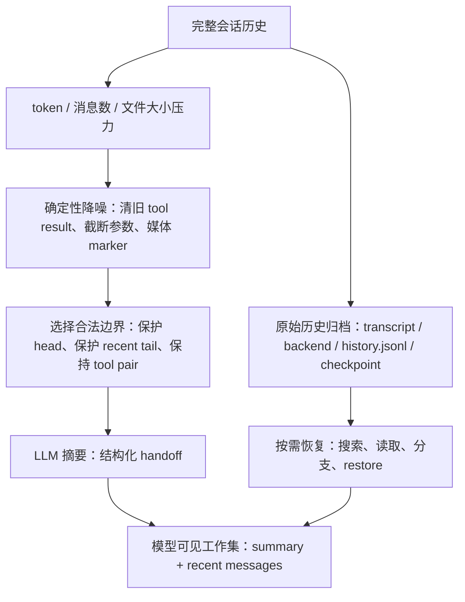

# Agent 上下文压缩技术实现：为什么不是“把历史总结一下”这么简单

很多人第一次理解 agent 的上下文压缩时，会把它想成一个很朴素的动作：

> 对话太长了，就让模型把前面的聊天记录总结一下，然后继续聊。

这个说法没有错，但只说到了最外层。真正跑过 coding agent、个人 agent 或多入口 agent 后，会发现上下文压缩涉及 agent runtime 里一整套状态管理，远不止一个 prompt 技巧。

因为 agent 的上下文里不只有自然语言聊天记录，还有系统提示词、用户约束、工具调用、工具结果、文件内容、图片、计划、技能、子任务报告、记忆、会话元数据和缓存边界。任何一个环节处理不好，都会出现很典型的问题：

- 最新用户请求被总结进“历史背景”，模型下一轮反而不执行它。
- 旧 tool result 被删了，但对应 tool call 还在，API 直接拒绝请求。
- 摘要请求本身超出上下文窗口，agent 进入“想压缩但压不动”的死循环。
- 压缩后原始历史不可恢复，调试和审计都失去依据。
- 每次压缩都改变 prompt 前缀，缓存命中率大幅下降。
- 大型工具输出反复进入上下文，摘要再努力也救不了 token。

所以这篇文章不把上下文压缩理解成“总结聊天记录”，而是从几个本地 agent 项目的实现出发，拆一个更工程化的问题：

> **agent 如何在不丢掉当前任务的前提下，把历史从“完整可见”降级成“足够可用”？**

本文依据 Claude Code、Codex、deepagents、nanobot、Hermes 和 OpenClaw 的源码。分析它们如何处理同一组工程矛盾，最后抽象出上下文压缩技术的共同特征。

---

## 一、先看最容易做错的版本

最简单的上下文压缩通常长这样：

```text
if tokens > 90% context_window:
    summary = LLM("总结前面的对话")
    messages = [system, summary, recent_messages]
```

这个版本很容易实现，也很容易出事故。原因在于它把“压缩”当成一次性文本处理，而没有处理上下文的结构。

agent 的消息不是一串普通段落。一次工具调用通常包含：

```text
assistant: tool_call(read_file)
tool: file content
assistant: 根据文件内容继续推理
```

如果压缩边界落在中间，比如保留了 assistant 的 tool_call，却删掉了 tool result，下一次请求就可能不合法。反过来，如果只保留 tool result，模型又不知道这个 result 属于哪个工具调用。

再看当前任务。压缩器如果只是“从前往后总结大部分内容，保留最后 N 条消息”，会遇到一个很隐蔽的情况：最后 N 条消息可能全是工具结果，真正的最近用户请求在更前面。压缩后，用户请求被写进 summary，而 summary 又被标成“历史参考”，下一轮模型就可能认为这个请求已经过去了。

还有一个问题是 tool 输出。`read_file`、`grep`、`bash`、网页搜索、批量编辑结果经常非常大。它们在上下文里的价值差异很大：

- 最近一次失败测试的错误栈，可能必须完整保留。
- 很早以前的一次 `ls` 输出，通常只需要知道查过目录。
- 一个 2 万行文件读取结果，不应该被全文塞进摘要请求。
- 一个工具结果如果原始内容还在磁盘上，保留路径和片段预览往往比保留全文更合理。

所以成熟一点的上下文压缩不会只有“摘要”这一招。它通常是一组渐进式动作：

```text
先估算或读取真实 token 用量
  -> 清理低价值的大块工具结果
  -> 保护系统头部和最近任务尾部
  -> 选择合法边界
  -> 对中间段做摘要或迁移
  -> 保留可恢复路径
  -> 重建下一轮模型可见上下文
```

下面看几个项目怎么做。

---

## 二、Claude Code：两条数据流，一条清 tool result，一条重建会话链

Claude Code 的上下文压缩可以拆成两条数据流：microcompact 和完整 compact。前者不生成摘要，只改写旧工具结果；后者生成 compact summary，并在 transcript 里插入 compact boundary。

先看 microcompact。输入不是“整段聊天文本”，而是一串结构化 message：

```text
system sections
user: 请分析项目
assistant: tool_use(Read)
user: tool_result(Read, 18k tokens)
assistant: tool_use(Grep)
user: tool_result(Grep, 7k tokens)
assistant: 结论和下一步
...
最新 user / assistant / tool_result
```

microcompact 会先走一遍消息列表，找到可压缩工具的 `tool_use` id。可压缩工具不是任意工具，而是源码中列出的 Read、Bash、Grep、Glob、WebSearch、WebFetch、文件编辑和写入等容易产生大文本输出的工具。接着它处理对应的 `tool_result`：旧内容会被替换成稳定占位，例如“旧工具结果内容已清理”。如果启用了 cached microcompact，还会产生 cache edits，并把删除动作固定到原消息附近，后续请求继续带着这些已 pin 的 cache edit。

这条数据流压缩前后大概是：

```text
压缩前：
assistant: tool_use(Read id=1)
user: tool_result(id=1, 巨大文件内容)

压缩后：
assistant: tool_use(Read id=1)
user: tool_result(id=1, [Old tool result content cleared])
```

注意它没有删掉 tool pair，也没有把工具调用变成自然语言摘要。它只是把高成本 payload 降级成一个合法、稳定、低 token 的结果。下一轮模型仍然能看到：之前确实读过文件，只是旧结果正文不再常驻上下文。

完整 compact 的数据流更重。它的输入是 compact boundary 之后仍然有效的历史消息。压缩前会先清洗一遍：

- 用户消息里的图片、文档会被替换成 `[image]`、`[document]` 这类文本 marker，避免摘要请求被附件撑爆。
- 技能发现、技能列表等后续会重新注入的 attachment 会被过滤，不让 summarizer 反复总结“可以使用哪些技能”。
- 如果 compact 请求本身 prompt-too-long，会按 API round 分组从最老部分截断，重新尝试生成摘要。

然后 Claude Code 用 forked agent 或 compact 模型生成 summary。生成结果不会简单追加到最后，而是写成新的 compact summary，并配套一个 system compact boundary。后续加载 transcript 时，会从最新 compact boundary 后继续构造当前消息链。旧消息仍在 transcript 文件里，但模型请求不再从最早历史开始重放。

压缩后的模型可见上下文大致变成：

```text
system: 原始系统提示词和动态 section
system: compact_boundary
user: compact summary
attachment: post-compact 恢复的文件/计划/技能片段（有预算）
user/assistant/tool: compact boundary 后保留的近期消息
user: 最新请求
```

这里的关键不是 summary 本身，而是 boundary。它告诉 session loader：boundary 之前的完整消息不再直接参与下一轮 prompt；boundary 之后的 preserved segment 继续作为真实消息链。Claude Code 还会在 compact 后重新附加 session metadata，清理或重建部分缓存，避免 title、tag、计划文件等元信息因为压缩被挤出 transcript 尾部。

所以 Claude Code 的压缩不是一次“旧历史变摘要”，而是两级变换：

```text
旧工具结果
  -> microcompact 替换 payload，保持 tool pair 合法

旧会话前缀
  -> compact summary + compact boundary
  -> transcript 仍可恢复，下一轮 prompt 从 boundary 后重建
```

这也是它为什么要同时关心 token、附件、缓存、session chain 和 post-compact context restore。

---

## 三、Codex：把当前 history 直接替换成 replacement history

Codex 的数据流更像“把当前模型可见历史整体替换”。它不围绕 transcript boundary 展开，而是在会话状态里构造一份新的 `replacement_history`。

输入历史先存在 session 的 history 里。每次 turn 前，Codex 会拿当前累计 token usage 和模型的 auto compact limit 比较。如果已经超过阈值，就在真正采样前运行 compact。还有一个特殊入口是模型降级：上一轮模型窗口大，下一轮模型窗口小，而当前历史对新模型来说太长时，会先尝试用上一轮模型上下文做压缩。

本地 compact 的数据流是：

```text
Session history
  -> 追加一条合成 compact prompt
  -> 调模型生成 assistant summary
  -> 从原 history 收集 user messages
  -> build_compacted_history(summary, user_messages)
  -> replace_compacted_history(new_history)
```

也就是说，Codex 不是把 summary 插进旧 history 中间，而是生成一份新 history。源码里有一个很直接的动作：`replace_compacted_history` 会把 session state 的 history 替换成新 items，同时把 compacted item 持久化到 rollout。替换完成后重新计算 token usage，并推进 model client 的 window generation。

压缩前后的形态可以这样理解：

```text
压缩前：
initial context
user A
assistant/tool/tool_result ...
user B
assistant/tool/tool_result ...
user C（当前任务）

压缩后：
summary_prefix + compact summary
保留/收集后的 user messages（受 token 上限约束）
必要的 initial context 注入位置
user C 或下一轮新 user
```

这里有两个容易忽略的实现细节。

第一，Codex 有 `InitialContextInjection` 的区别。普通 pre-turn 或手动 compact 使用 `DoNotInject`，压缩后清掉 reference context，让下一次正常 turn 再完整注入初始上下文。mid-turn compaction 则可能需要把 initial context 插到最后真实 user message 前面，因为模型训练和请求形态要求 compact summary 与最新 user message 的相对位置保持合理。

第二，Codex 的 compact 请求自己也可能超窗。本地路径在遇到 `ContextWindowExceeded` 时，会从 compact 请求 history 的开头移除最旧 item，保留最近消息继续重试。这不是最终的压缩结果，而是为了让“生成摘要的那次请求”能发出去。它体现了一个递归问题：压缩器也要被压缩。

remote compaction v2 的数据流略有不同：

```text
当前 prompt_input
  -> 追加 ContextCompaction item
  -> provider 返回 context compaction output
  -> build_v2_compacted_history(prompt_input, output)
  -> process_compacted_history(...)
  -> replace_compacted_history(...)
```

这里 summary 的生成不一定由本地 prompt 驱动，而是 provider 以专门的 context compaction item 返回压缩结果。本地仍然负责把结果安装进 session history，处理 initial context，并记录 compacted item。

所以 Codex 的核心是：

> 输入是 session 当前 history，输出是下一轮直接使用的新 history；完整旧 history 不再作为模型输入继续增长，而是通过 compacted rollout item 留下折叠记录。

---

## 四、Hermes：从 message list 中切出“中间层”，再把它变成 reference-only handoff

Hermes 的 `ContextCompressor` 最适合用数据流解释，因为它显式把压缩分成了 pre-pass、边界选择、summary 生成、消息重组和合法性修复。

它拿到的输入是一整个 OpenAI 风格 message list：

```text
system: 系统提示词、MEMORY.md、USER.md、工具规则
user / assistant / tool ...
user / assistant / tool ...
user: 最近请求
assistant: 最近可见回复或 tool_call
tool: 最新工具结果
```

第一步不是摘要，而是 cheap pre-pass：清理旧 tool result。Hermes 会保留较近的 tail 和一定 token budget 内的工具结果，旧的 tool output 可以替换成 `[Old tool output cleared to save context space]`。这样做的目的很明确：让 summarizer 少吃低价值大文本，也让后续边界判断不被超大旧工具结果扭曲。

第二步是确定三段：

```text
head：系统提示词 + 配置保护的前几条消息
middle：要被总结的历史窗口
tail：按 token budget 保留的近期消息
```

tail 不是最后 N 条消息。Hermes 会从后往前按近似 token 预算累计，同时有几个硬约束：

- 不能把切点放在 tool result group 中间。
- 最近 user message 必须在 tail 里。
- 最近可见 assistant message 也必须在 tail 里。
- 如果整个 transcript 都落在 soft ceiling 内，也要避免 no-op 压缩导致下次继续触发。

这一步决定了“谁会原样进入下一轮 prompt，谁只会以 summary 形态出现”。如果最近 user message 被放进 middle，summary 前缀又说“只回应 summary 后面的最新用户消息”，当前任务就会消失。所以 Hermes 用代码强制把它拉回 tail。

第三步是 summary 生成。Hermes 会查找压缩窗口里最近的旧 context summary。如果存在，就把它作为 previous summary 做迭代更新，而不是把旧 summary 当普通历史再总结一遍。生成出的 summary 带有 reference-only 前缀和 end marker，语义非常明确：

```text
这是早先上下文的 handoff
它不是当前指令
不要继续执行 summary 里的旧请求
只回应 summary 之后的最新 user message
```

第四步是重组消息：

```text
compressed = head
compressed += summary message（或合并进第一个 tail message）
compressed += tail
```

summary 的 role 不是固定的。Hermes 会看 head 最后一条和 tail 第一条的 role，尽量避免连续同 role。如果两种 role 都会冲突，就把 summary prepend 到第一条 tail message 里，而不是硬插一条会破坏 alternation 的消息。

第五步是合法性修复：

- 移除没有父 tool_call 的孤儿 tool result。
- 给仍然存在但缺少结果的 assistant tool_call 补 stub tool result。
- 清理历史媒体，只保留最新图片相关上下文，避免旧 base64 一直撑大请求体。
- 统计压缩后估算 token 和 savings，如果收益太低，增加 ineffective count，防止压缩抖动。

最终下一轮模型看到的不是“原始历史 + 摘要”，而是：

```text
system: 原系统提示词（附加一条已 compact 的说明）
summary: reference-only handoff
tail: 最近真实 user / assistant / tool 消息
latest user: 当前任务仍为真实消息
```

Hermes 的 gateway hygiene 还会在 agent 启动前做同样方向的处理：如果 transcript 太大，先用 compressor 生成压缩消息，旧 session 可以切到新的 session id，旧 transcript 仍可通过 session search 找回。这说明 Hermes 把压缩放在两层：agent loop 内部救窗口，gateway 入口处防止长会话一启动就爆窗。

---

## 五、OpenClaw：压缩是一场会话迁移，不只是消息替换

OpenClaw 的数据流比单纯 message compaction 更长，因为它把 compaction 当成 session mutation。一次手动 `sessions.compact` 大致先走控制面：

```text
session key
  -> 解析目标 agent / session entry / transcript file
  -> 如果有 active run，先 interrupt
  -> 捕获 pre-compaction checkpoint
  -> 启动 embedded compact runtime
```

这里的输入不只是 messages，还有 session file、workspace、cwd、模型配置、auth profile、工具策略、技能加载结果、plugin hooks、thinking/reasoning level 等。OpenClaw 这样做的原因是：压缩摘要不是孤立文本，它必须在和真实 agent run 接近的 runtime 里生成，否则 summary 可能缺少工具、技能、项目提示词或模型兼容处理。

进入 compaction runtime 后，数据流可以拆成四步。

第一步是构造 compact 输入。OpenClaw 会读取 transcript，修复或清洗 replay history，应用工具策略和系统提示词，再把需要压缩的历史交给 summarization 逻辑。这里还会处理重复 user message、manual boundary hardening、post-compaction section reinjection 等会话层细节。

第二步是生成 summary。OpenClaw 的 `summarizeWithFallback` 不假设一次总结一定成功。它先尝试完整 summarization；如果失败，会构造 oversized fallback plan，把过大的消息排除或拆分，再生成 partial summary，并把被过滤的大内容变成 note。chunk summarization 成功一部分后失败，也会把已完成 chunks 的 partial summary 带出来，避免全盘丢弃。

这个过程的数据流更接近：

```text
messages_to_compact
  -> chunk plan
  -> per-chunk summaries
  -> merge summaries
  -> if fail: small messages summary + oversized notes
  -> if partial fail: partial summary with failed chunk marker
```

第三步是质量和标识符保护。OpenClaw 的 compaction instructions 会要求保持对话主要语言，保留事实、决策、当前状态，同时不要翻译或改写代码、路径、identifier、错误信息。identifier policy 默认会保护 UUID、hash、URL、host、port、文件名等不透明标识符。可选的 quality guard 会审计 summary，不合格时重试生成。

第四步是安装压缩结果。OpenClaw 可以把 compact summary 写入当前 session，也可以在 `truncateAfterCompaction` 开启时轮转 active transcript，让后续 turns 只加载 summary 和未压缩 tail。压缩前的 transcript snapshot 会作为 checkpoint 存起来；session store 记录 compaction count、tokensAfter、sessionFile 等新状态；checkpoint 管理器还会限制每个 session 的 checkpoint 数量和总字节数。

压缩前后可以这样理解：

```text
压缩前 active transcript：
session header
message 1
message 2
...
message N（很长）

压缩后 active transcript：
session header / metadata
compaction summary
preserved tail
post-compaction context sections（取决于配置）
new messages

旁路归档：
pre-compaction checkpoint snapshot
旧 transcript / branch point / restore metadata
```

下一轮模型真正看到的是更短的 active transcript。但系统仍然知道压缩前 leaf 在哪里，可以 branch、restore、导出或查看历史。这就是 OpenClaw 和“把旧消息删掉”之间最大的差别：它把 compaction 设计成一次可追踪的会话迁移。

---

## 六、nanobot：同样是 summary，一个进入 cursor，一个改写 session 文件

nanobot 最值得细看的是它区分了两条压缩数据流：token-driven soft consolidation 和 idle auto compact。两者都会生成 summary，但影响完全不同。

先看 soft consolidation。输入是 session 里的完整消息和一个游标：

```text
session.messages = [m0, m1, ..., m120]
session.last_consolidated = 40
```

构造模型输入时，`get_history()` 默认只取 `messages[last_consolidated:]` 之后的 unconsolidated tail，再按 message count 和 token budget 从尾部裁剪。也就是说，`last_consolidated` 之前的消息不再常驻下一轮 prompt。

当 prompt 估算超过预算，Consolidator 会选择一个安全边界，把从 `last_consolidated` 到边界之间的旧消息拿出来总结。summary 追加到 `memory/history.jsonl`，然后把 `session.last_consolidated` 推进到新边界：

```text
压缩前：
last_consolidated = 40
active replay = m40..m120

consolidate：
summarize m40..m70
append summary to memory/history.jsonl
last_consolidated = 70

下一轮：
active replay = m70..m120
```

这个路径不改写 session 文件。`sessions/<key>.jsonl` 里的原始 structured messages、tool_calls、reasoning_content 仍在。变化发生在“下一轮 prompt 从哪里开始 replay”。所以它叫 soft consolidation 更准确：它把旧历史归档到 history.jsonl，同时用 cursor 减少活跃 replay。

idle auto compact 是另一条线。它在用户空闲超过配置阈值后运行，输入是一个 idle session。它会调用 Consolidator 对旧 prefix 做 summary，然后调用 `retain_recent_legal_suffix(8)` 保留最近合法后缀，并把 session 文件改写成这个后缀。

这条数据流是：

```text
idle session.messages = [m0..m120]
  -> summarize old prefix
  -> append summary to memory/history.jsonl
  -> retain recent legal suffix, e.g. [m113..m120]
  -> rewrite sessions/<key>.jsonl
  -> mirror summary to session.metadata._last_summary
```

用户回来时，`AutoCompact.prepare_session()` 会把 summary 格式化成一段 runtime context 返回。下一轮模型看到的是：

```text
runtime injected summary: Previous conversation summary ...
session live suffix: 最近合法消息
new user message
```

这里 summary 是 one-shot runtime context，而不是把一条 summary message 永久塞进 session.messages。为了重启后也能恢复，summary 同时镜像到 session metadata。

所以 nanobot 有一个非常清楚的分层：

- soft consolidation：不改写 session 文件，只推进 cursor，原始历史仍可审计。
- idle compact：会改写 session 文件，只保留 recent legal suffix，旧 prefix 退化成 history summary 或 `[RAW]` dump。
- Dream：后续再从 `history.jsonl` 消费摘要，编辑 `SOUL.md`、`USER.md`、`memory/MEMORY.md` 等长期记忆。

这解释了为什么“压缩”不能只问有没有 summary。真正要问的是 summary 进入哪里：是 prompt、history archive、session metadata，还是长期记忆文件。

---

## 七、deepagents：summary message 是入口，backend 文件是逃生门

deepagents 的 SummarizationMiddleware 把压缩拆成“模型可见摘要”和“backend 完整归档”两层。

它的输入是 LangGraph state 里的 `messages`。每次模型调用前，middleware 会先计算 effective messages。如果 state 里已经有 `_summarization_event`，它不会把完整 state messages 全部给模型，而是应用事件：

```text
effective_messages =
  [event.summary_message] + state.messages[event.cutoff_index:]
```

这意味着 state 可以继续保存完整 messages，但下一轮模型看到的是 summary message 加 cutoff 之后的 tail。这个 `_summarization_event` 就是压缩边界。

当触发条件满足时，middleware 会先判断是否需要压缩。trigger 可以是 tokens、messages、context fraction，keep 可以是 messages、tokens 或 fraction。它会根据 keep policy 算出 cutoff index，然后把消息分成两段：

```text
messages_to_summarize = messages[:cutoff]
messages_to_keep = messages[cutoff:]
```

接下来发生两件事。

第一，`messages_to_summarize` 会被写入 backend。默认路径类似 `/conversation_history/{thread_id}.md`，并且会过滤掉之前的 summary message，避免重复归档同一段摘要。这个文件是完整历史的外部化版本。

第二，LLM 会为 `messages_to_summarize` 生成 summary。summary 被包装成一条 `HumanMessage`，内容里明确告诉 agent：完整历史已经保存到哪个路径，需要细节可以回读；下面才是 condensed summary。

压缩结果不是直接改写所有 messages，而是返回一个事件：

```text
_summarization_event = {
  cutoff_index,
  summary_message,
  file_path
}
```

下一轮模型看到：

```text
HumanMessage: 你处在一段已被总结的对话中；完整历史在 /conversation_history/thread.md；summary 如下
messages[cutoff_index:]
latest user
```

这就是 deepagents 的核心数据流：完整 state 仍存在，模型输入通过 summarization event 被投影成 summary + tail。

它对大型工具输出还有另一条独立数据流。FilesystemMiddleware 或 overflow fallback 发现 ToolMessage 太大时，会把完整内容写到 backend 的 `/large_tool_results/{tool_call_id}`，然后把 ToolMessage 替换成带路径和 head/tail preview 的消息：

```text
压缩前：
ToolMessage(id=abc, content=几万行输出)

压缩后：
ToolMessage(
  id=abc,
  content="结果已保存到 /large_tool_results/abc；下面是 head/tail preview；可用 read_file 分块读取"
)
```

如果是 `read_file` 工具结果，overflow tail clipping 不一定重新写 backend，因为原文件路径已经在 tool_call args 里。它会保留前几千字符和提示：用 `read_file(file_path, offset, limit)` 继续读。这是一个很细的优化：不是所有大输出都需要复制归档，有些本来就可从源文件恢复。

deepagents 还暴露 `compact_conversation` tool。手动或 agentic compact 最终复用同一套 summarization event 机制，只是触发权从 middleware 自动判断变成 agent/用户主动调用。

因此 deepagents 的下一轮上下文不是“短历史覆盖长历史”，而是：

```text
state.messages：仍是完整状态
backend：保存被驱逐的历史和大工具结果
model input：summary message + kept tail + pointer
```

这套设计把“默认可见”和“按需可取”分开了。

---

## 八、这些实现的共同特征

看完这些项目，会发现它们名字不同、框架不同，但共同点非常明显。

### 1. 压缩是分层降级，不是一步到位

成熟实现通常不会一上来就做全量 summary。它们会先尝试更便宜、更确定的动作：

```text
清理旧 tool result
  -> 截断 oversized 参数或输出
  -> 保留 head/tail，压缩中间段
  -> 分块摘要
  -> 生成 handoff summary
  -> 归档或轮转 transcript
```

原因很现实：LLM 摘要是有成本、有延迟、有失败概率的。能用规则降噪的地方，应该先用规则。

### 2. 最近用户请求必须被特殊保护

很多压缩 bug 本质上都是“活跃任务被历史化”。summary 通常会被标成 reference、handoff、background。一旦最近用户请求进入 summary，它在下一轮模型眼里就可能不再是当前指令。

所以 Hermes 会强制最近 user message 留在 tail；nanobot 会尽量从 user turn 开始构造 legal suffix；Codex 和 Claude Code 也都偏向保留近期消息。共同原则是：

> 摘要可以承载过去发生了什么，但当前要做什么应该保留为真实、近期、未摘要的用户上下文。

### 3. tool 输出不是一种东西

工具输出至少要分几类处理：

| 类型 | 更合理的处理 |
| --- | --- |
| 旧的大型搜索/读取结果 | 清理、stub、head/tail preview |
| 最近失败日志 | 保留更多原文 |
| 可从文件系统恢复的内容 | 保留路径和 offset/limit 提示 |
| 不可恢复的一次性结果 | 摘要时保留关键结论 |
| 多媒体附件 | 用文本 marker 进入 summary |
| 工具调用参数中的大 patch | 截断旧参数，保留近期参数 |

这也是为什么 deepagents 有 large tool result offload，Claude Code 有 microcompact，Hermes 会先 prune old tool results，OpenClaw 有 oversized fallback note。

### 4. 消息边界合法性比摘要文字更基础

压缩后的消息列表必须仍然是一个合法的模型输入。最常见的边界问题包括：

- assistant tool_call 和 tool result 被拆开。
- 压缩后连续角色冲突，模型或 API 不接受。
- summary 插入位置让模型把旧任务当新任务。
- compact boundary 和 preserved segment 的父子关系断裂。
- 历史图片或附件仍然留在旧 tail，导致请求体过大。

Hermes 的 sanitizer、nanobot 的 legal suffix、Claude Code 的 compact boundary、OpenClaw 的 transcript repair 和 checkpoint 都是在处理这类问题。摘要质量再高，如果结构不合法，请求根本发不出去。

### 5. 摘要要结构化，而且要声明语义

好的 summary 不是“这段对话讨论了很多内容”。它要回答下一轮 agent 最需要的问题：

- 当前任务是什么？
- 已经完成了什么？
- 哪些决策已经确定？
- 哪些文件、路径、ID、端口、URL 很关键？
- 还有什么待办、阻塞和用户约束？
- 哪些内容只是历史参考，不应当被当成新指令？

Hermes 在 summary 前缀里强烈声明 reference only；OpenClaw 要求保留不透明 identifier；deepagents 的 summary message 会指向完整历史路径；Claude Code compact 后还会恢复部分文件、计划和技能上下文。这些都是在降低 summary 变成“模糊回忆”的风险。

### 6. 原始历史最好不要和模型可见上下文绑定死

上下文压缩的目标是减少下一轮 prompt，不一定是删除历史。OpenClaw 的 checkpoint/branch/restore、deepagents 的 backend offload、nanobot 的 `history.jsonl`、Codex 的 compacted rollout item，都体现了一个共同方向：

```text
模型每轮看到的是压缩后的工作集
系统仍然保留可审计、可恢复或可搜索的历史
```

这对长期 agent 很重要。用户体验上，agent 要轻；工程治理上，历史要能查。

### 7. 触发条件要尽量基于真实 token，而不是只看字符数

字符数估算可以兜底，但不能完全替代 token usage。Hermes gateway 优先使用上一轮 API 报告的 prompt tokens，缺失才用粗估。Codex 会维护总 token usage 并在 auto compact limit 上触发。deepagents 会用 token counter，并在可用时参考模型 profile 的 max input tokens。

粗估除了“不准”，还会影响压缩时机。触发太晚会请求失败，触发太早会频繁丢上下文、破坏缓存、增加成本。

### 8. 压缩失败也要有策略

压缩不是一定成功的。可能失败在：

- compact 请求本身超窗。
- summarizer 模型不可用。
- 大工具结果撑爆请求。
- provider 超时。
- partial summary 生成到一半失败。

成熟实现不会只抛异常。Codex 会在 compact 请求超窗时删最旧 item 重试；Claude Code 有 prompt-too-long retry；Hermes 有 abort 或 deterministic fallback；OpenClaw 有 partial summary fallback 和 timeout；deepagents 有 overflow clipping。

压缩失败策略本质上是在回答一个产品问题：

> 是宁可暂停也不丢信息，还是允许降级继续执行？

不同场景答案不同，所以很多实现把它做成配置或多级兜底。

### 9. 压缩要考虑缓存稳定

上下文压缩会改变 prompt。对于支持 prompt cache 的模型，频繁改变前缀意味着缓存命中下降，成本和延迟都会上升。

因此，压缩器最好有稳定边界：哪些内容被 stub，stub 在什么位置，compact boundary 如何写，哪些系统 prompt section 会被清缓存，哪些 post-compact 内容会重新注入。Claude Code 在这方面尤其明显，Codex 的 history replacement 也会推进窗口 generation，避免客户端继续拿旧窗口状态。

### 10. 自动压缩和手动压缩都需要

自动压缩负责安全：快到窗口上限时不能让请求失败。手动压缩负责意图：用户或 agent 认为一个阶段结束、要切换任务时，可以主动清理上下文。

Claude Code、Codex、OpenClaw、Hermes、deepagents 都能看到手动或 agentic compact 的影子。nanobot 则体现了后台 idle compact 的价值：用户离开后先整理旧上下文，回来时首 token 延迟更低，也不必重新处理长尾历史。

---

## 九、一个通用模型：上下文压缩其实是记忆分层

如果把这些实现放在一起，可以抽象成一个通用模型：



这个模型里有两条线：

第一条是模型可见线。它追求短、稳、够用，目标是让下一轮推理继续执行。

第二条是历史保存线。它追求完整、可查、可恢复，目标是让系统不因为 prompt 变短就失去事实依据。

上下文压缩是否可靠，取决于这两条线有没有分开，而非 summary 写得是否漂亮。

很多失败设计的问题，正是把它们混成一条线：

- 为了节省 prompt，直接删掉唯一历史。
- 为了保留历史，又把所有原文继续塞进 prompt。
- 只保存 summary，不保存原始 tool result。
- 只保存原始 transcript，但没有给模型可用的 handoff。

真正可持续的 agent runtime 会把历史变成分层资产：

```text
当前窗口：最近任务、关键约束、必要 tool 观察
压缩摘要：阶段性状态、决策、待办、重要标识符
外部归档：完整 transcript、工具大输出、文件路径、checkpoint
长期记忆：稳定偏好、项目事实、可复用经验
```

压缩只是其中一层。它连接的是短期工作记忆和外部历史。

---

## 结语

上下文压缩看起来是一个 token 优化问题，本质上是 agent runtime 的记忆管理问题。

Claude Code 用 microcompact 和 compact boundary 处理旧工具输出、附件、缓存和后压缩恢复。Codex 把 compaction 做成 replacement history，并在 turn 前和模型降级时触发。Hermes 展示了一个压缩器为了守住当前任务和消息合法性需要做多少边界处理。OpenClaw 把压缩放进会话生命周期，配套 checkpoint、branch、restore 和质量保护。nanobot 区分 soft consolidation 和 idle compact，让历史归档、活跃会话、长期记忆各归其位。deepagents 则把历史和大工具输出迁到 backend，用 summary + pointer 维持可用性。

它们最后指向同一个结论：

> **好的上下文压缩会把历史放到正确的层级里，缩短内容只是结果。**

模型每轮不需要看到所有东西，但系统必须知道哪些东西应该完整保留、哪些东西可以摘要、哪些东西只需要一个可恢复指针、哪些东西必须原样留在最近上下文中。

这就是为什么上下文压缩不是“总结一下”这么简单。它是一套围绕 token 压力、消息结构、工具输出、缓存、恢复和长期记忆共同设计的工程机制。

---

## 参考源码

- Claude Code：`src/services/compact/`、`src/utils/sessionStorage.ts`、`src/services/api/promptCacheBreakDetection.ts`
- Codex：`codex-rs/core/src/compact.rs`、`compact_remote_v2.rs`、`session/turn.rs`、`session/mod.rs`
- Hermes：`agent/context_compressor.py`、`gateway/run.py`、`agent/auxiliary_client.py`
- OpenClaw：`src/agents/embedded-agent-runner/compact.ts`、`src/agents/compaction.ts`、`src/gateway/session-compaction-checkpoints.ts`
- nanobot：`nanobot/agent/memory.py`、`nanobot/agent/autocompact.py`、`nanobot/session/manager.py`、`docs/memory.md`、`docs/configuration.md`
- deepagents：`libs/deepagents/deepagents/middleware/summarization.py`、`_message_eviction.py`、`_overflow_clip.py`
