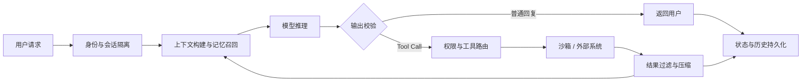

# 从模型到 Agent 服务：Harness 解决了哪些问题

调用一次大模型很简单：组织 messages，发起请求，拿到输出。

但把它做成一个真正可用的 Agent 服务，事情会立刻变复杂。服务要记得用户上一轮说过什么，要保证不同用户的数据不会串，要把模型输出变成可信的业务字段，还要控制上下文长度、执行工具、隔离文件和网络权限，并在失败后恢复。

这些能力并不来自模型本身。它们来自包在模型外面的一整套工程系统，也就是 **Agent harness**。

我更愿意把 harness 理解成模型的控制层：模型负责在不确定信息中推理和提出下一步，harness 负责状态、校验、上下文、执行与安全边界。前者提供智能，后者把这种智能约束成一个可以长期运行的服务。

这篇文章不讨论某个具体框架，而是从模型的几个天然边界出发，看看 harness 到底解决了哪些问题。

---

## 一、模型不持有业务状态：Harness 负责记忆，也负责隔离

我们经常说“大模型是无状态的”。更准确地说，**一次模型推理并不拥有应用的持久状态**。模型只处理这次请求里能看到的内容；下一次请求要延续上文，调用方就必须重新带上历史，或者通过平台提供的 conversation 接口引用由服务层保存的状态。[OpenAI 的 Conversations API](https://platform.openai.com/docs/api-reference/conversations) 本质上也在做这件事：创建、保存和读取会话状态，而不是让模型参数记住某个用户。

可 Agent 服务面对的是一条持续变化的任务线，远比一次请求复杂：

- 用户已经确认了哪些事实？
- Agent 从文档里提取了哪些字段？
- 当前计划执行到哪一步？
- 哪些结论只是暂定，哪些已经被工具验证？
- 用户有哪些跨会话仍然成立的偏好？

因此 harness 需要把状态分层：

```text
当前上下文：这一轮推理立即需要的信息
短期记忆：当前会话的目标、进度、决策和待办
长期记忆：跨会话稳定的用户偏好与业务事实
完整历史：原始消息、工具调用、审计记录和可恢复数据
```

这里很容易只想到“怎么记住”，却忘了另一个同样重要的问题：**这是谁的记忆？**

一旦服务支持多个用户、一个用户支持多个会话，所有状态都必须进入明确的命名空间。`user_id` 决定租户边界，`conversation_id` 决定会话边界，`workspace_id` 决定文件和执行环境边界。向量检索、对象存储、缓存、数据库查询和日志系统都必须携带这些约束，而且关键过滤条件应该由后端注入，不能交给模型决定。

所以记忆与隔离其实是同一个问题的两面：记忆回答“以后还要取出什么”，隔离回答“谁有权取出什么”。只做前者，长短期记忆就可能变成跨用户泄漏数据的通道。

这部分更具体的架构，可以参考之前的[《AI Agent 多租户工作区隔离》](category.html?category=tech&post=2026-06-07-agent-workspace-isolation)。

---

## 二、模型输出不等于可信数据：Harness 把建议变成可提交结果

大模型输出具有概率性。它可能漏掉字段、写错标识符、把相近的数字抄反，也可能生成格式正确但事实错误的内容。聊天产品可以用一句“请自行核实”提醒用户，业务服务却不能把错误订单号、错误金额或不存在的资源 ID 直接写进系统。

这就是为什么 Agent 项目里经常会出现 formatter、parser、schema validator、business validator 和 retry policy。它们在模型输出与业务状态之间建立确定性边界，并非重复造轮子。

一种常见的数据流是：

```text
模型输出候选结果
  -> 语法与 schema 校验
  -> 类型、范围、枚举校验
  -> 与数据库或工具结果核对
  -> 业务规则校验
  -> 提交或要求模型修正
```

在这个过程中，应该尽量让模型只输出下游真正需要的内容。例如需求提取不必返回一篇分析报告，只需要一个小 JSON：

```json
{
  "goal": "生成迁移方案",
  "constraints": ["不中断现网"],
  "missing_fields": ["回滚窗口"]
}
```

输出越短、字段越明确，模型偏离任务的空间越小，后端也越容易校验、重试和降级。能由代码计算的值不要让模型计算，能从事实源查询的值不要让模型回忆，能用枚举表达的状态不要让模型自由发挥。

[Structured Outputs](https://openai.com/index/introducing-structured-outputs-in-the-api/) 可以约束输出匹配给定 schema，但这里要分清两种正确性：

```text
格式正确：字段存在、类型正确、JSON 可以解析
事实正确：字段值确实来自可信来源，业务语义没有错误
```

前者可以由 schema 大幅改善，后者仍然需要工具查询、来源追踪和确定性校验。**模型负责提议，代码负责验证和提交**，这是比“让模型一次答对”更可靠的服务边界。

---

## 三、上下文窗口有限：Harness 负责决定历史如何退场

Agent 每执行一步，都会产生新的上下文：用户消息、模型回复、工具参数、工具结果、文件内容、错误栈和中间计划。如果把这些内容不断追加到 messages，窗口迟早会被填满。

其中最危险的往往是工具输出，而非对话。一次读取大文件、全仓库搜索、网页抓取或测试日志，就可能占据数万 token。更麻烦的是，这些内容在刚产生时很重要，十轮之后却通常只剩下少量结论还有价值。

因此 harness 不能把会话历史当作一段永远增长的字符串，而要管理不同信息的生命周期：

- 最近用户请求、当前计划和失败信息原样保留。
- 旧工具结果替换为摘要、片段或可恢复指针。
- 已完成阶段压缩为结构化 handoff。
- 大文件和完整日志移到文件、对象存储或 transcript 中。
- 稳定事实沉淀为长期记忆，需要时再召回。

这里有一条重要边界：**模型可见上下文不等于系统保存的完整历史**。前者追求短、准、够用，后者追求完整、可查、可恢复。如果为了省 token 直接删除唯一历史，系统会失去审计和恢复能力；如果为了保存历史又把所有原文继续发给模型，压缩也就失去了意义。

所以成熟的上下文管理更像分层存储，而不是简单的“聊长了就总结一下”。具体实现可参考[《Agent 上下文压缩技术实现》](category.html?category=tech&post=2026-06-20-agent-context-compression)。

---

## 四、能放进窗口，不代表应该放进去

上下文窗口越来越大，很容易让人产生一个错觉：只要没有超过 token 上限，就可以把所有资料都塞进去。

但窗口容量只说明“请求能不能被模型接收”，不说明模型能否同等有效地使用其中每条信息。`Lost in the Middle` 的实验表明，相关信息位于长上下文不同位置时，模型表现会明显变化，关键信息落在中间位置时尤其容易被忽略。[Liu et al., 2024](https://aclanthology.org/2024.tacl-1.9/)

对 Agent 来说，这种上下文污染还有更直接的表现：工具越多越容易选错，规则越长越容易漏掉局部约束，大段旧日志会淹没当前错误，重复信息则可能让模型误判优先级。

这里也不宜简单地说 system、assistant、human、tool 消息有一组可以精确控制的“注意力权重”。更实用的理解是：它们承担不同的权限语义，在上下文中处于不同位置，并有不同的保留周期。harness 要做的是尊重消息协议和指令层级，同时治理哪些内容应该进入当前请求。

这就引出了 **最小可用上下文**：

> 只向模型交付完成当前步骤所需的最小信息集合。

例如，一个负责校验订单字段的子任务，只需要订单候选值、字段规则和事实源返回值，不需要完整用户画像、全部历史对话和其他工具说明。一个复杂能力也不必把几十页操作手册常驻在 prompt 中，可以先暴露简短索引，需要时再读取具体 skill、文件或工具描述。

[Anthropic 对 context engineering 的总结](https://www.anthropic.com/engineering/effective-context-engineering-for-ai-agents)也强调了这种选择过程：围绕有限窗口持续策划真正有用的信息，并通过 compaction、结构化笔记和多 Agent 等方式控制上下文污染。

因此，上下文压缩只是治理手段之一。更根本的问题发生在压缩之前：这段内容是否有必要进入模型？能否先由代码过滤？能否只返回匹配片段？能否保存为小 JSON 或文件指针？

处理大工具输出的最好办法，是一开始就避免它进入主 Agent 上下文；压缩只能补救已经产生的大输出。

---

## 五、模型只能提出动作：Harness 负责让动作真正发生

大模型的直接产物仍然是 token。即使接口把其中一部分表示成 Tool Call，它也只是模型发给 runtime 的结构化请求：调用哪个工具、传入什么参数。它不会自己访问数据库、修改文件或执行命令。

真正的执行链路是：

```text
model
  -> tool call
harness
  -> 参数校验、权限判断、工具路由
tool / external system
  -> 执行并返回结果
harness
  -> 截断、过滤、结构化、审计
model
  -> 根据结果继续推理
```

这条 loop 看起来简单，进入生产环境后却要处理大量运行时问题：不存在的工具名、错误参数、重复调用、超时、幂等、重试、并行依赖、用户审批、敏感字段脱敏和调用链追踪。Tool Call 只是协议入口，harness 才是执行控制面。关于这条能力演进，可以参考[《从 Function Call 到 Skills》](category.html?category=tech&post=2026-01-25-tool-call-and-skills)。

当工具只是查天气或调用只读 API 时，风险还比较有限。当 Agent 获得 shell、文件系统、浏览器和网络访问后，它就拥有了改变外部世界的能力。模型可能误解需求，外部内容也可能通过 prompt injection 诱导它执行危险操作。仅在 system prompt 里写“不要越权”不是安全边界。

因此 harness 还要提供沙箱运行时：限制可见文件、网络目的地、进程权限、CPU 和内存；将用户、会话与 sandbox identity 绑定；对高风险动作要求审批；让凭证在边界处按需注入；记录完整审计日志，并明确创建、暂停、恢复和销毁的生命周期。

不同场景可以使用受限进程、容器、gVisor、MicroVM 或 WASM，但它们解决的是同一个问题：模型可以提出动作，却不能自己决定权限边界。更完整的技术路线见[《Agent 沙箱运行时隔离》](category.html?category=tech&post=2026-06-17-agent-sandbox-runtime-isolation)。

---

## 六、把 Harness 放回完整链路

把前面的机制放在一起，一个 Agent 服务大致会形成这样的数据流：



模型位于链路中央，却不是整个系统。围绕它工作的 harness 至少承担五个控制面：

| 控制面 | 要解决的问题 |
| --- | --- |
| 状态 | 当前任务进行到哪里，哪些信息需要跨轮或跨会话保存 |
| 可靠性 | 模型输出是否符合格式、事实来源和业务规则 |
| 上下文 | 下一轮真正需要看到什么，旧信息如何压缩和召回 |
| 执行 | Tool Call 如何被校验、调度、重试和回填 |
| 隔离 | 哪个用户能访问哪些数据、文件、网络和凭证 |

这也是为什么 Agent 框架的差异，最终经常不只体现在 prompt 模板或支持多少模型，而是体现在 session、memory、middleware、tool runtime、sandbox、checkpoint 和 observability 这些看起来“不智能”的部分。

---

## 结语

从模型到 Agent 服务，不是多写一段 system prompt，再接几个工具就结束了。

模型是一个概率性的推理组件：它根据当前输入生成候选文本或动作。服务则必须有连续状态、租户边界、可信数据、有限资源、执行权限和失败恢复。Harness 的价值，就是在两者之间建立一组确定性的控制面：

```text
让模型只看到完成当前任务所需的上下文，
只输出下游真正需要的最小结果，
只执行经过校验和授权的动作，
并把重要状态保存到正确的用户、会话和存储层级。
```

模型能力决定 Agent 的上限，harness 决定这个上限能否稳定地变成服务能力。

如果说模型给了 Agent 一个大脑，那么 harness 做的不是再给它补上记忆、感官、手脚、边界和运行秩序。

---

## 参考资料

- OpenAI, [Conversations API](https://platform.openai.com/docs/api-reference/conversations)
- OpenAI, [Introducing Structured Outputs in the API](https://openai.com/index/introducing-structured-outputs-in-the-api/)
- Nelson F. Liu et al., [Lost in the Middle: How Language Models Use Long Contexts](https://aclanthology.org/2024.tacl-1.9/)
- Anthropic, [Effective context engineering for AI agents](https://www.anthropic.com/engineering/effective-context-engineering-for-ai-agents)
