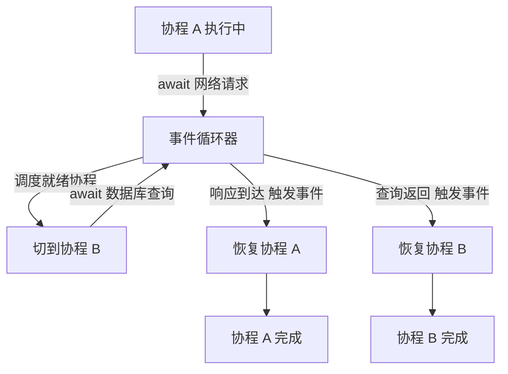

# 异步执行的思想：阻塞、协程与事件循环

做 Agent 开发时有一个很典型的场景：主 Agent 在一轮任务里要调用一堆工具和外部服务——查天气、查日历、检索文档、调用模型 API。这些调用之间大多没有强先后依赖，你不必等天气结果回来才能发起检索。

但如果代码是同步串行的，主流程就会每次都停在原地，等上一次调用返回才开始下一次。假设一次工具调用平均 800ms，六次排下来就是五秒左右——而这五秒里，CPU 几乎全程在空转等待。如果六个请求能同时发出去，总耗时大约就等于最慢的那一次，一秒上下。

同样的网络状况，同样的一批任务，差别只在于**等的时候主流程停不停**。这就是本文想讲透的东西：异步执行这个思想。它不神秘，效果层面的区别只有一个——阻塞不阻塞主流程。至于怎么实现异步，可以走多进程、多线程、协程几条路，下面以 Python 和 TypeScript 为例拆开来看。这类「无依赖调用该并行就并行」的业务场景，之前[《多 Agent 业务开发实践：如何减少 Token 消耗和等待时间》](category.html?category=tech&post=2026-07-07-multi-agent-token-latency)里从工程角度聊过，本篇往底层挖一层：异步到底是怎么实现的。

---

## 一、同步与异步：区别只在主流程停不停

同步调用是最直觉的写法：发请求，等结果回来，再往下走。它的代价是等待时间被整个浪费掉：

```text
同步串行（总耗时 ≈ 6 × 800ms ≈ 4.8s，数字为示意值）

主流程 ──[调用1]──等待──[调用2]──等待── …… ──[调用6]──等待──▶
               ↑ 每段等待期间，程序什么都不做
```

异步的思路反过来：把耗时任务交出去，主流程继续往前走，结果晚点再收：

```text
异步并发（总耗时 ≈ max(各任务耗时) ≈ 0.8s）

主流程 ──[发起1..6]─────────────全部完成时收结果──────────▶
                   ↓ 六个请求同时在路上 ↓
```

定义可以先行给出：同步是「必须等到结果才继续」，异步是「先继续，结果回头再说」。从效果上看，两者的全部区别就在于主流程会不会被等待阻塞。

还有一层值得先点破：异步并没有让任何一次请求变快，它只是把原本浪费掉的等待时间利用了起来。这句话先埋在这里，第七节还要回来算账。

---

## 二、把任务挪走的办法

一个进程默认只有一条执行流。要让程序「边等边干活」，本质都是把任务挪到别处执行。常见的路有三条：多进程、多线程、协程。

多进程一句话带过：操作系统 fork 出独立进程，各有各的内存空间，天然隔离互不踩踏；代价是进程创建开销大、进程间通信麻烦。它是为并行计算准备的路线（比如 Python 的 multiprocessing 把 CPU 密集任务摊给多个核），与「利用等待时间」这个 IO 诉求并不对口，本文不再展开。

主线交给剩下的两条路：多线程与协程。这也是 Python 和 TypeScript 两种生态给出的不同答案。

---

## 三、Python 多线程：IO 能行，CPU 不行

Python 多线程的心智模型很朴素：主线程继续执行，分出别的线程去跑耗时任务，之后再通过共享内存拿结果——全局变量、队列都是常用的通信手段。既然内存是共享的，就必须考虑多个线程同时改一份数据的问题，也就是加锁。

先看不加锁会发生什么：

```python
import threading

counter = 0

def bump():
    global counter
    for _ in range(100000):
        counter += 1   # 读、加、写回三步，会被其他线程切开

t1 = threading.Thread(target=bump)
t2 = threading.Thread(target=bump)
t1.start(); t2.start()
t1.join(); t2.join()

print(counter)   # 大概率不是 200000
```

`counter += 1` 看着是一行，实际是「读出来、加一、写回去」三步。两个线程交错执行时会互相覆盖，更新就丢了。加锁修复只需两处改动：

```python
lock = threading.Lock()

def bump():
    global counter
    for _ in range(100000):
        with lock:     # 保证这三步不被切开
            counter += 1
```

这就是共享内存模型的标准价码：并发能力给你，同步问题自己管。

顺带一提，线程间通信除了「共享变量加锁」，还有一条省心的路：标准库自带的 `queue.Queue` 内部已经处理好了加锁，天然线程安全。多线程版的工具编排常用「任务队列进、结果队列出」的结构。锁的原理必须懂，但能不亲手写就不亲手写。

那么 Python 多线程适合什么？答案是 IO 场景，而且确实有用：等网络响应、等数据库查询、轮询远端模型 API 的返回……这些任务的共同点是线程绝大部分时间都在等，几乎不占解释器算力。一个线程等 IO 时把解释器让给别人用，吞吐立刻上来。开头的 Agent 场景，用多线程并发发六个请求完全可行。

但计算密集型任务不行。根源要从 CPython 的实现说起：CPython 的内存管理主要靠引用计数，每个对象记着「有几个地方在引用我」，计数加一减一必须分毫不差。可计数操作本身并非原子——两个线程同时改同一个对象的引用计数，就可能引发数据竞争，导致对象被错误回收或永远泄漏。要在所有地方保证这一点，最直接的做法就是上全局锁：同一时刻只允许一个线程进入解释器执行字节码。这就是 GIL（Global Interpreter Lock）。

于是有了那个著名的结论：Python 多线程对 IO 密集有效，对计算密集基本无效——再多的线程，也是在排队等进同一扇门。

> 注：GIL 并非铁板一块。numpy 这类 C 扩展进入重计算段落时会主动释放 GIL，所以准确的表述是「纯 Python 计算循环跑不满多核」，笼统说「一切 CPU 密集都不行」会失之武断。

---

## 四、Future 与 Promise：异步任务的「取餐号」

无论哪种异步方案，都要回答同一个问题：任务交出去了，将来怎么拿结果？

各门语言给出的答案高度一致：造一种特殊对象来代表「尚未完成的任务」——Python 里叫 Future，JavaScript 里叫 Promise，本质是一回事。这种对象身上通常有三样东西：任务的当前状态（运行中、已完成、已失败）、任务完成时要触发的回调，以及最终的结果或异常。

生活化一点，它很像餐厅的取餐号：下单后拿到一张小票（创建 Future），人就回去干自己的事了（主流程不被阻塞）；餐好了店家叫号（回调触发）；凭小票领餐（读取结果）。

类比的失效边界也要交代：取餐号永远不会报「餐做糊了」，但 Future 可能带着异常完成、可能超时——`.exception()` 就是用来告诉你这一点的。

```python
from concurrent.futures import ThreadPoolExecutor

with ThreadPoolExecutor() as pool:
    fut = pool.submit(call_api, url)  # 立刻拿到 Future，不等网络
    do_something_else()               # 主线程可以干别的
    result = fut.result()             # 真要用结果时，这里才阻塞等待
```

JavaScript 侧完全同构：

```javascript
const p = fetch(url); // 返回 Promise，代码立刻往下走
p.then(render);       // .then 注册的正是「完成后要触发的回调」
```

值得注意的是分工：`ThreadPoolExecutor` 里，线程负责真的并发执行，Future 负责将来交货。不过 Future 只解决了「怎么代表一个未完成任务」，手写回调、手动 `.result()` 依然繁琐。有没有办法让异步代码写得像同步代码一样自然？这个问题把我们引向协程。

---

## 五、Python 协程：async/await 与事件循环

Python 的协程是无栈协程，由三个角色配合实现：`async def`、`await` 和事件循环器（event loop）。

我习惯这样理解这两个关键字。`async def` 标记的函数不再是普通函数，而是把「一段代码的执行状态」暴露给事件循环器管理：它可以被暂停，也可以被恢复。`await` 则是在说：「我要等的东西还没好，我把当前代码的执行权让出去。」事件循环器此刻的任务，是在所有处于可执行状态的协程之间调度；一旦某个 await 对象的状态变了（比如网络响应到达），事件循环器处理这个事件，让暂停在那里的代码重新拿回执行权，接着往下跑。

画成图是这样一个循环：



有三个容易忽略的点：

- 全程只有一条线程。await 让出的只是「这一个协程」的执行权，不是切换到别的线程。
- await 应该出现在真正要等的操作上（网络、磁盘、sleep）。定义在 CPU 密集型任务上的 await 救不了任何人——让出去的执行权最终还得回到同一条线程。
- 「暂停—恢复」发生在函数体内任意 await 处，现场由语言运行时保管而不依赖系统调用栈，这是无栈协程与有栈协程的分水岭，下一节顺带一提。

导语里的 Agent 场景用协程写出来只要十几行：

```python
import asyncio

async def call_tool(name: str) -> str:
    await asyncio.sleep(0.8)      # 模拟一次约 800ms 的 API 调用
    return f"{name} done"

async def main():
    results = await asyncio.gather(
        call_tool("weather"),
        call_tool("calendar"),
        call_tool("search"),
    )                             # 三路同时在途，总耗时约 0.8s
    print(results)

asyncio.run(main())
```

对照着感受一下：把 gather 换成三个顺序 await，就是三次串行、2.4 秒；gather 把三次让权交给事件循环统一调度，三路调用便同时在途。「发起」与「收获」一旦分离，串行改并行的成本就只剩几个关键字的摆放位置。

还有一个工程上的前提必须记住：await 让权带来的并发，只对「支持异步的客户端」成立。如果在协程里调了一个同步阻塞的库（比如 requests），它不会让出执行权，事件循环会被整个卡住，所谓并发立刻退化回串行——这是协程新手最常踩的坑。所以 asyncio 生态里才有配套的 aiohttp、异步数据库驱动；开头的场景要吃到并发红利，就得选异步版的模型 API 客户端。

---

## 六、TypeScript：单线程世界的异步

TypeScript（或者说它编译出的 JavaScript）是单线程的，语言层面没有多线程概念。硬要说 worker 的话，那也得划清界限：worker 是另开一个完整的 V8 运行时实例，拥有独占的内存，而不像传统多线程那样共享同一块内存——所以平时也不必考虑锁。

为什么这样设计？看应用场景就够了。浏览器的主战场是页面请求与资源加载，Node.js 的主战场是网络应用服务，两者都是典型 IO 密集而非计算密集，根本不需要强大的并行能力。应用场景决定了技术选型。

而这个单线程模型换来两个实打实的好处。

第一，抛弃了锁。没有共享内存可竞争，学习成本低；更要紧的是，浏览器里不存在「两个线程同时改 DOM」这种事故来源，渲染树不需要复杂的并发控制，运行不容易出错。

第二，绕开了操作系统层面的上下文切换开销。线程间的切换伴随用户态与内核态的来回，成本不小。顺带一提，Go 的 goroutine 正是为省掉这部分开销而生：用用户态线程实现有栈协程，把调度留在用户态。这不是本篇重点，点到为止；但它说明了两条路线殊途同归——切换贵，就想办法别在内核态切。JavaScript 选的路线则是干脆用单线程加上无栈协程。

落实到机制上，TypeScript 同样是 async/await 加事件循环的无栈协程：await 让出执行权，事件循环在就绪的协程间调度，IO 完成后恢复挂起的代码——与上一节 Python 侧一一对应。差异在于土壤：单线程的内存模型下没有数据竞争，这套协作式调度用起来格外放心。于是结论自然浮现：协程是为 IO 密集任务量身定做的能力，而 TypeScript 所处的世界（浏览器与 Node.js）恰好满是 IO 密集的场景。

写法上：

```typescript
async function callTool(name: string): Promise<string> {
  const res = await fetch(`/api/tools/${name}`);
  return res.json();
}

async function main() {
  const results = await Promise.all([
    callTool("weather"),
    callTool("calendar"),
    callTool("search"),
  ]);                  // 三路并发在途，全部完成后统一收结果
  console.log(results);
}
```

Promise.all 对应 Python 的 asyncio.gather，连心智模型都一样：一批任务同时发出，全部落地后一起收割。

至于 JavaScript 事件循环内部宏任务与微任务的优先级细节，同样属于「让权与调度」这套机制的延伸话题，这里有意留白，不影响对主线的理解。

> 注：SharedArrayBuffer 能让 worker 与主线程真正共享一段内存（须配合 Atomics），浏览器另有可转移的 ArrayBuffer。这些是为特定高性能计算场景保留的逃生通道，不属于日常的单线程模型。

---

## 七、异步不等于更快，也不等于并行

最后把这层最容易混淆的关系掰清楚。

异步只解决一个问题：等待的时间不浪费。它不会让一次网络往返变快，也不会让 CPU 算得更勤。六个接口各花 800ms，异步之后每一次依然还是 800ms，变的只是它们重叠了起来。

衡量的口径也不同：异步改善的是吞吐量——同一时刻能挂起更多在途任务；单个请求的延迟一分未降。

对计算密集型任务，异步更是无能为力。协程无论怎么交错调度，用的始终是一条线程、一个核。真要把 CPU 吃满，Python 得转向 multiprocessing 或释放 GIL 的原生扩展，TypeScript 得开 worker。

所以动手之前不妨先问一句：我在等的到底是什么？等 IO，用异步；等算力，谈并行。这两件事常被混作一谈，其实是两个正交的问题。

文章收尾，把全文涉及的方案放进一张表：

| 方案 | 是否真并行 | 锁与共享 | 切换成本 | 典型场景 |
| --- | --- | --- | --- | --- |
| 同步 | 否 | —— | —— | 强先后依赖的链路、简单脚本 |
| 多进程 | 是 | 无共享内存，IPC 通信 | 最重 | CPU 密集（multiprocessing） |
| 多线程（Python） | 仅纯 IO 期间交替 | 共享内存，须加锁 | 中，涉及内核态 | Python 的 IO 密集任务 |
| 协程 async/await | 否（单线程内并发） | 无共享，无需锁 | 极低，纯用户态 | IO 密集：网络、API、数据库 |

选型指引浓缩成三行：

- 等 IO 且并发量大：首选协程（asyncio / Promise.all）。
- 等 IO 但依赖的库只有同步版本：多线程配 concurrent.futures 顶着用。
- 等算力：多进程、worker 或原生扩展，别指望异步。

---

## 结语

回到开头那个 Agent 场景。编排层的提速常常不来自更聪明的算法，而来自一件朴素的事：把彼此独立的等待时间叠起来。识别出哪些调用没有强先后依赖，然后用 gather 或 Promise.all 发出去——这一个动作的背后，站着从多线程到协程、从 Future 到事件循环的一整条演化链。

本篇讲到无栈协程为止。还有一条线刻意没展开：Go 的 goroutine 属于有栈协程，每个 goroutine 自带独立栈、可被真正抢占式调度，在百万级并发连接里表现出另一种从容。那是另一个设计取舍的故事，留作下一篇的素材。

---

## 参考资料

- CPython Wiki, [GlobalInterpreterLock](https://wiki.python.org/moin/GlobalInterpreterLock)
- PEP 703, [Making the Global Interpreter Lock Optional in CPython](https://peps.python.org/pep-0703/)
- Python 官方文档, [asyncio — Asynchronous I/O](https://docs.python.org/3/library/asyncio.html)
- MDN, [Concurrency model and the event loop](https://developer.mozilla.org/en-US/docs/Web/JavaScript/Event_loop)
- Node.js, [The Node.js Event Loop, Timers, and process.nextTick()](https://nodejs.org/en/learn/asynchronous-work/event-loop-timers-and-nexttick)
