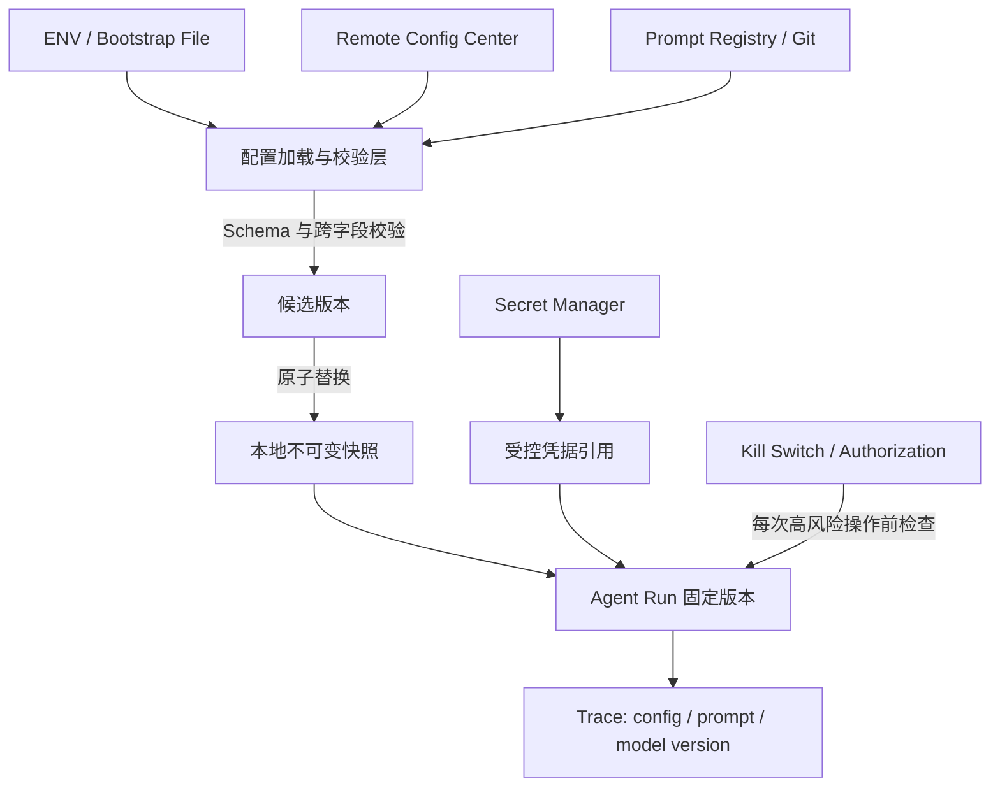
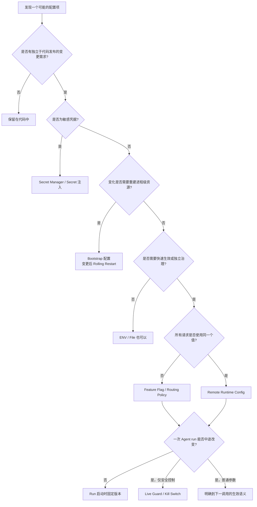

# Agent 服务配置设计：哪些应该动态化，哪些应该在启动时确定

很多 Agent 服务最初只有一套配置：代码里的默认值，加上一组环境变量。

这套方式在原型阶段很好用。数据库地址、模型名称、Prompt、最大执行步数和工具超时都写进 Deployment，服务启动时统一读取。部署过程简单，排查问题时也不用追踪多个配置来源。

问题通常在服务上线以后出现。Prompt 改一个词需要重新构建镜像，模型供应商故障时要改环境变量并等待 Pod 滚动重启，代码执行工具出问题后也只能走一次发布流程才能关闭。于是团队引入配置中心，又很容易走向另一个极端：只要是个值就搬进去，只要配置发生变化就要求所有运行中的任务立即读取新值。

这两个极端都忽略了同一件事：**配置存在哪里、什么时候加载、何时对业务生效，是三个不同的问题。**

对 Agent 服务尤其如此。一次 HTTP 请求可能只持续几百毫秒，一次 Agent run 却可能执行几十分钟，中间经历多轮模型调用、工具执行和状态保存。如果 Prompt 在第 3 步更新，当前任务的第 4 步要不要使用新版本？如果工具权限被撤销，是等下一个任务再生效，还是当前任务必须立即停止？“支持热更新”本身回答不了这些问题。

本文先比较常见的配置承载方式，再建立一套判断方法，最后把它应用到模型、Prompt、工具、RAG、Memory 和基础设施配置上。核心立场很明确：Agent 的运行策略应该默认具备远程治理能力，但远程化不意味着所有配置都进入同一个系统，也不意味着所有变化都要立刻影响正在运行的任务。

## 一、先拆开三个容易混在一起的概念

讨论配置时，人们经常把 ENV、配置中心、动态配置和 Feature Flag 放进同一张表。它们其实没有处在同一个分类维度。

### 1. Bootstrap：服务启动时必须确定什么

Bootstrap 描述加载和生效时机。服务在监听端口、创建数据库连接池、初始化配置客户端之前，就必须拿到一部分信息，例如：

```text
HTTP_PORT
DATABASE_URL
SERVICE_NAME
CONFIG_CENTER_URL
ENVIRONMENT
```

这些值可以来自环境变量、本地文件，甚至远程系统。关键不在存储位置，而在于服务需要依赖它们建立运行结构。修改后通常通过重启或滚动发布完成切换。

### 2. Remote Config：配置从哪里存储和分发

Remote Config 描述控制面的配置如何到达服务实例。配置中心通常提供统一存储、权限、版本、审计、推送或监听能力。它解决的是多实例环境下的集中治理，不自动保证业务能安全地接受新值。

数据库地址当然也能存进远程配置中心，但应用可能只在启动时读取一次。反过来，挂载在本地文件系统中的配置也能被进程监听并热加载。因此：

> 远程配置不等于动态生效，本地文件也不等于只能启动时读取。

### 3. Hot Reload：运行中的进程怎样接受新值

Hot Reload 描述配置更新后，进程是否能在不重启的情况下切换。它要求应用实现完整的更新语义：监听变化、校验候选值、构造新状态、原子替换、处理失败并保留旧版本。

把一个变量重新赋值不等于完成热更新。将 `DATABASE_URL` 从 A 改成 B，还要处理旧连接池、正在执行的事务、新连接的健康检查和切换失败后的回滚。相比之下，将 `temperature` 从 0.3 调到 0.5，只要下一次模型调用读取新值即可。两者的实现成本完全不同。

## 二、四种常见的存储与分发方式

先沿着“配置如何进入服务”这一条轴比较四种常见方式。

| 方式 | 典型加载方式 | 优点 | 主要限制 | 适合场景 |
| --- | --- | --- | --- | --- |
| 代码常量与默认值 | 随构建产物加载 | 最简单、可测试、与实现同步 | 修改需要发版，无法独立治理 | 算法内部常量、安全默认值、兜底值 |
| ENV / 启动文件 | 进程启动时读取 | 稳定、通用、无运行期网络依赖 | 更新通常需要重启，版本与审批能力有限 | Bootstrap、部署环境差异 |
| 共享文件 / ConfigMap Volume | 周期读取或监听文件 | 接入成本低，可实现热加载 | 更新延迟、监听可靠性和版本治理需要自行处理 | 中小规模服务、现有 K8s 环境 |
| 远程配置中心 | 拉取、长轮询或长连接监听 | 集中管理、审计、回滚、多实例分发 | 引入控制面依赖，客户端和生效逻辑更复杂 | 生产环境中的运行策略 |

[Twelve-Factor App](https://www.12factor.net/config) 提倡把随部署变化的配置与代码分离，并用环境变量承载数据库句柄、外部服务凭据和部署域名等值。这个原则仍然有效。问题出在把“与代码分离”进一步理解成“所有配置都只能放在 ENV”。环境变量擅长描述一次部署，却不擅长处理需要在部署之间频繁变化的运行策略。

代码默认值也不应该被远程配置彻底消灭。`temperature=0.2` 可以有一个经过测试的默认值，远程系统只覆盖它；安全能力则应使用保守默认值，例如代码执行默认关闭。配置中心不可用或首次启动尚未获取配置时，这些默认值决定服务是降级运行还是拒绝启动。

### ConfigMap 的“动态”取决于消费方式

Kubernetes ConfigMap 很能说明存储与生效不是一回事。根据 [Kubernetes 官方文档](https://kubernetes.io/docs/concepts/configuration/configmap/)：

- 以环境变量注入的 ConfigMap 不会自动更新，需要重启 Pod；
- 以 Volume 挂载时，文件内容会在 kubelet 后续同步中最终更新，并非瞬时传播；
- 使用 `subPath` 挂载的 ConfigMap 不会收到更新；
- 文件变了以后，应用仍需重新读取或监听，业务对象不会自动刷新。

所以“我们已经把配置放进 ConfigMap”只说明配置有了外部载体。它是否动态、多久生效、失败后怎么办，仍取决于挂载方式和应用实现。

### Feature Flag 为什么不属于这张表

Feature Flag 不是第五种存储方式。普通配置通常表达：

```text
default_model = model-a
```

Feature Flag 或请求级策略表达的是：

```text
(tenant_id, user_id, region, experiment_group) -> model-a / model-b
```

[OpenFeature 对 Evaluation Context 的定义](https://openfeature.dev/specification/sections/evaluation-context/)允许使用用户、应用、主机等上下文进行规则匹配、特定对象覆盖和按比例放量。规则仍然可以存放在配置中心，但每个请求都要带着上下文求值。它解决的是“谁使用哪个值”，并非“这个值存在哪里”。

全局切换默认模型，用普通远程配置即可；让租户 A 使用新模型、5% 用户进入实验组，则更适合路由规则或 Feature Flag。

## 三、判断一个配置是否应该动态化

看到一个配置项时，不要先问“它属于 LLM 还是 Tool”，而应沿着下面几个问题判断。

### 1. 修改后要不要重建进程级资源

这是最先检查的条件。

如果变化只会改变下一次函数调用的参数，动态生效的成本通常很低：

```text
temperature
max_tokens
rag_top_k
max_agent_steps
tool_timeout
```

如果变化会影响连接池、监听端口、线程模型或客户端初始化，热切换就需要额外的生命周期管理：

```text
DATABASE_URL
REDIS_URL
HTTP_PORT
CONFIG_CENTER_URL
```

后一类配置并非绝对不能远程存储，只是更适合按 Bootstrap 语义消费：服务启动时加载，变更后通过 Rolling Restart 切换。系统获得集中治理能力，同时避免在进程内实现复杂且风险很高的资源迁移。

### 2. 变化是否紧急

变化频率不是唯一指标，事故时需要多快生效往往更重要。

`enable_code_execution` 平时可能半年不改，但代码执行模块出现漏洞时，希望几秒内关闭。`tool_timeout`、最大并发、重试次数、熔断阈值也经常承担线上止血作用。它们值得进入远程配置，不是为了让日常调参更方便，而是为了把恢复动作从发版流程中分离出来。

反过来，`SERVICE_NAME` 和 `OTEL_ENDPOINT` 即使可以热更新，通常也没有足够收益。低频变更跟随部署，系统反而更容易理解。

### 3. 配置在哪个边界生效

“运行时生效”仍然太模糊。Agent 服务至少有三个边界：

```text
下一次请求
下一次 Agent run
当前 run 的下一执行步
```

例如，一个 run 启动时允许最多执行 20 步，运行到第 8 步后，远程配置把上限改成 10。如果当前任务立刻读取新值，它会突然只剩两步；如果改成 50，它又可能获得原本不应拥有的执行预算。

Prompt、默认模型、`max_agent_steps`、工具集合等普通运行策略，适合在 run 开始时捕获一个不可变快照，整个任务使用同一版本。这样才容易复现“任务为什么在第 12 步停止”“当时使用了哪个 Prompt”。

紧急停止、租户封禁、凭据吊销和安全权限则不同。它们不应该等到下一个 run 才生效，需要在关键操作前读取最新控制状态。实践中往往需要两条路径：

- **Run Snapshot**：保证普通策略在一次任务内一致；
- **Live Guard**：在执行高风险动作前检查最新授权和止血信号。

### 4. 更新失败时应该继续还是停止

配置中心不可用时，“统一回退到默认值”并不安全。

模型温度、RAG 召回数等普通策略可以继续使用 last-known-good，即最近一次通过校验的本地快照。代码执行权限如果从未成功加载，则应保持关闭。数据库地址缺失时，服务可能根本不具备启动条件。

因此失败策略需要按配置风险定义：

| 情况 | 推荐行为 |
| --- | --- |
| 已加载过普通运行策略，远端暂时不可用 | 继续使用 last-known-good |
| 新版本未通过校验 | 拒绝候选版本，保留旧快照 |
| 首次启动缺少关键基础设施配置 | 启动失败并告警 |
| 首次启动缺少安全授权配置 | Fail-closed，能力保持关闭 |
| Feature Flag 服务不可用 | 使用代码中明确声明的安全默认值 |

Spring Cloud Config 同时支持启动阶段的 [fail-fast 与重试](https://docs.spring.io/spring-cloud-config/reference/client.html)，其 Git 后端在远端不可用时也可以从[已有本地工作副本](https://docs.spring.io/spring-cloud-config/reference/server/environment-repository/git-backend.html)继续提供配置。这些机制说明不存在唯一正确的失败模式，关键是团队必须显式选择，而不是依赖 SDK 偶然的默认行为。

### 5. 这个值真的应该成为配置吗

远程配置很容易退化成“远程版全局变量”。算法里的每个常量都被暴露后，配置项会越来越多，组合状态无法测试，几年后也没有人敢删除。

一个值值得成为配置，至少要满足三个条件：存在独立于代码发布的变更需求；有人对它的正确性负责；变更后的结果可以验证。纯实现细节继续留在代码中更合适。

每个远程配置至少应该有一份最小契约：

```text
名称和用途
类型、取值范围与跨字段约束
代码默认值
责任人和敏感等级
生效边界
加载失败策略
是否允许热更新
```

没有这份契约，配置数量越多，系统的隐式状态就越多。

## 四、典型 Agent 配置应该放在哪里

假设一个团队最初把所有值都放在 ENV：

```text
DATABASE_URL
API_KEY
MODEL
TEMPERATURE
MAX_AGENT_STEPS
TOOL_TIMEOUT
PROMPT
ENABLE_CODE_EXECUTION
```

根据前面的判断方法，它们不会被统一迁移到同一个地方。

### 1. 基础设施配置：集中治理，启动时生效

`DATABASE_URL`、`REDIS_URL`、监听端口和配置中心地址决定服务如何建立进程级资源。推荐使用 ENV、本地启动文件或 Secret 引用，在启动时读取，变更后滚动重启。

如果企业已有统一配置平台，也可以把数据库地址远程存储，但应诚实地标记为 `restart_required`。远程存储只改变治理方式，不强迫应用实现连接池热迁移。

### 2. 密钥：使用专门的 Secret 系统

API Key、数据库密码和签名密钥确实需要远程分发，但不应混入普通配置快照。它们需要更严格的访问控制、轮换、审计和日志脱敏。

[Kubernetes Secret 安全实践](https://kubernetes.io/docs/concepts/security/secrets-good-practices/)特别提醒，Secret 默认在 etcd 中并未加密，Base64 也不提供保密能力；实际使用时仍需开启静态加密、限制 RBAC，并避免应用把读取到的值写入日志。规模更大时可以接入云 Secret Manager、Vault 一类专用系统，只向工作负载授予所需凭据。

### 3. 模型与推理参数：在下一次 run 生效

默认模型、`temperature`、`top_p`、最大输出长度和 reasoning budget 只会改变后续模型调用，很适合进入远程配置。

但一次 Agent run 可能包含多次模型调用。若没有明确的模型故障，最好让同一个 run 固定模型和参数版本，避免执行一半突然切换能力与上下文窗口。模型供应商故障转移可以由路由器按独立策略处理，并在 Trace 中记录每次实际调用的模型。

### 4. Prompt：正文版本化，配置中心切版本

短 Prompt、低风险内部工具可以直接把正文放进配置中心。随着 Prompt 变长，并开始要求 Review、Diff、评测和回滚，直接维护一大段文本会越来越笨重。

更合适的方式是：

```text
Git / Prompt Registry 保存 Prompt 正文和版本
                    ↓
配置中心保存 prompt_version = v17
                    ↓
Agent run 解析并固定 v17
```

这里仍然不必把 Prompt Registry 设为所有团队的必选项。重要的是正文和启用状态可以独立治理，并且每次执行都能追溯到准确版本。

### 5. Agent、Tool、RAG 和 Memory：多数属于运行策略

下面这些配置通常只影响下一次 run 如何执行，因此适合远程化：

```text
max_agent_steps
max_tool_calls
tool_timeout
retry_limit
rag_top_k
memory_enabled
subagent_enabled
context_compression_threshold
```

它们并非都应该拥有相同的生效边界。工具超时可以在下一次工具调用生效；工具白名单最好在 run 开始时固定，同时在实际调用前再经过实时授权；上下文压缩阈值在 run 中途变化可能改变记忆语义，通常也应随 run 固定。

### 6. 安全开关：关闭和开启不是对称操作

`ENABLE_CODE_EXECUTION` 看起来只是一个布尔值，但不能简单写成：

```python
if config.enable_code_execution:
    execute_code()
```

快速关闭是典型的 Kill Switch，应当尽快传播到运行实例。重新开启则必须同时满足租户权限、沙箱健康状态、策略校验和操作审批。普通配置中心中的一个 `true` 不应绕过这些条件。

这种不对称设计同样适用于外部写操作、高权限工具和敏感数据访问：关闭可以是全局否决，开启只能表示“允许进入后续授权判断”。

### 7. 租户和流量路由：使用请求级策略

如果所有请求都使用 `model-a`，普通配置足够。需求变成“租户 A 使用 model-b”“内部员工试用新 Planner”“5% 流量进入新 Prompt”后，配置值已经依赖请求上下文。

这时可以使用 Feature Flag 或独立路由策略：

```text
request context
  ├── tenant_id
  ├── user_id
  ├── region
  └── experiment_group
          ↓
      policy evaluate
          ↓
 model / prompt / planner version
```

请求级策略不应从用户可篡改的普通参数直接读取租户身份和权限。可信上下文应由鉴权层注入，实验系统也应避免把不必要的个人信息发送给外部 Flag Provider。

## 五、一个更稳妥的动态配置架构

远程配置中心不应该出现在每次业务请求的同步链路上。否则配置系统发生抖动，Agent 服务也会跟着增加延迟甚至不可用。更稳妥的结构是让后台加载器负责更新，本地内存快照负责服务请求。



关键点有四个：

1. 业务请求只读本地内存，不同步访问配置中心；
2. 新配置先校验，再整体替换，不能逐字段修改共享对象；
3. 一次 run 捕获一个版本，普通策略不在中途漂移；
4. 安全控制走实时旁路，并采用 fail-closed 语义。

下面是一段刻意简化的 Python 风格伪代码：

```python
from dataclasses import dataclass
from threading import Lock

@dataclass(frozen=True)
class RuntimeConfig:
    version: str
    model: str
    temperature: float
    max_agent_steps: int
    prompt_version: str

class ConfigStore:
    def __init__(self, initial: RuntimeConfig):
        self._current = initial
        self._lock = Lock()

    def snapshot(self) -> RuntimeConfig:
        # 对象不可变，调用方可以在整个 run 中安全持有
        return self._current

    def publish(self, raw: dict) -> None:
        candidate = parse_and_validate(raw)
        with self._lock:
            self._current = candidate
        persist_last_known_good(candidate)

async def run_agent(request, store, live_guard):
    config = store.snapshot()
    trace = start_trace(config_version=config.version)

    for step in range(config.max_agent_steps):
        plan = await call_model(
            model=config.model,
            temperature=config.temperature,
            prompt_version=config.prompt_version,
        )

        if plan.requires_code_execution:
            # 不依赖 run 启动时的旧快照
            await live_guard.require_code_execution_allowed(request.tenant_id)

        await execute(plan)
```

真实实现还需要处理版本乱序、监听断线重连、持久化快照损坏和指标上报，但核心约束不会改变：候选配置在后台变化，业务读取的是已经验证过的完整版本。

### 多实例不必假装强一致

配置 Watch 到达不同实例存在时间差。短时间内，有的实例使用 v41，有的已经使用 v42，这是常见的最终一致性现象。

普通运行策略可以通过版本号、分批发布和观测来接受这种差异。日志和 Trace 至少记录：

```text
config_version
prompt_version
resolved_model
flag_evaluation_result
```

发生异常时，团队才能判断问题集中在哪个版本，并快速回滚。

如果某条安全策略要求所有请求在同一时刻严格执行，就不应只依赖普通配置推送。把检查放在统一入口、授权服务或真正的强控制路径上，才符合它的风险等级。

## 六、最终决策树

面对一个新配置，可以按下面的顺序判断：



这棵树最后留下的不是三只互斥的箱子，而是几项可以组合的决定：配置可以远程存储、启动时加载、变更后重启；也可以来自挂载文件、运行时热加载；还可以由配置中心保存规则，再由 Feature Flag SDK 按请求求值。

真正需要避免的是让同一个词代替所有设计工作。写下“动态配置”以后，还要说明它从哪里来、如何校验、在哪个边界生效、失败时保留什么，以及怎样知道某次 Agent 执行实际使用了哪个版本。

对于一个典型的生产 Agent 服务，可以先采用这样的默认分工：

```text
Bootstrap
├── 服务如何启动
├── 基础设施在哪里
└── 配置与密钥系统在哪里

Runtime Config
├── 模型如何推理
├── Agent 如何执行
└── Tool / RAG / Memory 如何运行

Request Policy
└── 哪些请求使用哪套 Runtime Policy
```

这不是绝对边界，但它提供了一个可靠起点：环境变量继续负责它擅长的部署配置，远程配置接管需要独立治理的运行策略，Feature Flag 和路由系统处理请求差异，Secret 系统保护凭据。每个配置再根据资源生命周期和风险选择真正的生效方式。

配置远程化的价值也就不再只是“修改时不用重启”。更重要的是，团队终于能够说清楚一次变更影响谁、什么时候生效、出错后如何退回，以及一次 Agent 行为究竟由哪一组策略驱动。

## 参考资料

- [The Twelve-Factor App：Config](https://www.12factor.net/config)
- [Kubernetes：ConfigMaps](https://kubernetes.io/docs/concepts/configuration/configmap/)
- [Kubernetes：Good practices for Kubernetes Secrets](https://kubernetes.io/docs/concepts/security/secrets-good-practices/)
- [OpenFeature：Evaluation Context](https://openfeature.dev/specification/sections/evaluation-context/)
- [Spring Cloud Config Client](https://docs.spring.io/spring-cloud-config/reference/client.html)
- [Spring Cloud Config：Git Backend](https://docs.spring.io/spring-cloud-config/reference/server/environment-repository/git-backend.html)
- [Nacos：Publish, Query, and Listen](https://nacos.io/en/docs/latest/manual/user/config/publish-query-listen/)
