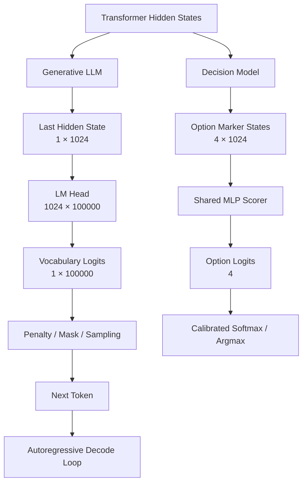

# 从 Logits 到答案：LLM 的输出侧，以及 Laya 为什么不再生成 Token

上一篇讨论 Jev 和 Decision Model 时，我把重点放在任务形态上：业务需要的是有限选项，为什么还要让大语言模型先生成字符串？

那篇文章介绍了 Structured Output、候选评分和 Decision Head，却没有仔细展开一个更基础的问题：Transformer 算完以后，hidden states 到底怎样变成我们看到的答案？

这部分很容易被一句“接 LM Head，再做 Softmax”带过。可我们平时在推理服务里反复调整的 `temperature`、`top_k`、`top_p`、`min_p`、重复惩罚、禁止 token 和 JSON Schema，几乎都发生在这里。它们不会改变 Transformer block，却会直接改变模型最后能说什么、怎样选择，以及什么时候停下来。

这篇文章就从上一篇停下的位置继续：先用矩阵回顾一层 Transformer 如何得到 hidden states，再沿着输出链路走到 logits、采样和自回归循环，最后看一个具体的开源 Decision Model——Laya——怎样把这条输出路径改成候选评分。

---

## 一、先回到 Transformer 的最后一层

为了把每一步的维度讲清楚，先固定一组教学配置：

```text
sequence length L = 128
hidden size d = 1024
num heads = 16
head dim = 64
FFN intermediate size = 4096
```

输入经过 token embedding 和位置编码后，可以写成：

$$
X\in R^{128\times1024}
$$

也就是 128 个 token，每个 token 用一个 1024 维向量表示。

### 1. 从 X 得到 Q、K、V

进入一层 Transformer 后，先做三次线性投影：

$$
Q=XW_Q,\qquad K=XW_K,\qquad V=XW_V
$$

假设三个权重矩阵都是：

$$
W_Q,W_K,W_V\in R^{1024\times1024}
$$

那么一次矩阵乘法的形状是：

$$
[128,1024]\times[1024,1024]=[128,1024]
$$

所以 Q、K、V 都还是 `[128,1024]`：

```text
X [128,1024]

  × Wq [1024,1024]
→ Q [128,1024]

  × Wk [1024,1024]
→ K [128,1024]

  × Wv [1024,1024]
→ V [128,1024]
```

### 2. 拆成 16 个 attention heads

1024 维会被拆成 16 个 64 维的 head：

```text
Q → [16,128,64]
K → [16,128,64]
V → [16,128,64]
```

先看一个 head。它的 attention score 来自：

$$
QK^T
$$

维度是：

$$
[128,64]\times[64,128]=[128,128]
$$

16 个 head 合起来，attention scores 的形状就是：

```text
[16,128,128]
```

这里的两个 128 分别代表“当前 token”和“它要查看的 token”。Decoder-only LLM 还会在这个矩阵上施加 causal mask，屏蔽当前位置右侧、尚未生成的 token。

经过缩放、mask 和 Softmax 后，attention weights 再乘 V：

$$
[128,128]\times[128,64]=[128,64]
$$

16 个 head 拼接回来，又得到 `[128,1024]`。再经过 attention output projection，外部形状仍然不变。

### 3. 经过 FFN

Attention 负责让 token 之间交换信息，FFN 则分别处理每个位置上的向量。假设 intermediate size 是 4096：

$$
[128,1024]\times[1024,4096]=[128,4096]
$$

经过激活函数后再投影回来：

$$
[128,4096]\times[4096,1024]=[128,1024]
$$

残差连接和 LayerNorm 会改变数值，不改变 shape。因此一层 Transformer 可以先记成：

```text
输入 [128,1024]
  ↓ Multi-Head Attention
[128,1024]
  ↓ FFN
[128,1024]
```

模型堆叠 24、28 或 32 层以后，表示的内容已经反复融合，外部形状通常仍是：

$$
H\in R^{128\times1024}
$$

上面的 4096 只是方便讲解的假设，不是所有模型的真实配置；不同架构还会采用不同的归一化位置、激活函数、门控 FFN 和注意力实现。但这些差异不影响本文的分界线：Transformer backbone 最终交出一组 hidden states，输出侧从这里开始。

---

## 二、生成式 LLM 怎样把 hidden state 变成 token

假设最后一层输出：

$$
H=[h_1,h_2,\ldots,h_{128}]\in R^{128\times1024}
$$

在 Decoder-only LLM 的一次推理中，当前位置的下一个 token 由最后一个 hidden state 预测：

$$
h_{128}\in R^{1024}
$$

它通常先经过最终的归一化，再进入 LM Head，也叫 vocabulary projection 或 unembedding。假设词表大小是 100000：

$$
W_{LM}\in R^{1024\times100000}
$$

于是：

$$
[1,1024]\times[1024,100000]=[1,100000]
$$

输出是一万个还是十万个数，取决于词表大小。这里得到的 100000 个数叫 **logits**：

```text
"fraud"       4.2
"hello"      -1.3
"cat"        -2.1
"duplicate"   7.8
...
```

Logit 是未归一化分数。它可以是任意实数，既不是概率，也还没有决定最终输出哪个 token。

很多模型会把输入 embedding 矩阵和 LM Head 的权重绑定起来。假设 embedding table 是 `[100000,1024]`，输出时可以复用它的转置完成 `[1024,100000]` 投影。这叫 weight tying，节省参数，也让“把 token 映射到向量”和“把向量映射回 token 分数”共享同一套表示空间。具体模型也可能不绑定。

### 1. 训练时会为所有位置计算 logits

如果加上 batch 维度，最后的 hidden states 是：

$$
H\in R^{B\times L\times d}
$$

训练时已知整段目标文本，可以一次计算每个位置的下一个 token：

$$
[B,L,d]\times[d,V]=[B,L,V]
$$

然后把每个位置的 logits 与正确 token 做交叉熵。实现中常把投影与交叉熵融合以减少中间张量的存取，但学习目标仍然是：让正确的下一个 token 获得更高分数。

### 2. 推理时只需要当前最后一个位置

推理时未来答案还不存在。完成 prompt 的 Prefill 后，系统取当前位置的 hidden state，生成一个 token，把它追加到上下文，再进行下一步：

```text
hidden state
  ↓ LM Head
vocabulary logits
  ↓ logits processors / masks
adjusted logits
  ↓ Softmax
probabilities
  ↓ greedy / sampling / beam search
next token
  ↓ append to context
下一轮 Decode
```

KV Cache 避免每一步重新计算所有历史 token 的 K 和 V，但不能取消顺序依赖。第 $t+1$ 个 token 的条件分布依赖已经选出的第 $t$ 个 token，因此输出多少 token，通常就要推进多少轮 decode。

这也是为什么“模型输出了 logits”和“用户拿到了回答”之间，还有一整套推理系统。

---

## 三、常见推理参数都在输出侧做了什么

推理框架拿到词表 logits 后，可以先修改分数或删除候选，再选择 token。我们平时最常调整的生成参数，大多属于这一段。

| 机制 | 作用位置 | 直观作用 |
| --- | --- | --- |
| Temperature | 缩放 logits | 调整分布尖锐程度 |
| Repetition Penalty | 修改已出现 token 的 logits | 减少原样重复 |
| Frequency Penalty | 按出现次数修改 logits | 出现越多，惩罚越大 |
| Presence Penalty | 按是否出现修改 logits | 出现过一次就施加惩罚 |
| Top-k | 裁剪候选集合 | 只保留分数最高的 k 个 token |
| Top-p | 裁剪候选集合 | 保留累计概率达到 p 的最小集合 |
| Min-p | 裁剪候选集合 | 按当前最高概率设置相对门槛 |
| 禁止 token | 屏蔽指定 token | 防止产生某些特殊或业务禁用 token |
| 约束解码 | 动态屏蔽非法 token | 保证输出符合 grammar、正则或 JSON Schema |

### 1. Temperature：缩放分布，而不是给模型增加创造力

Temperature 的常见形式是：

$$
z_i'=\frac{z_i}{T}
$$

其中 $z_i$ 是第 $i$ 个 token 的 logit。

- 当 $0<T<1$ 时，logits 之间的差距被放大，Softmax 后的分布更尖锐。
- 当 $T>1$ 时，差距被压缩，更多低概率 token 有机会被采样。
- API 中的 `temperature=0` 通常是一个特殊实现，表示使用 greedy/近似确定性选择，并不是在数学上真的计算除以零。

Temperature 改变的是对已有分数的解释方式。它不会让模型凭空知道更多事实，也不能把一个判断错误的高分 token 修正成正确答案。

### 2. 三类“重复惩罚”并不完全相同

`repetition_penalty` 常见于 Hugging Face 等开源推理框架。它会根据某个 token 是否已在上下文或生成序列中出现，对对应 logit 做缩放。常见实现还会区分 logit 的正负号，避免简单乘除带来相反效果。因此，它不能被统一概括成“给已出现 token 减去一个固定值”。

OpenAI API 中常见的 `frequency_penalty` 和 `presence_penalty` 更接近加性修正：前者考虑出现次数，后者只考虑是否出现过。直观上可以写成：

$$
z_i'=z_i-\alpha\cdot count_i-\beta\cdot \mathbb{1}[count_i>0]
$$

这里的 $\alpha$ 对应 frequency penalty，$\beta$ 对应 presence penalty。具体支持范围要看 API、端点与模型，不能假设每个服务都暴露这些参数。

这几种方法都只能缓解表面重复。模型如果在语义上绕着同一件事打转，却一直换词，token 级惩罚未必能识别出来。

### 3. Top-k、Top-p 和 Min-p：先决定谁有资格参加抽样

假设 Softmax 后最高的几个概率是：

```text
A  0.40
B  0.25
C  0.15
D  0.10
E  0.06
F  0.04
```

`top_k=3` 会只留下 A、B、C，其余候选被屏蔽，然后在剩余概率上重新归一化。

`top_p=0.75` 会先按概率从高到低排列，选择累计概率达到 0.75 的最小集合。在这个例子中：

```text
A + B + C = 0.80
```

所以仍然保留 A、B、C。与固定数量的 Top-k 不同，Top-p 保留多少 token 会随当前分布变化。

`min_p` 使用当前最大概率作为相对参照。若 `min_p=0.2`，而 `max_prob=0.40`，门槛就是：

$$
0.2\times0.40=0.08
$$

概率低于 0.08 的 E 和 F 会被移除。模型非常确定时，门槛随最大概率升高；模型犹豫时，更多候选可能留下。

这些策略经常与 Temperature 组合使用。究竟先缩放、先惩罚还是先裁剪，会影响最终分布；不同推理框架的处理顺序和细节不一定完全相同。

### 4. 禁止 token 与约束解码：把某些路径直接封死

禁止 token 的做法最直接：把 `<pad>`、某个特殊控制符或业务不允许出现的 token 对应 logit 设为负无穷，Softmax 后概率就变成 0。

约束解码更进一步。它维护一个随生成进度变化的状态，在每一步判断哪些 token 仍可能组成合法结果，再屏蔽其余 token。例如 JSON Schema 要求字段 `intent` 只能取四个枚举值，那么生成到不同位置时，合法的引号、字段名、冒号、枚举前缀和右花括号都不同。

Outlines、llguidance、XGrammar 等工具会把 Schema、正则或语法转换成这种动态约束。它们能保证语法路径合法，但底层模型仍然在执行：

```text
全词表 logits
  ↓ 根据当前语法状态生成 mask
合法 token logits
  ↓ 选择一个 token
更新语法状态并继续 Decode
```

因此，Structured Output 改变了每一步允许模型走的路径，没有取消逐 token 生成。

---

## 四、用一个四分类任务看完整输出路径

假设任务是：

```text
输入：
“我的信用卡同一笔消费被扣了两次”

候选：
A fraud
B duplicate_charge
C refund
D card_lost
```

先看普通 Decoder-only LLM。假设 prompt 一共 128 个 token，经过多层 Transformer 后得到：

$$
H\in R^{128\times1024}
$$

取最后一个位置并经过 LM Head：

$$
[1,1024]\times[1024,100000]=[1,100000]
$$

如果使用 Structured Output，推理框架会屏蔽当前不可能组成合法答案的 token。例如第一步只允许四个候选的合法开头，其余 token 的 logit 设为负无穷。模型仍然先算出了全词表 logits，只是在输出端缩小了可选范围。

### 1. 最强的简单基线：只输出 A、B、C、D

如果 tokenizer 能把 `A`、`B`、`C`、`D` 各自表示为一个 token，那么模型只需生成一次：

```text
[1,1024]
  ↓ LM Head
[1,100000]
  ↓ mask，只保留 A/B/C/D
选择 B
```

到这里就可以结束。比较 Decision Model 时不能故意让生成模型输出一大段 JSON，再据此声称前者天然快很多。对于四选一任务，单 token verbalizer 是必须纳入的强基线。

不过，这个基线仍然通过词表 token 表达业务类别。把标签从 `B` 换成 `duplicate_charge`、`duplicate transaction` 或其他字符串，tokenizer 切分和语言模型对词语的先验都可能改变分数。

### 2. 输出标签名或 JSON 时，Decode Loop 又回来了

如果输出契约要求返回：

```json
{
  "intent": "duplicate_charge"
}
```

整个结果通常会被切成多个 token。即使只返回 `duplicate_charge`，也可能根据 tokenizer 被切成一个或多个 token。生成过程随之变成：

```text
Transformer → 100000-way logits → token 1
Transformer → 100000-way logits → token 2
Transformer → 100000-way logits → token 3
...
```

每一步都可以使用 Schema mask，但下一步仍依赖已经选出的 token。输出越长，串行 Decode 的成本越明显。

这里还要区分两个问题：

```text
Structured Output 解决：
怎样保证输出字符串符合约束？

Decision Model 解决：
怎样直接在候选答案之间做判断？
```

它们都能让业务代码最终拿到 `duplicate_charge`，中间的数据流并不相同。

---

## 五、Laya 怎样直接给候选打分

[Laya](https://huggingface.co/convaiinnovations/laya) 是 Convai Innovations 开源的非自回归 Decision Model，接口形态与 Jev 相近：输入一份 state 和若干 typed questions，返回 `choice`、`score` 或 `noul` 结果及其概率。项目方称它在部分任务上比 Jev 更快、效果更好；这些数字来自不同测试条件，不适合在这里直接当成横向结论。更值得看的，是它把架构和代码都公开了。

Laya 的英文 checkpoint 使用 ModernBERT-large 作为 backbone。公开配置显示，ModernBERT-large 有 28 层、hidden size 为 1024、16 个 attention heads。Laya 在其上增加 question-type embedding、两层 Transformer decision head、option-marker scorer，以及一个 act/escalate head。

### 1. 候选本身也是输入

对上面的四分类任务，Laya 实际构造的顺序接近：

```text
[CLS]
choice question: 用户属于哪个意图？
[SEP]
[MASK] fraud
[MASK] duplicate_charge
[MASK] refund
[MASK] card_lost
[SEP]
我的信用卡同一笔消费被扣了两次
[SEP]
```

每个 `[MASK]` 不是让模型恢复被遮住的单词，而是充当对应候选的 marker。代码会记录这些 marker 在序列中的位置，等 Encoder 和 Decision Head 算完后，再把它们的 hidden states 取出来。

为了与前面的例子连续，假设加入问题和四个候选后一共 160 个 token：

$$
X\in R^{160\times1024}
$$

Laya 使用双向 Encoder，没有 Decoder-only 模型的 causal future mask。候选 marker 能结合问题、候选文本和 state 形成表示。不过，“双向”不等于 ModernBERT 的每一层都显式计算完整的 `[160,160]` dense attention matrix。ModernBERT-large 交替使用局部与全局 attention；更准确的说法是它允许双向信息流，不受从左到右生成规则限制。

如果暂时只比较 dense attention score 的元素数量，从 128 增长到 160 是：

$$
\frac{160^2}{128^2}=1.5625
$$

也就是增加约 56%。但这个数字不能直接解释成整个模型 FLOPs 增加 56%，更不能原样套到所有 ModernBERT 层。线性投影、FFN、局部 attention、padding 和具体 Kernel 都会影响实际成本。

### 2. 真实的 Decision Head 不只是一层 Linear

为了建立直觉，可以先把候选输出简化成：

$$
[4,1024]\times[1024,1]=[4,1]
$$

但 Laya 的实际实现更完整。ModernBERT 输出全部 token 的 hidden states 后，先加入当前问题类型的 embedding：

```text
Encoder hidden states [B,L,1024]
  + question-type embedding [B,1,1024]
  ↓
[B,L,1024]
```

然后整段序列经过两层额外的 Transformer Encoder：

```text
[B,L,1024]
  ↓ 2-layer decision Transformer
[B,L,1024]
```

代码再按事先记录的位置 gather 四个 marker：

$$
M\in R^{B\times4\times1024}
$$

每个 marker 经过同一个 scorer：

```text
LayerNorm
  ↓
Linear(1024,1024)
  ↓
GELU
  ↓
Linear(1024,1)
```

于是：

$$
[B,4,1024]\rightarrow[B,4,1]\rightarrow[B,4]
$$

得到的四个数直接对应四个候选：

```text
fraud             1.2
duplicate_charge  5.7
refund             0.8
card_lost         -0.3
```

经过校准温度和 Softmax 后，得到同一个问题内的候选分布：

```text
fraud              0.010
duplicate_charge   0.977
refund              0.008
card_lost           0.005
```

这里没有 `[1024,100000]` 的 LM Head，也不需要先生成 `duplicate`、再生成下划线或后续子词。候选叫什么、由几个 token 构成，只影响 Encoder 如何理解候选描述，不再决定输出要走多少轮 Decode。

### 3. Laya 还有一条 act/escalate 分支

Laya 不只返回候选 logits。源码中另有一个 act head，它读取 `[CLS]` 位置的 pooled representation，并拼接候选分布的四个统计量：

```text
top-1 probability
top-1 与 top-2 的差值
归一化熵
候选数量
```

这些特征经过一个小型 MLP，输出 act/escalate logits。也就是说，option scorer 回答“哪个候选更合适”，act head 再结合分布形状判断“是否应当执行或升级”。两条输出分支相关，但不是同一个分类头。

### 4. “一次 forward 回答多个问题”指的是 batching

Laya 的接口允许同一次调用提交多个问题。公开实现会为每个问题分别构造一条包含 question、options 和 state 的序列，然后在 batch 维度上一起送入模型。

因此，“single forward pass”应理解为一次 batched model call，而不是把 state 只编码一遍、再让所有问题无成本复用同一份 hidden states。问题数量增加时，batch 中的序列和重复的 state 也会增加，只是这些计算可以并行执行。

---

## 六、把两条数据流放在一起

现在可以从 hidden states 之后画出真正的分叉：



对应到前面的四分类任务：

| 对比项 | Decoder-only LLM | Laya |
| --- | --- | --- |
| Backbone attention | Causal，从左到右 | 双向 Encoder，不受生成顺序约束 |
| 候选在哪里 | 词表或约束生成路径中 | 作为输入文本放在各自 marker 后 |
| 最后投影 | `d → V` | 每个 marker 经过共享 `d → d → 1` scorer |
| 分数含义 | 下一个 token 的 logits | 当前问题下各候选的 logits |
| 最终目标 | 目标字符串的 token likelihood | 候选之间直接竞争 |
| 输出过程 | 生成一个或多个 token | 一次得到候选分布 |
| 动态候选 | 可通过 prompt/schema 提供 | 可在请求时提供，无需固定 `Linear(d,N)` |

两种模型的大部分计算仍然发生在 Transformer backbone 中。Laya 还要把候选描述放进输入，并额外执行两层 decision Transformer，所以它的优势不能概括成“少算一个 LM Head，因此一定快很多”。

真正稳定的架构差异有两点。

第一，生成模型在全词表中预测下一个 token，Laya 在当前问题的候选集合中直接比较答案。第二，只要生成结果包含多个 token，前者就有串行 Decode Loop，后者的候选分数仍可在一次 batched forward 中一起得到。

如果生成基线只输出单 token 的 `A/B/C/D`，串行解码差异会显著缩小。这时是否更快，主要取决于 backbone 大小、输入长度、batch、硬件和推理实现，不能只凭输出头的矩阵大小判断。Laya 更明确的区别，是训练和输出接口都围绕“候选决策”组织，而不是把类别继续包装成 token。

---

## 七、同样是 Temperature，在两个系统里含义不同

生成式 LLM 和 Laya 都会执行类似的计算：

$$
z_i'=\frac{z_i}{T}
$$

但它们使用 Temperature 的目的不同。

在生成式 LLM 中，Temperature 通常服务于采样。调低它，下一 token 的分布更集中；调高它，更多 token 有机会被抽中。它直接影响文本输出的随机性。

Laya 的 Temperature 用于 post-hoc calibration。模型仍可确定性选择 argmax，只是通过缩放四个候选 logits，让报告的概率更接近验证集上的实际正确频率。Laya 的配置甚至会按问题类型和候选数量保存不同温度。这种校准并不能保证单次判断正确，也需要在自己的业务分布上重新验证。

同一个公式落在两条输出链上，一个主要控制“怎样采样下一个 token”，另一个主要修正“怎样解释候选分数”。这正好说明，理解输出侧不能只记住 Softmax 或某个参数名，还要看 logits 代表什么、候选空间怎样定义，以及系统在 Softmax 后究竟要采样、排序还是直接执行一个业务动作。

上一篇讨论 Jev 时，问题是“Agent 是否每一步都需要生成”；把输出侧拆开以后，可以把这个问题说得更精确：

```text
如果任务需要开放表达，
让 hidden states 进入 LM Head，并通过 token 序列展开答案。

如果答案空间已经给定，
也可以让 hidden states 直接变成候选分数。
```

两条路线共享 Transformer 的表示能力，差别集中在 hidden states 之后。我们平时看到的 Temperature、Top-p、重复惩罚和 Structured Output，都在调整第一条路线；Laya 则提供了第二条路线的一份可阅读、可运行的开源实现。

---

## 参考资料

1. Vaswani et al., [Attention Is All You Need](https://arxiv.org/abs/1706.03762)。
2. Hugging Face, [GenerationConfig 文档](https://huggingface.co/docs/transformers/main_classes/text_generation)。
3. OpenAI, [Completions API Reference](https://developers.openai.com/api/reference/resources/completions/methods/create)。
4. Outlines, [Architecture Overview](https://dottxt-ai.github.io/outlines/main/guide/architecture/)。
5. Convai Innovations, [Laya Model Card](https://huggingface.co/convaiinnovations/laya)。
6. Convai Innovations, [Laya 开源实现](https://github.com/NandhaKishorM/laya)。
7. Warner et al., [Smarter, Better, Faster, Longer: A Modern Bidirectional Encoder for Fast, Memory Efficient, and Long Context Finetuning and Inference](https://arxiv.org/abs/2412.13663)。
8. 本站文章：[《经典论文解读（一）｜架构革命：Attention Is All You Need》](category.html?category=papers&post=2026-05-20-transformer-paper-notes)。
9. 本站文章：[《企业 Agent 推理优化：先识别任务形状，再选择优化方法》](category.html?category=tech&post=2026-09-18-agent-inference-optimization)。
10. 本站文章：[《当 Agent 不再需要生成：从 Jev 看结构化输出之后的决策模型》](category.html?category=tech&post=2026-09-21-jev-structured-output-decision-model)。
